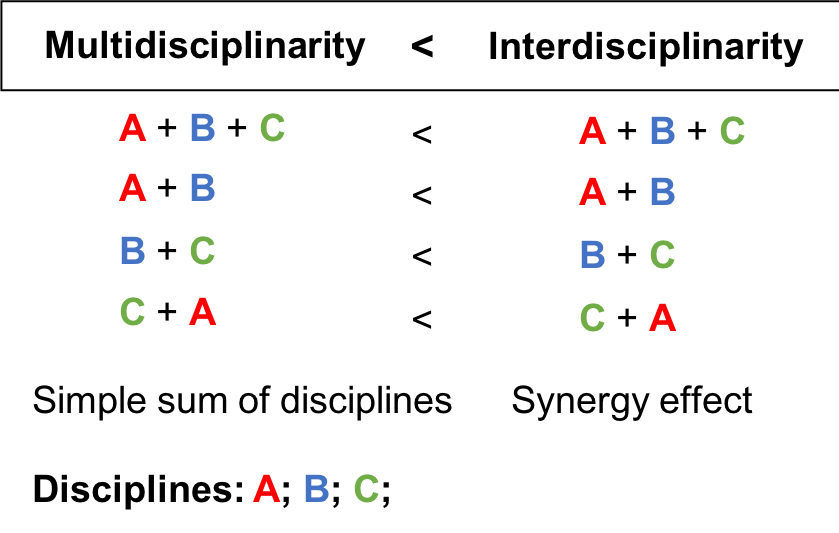

```{r message=FALSE, warning=FALSE, paged.print=FALSE, include=FALSE}
load("~/Google Drive/PhDThesis/RData/PreInter.RData")
```

```{r abbrev, results="asis", echo = FALSE}
if(is_pdf_output()){
cat("
\\newpage
\\thispagestyle{empty}
\\vskip 1cm
\\huge{\\textbf{Abbreviations}}
\\vskip 1cm
\\normalsize{}
")
} else 
{
  cat("# Abbreviations")
}
```

TME

DNA

RNA (mRNA, miRNA)

FACS

scRNA-seq

RNA-seq

CAF

 TIL

DGE

BSS

CRI

ML

AI

TMA

CNV

CNA

```{r abbrevEND, results="asis", echo = FALSE}
if(is_pdf_output()) {
cat("
\\newpage
\\thispagestyle{empty}
")}
```
# Preamble about Interdisciplinary Research {-}

```{r chapnam, results="asis", echo = FALSE}
if(is_pdf_output()){
cat("\\chaptermark{Interdisciplinary research}")
}
```
```{r pagesONE, echo=FALSE, results='asis', eval=is_pdf_output()}
cat("\\setcounter{page}{17}
\\renewcommand{\\thepage}{\\arabic{page}}")
```


> *We are not students of some subject matter, but students of problems. And problems may cut right across the borders of any subject matter or discipline.*
> 														— Karl Popper

The piece of work you are reading should harvest fruit of an interdisciplinary research conceived in an interdisciplinary environment of Center for Interdisciplinary Research in Paris (CRI) in École doctorale *Frontières du Vivant* (FdV) and Institut Curie in groups Computational Systems Biology of Cancer and Integrative Biology of  Human Dendritic Cells and T-cells. CRI's main mission can be formulated as follows:

> *to empower the students to take initiative and develop their own research projects **at the crossroads of life, learning, and digital sciences**.* [@CRIweb] 

Interdisciplinarity has many definitions and meanings. According to the book *Facilitating Interdisciplinary Research* [@FIRbook]

> *Interdisciplinary research and education are inspired by the drive to solve **complex questions** and problems, whether generated by scientific curiosity or by society, and lead researchers in different disciplines to meet at the **interfaces** and **frontiers** of those disciplines and even to **cross frontiers** to **form new disciplines**.*

For me, the essence of interdisciplinarity is the need to solve a complex problem, whatever expertise would be necessary to solve it. I consider that fighting cancer disease, deciphering cancer heterogeneity and interactions of immune system are causes worth an interdisciplinary effort. This is even more true in the era of big data, when the demand for quantitative tools is exponentially growing, in order to extract information and knowledge.

Though this preamble I would like not only praise the interdisciplinary research but also underline possible limitations and constraints that come with it and which could affect this thesis.

## What does interdisciplinarity in science mean in XXI century? {-}

In the ancient history, being formed and practice multiple disciplines was not anything unusual which is strongly reflected in Greek philosophy initiating the dispute about the division and hierarchical classification of knowledge. [@Slavicek2012]. Figures as Aristotle and Leonardo Da Vinci, that can be called *homo universals* served different disciplines from arts through history, natural sciences to mathematics.  With time human knowledge about the word, i.e. natural sciences got bigger and bigger, to the point that it became hard to master all the disciplines. The specialisation would allow to study in deep a certain subject and make possible discoveries about it. And even if, interdisciplinary efforts never stopped, for long time they were not mainstream in scientific communities divided into academies, chairs and specialization.

Different fields differ in term of concept, method, tools, processes and theories [@Slavicek2012]. Thanks to division into scientific disciplines certain order is conserved across space and time. Hierarchical classification of knowledge comes with human nature. 

It can be observed that there is an increasing gap between disciplines along with specialization. 

>*advancing specialisation leads to gaps in the level of comprehension between individual disciplines and eventually gives rise to the demand for interdisciplinarity - in order to close the gaps between disciplines.*[@Slavicek2012] 

It is not really clear why this gap must happen. Would it somehow reflect a human nature,  the strong need to divide things into discrete categories rather than to see a continuum?

Nowadays, the knowledge is accessible, we can profit from achievements of different disciplines thanks to easy means of communication. Two different terms  can be defined to describe initiatives that use the knowledge of different specialities:  multidisciplinarity which is a sum of efforts of different disciplines and interdisciplinarity that allows to profit from synergy of multiple disciplines (Fig. \@ref(fig:multidisc)). With interdisciplinary research and education come flexibility, creativity and novelty but also limit of depth on ingested knowledge and possibilities of cross-interactions between disciplines.

```{r multidisc, fig.cap='(ref:multidisc-caption)',fig.scap="Symbolic illustration of sum (multidisciplinarity) versus synergy (interdisciplinarity)", out.width='60%', fig.align='center', echo = FALSE}
if (is_pdf_output()) {
  knitr::include_graphics('figures-ext/multidisc.pdf')
} else {
  
}
```

(ref:multidisc-caption) **Symbolic illustration of sum (multidisciplinarity) versus synergy (interdisciplinarity)**, in an interdisciplinary project sum of thee disciplines A, B, C should have more value than a simple sum od disciplines:  an interdisciplinary project should have an added value compared to a multidisciplinary one.

Why not all the labs are interdisciplinary?

> *Scientists tend to resist interdisciplinary inquiries into their own territory. In many instances, such parochialism is founded on the fear that intrusion from other disciplines would compete unfairly for limited financial resources and thus diminish their own opportunity for research*
>  															— [Hannes Alfvén](http://www.azquotes.com/author/28130-Hannes_Alfven) 

Crossing frontiers is not an easy task, and it was quite difficult in the beginnings of modern interdisciplinarity. Some examples of early interdisciplinary efforts of 20th century are nicely described by Ledford et al. [@Ledford2015] in *Nature* special issue on [Interdisciplinarity](https://www.nature.com/news/interdisciplinarity-1.18295). It illustrates Theodore Brown in 1980s, while trying to organise a new interdisciplinary research project and reorganise university space to engage exchange between students of different faculties, he encounter a lot of reluctance.

> *And then there was the stigma. “Interdisciplinary research is for people who aren't good enough to make it in their own field,” an illustrious physicist chided* [@Ledford2015].

The story seems to end up with a happy ending of 40-milion US dollars grant and foundation of Beckman Institute for Advanced Science and Technology. However, recruiting open-minded director to lead this unconventional organisation was a struggle. Soon, the organisation became a model for others and met a great scientific and technological success.

Even though, since then the idea of interdisciplinary research spread around the world. Still, not all problem got overcome.

> *"There's a huge push to call your work interdisciplinary," says David Wood, a bioengineer at the University of Minnesota in Minneapolis. "But there's still resistance to doing actual interdisciplinary science".*

First, the institutions, universities where research is performed should equip scientist with a passport to other disciplines, facilitate exchange, funding the interdisciplinary research, accepting fusion of disciplines as new ones. Then, a proper communication between disciplines is necessary. Finally, forming interdisciplinary researches is extremely challenging as it often requires extra effort from an apprentice.

*Are all the disciplines idependent units nowadays?*

Can we do molecular biology without technical, mathematical and computational support? Can we study cognitive science without knowledge of biology, physics and psychology? Can we advance medecine without basic research in biology, physiology, electronics?

Bioinformatics and/or computational biology is an interesting case. Working in this field being between biology, medecine, computer science, mathematics and statistics, the role of a computational biologist is sometimes reduced to a service. A biological lab may need a computational biologist to perform an analysis, restructure the data,  that is needed for the biological discovery. Often, there is not enough space for research in computational biology itself, where the discovery does not depend on the original data but on tools and approaches to complex, data-intensive biological problems. It may happen also the other way round, when a computational biologist ask a bench researcher to perform an experiment to prove his theoretical model. In both cases, the long-term interdisciplinary partnership would probably fail. A wet and dry researchers should collaborate as equal with important research advances on both side to assure a long term equilibrium. 

*How interdisciplinarity changed over years? Are all disciplines affected equally?* 

From the chart (Fig. \@ref(fig:interdisciplinary)) we can see that Social Studies of Medicine seems to be the most interdisciplinary field. In general Biology, Health and Biomedical Sciences seem to be more open into flow of knowledge from other fields than humanities. On the extreme opposite of health, Clinical Medecine appears to be very conservative field.

```{r interdisciplinary, fig.cap='(ref:interdisciplinary-caption)',fig.scap="Interdisciplnarity of different fields.", echo=FALSE, message=FALSE, warning=FALSE, paged.print=TRUE, fig.align='center', out.width='90%'}
if (is_html_output()){
  library(plotly)
library(ggplot2)
interd.data <- read.csv("~/Google Drive/PhDThesis/RData/interd-data.csv")
interd.data$OutDiscRef <- interd.data$OutDiscRef*100
interd.data$OutDiscCit <- interd.data$OutDiscCit*100
gg <- ggplot(interd.data, aes(OutDiscRef, OutDiscCit, color = Discipline))+
  labs(x = "References to outside disciplines (%)", y = "Citations from outside disciplines (%)") +
  geom_point(aes(size = 4, frame = Year, id = Specialty, alpha = 0.85)) +
  ggtitle(label= "A measure of interdisciplinarity") +
 theme_bw() +
  annotate("text", x = 70, y = 95, label = "More interdisciplinary", color = "grey27", size = 5) +
  annotate("text", x = 30, y = 5, label = "Less interdisciplinary", color = "grey27", size = 5)
ggplotly(gg) %>% animation_slider(
    currentvalue = list(prefix = "\nYEAR ", font = list(color="red"), offset = 30,  redraw = T)
  )
} else {
  
}  
```


(ref:interdisciplinary-caption) **Interdisciplnarity of different fields.** "From 1950-2014, a field’s position is determined by how much its papers cite outside disciplines (x-axis), and by how much outside disciplines subsequently cite its papers (y-axis). (Some years, certain fields have too few references to be plotted.)". Reprinted by permission from Springer Nature [@VanNoorden2015] © 2015 Nature America, Inc. All rights reserved.

## Strengths, Weaknesses Opportunities, Threats (SWOT) of an interdisciplinary PhD - personal perspective {-}

>*I'm not good enough to do well something I dislike. In fact, I find it hard enough to do well something that I like* 
> — Jim Watson, Succeeding In Science: Some Rules Of Thumb [@Csermely2007]

Being formed first in double major in biology and mathematics, then participating in interdisciplinary research projects during my master studies, I can witness that the learning curve of multiple disciplines can be steep. It is also often associated with frustration of not going deep enough in all of disciplines or the feeling of being overwhelmed by the amount of knowledge.

Coming with expertise of biology and mathematics, I got fascinated by complex biological systems. One way of study high-dimensional data is to reduce them into smaller interpretable units. This is what I tempted to achieve in this thesis in order to enrich our knowledge about tumor microenvironment and possible contribute to orienting future research on immunotherapies. 

However, being an interdisciplinary researcher was not always a privilege. *To which category do I belong?* *To whom should I present my work?*  I often asked myself these questions. I also often encountered lack of understanding where my methodological results were not bringing enough of *biological insights*. Or the constraints of my biological application seemed very obscured and complicated for mathematicians and my work often lacked *important methodological advances*. 

*Does it mean that my work is not accurate, useless?* Probably,  for many, it is not enough. However, I still hope that our findings will be interesting to some. I enjoy working with data and statistics that serve an actual purpose.  The Tab. \@ref(tab:SWOT) summarizes Strengths, Weaknesses, Opportunities and Threats (SWOT analysis) of an interdisciplinary projects, in the way I see it. 

```{r SWOT, echo=FALSE, }
  SWOT <- read.csv("~/Google Drive/PhDThesis/RData/SWOT.csv", sep= ";", header = FALSE)
if (is_html_output()){
x <- kable(SWOT, "html", col.names = SWOT[1,], row.names = FALSE, align = 'c',caption='(ref:SWOT-caption)') %>%
  kable_styling(c("striped", "bordered"), full_width = F) %>%
  row_spec(1, bold = T, color = "white", background = "black")
gsub("<thead>.*</thead>", "", x)
  x
  gsub("<thead>.*</thead>", "", x)
} else {

kable(SWOT[2:nrow(SWOT),], format="latex",col.names = as.character(as.matrix(SWOT[1,])),row.names = FALSE, align = 'c', booktabs = T , caption='(ref:SWOT-caption)',   caption.short = "SWOT analysis of Interdisciplinary research") %>%
     kable_styling(latex_options= c("striped"), full_width = F ) %>%
    row_spec(0, bold = T, background = "Gray", color = "white") %>%
  column_spec(1:4, width = "9em", border_left = T) %>%
   column_spec(4, width = "9em",  border_left = T, border_right = T)

}
```

(ref:SWOT-caption) **SWOT analysis of Interdisciplinary research**. In SWOT analysis, Strengths, Weakenesses, Opportunities and Threats are enumerated. Strengths and Wearknesses are internal and Opportunities and Threats are external factors. 


<!-- --<! | Strengths (internal, positive)                    | Weaknesses (internal, negative)                   | Opportunities (external, positive)                           | Threats (external, negative)                               | --> 
<!-- | ------------------------------------------------- | ------------------------------------------------- | ------------------------------------------------------------ | ---------------------------------------------------------- | -->
<!-- | Having a holistic view of the problem             | Not seeing details of the problem                 | Mulitple possibilities to convey research                    | Spending too much time filling  knowledge gap              | -->
<!-- | Being supervised  by multiple experts             | Being in the missgle of a conflict of two experts | Take advantage of synergistic effect of fields               | Inhibiting effect of oppinions from  different fields      | -->
<!-- | Joining expertises of different fields            | Not covering in details all the disciplines       | Doing a new discovery                                        | Obtaining too generic results                              | -->
<!-- | Using new/non standart approach                   | Experiencing steep learning curve                 | Raising interest in different expert domains                 | Not mastering the specific  vocabulary of different fields | -->
<!-- | Having better understanding of complex  processes | Being in constant need of help of domain experts  | Making progress                                              | Not being understood                                       | -->
<!-- | Higher creativity                                 |                                                   | Creating a new field                                         | Being hard to classify/ fall into a  category              | -->
<!-- | Having great flexibility                          |                                                   | Sovling many problems impossible to solve with traditional approach | Being considered as superficial                            | -->
<!-- | Feeling a thrill of adventure                     |                                                   |                                                              |                                                            | -->
<!-- | Being open                                        |                                                   |                                                              |                                                            | -->

<!-- Table: (\#tab:SWOT) **SWOT analysis of Interdisciplinary research**  -->

Besides conducting research that crosses the boundaries of one discipline, I also could meet and work with inspiring people coping like me with filling the gap in understanding of an interdisciplinary work, multiple supervisors and reporting to many institutions. I gained (even if only superficial) understanding of many topics in mathematics, statistics, data science, immunology, cancer but also oral and written presentation skills, time and work management   

Is my thesis really interdisciplinary? Does biology profits from mathematics and mathematics from biology? I will let you judge it. 

What impact had biology on the statistical/mathematical modelling ? The practical problems, systems that go beyond theoretical formulations challenge the theoretical tools. In my work, I did my best to fuse theory and practice that should serve a biological application. I can image the project more complete if the results of my work would inspire changes in biological experiments, uncover new paths to follow for experimental biologists or translational researchers. 

## The origins of the PhD topic {-}

> *The universe will lead me where I need to go. I am like a leaf in the stream of creation*
> 													— Dirk Gently, Holistic detective

When finishing my master I was looking for an interdisciplinary subject where I could deepen my quantitative skills and apply to a real-life healthcare problem. I came across a project proposed by Andrei Zinovyev in close collaboration with Vassili Soumelis. I was quite anxious that my knowledge of cancer immunology would not be sufficient to lead the project to a success. I recognise that the complexity and heterogeneity of immune systems are is very complex and dynamic system and many years of expertise are needed to really grasp the understanding of it. I had a great chance to work hand in hand with domain experts that would suggest me the direction I should take in my research.

The project started by causal exploration of different blind source separation or dimension reduction techniques and their ability to dissect bulk transcriptomic data into cell type-related units. We also faced an important problem of lack of gold standard data that would define efficiency and accuracy of different methods. 

I have spent void efforts working on a bulk transcriptomic data simulation framework, important statistical issues come into our way and probably another Ph.D would be necessary to solve them. In the meantime, many tools dissecting tumor bulk transcriptome were published. Serving a similar purpose, they used different means and assumptions, which left a space for my project to continue. In my third year, I am finally publishing a tool that performs the analysis I developed together with the Sysbio team members, and I can apply it to a corpus of publicly available data  to learn about actual question: the immune system infiltrating cancers and the context-dependent signatures  (see [Chapters 4 & 5](#deconica)).

In a parallel project, I worked on exploration of brand new data type: single cell transcriptomic (RNAseq) in the context of tumor microenvironment (see [Chapter 6](#map)). 

We have also participated in Dream Idea Challenge, a project that aimed to put closer experimental and theoretical  researchers [@Azencott2018][Annexe1](). 

I have collaborated in numerous projects within and outside my team. Some of the projects resulted in publications, such as my work on analysing pDC subsets of X cancer [Annexe2](). Others are in still preparation.

Alongside with pursuing the compelling scientific research, I completed a wide variety of courses. Thanks to this extensive (>300 hours of training over 3 years), I am equipped with soft skills that not only helped me to shape my thesis project on the go but also, I hope, will help me to succeed in my future career path.

# Organisation of the dissertation {-}
```{r chapnameOne, results="asis", echo = FALSE}
if(is_pdf_output()){
cat("\\chaptermark{Organisation of the dissertation}")
}
```
As it is a fruit of an interdisciplinary work, I decided to introduce the topic from two perspectives: describe the biological and biomedical dimension of the topic (see [Chapter 1](#intro)), as well as, the mathematical dimension of the problem of separation of sources in complex mixtures (see [Chapter 2](#methods)). I hope, it will make  the subject of my thesis easy to understand also for non-biologists or non-mathematicians. In the results part, I compare reproducibility of blind source separation methods NMF and ICA (see [Chapter 4](#sens)), I cite our results on the estimating the Most Reproductible Transciptomic Dimension (MSTD). I also apply ICA-based deconvolution to Breast cancer transcriptomes to to prove its reproducibility [Chapter 3](#LVA). Then I introduce the DeconICA R package (see [Chapter 5](#deconica) ) and finally present results of application of DeconICA and other tools to >100 transcriptomic datasets (see [Chapter 6](#results)). A second part of results is dedicated to my work on cell type heterogeneity (see [Chapter 7](#map)). The manuscript finishes with [Chapter 8](#conclusions) that contains discussion, conclussions and perspectives. In annexes you can find publications to which I contributed during my doctorate that are not strictly linked with the topic of this thesis. 

**INTRODUCTION**

* [Chapter 1](#intro): introduction to cancer biology and immunity, challenges in cancer immunotherapies and cancer immune phenotyping as well as data sources most commonly used to face the topic.

* [Chapter 2](#methods): introduction to a problem of mixed sources in biological samples, overview of blind source separation methods and supervised deconvolution methods, with focus on those applied to bulk transcriptome to uncover and quantify immune compartments

**RESULTS**

* [Chapter 3](): Most Reproducible Transcriptome Dimension (MSTD)
* [Chapter 4](): application of ICA-based deconvolution to six breast transcriptomes
* [Chapter 5](#sens): comparison of reproducibility of NMF and ICA methods
* [Chapter 6](): DeconICA R package
* [Chapter 7](): application of DeconICA R package and other tools to analyse >100 transcriptome datasets of bulk cancer transcriptomes
* [Chapter 8](#map): study of immune cell types heterogeneity in tumor microenvironment using innate immune map and scRNAseq data

**DISCUSSION**

* [Chapter 9](#conclusions): discussion, conclussions and perspectives

**ANNEXES**

* Other publicatons:
  + pDC subsets
  + Idea Dream Challenge