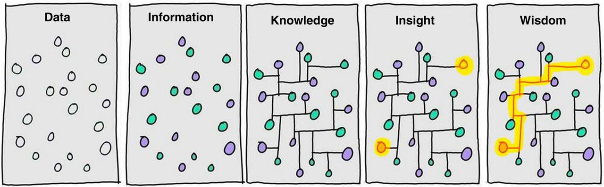

# Immuno-biology of cancer {#intro} 
\setcounter{page}{11}
\renewcommand{\thepage}{\arabic{page}}
\vspace*{\fill}
 \begin{quote}
 \emph{Suffering has been stronger than all other teaching, and has taught me to understand what your heart used to be. I have been bent and broken, but - I hope - into a better shape.}
 \end{quote}
 \vspace*{\fill}

> And now, let's repeat the Non-Conformist Oath!
> I promise to be different!
> I promise to be unique!
> I promise not to repeat things other people say!
>
> — Steve Martin, [*A Wild and Crazy Guy*](https://en.wikipedia.org/wiki/A_Wild_and_Crazy_Guy) (1978)


This chapter will introduce a basic topic of cancer and participation of stroma in cancer development, progression and response to treatment. It will also describe 

## Cancer seen as complex environment

For a long time studying tumor was focused on tumor cells, their reprogramming, mutations. It was seen as disease of uncontrolled cells. Recent research moved research focus from tumor cells to tumor cells in their proper context: tumor microenvironment. 

### Our understanding of cancer over time

cancer is a disease touching blah blah many ppl over the word. it has been known that blah blah and then types

### Tumor micro environment: fiend or foe? 

what is time : composition, roles 
it was decided  the environment is bad for cancer 

Tumors effectively suppresses immune response: activates negative regulatory pathways ( checkpoints) 

> Indeed, cellular elements of both the innate and adaptive immune response impact tumor progression.1,2 Cytotoxic T cells, B cells, and macrophages can orchestrate tumor cell elimination, while other populations such as regulatory T cells (Tregs) and myeloid-derived suppressor cells can dampen the antitumor immune response and promote malignant cell growth and tissue invasion3 (@Implications of the tumor immune microenvironment for staging and therapeutics Janis M Taube1,2,3, Jérôme Galon)

For ages, we didn't know much  about how to modulate TME
Now we know it can do both
- review hallmarks of cancer immune

### Cancer immune phenotypes

There can be distinguished cancer phenotypes depending on immune infiltration
how they are measured, defined, indexes, types of cancer, impact

> In further support of a role for memory T cells in antitumour responses, tumour-infiltrating lymphocytes that express CD4 or CD8 extracted from experimental tumour models typically have the features of memory T cells and can possess an activated or exhausted phenotype, expressing markers such as PD-1, T-cell immunoglobulin and mucin-domain containing protein 3 (TIM-3) and lymphocyte activation gene 3 (LAG-3). (@IMMUNE CANCER CIRCLE)

> Anticancer immunity in humans can be segregated into three main phenotypes: the immune-desert phenotype (brown), the immune–excluded phenotype (blue) and the inflamed phenotype (red). (@IMMUNE CANCER CIRCLE Fig 3)
>
>  Inflamed versus non-inflamed tumours
>
> What is the basis for the three immune profiles observed in tumours? To a first approximation, differences between the profiles can be ascribed to whether tumours harbour an inflammatory microen-vironment, which can reflect variations in a number of cellular and other factors (Fig. 4). The degree of inflammation can be gauged by the cellular content of the tumour — for example, the presence of immune cells, either in the parenchyma or at the invasive margin of the tumour78,79. Inflamed tumours also contain proinflammatory cytokines that should provide a more favourable environment for T-cell activa-tion and expansion, including type I and type II IFNs, IL-12, IL-23, IL-1β, tumour-necrosis factor (TNF)-α and IL-2. However, it is unclear whether the presence of these cytokines is the cause or consequence of the cellular influx. The production of tropic chemokines by lympho-cytes and myeloid cells is therefore likely to be an important feature of inflamed tumours.Non-inflamed tumours generally express cytokines that are associ-ated with immune suppression or tolerance. They can also contain cell types associated with immune suppression or tissue homeostasis. As well as regulatory T cells, these cells include the lesser characterized populations of myeloid-derived suppressor cells (for example, immature granulocytes) and tumour-associated macrophages, which are unacti-vated and often called M2 macrophages. However, regulatory T cells are not associated uniquely with non-inflamed tumours as they typically accompany effector T cells into inflammatory sites and are important for maintaining immune homeostasis, even in the presence of an active antitumour immune response


immunoscore

immunophenoscore

ML based scoring scheme. Random forest

link to *precision medecine* 

> These observations raise the question of the underlying molecular mechanisms that explain the differences in immunogenicity of the tumors. The question can be reduced to the notion of sources of immunogenic differences, which can be divided into two categories: tumor-intrinsic factors and tumor-extrinsic factors. Tumor-intrinsic factors include the mutational load, the neoantigen load, the neoantigen frequency, the expression of immunoinhibitors and immunostimulators (e.g., PD-L1), and HLA class I molecule alterations. Tumor-extrinsic factors include chemokines that regulate T cell trafficking, infiltration of effector TILs and immunosuppressive TILs, and soluble immunomodulatory factors (cytokines) (@Gajewski et al., 2006Immune resistance orchestrated by the tumor microenvironment.)
>
> For each of the studied cancers, the analysis revealed only immune-related factors, which we classified into four categories: (1) infiltration of activated CD8+/CD4+ T cells and Tem CD8+/CD4+ cells; (2) infiltration of immunosuppressive cells (Tregs and MDSCs); (3) expression of MHC class I, class II, and non-classical molecules; and (4) expression of certain co-inhibitory and co-stimulatory molecules ([Figure 5](http://www.cell.com/cms/attachment/2109515464/2082923785/gr5.jpg)A).To visualize the information, we constructed an immunophenogram that includes these four categories ([Figure 5](http://www.cell.com/cms/attachment/2109515464/2082923785/gr5.jpg)B). We then calculated an aggregated score, immunophenoscore, based on the expression of the representative genes or gene sets comprising four categories: MHC molecules, immunomodulators, effector cells (activated CD8+ T cells and CD4+ T cells, Tem CD8+ and Tem CD4+ cells), and suppressor cells (Tregs and MDSCs) Multivariate analysis showed that the immunophenoscore was associated with survival in 12 solid cancers, of which 4 were significant: KIRC, SKCM, breast cancer (BRCA), and bladder cancer (BLCA) ([Figure 5](http://www.cell.com/cms/attachment/2109515464/2082923785/gr5.jpg)C).
>
> The immunophenoscore we developed was derived in an unbiased manner using the TCGA data and machine learning, but it reflects current understanding of the categories of genes that determine immunogenicity of the tumors: effector cells, immunosuppressive cells, MHC molecules, and immunomodulators. The immunophenoscore is similar to the conceptual immunogram that was recently proposed to represent the status of the immune system ([Blank et al., 2016](javascript:void(0);)). Another advantage of the immunophenoscore is that it represents a standardized value because *Z* scores are used, and is therefore more robust compared with the use of expression values. However, because presently only limited data are available, additional studies are required to validate the immunophenoscore. Notably, the method can be further improved by optimizing the immunophenoscore for specific cancers. Finally, for routine applications, other techniques for gene expression profiling like microarrays and qPCR can be used instead of RNA-sequencing.

### Immune signatures {#immune-signatures} 

definition of signature: marker genes, list of genes, weighted list
we can talk about the general immune signature of signature of immune infiltration and stroma
or immune signature of a specific cell type of functional subpopulation
purpose of signatures

availability of immune signatures

the problem of not consistency of immune signatures
origin of signatures

"the gene expression profiles of tumour-associated immune cells differ considerably from those of  blood derived immune cells"(@Shelker et al. Estimation of immune cell content using single cell data)

## Immunotherapies


This section outlines progress in cancer therapies with a focus on immune therapies. It will link the ongoing research on TME with therapeutical potential. 

### Cancer therapies

### Recent progress in immuno-therapies

most potential  
cytotoxic T-lymphocyte protein 4 (CTLA4) and programmed cell death protein 1 (PD-1)

> CTLA4 is a negative regulator of T cells that act to control T-cell activation by competing with the co-stimulatory molecule CD28 for binding to shared ligands CD80 (also known as B7.1) and CD86 (also known as B7.2).The cell-surface receptor PD-1 is expressed by T cells on activation during priming or expansion and binds to one of two ligands, PD-L1 and PD-L2. Many types of cells can express PD-L1, including tumor cells and immune cells after exposure to cytokines such as interferon (IFN)-γ; however, PD-L2 is expressed mainly on dendritic cells in normal tissues. Binding of PD-L1 or PD-L2 to PD-1 generates an inhibitory signal that attenuates the activity of T cells. The 'exhaustion' of effector T cells was identified through studies of chronic viral infection in mice in which the PD-L1/PD-1 axis was found to be an important negative feedback loop that ensures immune homeostasis; it is also an important axis for restricting tumor immunity. (@IMMUNE CANCER CIRCLE)

> The mechanisms that underlie cancer immunotherapy differ considerably from those of other approaches to cancer treatment. Unlike chemotherapy or oncogene-targeted therapies, cancer immunotherapy relies on promoting an anticancer response that is dynamic and not limited to targeting a single oncogenic derangement or other autonomous feature of cancer cells. Cancer immunotherapy can, therefore, lead to antitumor activity that simultaneously targets many of the abnormalities that differentiate cancer cells and tumors from normal cells and tissues.(@IMMUNE CANCER CIRCLE)

>Checkpoint inhibitor immunotherapies work by
>blocking the immune inhibitors CTLA-4 or PD-1/
>PD-L1, allowing the natural host antitumor immune
>response to eliminate a tumor and improve patient
>survival even in advanced cancers. (@Implications of the tumor immune microenvironment for staging and therapeutics Janis M Taube1,2,3, Jérôme Galon)

>And second, basic research in cancer immunology paved the way for the development and approval of checkpoint blockers. These drugs, which augment T cell activity by blocking cytotoxic T lymphocyte antigen-4 (CTLA-4), programmed cell death protein 1 (PD-1), or PD-1 ligand (PD-L1), show remarkable clinical effects. Analysis of long-term data of patients who received anti-CTLA-4 antibodies in unresectable or metastatic melanoma shows a plateau in the survival curve after 3 years (@Schadendorf et al., 2015 Pooled analysis of long-term survival data from phase II and phase III trials of ipilimumab in unresectable or metastatic melanoma.), suggesting curative potential.Over and above, efficacy of anti-PD-1 antibodies has been shown not only in melanoma, but also in nine different tumor types (@Wolchok, 2015,PD-1 blockers.). There is currently a rapid pace of development of checkpoint blockers evident from more than 150 clinical trials with monotherapies or combination therapies (@Wolchok, 2015,PD-1 blockers). However, there is disparity in response rates across and within tumor types, suggesting the existence of intrinsic immune resistance, as well as evidence for acquired immune resistance (@Pitt et al., 2016,Resistance mechanisms to immune-checkpoint blockade in cancer: tumor-intrinsic and -extrinsic factors.).

>Fig3 timeline immunotherapies (@Implications of the tumor immune microenvironment for staging and therapeutics Janis M Taube1,2,3, Jérôme Galon)

>Although long considered a possibility, it has been demonstrated only in the past five years that the mutational burden of tumours contributes to immune recognition of cancer and that it may, at least partly, determine a person’s response to cancer immunotherapy (@. Rizvi, N. A.et al. Mutational landscape determines sensitivity to PD-1 blockade in non-small cell lung cancer. Science 348, 124–128 (2015).

It has been shown that anti PD-L1 therapies works more effectively in T cell infiltrated tumors with exclusion of Tregs because of lack of  difference in expression of FOXP3 in responding and non-responding group of patients. (@Herbst.predictive role PD_L1_)

Unfortunately most patients do not answer to immunotherapies which stimulates researches to look for better biomarkers and patient stratifications, and pharmaceutical industries to discover new immune checkpoints based therapies. 

tedtrtr

### Potential of development of new immunotherapies

>As effective as immunotherapy can be, only a minority of people exhibit dramatic responses, with the frequency of rapid tumor shrinkage from single-agent anti-PD-L1/PD-1 antibodies ranging from 10–40%, depending on the individual's indication (@
>Zou, W., Wolchok, J. D. & Chen, L. PD-L1 (B7-H1) and PD-1 pathway blockade for cancer therapy: mechanisms, response biomarkers, and combinations.(@ Sci. Transl. Med. 8, 328rv4 (2016).)

> predicting response: The immune-inflamed phenotype correlates generally with higher response rates to anti-PD-L1/PD-1 therapy51,62,67,69,70,71, which suggests that biomarkers could be used as predictive tools. Most attention has been paid to PD-L1, which is thought to reflect the activity of effector T cells because it can be adaptively expressed by most cell types following exposure to IFN-γ6,82. (@IMMUNE CANCER CIRCLE)


## Quantifying immune infiltration (data)

Nowadays, more and more biological data is produced. However, this proliferation of accessible resources is not proportional to generated insights and wisdom. In this thesis, we wok mostly generate *Knowledge* and *Insights* and we hope to generate some *Wisdom* (Fig.  \@ref(fig:information-power)). However, in this part, we will introduce the foundation of our analysis: different data types that will be further discussed in chapters that follow.

```{r information-power, echo = FALSE, out.width='80%', fig.show='hold', fig.cap='(ref:information-power-caption)', fig.align = 'center'}

```


(ref:information-power-caption) **From *Data* to *Wisdom***. Illustration of different steps that it takes to go from *Data* to generating *Wisdom*. It highlights that generating data is not equal to understanding it and additional efforts are needed to generate value. Image authored by Clifford Stoll and Gary Schubert published by Portland Press Limited on behalf of the Biochemical Society and the Royal Society of Biology and distributed under the [Creative Commons Attribution License 4.0 (CC-BY)](https://creativecommons.org/licenses/by/4.0/) in (@BIG DATAOMICShttp://www.emergtoplifesci.org/content/1/3/245.article-info).


We will introduce most relevant data types that are used to study immune infiltration of tumors. 

###  Facs {#facs}

> Flow cytometry : Laser-based technology that allows for simultaneous quantification of the abundance of up to 17 cell surface proteins using fluorescently labelled antibodies. (@Single-cell RNA sequencing to explore immune cell heterogeneity) cost : 0.05$/ cell

> Mass cytometry(commercial name CyTOF). Mass spectrometry technique used as an alternative to flow cytometry that allows for the quantification of cellular protein levels by using isotopes that overcome problems associated with the spectral overlap of fluorophores.  40 prot per cell (@Single-cell RNA sequencing to explore immune cell heterogeneity) 35$/cell

### staining (histopathology, immunoscore!!! , multiplex immunofluorescence){#staining}


>The standardized Immunoscore was based on
>the quantification (cells/mm2) of two lymphocyte
>populations (CD3 and CD8) within the central region
>and the invasive margin of colorectal carcinoma
>tumors and provides a scoring system ranging from
>Immunoscore 0 (I0) to Immunoscore 4 (I4) (Figure 4).41 (@Implications of the tumor immune microenvironment for staging and therapeutics Janis M Taube1,2,3, Jérôme Galon)

>The immune cell content of a tumour sample can also be determined by using more established multiplexed methods like immunohistochemistry (IHC) or immunofluorescence (IF)20 or newer methods like imaging mass cytometry using FFPE tissue samples21. The advantage of these techniques is that a larger number of cells can be analysed and that these techniques also provide information about the spatial distribution of the different cell types. However, these methods are limited to the number of proteins that can be analysed simultaneously currently (ranging from ~10 to 100), advantage of the deconvolution approach is that it is unbiased (i.e., hypothetical response markers do not need to be pre-specified). It allows one to link both the cellular characteristics and the cellular content with treatment response. We anticipate that this approach will aid in the discovery of novel predictive response biomarkers for both conventional and immune-directed therapy by taking cellular composition into account.  (@Shelker et al. Estimation of immune cell content using single cell data).


### omics 

Some kind of sequencing explanation needed for non-biologists

#### transcriptome

>Bulk RNA-seq data can easily be obtained from either flash-frozen or formalin-fixed, paraffin-embedded (FFPE) tissue samples, including both surgically resected material and core needle biopsies. (@Shelker et al. Estimation of immune cell content using single cell data).

#### methylome

> Changes in gene expression in tumours owing to epigenetic modifi-cations and the expression of microRNAs probably contribute directly to determining the immune microenvironment and immunogenicity of a tumour. Cytokine expression during T-cell development is regu-lated by epigenetic alterations to both DNA and chromatin96. Cancer can also be accompanied by epigenetic changes, which makes it prob-able that such changes will influence cytokine profiles that modulate the immune microenvironment. In fact, DNA methylation in lung-cancer cells has been shown to reduce the expression of IL-1β97. And PD-L1 expression can be modulated by microRNAs, with miR-200 (a repressor of epithelial-to-mesenchymal transition) and possibly others decreasing its expression98. Methylation of the promoter for the gene PD-L1 itself also seems to repress PD-L1 expression; demethylation can result in constitutive expression in tumours, especially non-small cell lung cancer99..
>
> Another influence on the immune profile of a tumour that has an epigenetic mechanism involves the tissue of origin of the tumour. Colorectal cancer tumours commonly express elevated levels of transforming growth factor (TGF)-β100. Presumably, this reflects the importance of the TGF-β pathway in intestinal biology and, especially, its role in maintaining tolerance to the gut microbiota by favour-ing the development of regulatory T cells101. Elevated expression of TGF-β may also contribute to the development of abundant stromal elements in these tumours that can restrict the access of immune cells to the tumour parenchyma, as has been demonstrated in pancreatic cancer102. Although other factors also contribute, it is interesting to note that pancreatic cancer and most forms of colorectal cancer (except for the mutationally rich microsatellite-instability-high sub-group85) respond poorly to single-agent inhibition of PD-L1/PD-1 (refs 62, 83 and 103–105).
>
> (@IMMUNE CANCER CIRCLE)

#### single cell 

Described above methods of process DNA from hundreds of thousands of cells  simultaneously and report averaged gene expression of all cells. In contrast, scRNA-seq technology allows getting results for each cell individually. This is tremendous step forward enhancement of our understanding of cell heterogeneity and opens new avenues of research questions. 

Continuous discovery of new immune subtypes has proven that cell surface markers that are used for phenotyping by techniques like [FACS](#facs) and [immunohistochelistry](#staining) cannot capture the full complexity. ScRNA-seq methods allow to cluster known cell types in subpopulations based on their genetic features.  (@Single-cell RNA sequencing to explore immune cell heterogeneity). ScRNA-seq is also able to capture particularly rare cell types as it requires much less of RNA material (1 ng isolated from 100-1000 cells) compared to 'bulk' RNA-seq ( ~ 1 μg of total mRNA transcripts )

*new cellular states*

> In summary, these studies have established that sur‑face phenotypes are not sufficient to define cellular states in disease and have proposed new scRNA‑seq methods to study innate immunological processes as well as dis‑ease pathogenesis and progression at high resolution (@Single-cell RNA sequencing to explore immune cell heterogeneity)

This new data type also brings into the field new challenges related to data processing due to the volume, distribution, noise, and biases. Experts highlight as the most "problematic" "batch effect" and noise and "dropout effect" (@https://www.nature.com/news/single-cell-sequencing-made-simple-1.22233). So far, there are no official standards that can be applied which makes data comparison and post-processing even more challenging. Up to date, there are around 70 reported tools and resources for single cell data processing (@ GitHub, called ‘Awesome Single Cell’ ([go.nature.com/2rmb1hp](http://go.nature.com/2rmb1hp))) .  

A limited number of single-cell datasets of tumors are made publicly available (@TABLE). 

One can ask why then developing computational deconvolution of transcriptome if we can learn relevant information from single-cell data. Today's reality is that single cell data does not provide a straightforward answer to the estimation of cell proportions. The coverage is not full and sequenced single cells are not fully representative of the true population. For instance, neutrophiles are not found in scRNA-seq data because of they are "difficult to isolate, highly labile *ex vivo* and therefore difficult to preserve with current single-cell methods" (@Shelker et al. Estimation of immune cell content using single cell data). In addition, a number of patients included in published studies of range <100 cannot be compared to thousand people cohorts sequenced with bulk transcriptome methods. This is mostly because single cell experiments are challenging to perform, especially in clinicsal setting as fresh samples are needed.(@Shelker et al. Estimation of immune cell content using single cell data). Today, single cell technology brings very interesting "zoom in" perspective, but it would be incautious to make fundings from a restricted group of individuals universal to the whole population. Major brake to the use of single cell technology more broadly might be as well the price that is neatly 10x higher for single cell sample compared to bulk (@https://www.cedars-sinai.edu/Research/Research-Cores/Genomics-Core/Documents/Single-Cell-Genomics-Pricing---June-2017.pdf).** (A table? )**

| Technology | Price per sample |
| :--------: | :--------------: |
| scRNA-seq  |      3000 $      |
|  RNA-seq   |      200 $       |

In this work, we are using single cell data in two ways. Firstly, in [Comparative… chapter](#results) we compare immune cell profiles defined by scRNA-seq, blood and blind deconvolution (problem introduced in [Immune signatures section](#immune-signatures)). Secondly, in [Heterogeneity of immune…](#map) we use single call data of Metastatic melanoma generated by Tirosh et al. (@Tirosh Melanoma sc) to demonstrate subpopulations of Macrophages and NK cells. 


<!-- You can label chapter and section titles using `{#label}` after them, e.g., we can reference Chapter \@ref(intro). If you do not manually label them, there will be automatic labels anyway, e.g., Chapter \@ref(methods).

Figures and tables with captions will be placed in `figure` and `table` environments, respectively.

```{r nice-fig, fig.cap='Here is a nice figure!', out.width='80%', fig.asp=.75, fig.align='center'}
par(mar = c(4, 4, .1, .1))
plot(pressure, type = 'b', pch = 19)
```


Reference a figure by its code chunk label with the `fig:` prefix, e.g., see Figure \@ref(fig:nice-fig). Similarly, you can reference tables generated from `knitr::kable()`, e.g., see Table \@ref(tab:nice-tab).

```{r nice-tab, tidy=FALSE}
knitr::kable(
  head(iris, 20), caption = 'Here is a nice table!',
  booktabs = TRUE
)
```

You can write citations, too. For example, we are using the **bookdown** package [@R-bookdown] in this sample book, which was built on top of R Markdown and **knitr** [@xie2015].
 -->
