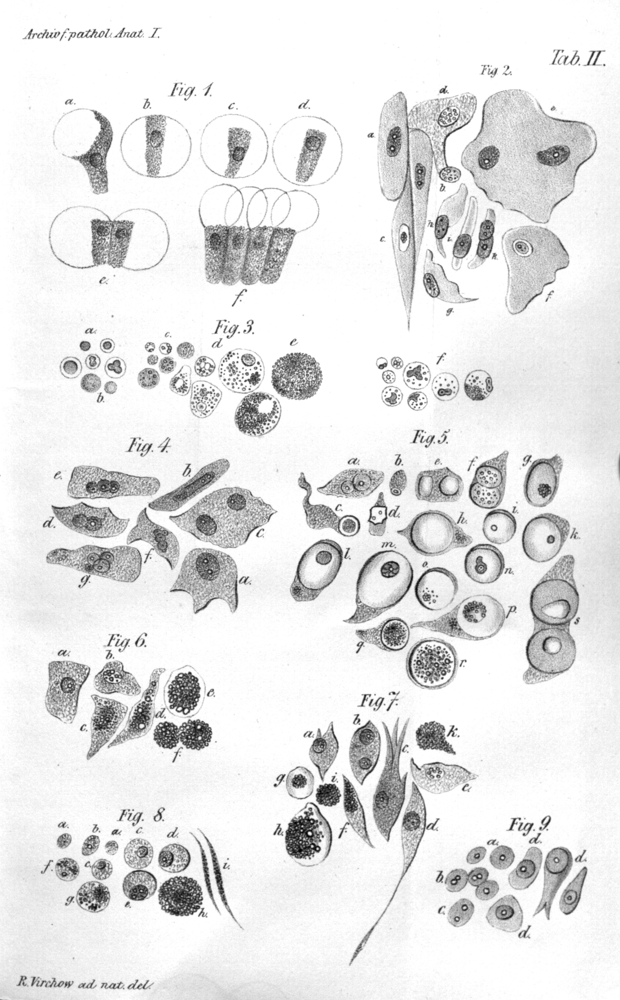
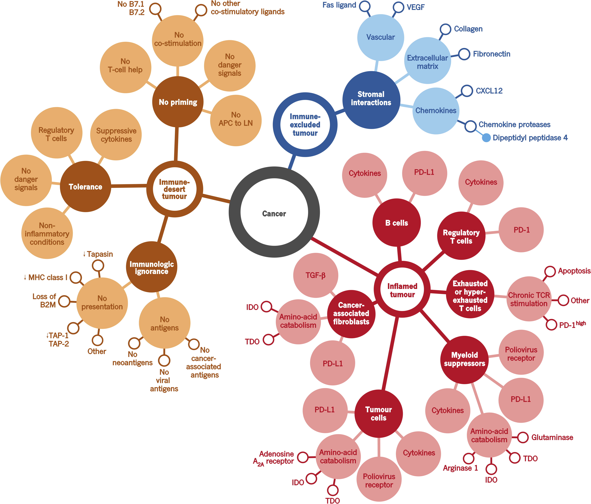

```{r include=FALSE}
 load(file = "./RData/IntroBio.RData")
```

<!-- ```{r setup, include=FALSE} -->
<!--  is_pdf_output = function() { -->
<!--     knitr::opts_knit$get("rmarkdown.pandoc.to") =="latex" -->
<!--  } -->
<!-- ``` -->

<!-- ```{r setup2, include=FALSE} -->
<!--  is_html_output = function() { -->
<!--    knitr::opts_knit$get("rmarkdown.pandoc.to") =="html4" -->
<!--  } -->
<!-- ``` -->

# (PART) Introduction {-}
# Immuno-biology of cancer {#intro} 

This chapter will first introduce a short history of cancer with a focus on discoveries linking cancer and its environment. It will also describe the participation of TME in cancer development, progression and response to treatment. Most important types of data used to study cancer microenvironment will be discussed. I also introduce a link between tumor immune-biology and cancer phenotyping for development of immunotherapies.

## Cancer disease

According to [GLOBOCAN study]( http://globocan.iarc.fr/Pages/fact_sheets_cancer.aspx) [@GLOBOCAN], 14.1 million cancer cases were estimated to happen around the world in 2012. It touched 7.4 million men and 6.7 million women. It is estimated that the cancer cases will increase almost two-fold to 24 million by 2035.

In France only, in 2012 there were 349426 cases of cancer, of which leading is Prostate cancer (16,3%) followed by Breast (14%) and Lung (11,5%). 

For a long time studying tumor was focused on tumor cells, their reprogramming, mutations. Cancer was seen as a disease of uncontrolled cells by the mainstream research. At the same time, the idea of the importance of the impact of other cells and structures on cancer cells was present but often not believed.  A recent success of immunotherapies moved research focus to tumor cells in their context: tumor microenvironment. We will describe here what is the composition and role of the TME in tumor progression, diagnosis and response to treatment. 

### Historical understanding of cancer {#hist}  

Cancer was historically described by a physician Hippocrates (460–370 B.C) [@Sudhakar2009]. Even though there exist even earlier evidence of the disease. Hippocrates stated that the body contained 4 humors (body fluids): blood, phlegm, yellow bile and black bile. Any imbalance of these fluids will result in disease. Particularly the excess of black bile in an organ was meant to provoke cancer. For years, it was not known what factors cause cancer and it was easily confounded with other diseases. In the middle ages in the Renaissance Period, it was believed cancer is a punishment for the sins they committed against their god, that they deserved it to some extent.

Until the 18th century, it was believed that cancer is contagious and is spread by parasites.

In the 19th century, tumor cells started to be analyzed by pathologists. They were strike with their ability to proliferate uncontrollably, ability to spread and destroy the original tissue [@NPR2010]. Around the same time, leukocytes from the blood were first described by Gabriel Andra and William Addison. Just a few years later, in 1845 Bennett and Virchow described blood cells in leukemia (Fig. \@ref(fig:Virchow-cell)). Virchow is also a father of Chronic irritation theory (nowadays called chronic inflammation) that says that cancer is caused by local "irritation" and, incorrectly, that cancer cells spread like liquid resulting in metastasis.

```{r Virchow-cell, fig.cap='(ref:Virchow-cell-caption)',fig.scap="Illustration of Virchow's cell theory", out.width='100%', fig.align='center', echo = FALSE}

```

(ref:Virchow-cell-caption) **Illustration of Virchow's cell theory**. Virchow depicted different cells transformation due to irritation.  [@VirchowRudolf1847] 

In 1889, Stephen Paget introduced *soil and seed* hypothesis of metastases [@Paget1889]. He formulates it as follows 

> *When a plant goes to seed, its seeds are carried in all directions, but they can only live and grow if they fall on congenial soil.*

Which is parallel to cancer cells disseminated by body fluids, and they can grow only tissues - "soil" that is predisposed to host the cancer cell - "the seed". He focused on the importance of tissue characteristics that favorize tumor development as opposed to most researchers of his time that were focusing on the "seed" itself.

In the 20th century, molecular causes started to be investigated. It was discovered that cancer could be caused by environmental factors, i.e. chemicals (carcinogens), radiation, viruses and also inherited from ancestors. Those factors would damage but contrary to a healthy condition they would not die.

Also in 1909, Paul Ehrlich, called one of fathers of immunology and Nobel Prize laureate, indicated a link between immune system and tumor suppression [@Ehrlich1909]. One of the remarkable first immunotherapy attempts can be attributed to William Coley, that practiced injecting streptococcus bacteria directly into patients after cancer surgery in 1891, later called "Colley vaccine". However, the impact of this procedure on patients recovery was judged by scientific community as "unclear".

In 1968, Melvin Greenblatt and Philippe Shubik showed that tumor transplants secrete a substance stimulating the growth of blood vessels [@Greenblatt1968], later identified as "tumor angiogenic factor (TAF)" by Judah Folkman in 1971 [@Folkman1971]. Folkman also suggested that TAF can be a  target of a therapy itself. This was a revolutionary idea, at the time, as it did not target the tumor cells directly acted on their environment.

During the 1970s, oncogenes and tumor suppressor genes were discovered. Oncogenes are genes that allow a cell to become a cancer cell, while the tumor suppressor genes would repair DNA or execute cell death of a damaged cell. A new dimension to cancer studies was added in the 1980s, epigenetic changes were proven to occur to both oncogenes and tumor suppressors [@Feinberg1983; @Greger1989], which are presently known as epigenetic markers used for diagnostics and therapeutic targets for cancer.

In 1982, Aline van Pel and Thierry Boon [@VanPel1982] discovered that a specific immunity to spontaneous tumor cells could be induced by vaccinating mice with mutagenized tumor cells. This raised an inspiration for many years of immune therapy development.

In Napoleone Ferrara and colleagues identified the gene encoding vascular endothelial growth factor (VEGF) that was shown to stimulate the growth of endothelial cells proliferation *in vitro* and angiogenesis (blood vessels formation) *in vivo* [@Leung1989].

In 1999 for the first time, gene-expression was used to study cancer (leukemia) by Todd Golub, Donna Slonim and colleagues [@Golub1999].

Since the end of the 20th century, cancer screens are developed along with multiple strategies to fight the tumor. Most classical ones are based on the idea of removing tumor cells (surgery), killing tumor cells with DNA-blocking drugs (chemotherapy), radiation, inhibit cancer growth (hormonal therapy, adjuvant therapy and immunotherapy). As none of those methods is fully efficient, often a combination of treatments is proposed. Nowadays, science is aiming in the direction of targeted therapies and personalized treatment.  

The recent success of immunotherapies (discussed in [Immunotherapies section](#immunotherapies) attracted the attention the scientific community again to the context in which tumor cells are found. This context called Tumor Microenvironment, as well as the communication that happens within it between different agents nowadays studied differently with available knowledge of molecular biology, have become a popular scientific topic of the 21st century (Fig. \@ref(fig:pubmedTME)). 

```{r pubmedTME, echo=FALSE, message=FALSE, warning=FALSE, paged.print=FALSE, fig.cap='(ref:pubmedTME-caption)', fig.scap="Percentage of publications containing the phrase \"tumor immunotherapy\" is growing", out.width=size.fig, fig.align='center'}
library(ggplot2)
p <- ggplot(data = tme, aes(x = Year, y = percentage, fill = Type)) +
  geom_bar(stat = "identity", fill = "steelblue") +
  theme_bw() + scale_x_continuous(breaks = round(seq(min(tme$Year), max(tme$Year), by = 5), 1)) + labs(y = "Percentage of all publications [%]")
if (is_html_output()){
  library(plotly)
  ggplotly(p, tooltip=c("x","y"))
} else {
  p
}
```

(ref:pubmedTME-caption) **Percentage of publications containing the phrase "tumor immunotherapy" is growing**, numbers retrieved on 17.01.2018 from [Medline Trends](http://dan.corlan.net/medline-trend.html) [@Corlan2004]

### Tumor Microenvironment as a complex system 

Tumor Microenvironment is a complex tissue that surrounds tumor cells. It is composed of different compartments (in solid tumors):

* Stroma:  blood and lymphatics vessels, epithelial cells, mesenchymal stem cells,  fibroblasts, adipocytes supported by extracellular matrix (EM) 
*  Immune cells: T cells, B cells, NK cells, Dendritic cells,  Macrophages, Monocytes etc. 

Their proportion and specific roles vary significantly with tumor type and stage. Communication between the environmental cells and the tumor is critical for tumor development and has an impact on patient's response to treatment. This communication between different compartments is bidirectional and all the players can influence each other. Depending on the nature and prevailing direction of those interactions different destiny is possible for each of the compartments, i.e. immune cells can be recruited to protect tumor cells or they can kill them directly. Many of the signals can be contradictory, many can suppress each other. Then is it possible to tilt this complex ecosystem into patients' favor? Can we decipher the most important factors of this molecular knot and manipulate it? 

Next section describes different scenarios of interaction within TME in order to illustrate the complexity of TME and possible targets for cancer therapies.

```{r video1, echo=FALSE, results='asis', eval=is_html_output()}
cat("We recommend watching this video in order to visualize the TME and cancer thanks to 3D animations

<iframe width=\"560\" height=\"315\" src=\"https://www.youtube.com/embed/K09xzIQ8zsg\" frameborder=\"0\" allow=\"autoplay; encrypted-media\" allowfullscreen></iframe> ")
```

#### Interactions between TME and Tumor

Three scenarios can be considered to describe the relationship between TME and tumor cells:

1. TME stimulates  tumor growth and/or  progression and/or impact negatively the response to treatment
2. TME has no influence on tumor cells and disease development
3. TME has a tumor-suppressive role and impact positively the response to treatment

As it is presented in  [Section 1.1.1](#hist) these three hypotheses were gaining and losing popularity in the scientific and medical community over the decades.

##### TME as a foe: inflammation

In 1863 Rudolf Virchow observed a link between chronic inflammation and tumorigenesis. According to Virchov theory, the genetic damage would be the “match that lights the fire” of cancer, and the inflammation or cytokines produced by immune cells should be the “fuel that feeds the flames” [@Balkwill2001]. Therefore lymphocyte infiltration was confirmed by subsequent studies as a hallmark o cancer. The question one may ask is why our immune system is not enough to defend the organism from tumor cells as it does efficiently in a range of bacterial and viral infections? It is mainly because of the ability of tumor cells to inhibit immune response through activation of negative regulatory pathways (so-called immune checkpoints).

Many examples can be cited on how TME facilitates tumor development (Fig. \@ref(fig:met-dis)). For instance, in the early stages of tumorigenesis, some macrophage phenotypes support tumor growth and mobility through TGF-beta signaling. Also, it was shown that NK cells and myeloid-derived suppressor cells (MDSCs) have an ability to suppress immune defence i.e. immunosurveillance by dendritic cells (DCs), T cell activation and macrophage polarisation and they promote tumor vascularization as well. [@Talmadge2013; @Gabrilovich2012] They create so-called niches that facilitate tumor colonization. T-regs and myeloid-derived suppressor cells can negatively impact natural immune defense and by these means allow growth and invasion of tumor cells [@Taube2017a]. Another cell type, a part of ECM, fibroblast, or more precisely Cancer-Associated Fibroblasts (CAFs) have proven pro-tumor functions in breast cancer where they enhance metastasis [@Dumont2013]. The blood and lymphatic vessels maintain tumor growth providing necessary nutritive compound to malignant cells. 


```{r met-dis, fig.cap='(ref:met-dis-caption)',fig.scap="The microenvironment supports metastatic dissemination and colonization at secondary sites.", out.width='100%', fig.align='center', echo = FALSE}
if (is_pdf_output()) {
  knitr::include_graphics('figures-ext/massive-dissemination.pdf')
} else {
  knitr::include_graphics('figures-ext/massive-dissemination.png')
}
```

(ref:met-dis-caption) **The microenvironment supports metastatic dissemination and colonization at secondary sites.**  Different tumor sites can communicate through exosomes realized by tumor cells and also immune and stromal cells such as NK cells, CAFs and DCs. Reprinted by permission from Springer Nature [@Quail2013] © 2013 Nature America, Inc. All rights reserved.

According to [@Hanahan2012] immune and stroma cells participate in almost all of Cancer Hallmarks [@Hanahan2000; @Hanahan2012]. Most of the hallmarks of cancer are enabled and sustained to varying degrees through contributions from repertoires of stromal cell types and distinctive subcell types.

##### TME seen as neutral

In front of lack of definitive proof that TME can positively or negatively impact on tumor development, many scientists, in a long time, ignored the importance of this factor.  Until the early-mid eighties, the TME research was mostly limited to angiogenesis and immune environment and most areas that are now driving the field were not represented. 

From the early 70s until the end of the 90s. the most accepted statement was that genetic alterations in oncogenes and tumor suppressor genes are both necessary and sufficient to initiate tumorigenesis and drive tumor progression. Therefore TME was not seen as an important element of the puzzle. 

The cancer geneticists, at the time, had a lot of influence on scientific community diminishing the work made on TME which were considered as “uninteresting” and definitely not "mainstream".

After the 90s, with the discovery of signaling molecules involved in the communication of TME like VEGF general opinion started to change. Furthermore, discoveries made by developmental biology field supported the hypothesis that microenvironment plays an important role in development which was later shown for tumorigenesis. Additionally, the success of immune vaccines starting with the tuberculosis vaccine Bacille Calmette-Guérin (BCG) in 1976 and finishing, at the moment with checkpoint inhibitors did not leave the scientific community indifferent. 

##### TME as a friend: immunosurveillance

As mentioned in [Section 1.1.1](#hist) Paget proposed a hypothesis of "seed and soil" where the TME in a certain tissue (the soil) can either stimulate or suppress the metastasis (the seed). William Coley tested a possibility to trigger tumor-suppressive effect via stimulation of the immune system with bacteria.  In the 1960s, the immune surveillance theory hypothesized "the ability to identify and destroy nascent tumors as a central asset of the immune system" [@Sebeok1976; @Burnet1970]. Thus, the hypothesis that TME can have a positive role in tumor prognosis is not new. 

In modern immuno-oncology, the term *immune-editing* was introduced by @Dunn2002 in 2002, to describe the relationship between the tumor cells and the immune system. The immunosurveillance through immune-editing can be summarized in three processes:  elimination, equilibrium, and escape  [@Dunn2002]. 

The elimination is the direct killing of cancer cells or growth inhibition by the immune system. The adoptive T cells and NK are actively involved in tumor killing and stimulate other immune cells. The CD8 + cytotoxic lymphocytes (CTLs)  directly recognize tumor cells.  Employing perforin- and granzyme-dependent mechanisms they can lyse tumor cells. The CD4 + T cells release factors to induce proliferation of B cells and to promote their differentiation to the antibody (Ab)-secreting plasma cells, activate macrophages. Macrophages use phagocytosis to eliminate cancer cells [@Vesely2011].

The tumor-infiltrating lymphocytes (TILs) have been associated with an overall good prognosis and better survival in different cancer studies. Moreover,  abundance of  CD3 + and CD8 +  T cells, NK cells, and $\gamma\delta$T cells correlate  with improved outcomes in epithelial ovarian cancers [@Marquez-Medina2012]. Several studies report that the presence of the abundant immune infiltrates is correlated with a good prognosis or better survival [@Kornstein1983; @Baxevanis1994; @Naito1998; @Pages2005].   Spontaneous regression of human tumors has been reported in cutaneous melanoma, retinoblastoma, osteosarcoma, etc.  [@Aris2012].

The equilibrium is the phase when cancer and immune cells coexist and their crosstalk is preventing metastasis.

T cells are the main actor in maintaining the equilibrium. Progressively, the tumor cells become more immunogenic as they are not edited by the immune system [@Bhatia2011]. The state of tumor cells is then identified as "dormant" and active scientific reports investigate the possible molecular pathways that maintain dormancy or lead to escape [@Teng2008]. 

The immune escape is the final process when tumor cells impair the immune response. 


#### Two-faced nature of immune cells: context-dependent functional plasticity 

A modern vision of TME-tumor interactions assumes that tumor can be directed to several molecular pathways. This direction is decided by signals that are native of tumor cell and/or coming from the microenvironment. 

Recent studies unveil ambivalent nature of immune cells in TME. While some as cytotoxic T cells, B cells and macrophages can manage to eliminate tumor cells. Treg cells role is to regulate expansion and activation of T and B cells. Depending on cancer type, they can be either pro- or anti-tumor. For example, as it has been shown for T-regs, that are usually associated with bad prognosis, they can be equally associated with improved survival (i.e. in colorectal cancer [@Frey2010]). For innate immunity, there are widely accepted M1 (anti-tumor) and M2 (pro-tumor) extreme macrophages phenotypes in TME [@Qian2010]. Most of the statements seem to be context dependent and not valid universally across all cancer types. We already mentioned Macrophages phenotypic plasticity as well as the different behavior of EMC depending on tumor stage.

From a more general point of view, it has been observed that immunodeficiency can correlate with high cancer incidence. Results of analysis based on observations of 25,914 female immunosuppressed organ transplant recipients, the tumor incidence was higher than predicted for multiple cancers. However, the number of breast cancer cases decreased which can be really disturbing if we need to decide on the role of immune defense in tumor progression [@Stewart1995]. This indicates that immune microenvironment can be cancer stimulating or inhibiting depending on the type of cancer and/or other factors. 

#### Immune cell (sub)types in TME 

We are taught that a cell is the basic structural, functional, and biological unit of all known living organisms. A human body contains around $10^{14}$ which is three orders of magnitude more than the number of stars in the Milky Way. This ensemble of cells is traditionally classified into cell types based on their phenotypical variety. 

> *for their immense number, the variety of cells is much smaller: only about 200 different cell types are represented in the collection of about $10^{14}$ cells that make up our bodies. These cells have diverse capabilities and, superficially, have remarkably different shapes….*  @Boal2002

In the description of TME, I have referred to cell types of immune cells as well-established entities of the immune system. However, the definition of cell types remains controversial and there is no consensus among researchers on how exactly a cell type should be defined. The notion of the cell-subtypes is even vaguer. The problem does not only concerns immune cells, most of the cell types of our organism, classified initially according to their morphology, seem to fulfill multiple functions. One can also relate cell-type problem to species problem where scientist also debates about where to draw the borders between species. This problem is widely generalized as "theory of types" [@Slater2013] in many disciplines as philosophy, linguistics, mathematics. 

In this chapter, I will limit the description to immune cell types. 

An immune cell can be described nowadays along many axes:

* Phenotype /surface markers
* Stability 
* Morphology (expressed proteins)
* Ultrastructure (electron microscopy)
* Molecular data (gene expression, genotype, epigenome)
* Cell fate
* Cell of origin
* Function

Depending on how well a cell is different from all other cells along with those axes, it will (or not) be defined as a distinct cell type. However, this comes with more or less subjective threshold on where the cells become *significantly different*. These thresholds can be established computationally or by an expert. The usual practice is a mix of both methods.

Since the beginning of immunology, there was disagreement between pre-defined cell types and cell functions.

> *Cette espèce de leucocytes a une grande ressemblance avec certains éléments fixes du tissu conjonctif, ainsi qu'avec des cellules endothéliales et des cellules de la pulpe splénique. On est donc souvent embarrassé, surtout lorsqu'on trouve ces leucocytes mononucléaires en dehors des vaisseaux, pour les distinguer des autres espèces de cellules mentionnées.* 
>  				— Elie  Metchnikoff, Leçons sur la pathologie comparée de l'inflammation, 1891

The definition of cell types and subtypes is widely discussed today with the arrival of single cell technologies that allow a change of paradigm in cell classifications. Up to now, the top-down approach was mostly used. A pre-defined set of parameters describing a cell was fixed in order to select cells and then other parameters were measured. Now, it is possible to practice bottom-up approach where all (or some) parameters are measured for a single cell and then, depending on its distance from other cells, cell types are defined [@Satija2014]. 

> *The concept of "cell type" is poorly defined and incredibly useful*				
> 										— Allon Klein, Harvard Medical School

Researchers recognize that the concept of cell type is artificial and a continuum of cell types is closer to the reality. According to Susanne Rafelski, 

> *A useful way to classify cells might thus be a multiscale and multi-parameter cell-type space that includes vectors for key intracellular organizational, dynamic, and functional features as well as tissue location, gene expression etc.*

Some, as Allon Klein,  propose to introduce a concept of *cell states* which would better describe a cell depending on its context and function. However, an emerging challenge would be to connect *cell states* with historical *cell types.* [@EdiorialCellSystems2017] . 

Another aspect of cells, that I am not approaching in this thesis, is time. Cells are shaped by their environment, intrinsic and extrinsic events and can change states, functions etc. Can one cell belong to different cell types depending on its trajectory? How to include the dynamic aspect of the cells into the classification?

Thus, most scientists agree that used convention of cell types is not ideal and it is more matter of convenience than biological reality. This leaves a room to study cells and challenge existing classification. Describing cell types or cell states in the tumor microenvironment is extremely interesting as still little is know about the diversity of cell infiltrated in solid tissues. 

#### Summary

Cancer is a disease concerning milliards of people with a long history. Scientific community recognizes the role of the environment where the tumor cells find themselves as an important factor influencing tumor development, prognosis and response to treatment.  TME is a complex environment that constantly interacts with tumor cells, where both tumor and TME influence and shape each other. 

Over the years, many interactions are being discovered and cell types re-defined and described in their context. However, lots of mechanisms and interactions of TME remains unknown due to very heterogeneous nature of this microenvironment. This leaves room for a more extensive investigation of TME.

A therapeutic goal is target interactions that would be able to pivot the essential processes in tumorigenesis or tumor escape in order to put the cells "back on track" and facilitate anti-tumor therapies. 

These goals can be met thanks to the improvement of investigation methods, data quality and abundance. I will discuss the most important data types used in this project to investigate the TME.

## Quantifying and qualifying immune infiltration (data)

Nowadays, more and more biological data is produced. However, this proliferation of accessible resources is not proportional to generated insights and wisdom. In this thesis, I aim to generate *Knowledge* and *Insights* and we hope to generate some *Wisdom* (Fig. \@ref(fig:information-power)). In this section, we will introduce the foundation of our analysis: different data types that will be further discussed and explored in chapters that follow.


```{r information-power, fig.scap="From Data to Wisdom",echo = FALSE, out.width='80%', fig.show='hold', fig.cap='(ref:information-power-caption)', fig.align = 'center'}
knitr::include_graphics('figures-ext/01-Information_power.jpg')
```

(ref:information-power-caption) **From *Data* to *Wisdom***. Illustration of different steps that it takes to go from *Data* to generating *Wisdom*. It highlights that generating data is not equal to understanding it and additional efforts are needed to generate value. Image authored by Clifford Stoll and Gary Schubert published by Portland Press Limited on behalf of the Biochemical Society and the Royal Society of Biology and distributed under the [Creative Commons Attribution License 4.0 (CC-BY)](https://creativecommons.org/licenses/by/4.0/) in [@Ponting2017].

We will introduce most relevant data types that are used to study immune infiltration of tumors.

###  Cell sorting {#facs}

#### Flow cytometry

Flow cytometry is a laser-based technology. It uses marker genes: cell surface proteins to sort cells in different compartments. Nowadays, it permits quantification of the abundance of up to 17 cell surface proteins using fluorescently labeled antibodies [@Papalexi2017]. However this techniques is not free from bias, our knowledge about cell markers is limited and several markers may not be relevant in some context. Moreover, the scientific community did not clearly agree on the marker choice even for popular and well-studied cell types which introduced additional heterogeneity when independent studies are compared. Also, the quality of antibodies may influence the results of the FACs analysis.  Besides those limitations FACs remains quite a popular method for analyzing cells in complex tissues. It was among first methods that allowed molecular phenotyping of immune cells, a discovery of numerous subsets and their further functional interpretation.

#### Mass cytometry

Mass cytometry (also known as CyTOF allows for the quantification of cellular protein levels by using isotopes. It allows to quantify up to 40 proteins per cell [@Papalexi2017]. It also demands lower starting number of cells (1000 - 1000000), a realistic number that can be extracted from patient biopsy [@Lyons2017].

### Microscope Staining{#staining}

Using microscope technics, histopathological cuts are analyzed. The number of cells per a unit of area (i.e. mm$^2$) is defined either manually by a human or through diverse image analysis algorithms. 

Current pathology practice utilizes chromogenic immunohistochemistry (IHC) [@RamosVara2010]. Multiplexed approaches allow identifying multiple markers in the same histopathology cut. Modern techniques like imaging mass cytometry using FFPE tissue samples uses fluorescence and mass cytometry to identify and quantify marker proteins [@Giesen2014].  

The main advantage of aforementioned technics the number of cells that can be analyzed and the information about the spatial distribution of the different cell types. The limiting factor, as for [cell sorting methods](#facs), is the number of markers (~10-100) and consequently a number of cell types that can be identified [@Schelker2017].

The [cell sorting methods](#facs) and [microscope staining](#staining) are usually considered as a gold standard for multidimensional data techniques. The reason why they are not applied at large scale is the cost but also quite laborious and time-consuming sample preparation demanding a fresh sample. In contrast, the [omics methods](#omics) propose a more scalable way to measure tumor microenvironment.

#### Tissue Microarrays

Tissue Microarrays aim to automatize "staining" techniques. A large number of small tissue segments can be organized in a single paraffin block where 100 tissue samples can be easily examined on one slide. A variety of molecular or microscopic method can be then applied to FFPE tissue including immunohistochemistry, FISH, and in situ hybridization [@Wilczynski2009]. It is a technique in between traditional imaging and omic high-throughput.


### omics {#omics}

In biological systems information is coded in the form of DNA that do not vary a lot between different individuals of the same species. To trigger a function in an organism, a part of the DNA is transcribed to RNA, depending on the intrinsic and extrinsic factors, and after additional modification messenger RNA (mRNA) is translated into a protein (i.e., digestive enzyme) that fulfill a role in the organism. The mRNA information (also called transcriptome) can be captured with experimental methods at high throughput (transcriptomics) and provides an approximation of the state of the studied system (i.e., a tissue).  There is also information, not coded on the DNA sequence but in a pattern of chemical species that can regulate the state transition of DNA information. These additional regulators are called epigenome collectively and some of them, like methylation, can also be measured at high-throughput.

#### Transcriptome

Transcriptomics measures the number of counts of mRNA molecules using high-throughput techniques. mRNA is the part of the genetic information that should be translated into proteins. It reflects the activity of ongoing processes in a cell. In contrast to DNA, mRNA concentration can be highly variable [@Velculescu1997]. This variability can be either "intrinsic" that reflect the stochastic process of cell machinery or "extrinsic" reflecting impact of factors upstream to mRNA synthesis [@Satija2014].

Transcriptome can be measured by microarrays or RNA-seq NGS technology. Microarrays remain cost-efficient and popular technique designed in 90. There exist two and one fluorescent color probes, both representing different challenges in experimental design for batch effect removal. RNA-seq, in contrast, uses sequenced RNA to quantify the expression. As not only selected genes (probes) are quantified, it can be used to study unknown parts of the genome. RNA-seq is also characterized by lower background noise than microarrays.

Bulk transcriptome data are quite accessible nowadays. They can be obtained from either flash-frozen or formalin-fixed, paraffin-embedded (FFPE) tissue samples, including both surgically resected material and core needle biopsies [@Schelker2017].

The main flaw of transcriptomic data is that the reproducibility between different platforms is limited. As a result, direct comparison (direct merging, statistical difference tests) between two datasets produced by different platforms is not advised. There are 12 thousand genes that are matching between four sequencing platforms. Through gene names conversions much information is lost, and bias is introduced.

Different strategies can be adapted to analyze bulk transcriptome.

@Cieslik2017 describes five groups of most popular approaches that can be applied to study transcriptome (Fig. \@ref(fig:transcriptome-methods)). Despite a diversity of bioinformatic and statistical tools, the most popular differential approaches, mainly differential gene expression (DGE) based on the difference between two experimental conditions.

```{r transcriptome-methods, fig.cap='(ref:transcriptome-methods-caption)', fig.scap="Five categories of RNA-seq data analysis.", out.width='100%', fig.align='center', echo = FALSE}
if (is_pdf_output()) {
  knitr::include_graphics('figures-ext/transcriptome-methods.pdf')
} else {
  knitr::include_graphics('figures-ext/transcriptome-methods.png')
}
```

(ref:transcriptome-methods-caption) Five categories of RNA-seq data analysis. Differential analyses: comparing two (or more) conditions, Relative analyses: comparing to an internal reference (average, base level), Compositional analyses: inferring cell types or groups of cell types (i.e., tumor purity), Global analyses: pan-tissue and pan-cancer analyses and Integrative analyses: compiling heterogeneous data types. Reprinted by permission from Springer Nature [@Cieslik2017] © 2018 Macmillian Publishers Limited, part of Springer Nature. All rights reserved.

RNA-seq data was proven to be a useful indicator for clinical applications [@Mody2015; @Oberg2016; @Robinson2017]. Its utility for immune profiling was demonstrated in many studies through the use of transcriptomic signatures to predict immunotherapy response or survival [@Chen2016].

In this work transcriptome data analysis falls into multiple categories: Compositional, Relative and aims to construct Global-level conclusions.

#### Single cell RNA-seq

Described above methods of process DNA from hundreds of thousands of cells simultaneously and report averaged gene expression of all cells. In contrast, scRNA-seq technology allows getting results for each cell individually. This is tremendous step forward enhancement of our understanding of cell heterogeneity and opens new avenues of research questions.

Continuous discovery of new immune subtypes has proven that cell surface markers that are used for phenotyping by techniques like FACS and immunohistochemistry cannot capture the full complexity. ScRNA-seq methods allow clustering known cell types in subpopulations based on their genetic features. ScRNA-seq is also able to capture particularly rare cell types as it requires much less of RNA material (1 ng isolated from 100-1000 cells) compared to 'bulk' RNA-seq ( ~ 1 μg of total mRNA transcripts ). It also allows studying cells at high resolution capturing the phenotypes in much more refined scale than previously [@Papalexi2017].

This new data type also brings into the field new challenges related to data processing due to the volume, distribution, noise, and biases. Experts highlight as the most "batch effect", "noise" and "dropout effect" [@Perkel2017]. So far, there are no official standards that can be applied which makes data comparison and post-processing even more challenging. Up to date, there are around 70 reported tools and resources for single cell data processing [@Davis2016]. A limited number of single-cell datasets of tumors are made publicly available, and more are to come.

One can ask why then developing computational deconvolution of bulk transcriptome if we can learn relevant information from single-cell data. Firstly, that single cell data do not provide a straightforward answer to the estimation of cell proportions. The coverage is not full and sequenced single cells are not entirely representative of the actual population. For instance, neutrophils are not found in scRNA-seq data because of they are "difficult to isolate, highly labile ex vivo and therefore difficult to preserve with current single-cell methods" [@Schelker2017]. Besides, a number of patients included in published studies of range <100 cannot be compared to thousand people cohorts sequenced with bulk transcriptome methods. This is mostly because single cell experiments are challenging to perform, especially in a clinical setting as fresh samples are needed [@Schelker2017]. Today, single cell technology brings very interesting "zoom in" perspective, but it would be incautious to make fundings from a restricted group of individuals universal to the whole population. Primary brake to the use of single cell technology more broadly might be as well the price that is nearly 10x higher for single cell sample compared to bulk [@Cedar2018].

In this work, we are using single cell data in two ways. Firstly, in Chapter 5 we compare immune cell profiles defined by scRNA-seq, blood and blind deconvolution (problem introduced in Immune signatures section). Secondly, in Chapter 6 we use single call data of Metastatic melanoma generated by @Tirosh2016 to demonstrate heterogeneity of subpopulations of Macrophages and NK cells.

#### Epigenome {#epi}

An epigenome can be defined as a record of the chemical changes to the **DNA and histone proteins** of an organism. Changes to the epigenome can provoke changes to the structure of chromatin and changes to the function of the genome [@Bernstein2007]. Epigenome data usually contains information about methylation **CpG island changes**. In cancer, global genomic hypomethylation, CpG island promoter hypermethylation of tumor suppressor genes, an altered histone code for critical genes, a global loss of monoacetylated and trimethylated histone H4 were observed. Methylome profiles can also be used as a molecular signature of disease and potential diagnostic or predictive biomarker [@Jeschke2017].

#### Copy number variation (CNV) and Copy number aberration (CNA)

The differences between human genome come in the majority from **Copy Number Variation **[@McCarroll2007].  CNV regions constitute  4.8–9.7%  of the whole human genome [@Zarrei2015]. They can be reflected in structural variation that is duplication or deletion of DNA bases. CNV can affect a lot of base pairs of DNA code  (deletion of more than 100 genes) and result in a phenotype change. 

In addition, there can be distinguished, **Copy number alterations/aberrations (CNAs)** that are changes in copy number that have arisen in **somatic** tissue (for example, just in a tumor), in contrast to CNV that originated from changes in copy number in **germline** cells (and are thus in all cells of the organism) [@McCarroll2007]. CNV and CNA profiles can be associated with diseases or cancer subtypes. 

There exist disease-related exome panels that focus on regions with high copy variation, or the full exome can be sequenced using whole-exome sequencing (WES) [@Yamamoto2016]. 

#### Spatial transcriptomics

> Spatial transcriptomics provides quantitative gene expression data and visualization of the distribution of mRNAs within tissue sections and enables novel types of bioinformatics analyses, valuable in research and diagnostics [@Stahl2016]

It combines RNA-seq technology with spatial labeling which allows having a bulk gene expression of 10-20 cells with given space coordinates within the sample. It allows to localize regions of highest gene expression and perform *Spatially Variable Genes* (@Svensson2018).  Some attempts were already made to combine Spatial Transcriptomics and scRNA-seq [@Moncada2018].  It remains an early-stage technique, and so far it is not widely used, but it might be a future of omics to add spatial information as it can be essential for many research problems. 

## From cancer phenotyping to immune therapies {#immunotherapies}

This section outlines different methods of cancer immune phenotyping and progress in cancer therapies with a focus on immune therapies. It will link the ongoing research on TME with therapeutical potential.

### Cancer immune phenotypes

Since 20s century physicians decided on common nomenclature that classifies tumors into distinct groups that are relatively homogenous or that share common characteristic important for treatment and prognosis. Tumor typing should help to predict prognosis better, to adopt a therapy to the clinical situation, to enable therapeutic studies which are essential in proving any therapeutic progress.

Most of the classifications are based on clinical data. Most common factors taken into account are the degree of local invasion, the degree of remote invasion, histological types of cancer with specific grading for each type of cancer, possibly various tumor markers, general status of the patient.

However, cancers with similar morphological and histopathological features reveal very distinct patterns of progression and response to therapy [@Galon2014]. In the era of gene sequencing, gene and protein expression, as well as epigenome, can provide valuable complementary information. Therefore gene markers or proteomic abnormalities can be integrated into classification panel.  One famous example is a gene signature *PAM50* [@Parker2009] used for prediction of patients' prognosis in breast cancer, patented as a tumor profiling test.

Since the increase of importance of the immunotherapies, researches proposed several ways to classify tumors based on their microenvironment. Given different parameters describing TME, cancers can be sorted into groups that show similar characteristics. We will discuss most common frameworks that allow for phenotype cancers based on the TME.

The localization of the immune cells can be an indicator of the state and response to the therapy [@Bindea2013].

The most standard approach is to convey an analysis of histopathological cuts to asses the number of infiltrating lymphocytes (TILs). Two typical patterns are usually identified: "hot" - immune inflamed and "cold" - no active immune response [@Berghoff2018].

@Chen2017 describe classification into inflamed and non-inflamed tumors, where non-inflamed phenotypes: can be further split into the immune-desert phenotype and the immune-excluded phenotype (Fig. \@ref(fig:immune-phenotypes)). The inflamed phenotype is characterized by the abundant presence of immune cells: T cells, myeloid cells, monocytes in tumor margin. Along with the immune cells, due to their communication, a high expression of cytokines is characteristic for this phenotype. According to @Chen2017, this is a mark that an anti-tumor response was arrested by the tumor. The inflamed phenotype has shown to be most responsive to immunotherapies. In the immune-excluded phenotype, the immune cells are present as well but located in the stroma [@Herbst2014], sometimes penetrating inside the tumor. However, when exposed to checkpoint immunotherapy, T cells do not gain the ability to infiltrate the tumor; therefore the treatment is inefficient. The immune-desert main features are little or no presence of immune cells, especially T cells. Surprisingly, these tumors have been proven to respond rarely to the checkpoint therapy [@Herbst2014]. In non-inflamed tumors, cytokines associated with immune suppression or tolerance are expressed.

```{r immune-phenotypes, fig.cap='(ref:immune-phenotypes-caption)',fig.scap="Cancer-immune phenotypes: the immune-desert phenotype, the immune-excluded phenotype and the inflamed phenotype.", out.width='100%', fig.align='center', echo = FALSE}
if (is_pdf_output()) {
  knitr::include_graphics('figures-ext/immune-phenotypes.pdf')
} else {
  
}
```

(ref:immune-phenotypes-caption) **Cancer-immune phenotypes: the immune-desert phenotype (brown), the immune-excluded phenotype (blue) and the inflamed phenotype (red).** The immune-desert phenotype is characterized by a paucity of immune cells and cytokines. In the immune-excluded phenotypes, the T cells are often present but trapped in the stroma, enabled to migrate to the tumor site. The immune-inflamed phenotype is rich in immune cells and the most responsive to the immune checkpoint therapies. Reprinted by permission from Springer Nature [@Chen2017] © 2017 Macmillian Publishers Limited, part of Springer Nature. All rights reserved.

A presence of immune phenotypes was confirmed by for example by @Becht2016 in colorectal cancer, where after deconvolution of bulk tumor profiles, patterns of immune and stromal cells abundance was matching four cancer subtypes. The good prognosis was related to cytotoxic response and bad prognosis to lymphocytes and cells of monocytic origin.

According to @Gajewski2006,  the immunogenicity of the tumors can be explained by tumor-intrinsic factors and tumor-extrinsic factors. Tumor-intrinsic factors are the neoantigen load and frequency, the mutational load, the expression of immunoinhibitors and immunostimulators (e.i. PD-L1), and alteration of HLA class I molecules. Tumor-extrinsic factors include chemokines regulating T cell trafficking, infiltration of effector TILs and immunosuppressive TILs, and soluble immunomodulatory factors (cytokines).

### Scoring the immune infiltration

Experimental techniques and computational tools enabled us to characterize and classify TME with multi-omics data. Here I present a short list of most influencing and complete analysis aiming to redefine tumor phenotypes based on the immune infiltration, with a focus on computational techniques.

#### Immunoscore

Jerôme Galon lab in Paris authors one of the most recognized scoring method, based on fluorescent images and names [Immunoscore](http://www.haliodx.com/clinical-research-services/immunoscorer/). The Immunoscore ranges from 0 to 4 and it is based on the density of lymphocyte populations CD3/CD45RO, CD3/CD8, or CD8/ CD45RO. It also takes into account the spacial position of the cells: the tumor core and margins [@Galon2012]. It was successfully applied to colorectal cancer to predict patients' survival [@Anitei2014]. Since then, it resulted in numerous application to many cancer types. Immunoscore has been recently validated in a large cohort international independent study (14 centers in 13 countries) as a relevant prognostic score of time to recurrence, defined as the time from surgery to disease recurrence [@Pages2018].

The immunoscore is an interesting indicator, especially in the scope of clinical applications, although it does not tell us a lot about underlying biology. It is also limited to a few cell types while it may be that in some cancer types or patients, the system requires more detailed or rich analysis of a larger panel of cells.

#### Spatiotemporal dynamics of Intratumoral Immune Cells of Colorectal Cancer

@Bindea2013 published a quite complete, and supported with strong experimental evidence, immune landscape of colorectal cancer. Authors introduced *the immunome compendium* containing 577 cell-type-specific genes, derived from analysis of a significant corpus of publicly available data. They used it to analyze CRC large transcriptomic data (105 patients). Using qPCR (more sensitive technique than microarray) expression of 81 "representative" genes from the compendium was investigated in 153 CRC patients. This study validated correlation of markers of the same type and also revealed the correlation of different cell-type markers (i.e., T-cells and NK or Th and macrophages). The data matrix was grouped into 3 clusters which were corresponding to 1) tumor 2) adaptive 3) innate immune responses.  Besides, spatial positioning of markers was visualized thanks to Tissue Microarray technology in samples from 107 CRC patients distinguishing marker densities in tumor center and tumor margin areas. This was followed by an in-depth study of chemokines expression and genomic alterations. Also, authors validated potential prognostic biomarkers in murine orthotopic CRC models. 

In summary, using marker genes measured and visualized with different data types of CRC, a high inter-patient heterogeneity was observed. It was confirmed that the immune landscape evolves over time (tumor stages). Adaptive immunity cells were associated with the core of the tumor and the innate ones with the tumor margin. A mechanism involving CXCL13, Tfh cells, B cells and IL-21 was identified as associated with good prognosis. 

#### Immunophenoscore

Different approaches, sub-typing oriented,  are based principally on gene expression patterns. Most commonly, machine learning supervised algorithms are trained to match known phenotype (established with microscopy or with clinical features) to genetic patterns, or an unsupervised clustering is used to discover new classification.

An example of well-formulated classification framework is Immunophenoscore [@Charoentong2017], based on the publication of @Angelova2015, where methylome, transcriptome and mutation of TCGA CRC dataset (n = 598) was used to describe *immunophenotypes*. Later on, it was reduced to gene expression indicator and summarised in the form of a score. This scoring scheme is based on the data of 20 solid tumors, using the expression of marker genes selected by a machine learning algorithm (random forest) for best prediction in each cancer. These indicators can be grouped into four categories:

* MHC molecules (MHC)
* Immunomodulators (CP)
* Effector cells (EC)
* Suppressor cells (SC)

The immunophenscore (IPS) is calculated on a 0-10 scale based on the expression of genes in each category. Stimulatory factors (cell types) impact the score positively and inhibitory factors (cell types) negatively. Z-scores $\geq$ three were designated as IPS10 and z-scores $\leq$ 0 are designated as IPS0. A similar conceptual framework called *cancer immunogram* was proposed by @Blank2016 included seven parameters: tumor foreignness (Mutational load), general immune status (Lymphocyte count), immune cell infiltration (Intratumoral T cells), absence of checkpoints (PD-L1), absence of soluble inhibitors (IL–6, CRP), absence of inhibitory tumor metabolism (LDH, glucose utilisation), tumor sensitivity to immune effectors (MHC expression, IFN-γ sensitivity). @Charoentong2017 claim that the immunophenoscore can predict response to CTLA-4 and anti-PD-1.

Nonetheless, the details of the use of *cancer immunogram*  in practice remain unclear and the result could be sensitive to patients' and data heterogeneity as no standardization was proposed. It should also be validated in a systematic, independent study.

#### The immune landscape of cancer

```{r C6, echo=FALSE}
library(kableExtra)
C6 <-
  read.csv("~/Google Drive/PhDThesis/RData/C6.csv",
           sep = ";",
           header = TRUE)
if (is_html_output()) {
  html_C6 <- kable(C6,
        "html",
        row.names = FALSE,
        align = 'c',
        caption = '(ref:C6-caption)') %>%
    kable_styling(c("striped", "bordered"), full_width = T,  font_size = 10) %>%
    row_spec(0,
             bold = T,
             color = "white",
             background = "black")

   html_C6
} else {
  C6$Features <- as.character(C6$Features)
  C6$Features[2] <- "IFN-$\\gamma$ dominant"
  C6$Features[6] <- "TGF-$\\beta$ dominant"

  else_C6 <- kable(
    C6,
    format = "latex",
    row.names = FALSE,
    align = 'c',
    booktabs = T ,
    caption = '(ref:C6-caption)',
    escape = FALSE,
    caption.short = "Six immunological subtypes of cancer"
  ) %>%
    kable_styling(latex_options = c("striped", "scale_down"),
                  full_width = F) %>%
    row_spec(0,
             bold = T,
             background = "Gray",
             color = "white") %>%
    column_spec(1:6, border_left = T) %>%
    column_spec(7,
                border_left = T,
                border_right = T)
  else_C6
}
```


@Thorsson2018 performed a multi-omic analysis of TCGA datasets that allowed them to define six subtypes that are valid across cancer types (see Tab. \@ref(tab:C6) ).

(ref:C6-caption) **Six immunological subtypes of cancer**. The general characteristic of subtypes generated by @Thorsson2018 as described in the original publication.

Authors selected eight indicators to define these six phenotypes:

1. differences in macrophage or lymphocyte signatures
2. Th1:Th2 cell ratio
3. extent of intratumoral heterogeneity
4. aneuploidy
5. extent of neoantigen load
6. overall cell proliferation
7. expression of immunomodulatory genes
8. prognosis

These indicators were selected among many other indicators though machine learning (elastic net regression) for the best predictive power of survival.

All the data and computed parameters can be accessed at [CRI iAtlas Portal](https://isb-cgc.shinyapps.io/shiny-iatlas/). Among the six phenotypes C3 (Inflammatory) has the best-associated prognosis while C1 (wound healing) and C2 (IFN-$\gamma$ dominant), much less favorable outcome. This again illustrates the ambivalent nature of the immune system as the best, and the worst prognosis is associated with immunologically active tumors. C4 (lymphocyte depleted) and C6 (TGF-$\beta$ dominant) subtypes had the worst prognosis. The content of immune cells was determined using different tools and data types (expression, DNA methylation, images, etc.) We can learn a lot from the study. However, it seems difficult to integrate the methods into an ordinary practice because different data levels are necessary for the same samples to compute all the indicators.

#### A pan-cancer landscape of immune-cancer interactions in solid tumors

A different classification was proposed by @Tamborero2018, also using TCGA data. They distinguished 17 immune infiltration patterns based on the immune cell proportions and 6 different clusters based on cytotoxicity measure across all cancer types (named immune-phenotypes) that were finally summarized in three groups: cytotoxic immune infiltrate, infiltrate with more immune-suppressive component and poor immune infiltrate. According to the analysis, one of the most critical factors is cytotoxicity. Tumors with high cytotoxicity were characterized by low clonal heterogeneity, with gene alterations regulating epigenetic, antigen presentation and cell-cell communication. The medium-level cytotoxic tumors had activated invasion and remodeling of adjacent tissue, probably favorable to immune-suppressive cells. The low cytotoxicity subgroup of tumors had altered: cell-cycle, hedgehog, $\beta$- catenin and TGF-$\beta$ pathways. This result roughly overlaps with the one of @Thorsson2018. The survival analysis based on the six immune-phenotypes revealed that for most cancer types, high cytotoxic tumors are associated with better survival. To evaluate tumor environment cells, authors used gene set variation analysis [@Hanzelmann2013] with a set of pre-defined cell-type markers. Another important conclusion of @Tamborero2018 is that tissue of origin is not the only important factor shaping cell-type patterns in tumors. However, the least infiltrated tumors were lung, uterine and bladder cancers, while the most infiltrated were pancreatic, kidney, skin cancers and glioblastoma. They also analyzed cancer cell pathways after computational purification of tumor samples (subtraction of the immune signal) to better understand cancer signaling.

A different approach is to characterize tumors based on signaling pathways organized in functional modules.

#### Immune maps

Another way to summarize tumor phenotype can be through the use of molecular maps. [Atlas of Cancer Signaling Network (ACSN) ](https://acsn.curie.fr/) [@Kuperstein2013; @Kuperstein2015] is a pathway database that contains a collection of interconnected cancer-related signaling network maps. An additional feature is ACSN web-based Google-maps-like visualization of the database. User data can be projected on the molecular map (for example gene/protein expression from user data can be paired with entities on the map ). ACSN 2.0 contains Cancer cell map and TME map (at the time: angiogenesis, innate immune map, T-cell signaling maps). All separate maps are available in [Navicell website](https://navicell.curie.fr/pages/maps.html). Through projection of the data on the innate immunity map, one can see if a tumor sample is characterized by pro- or anti-tumor activated pathways due to the organization of the map layout. Also, different CAF subtypes were characterized by the CAF specific map in [@Costa2018]. Kondratova and colleagues (including myself) used the innate immune map to characterize NK and Macrophages subtypes ([see Chapter Z](#map)).

#### Summary

Despite all scientific efforts, the gene expression-based classifications are not yet used in clinics. The measured multi-panel mRNA expression, which can be included into the category of In Vitro Diagnostic Multivariate Index Assay (IVDMIA) [@Gyorffy2015; @Ross2008], may be a future of TME-based cancer classification, diagnosis and treatment recommendation [@Gnjatic2017]. For this best tools need to be used to evaluate the state of TME and tumor-stroma-immune cells communication properly.

### Immune signatures - biological perspective {#immune-signatures}

A gene signature is

>*a single or combined group of genes in with a uniquely characteristic pattern of gene expression that occurs as a result of an altered or unaltered biological process or pathogenic medical condition* [@Itadani2008; @Liu2008].

They can be classified based on their form:

* metagene
* gene list
* weighted gene list

A term **metagene** or *eigen gene* describes an aggregated pattern of gene expression. The aggregation can correspond to simple mean of samples or can be obtained though matrix factorisation or source separation techniques, clustering. A metagene usually provides values for all measured genes (all probes) in contrast to a wighted gene list where weights are associated with selected genes. 

**Gene lists** are simple enumeration of transcripts names or gene identifiers. Application of gene list is often limited to gene enrichment analysis tools or gene selection from the data. 

An alternative is a **weighted gene list** or ranked gene list, where genes are ranked according to their importance. Often the ranks is obtained though comparison between two conditions or test/control. They can be also based on absolute gene expression values[@Lyons2017]. One possible problem with this weighted gene list can be platform dependence. 

There exist a big choice of databases storing collections of signatures.  They contain gene expression and other genomic data such as genotype, DNA methylation, and protein expression data attributed to some condition of reference. A big collection of immune signatures are regrouped by [Immunological Genome Project (IGP, ImmGen)](https://www.immgen.org/) [@Heng2008]. Gene expression of protein coding genes measure in mice immune cells, ex vivo, in different conditions (drug treatment, perturbations) were regrouped in this ressource. A different ressource [Immuno-navigator](https://sysimm.ifrec.osaka-u.ac.jp/immuno-navigator/) [@Vandenbon2016] that stores information about human and murine immune genes and co-expression networks. [ImmuneSigDB](http://software.broadinstitute.org/gsea/msigdb/collections.jsp) is a collection of gene-sets that describe immunity and inflammation in transcriptomic data [@Godec2016] and a part of popular MSigDB ressource used commonly for gene set enrichment analysis (GSEA) [@Subramanian2005].

They can also be classified based on their use:

* prognostic signatures
* predictive signatures
* diagnostic signatures
* specific signatures

The *prognostic* signatures can distinguish between patients with a good or from patients with bad prognosis when deciding to assign a patient to a therapy.

The *predictive* signatures are able to predict treatment benefit between experimental and/or nontraditional treatment groups vs. control, i.e. in clinical trials [@Michiels2016].

The *diagnostic* signature, also called *biomarkers* can be used for detection of a disease in a patient, like for example in blood tests.

The *specific* signatures should describe with robustness and reproducibility the same group of cells, or patients, or condition with respect to other considered groups. For instance, in the context of cell-types, among studied cell-types a  specific signature will distinguish only one cell type. In the context of cancer subtypes, it will indicate clearly one subtype among others.

Examples of predictive and prognostic gene signatures, used in clinical practice are Oncotype DX, EndoPredict, PAM50, and Breast Cancer Index for breast cancer [@Harris2016].

Studies discussed in this Chapter showed plausible importance of immune-related signals in cancer therapy. However, there is no no immune-related gene signatures used in clinical practice currently. This can be because of the lack of consistency of genes, both within the same tumor type and among different tumors that can be found in the signatures [@Chifman2016]. Difference in gene expression of different cell populations were found even intra- and interlabs. This difference can be due to confounding factors like stress or to contamination [@Heng2008].

In many studies *specifc* signatures of cell types are used. They seem to be good in discriminating between broad lineages of cell type, such as lymphoid and myeloid. Although thier capacity to describe cell states and cell subtypes is more discutable [@Chifman2016]. Another matter is that cell type signatures are often obtained in model organisms or extracted from different tissue (i.e. blood-derived signatures vs cancer-derived signatures).

> *the gene expression profiles of tumour-associated immune cells differ considerably from those of blood derived immune cells* [@Schelker2017]

With emergence of single-cell signatures, there are new horizons of gene signatures to be discovered. Especially signatures of rare cell types in solid tissues. Yet, it is up to researches to cross validate single cell signatures with different types of data as scRNA-seq is not free of platform and post-processing bias.

Immune signatures will be also discussed as a part of deconvolution pipeline in the [Chapter 2](#methods) under the section about *basis matrix* in mathematical terms.

### Cancer therapies {#cancer_Therapies}

Cancer is a complex disease. Up to date, no uniform and fully effective treatment were proposed, and usually different strategies are tested to kill tumor cells. **Surgery** is one of the oldest methods. The cancer is removed from the patient body. There are different ways, more or less invasive, that it can be performed. It is usually applied for solid tumor contained in a small area. **Radiation Therapy** uses high doses of radiation to eliminate tumor cells and shrink tumor mass. It can be applied externally or internally. **Chemotherapy** uses a drug (or a combination of drugs) that kill cancer cells, usually altering cell proliferation and growth. The drawback of radiotherapy and chemotherapy are substantial side effects. **Hormone therapy ** modulate hormone levels in the body in order to inhibit tumor growth in breast and prostate cancers. In leukemia and lymphoma, can be applied **stem cell transplants** that restore blood-forming stem cells destroyed by the very high doses of chemotherapy or radiation therapy that are used to treat certain cancers.

Alternatively, **targeted therapies** represent a more focused strategy that aims to be more efficient and cause fewer side effects than systematic therapies. Two main types of targeted therapies are small-molecule drugs and monoclonal antibodies. Targeted therapies usually aim to stimulate/inhibit a selected molecular function. Particular types of targeted therapies are **Immunotherapies**. Through activation/inhibition of immune regulatory pathways, it stimulates the immune system to destroy malignant cells. A continuation of targeted therapies is **precision medicine approach**. It is based on genetic information to specify patient's profile and find a suitable treatment. A number of innovative treatments targeting a specific change in tumor ecosystem are being tested presently in precision medicine clinical trials [@NCI2018].

### Recent progress in immuno-therapies

The immunotherapies, in contrast with other types of cancers therapies discussed in [the previous section](#cancer_Therapies), aim to trigger or restart the immune system to defend the organism and attack the malignant cells without provoking persisting inflammation state [@Predina2013]

The idea of stimulating the immune system to fight malignant cell was not born recently. For a long time, a possibility of development of an anti-cancer vaccine has been investigated. Unfortunately, this idea faced two essential limitations 1) lack of knowledge of antigens that should be used in a vaccine to stimulate cytotoxic T cells successfully) the ability of cancer to block the immune response also called *immunostat*. Despite those impediments works on anti-tumor vaccines do not cease [@Palucka2013]. A very recent promising an in-situ anti-tumor vaccine was proposed by Sagiv-Barfi et al. [@Sagiv-Barfi2018]. The therapy tested in mice would be based on local injections of the combination of "unmethylated CG-enriched oligodeoxynucleotide (Cp-G) - a Toll-like receptor 9 (TLR9)  ligand and anti-OX40 antibody.  Low doses of CpG injected into a tumor induce the expression of OX40 on CD4+ T cells in the microenvironment in mouse or human tumors. An agonistic anti-OX40 antibody can then trigger a T cell immune response, which is specific to the antigens of the injected tumor". Sagiv-Barfi et al. claim this therapy could be applied to all tumor types, as long as they are leucocyte-infiltrated. As a local therapy, in situ vaccination should have fewer side-effects than systematic administration. It is now undergoing clinical trials to test its efficiency in human patients.

Another idea involving using the immune system as a weapon to fight cancer would be the use of genetically modified patient's T-cells, carrying *CARs* (chimeric antigen receptors) [@Jackson2016]. After an extended period of small unsuccessful trials, recently in 2017, two CAR T-cell therapies were accepted, one to "treat adults with certain type of large B-cell lymphoma" [@FDACARTadult], other to treat "children with acute lymphoblastic leukemia (ALL)" [@FDACARTALL], which are, at the same time, the first two gene therapies accepted by FDA.

However, the two most promising immuno-related strategies with proven clinical efficiency are based on blocking so-called immune checkpoint inhibitors: cytotoxic T-lymphocyte protein 4 (CTLA4) and programmed cell death protein 1 (PD-1). The anti-CLTA4 antibodies blocks repressive action of CLTA4 on T-cells and they become therefore activated. It was shown efficient in melanoma patients and accepted by FDA in 2015 as adjuvant therapy for stage III metastatic melanoma patients [@FDACTLA4]. PD-1 is a cell surface receptor of T cells, that binds to PD-L1/PD-L2. After binding, an immunosuppressive pathway is activated and T cells activity is dampened. An action of an anti-PD-L1 antibody is to prevent this immune exhaustion [@Chen2017]. A stepping stone for anti-PD-L1 therapies was approval of Tecentriq (atezolizumab) for Bladder cancer [@FDAPDL1Bladder] and anti-PD1 Keytruda (pembrolizumab) initially accepted for NSCLC and further extended to head and neck cancer, Hodgkin's lymphoma, gastric cancer and microsatellite instability-high cancer [@FDAPDL1NSCLC]. Since that breakthrough, other anti-PD-L1 or anti-PD1 antibodies were accepted or entered advanced stages of clinical trials [@Wolchok2015]. A short history of immunotherapy FDA-accepted treatments can be found in Fig. \@ref(fig:timeline-immunotherapies)

```{r timeline-immunotherapies, fig.cap='(ref:timeline-immunotherapies-caption)', fig.scap="This timeline describes short history of FDA approval of checkpoint blocking immunotherapies up to 2017.",out.width='100%', fig.align='center', echo = FALSE}
if (is_pdf_output()) {
  knitr::include_graphics('figures-ext/02-timeline-immunotherapies.pdf')
} else {
  knitr::include_graphics('figures-ext/02-timeline-immunotherapies.png')
}
```


(ref:timeline-immunotherapies-caption) **This timeline describes short history of FDA approval of checkpoint blocking immunotherapies up to 2017.** Reprinted by permission from Springer Nature [@Taube2017a] Macmillan Publishers Limited, part of Springer Nature. All Rights Reserved.

The main drawback of immunotherapies is heterogeneity of response rate, which can vary, i.e., from 10–40% in case of PD-L1blocking [@Zou2016], suggesting that some patients can have more chances than others to respond to immune therapy. So far, it has been shown that anti PD-L1 therapies work more effectively in T cell infiltrated tumors with the exclusion of Tregs because of lack of difference in expression of FOXP3 in responding and the non-responding group of patients [@Herbst2014]. Also, some light has been shade by @Rizvi2015 who connected mutational rate of cancer cells to the chances of response to immunotherapy.

Despite those findings, the precise qualifications of patients that should be sensitive to immunotherapy are not defined [@Pitt2016]. As most patients do not answer to immunotherapies, it stimulates researches to look for better biomarkers and patient stratifications, and pharmaceutical industries to discover new immune checkpoints based therapies.

## Summary of the chapter 

Cancer remains a critical health problem of our era that touches many people. Tumor cells are interacting with their microenvironment (called Tumor Microenvironment (TME)) including normal cell, stromal cells and a variety of immune cells. These cells can have a role in disease progression and response to treatment.  A modern approach to modulate TME was proposed through an application of immune therapies. 

Many researchers aim to link the composition and state of TME with patients clinical features and survival. It has been shown that in some cases certain cell types are beneficial to tumor development and some are not. However, a case by case approach of personalized medicine may be necessary to understand the inter-patient heterogeneity fully. 

A new way to classify cancers based on their TME is called immunophenotyping. There are no well-established procedures to perform it yet, but it can be integrated shortly into the clinical classification of tumors. It is a subject of active research to find new biomarkers and signatures of different factors governing the TME. Much interest is directed nowadays towards immune cells. Given that traditional cell-type definitions can be questioned in the cancer context, new cell states and functional subtypes are being redefined by researchers. 

There are many experimental techniques, like immune staining and FACS, which allow an in-depth study of the immune system. They require vital preparation steps and fresh samples. Also, a limited number of variables can be observed through this techniques, and knowledge-based hypotheses are necessary. On the other hand, high-throughput omic data allow measuring of the all system at the same time as they can measure all referenced units (genes/methylation sites/ copy number aberrations) from FFPE samples that can be stocked for a long time. Discovery-Type studies are then, and new biomarkers can be discovered. Particularly suited for studying complex biological systems is scRNA-seq as it provides gene expression profile of each cell without a compulsory use of marker genes, indispensable in other techniques to define cell-types. However, this technique remains quite costly, and it is not yet optimized. 

Therefore to have a very detailed system-level view of the TME with traditional experimental techniques an uncountable amount of work and resources would be necessary. Using omic techniques system approach is possible, however, to embrace fully the data complexity computational tools are needed. From data generation to analyze different statistical and mathematical challenges need to be faced before arriving at valid biological results and interpretations.

As I will present in the next chapter, in order to solve the problem of extraction of cell-type heterogeneity from cancer bulk omic data, a number of approaches were developed. 


```{r include=FALSE}
#save.image( file = "./RData/IntroBio.RData")
```

