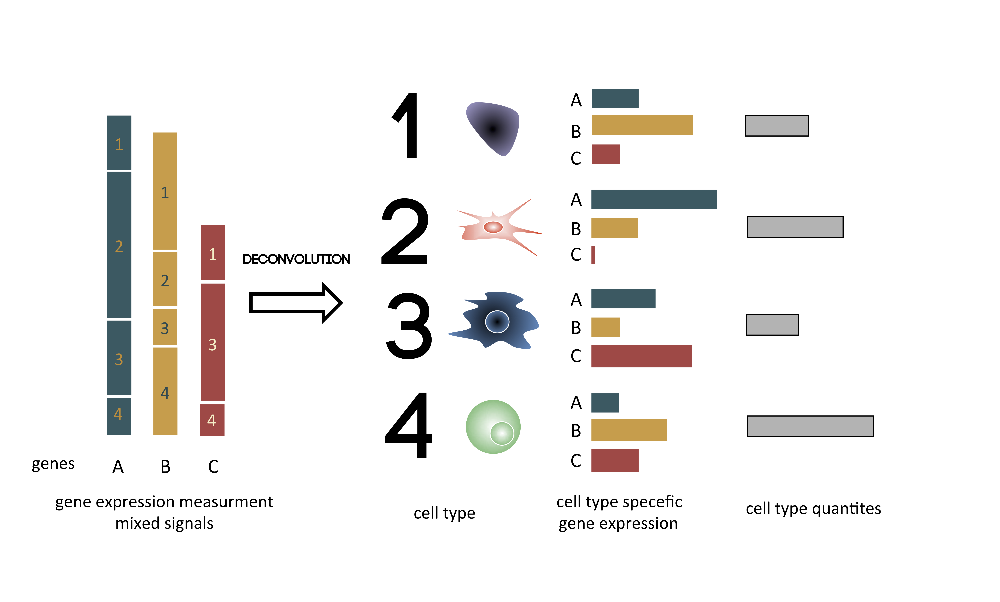
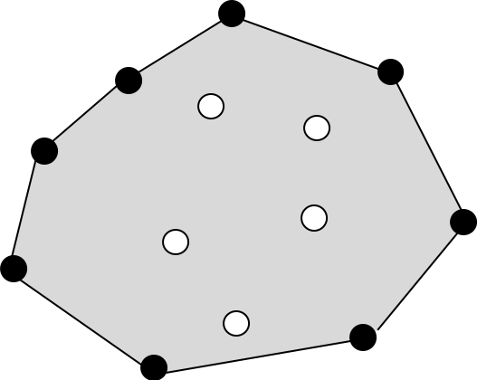
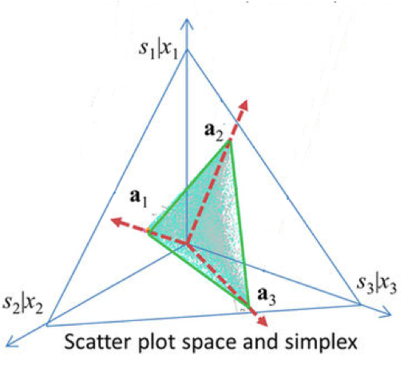
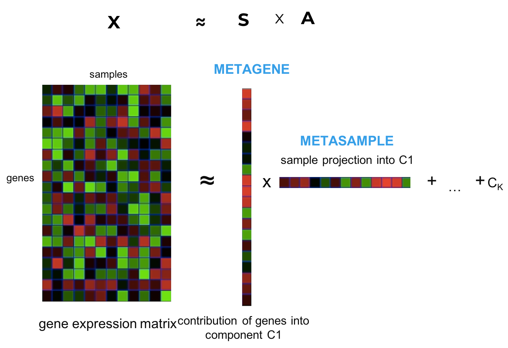
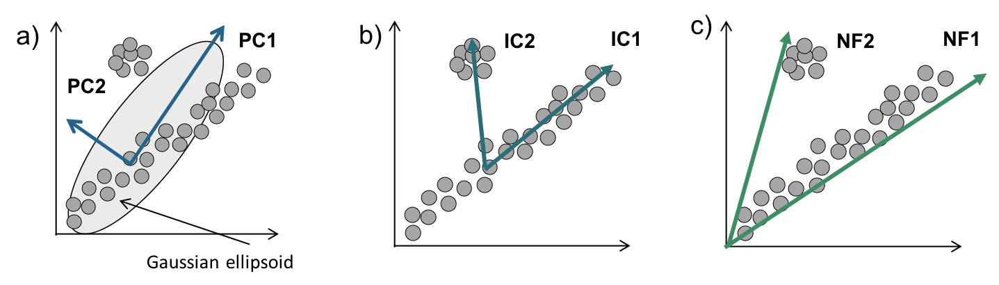

<!-- ```{r setup, include=FALSE} -->
<!--  is_pdf_output = function() { -->
<!--   knitr::opts_knit$get("rmarkdown.pandoc.to") =="latex" -->
<!--  } -->
<!-- ``` -->

<!-- ```{r setup2, include=FALSE} -->
<!--  is_html_output = function() { -->
<!--   knitr::opts_knit$get("rmarkdown.pandoc.to") =="html4" -->
<!--  } -->
<!-- size.fig = "100%" -->
<!-- ``` -->

```{r message=FALSE, warning=FALSE, paged.print=FALSE, include=FALSE}
load("~/Google Drive/PhDThesis/RData/Math.RData")
```

# Mathematical foundation of cell-type deconvolution of biological data {#methods}
```{r smallChap, results="asis", echo = FALSE}
if(is_pdf_output()){
cat("\\chaptermark{Mathematical introduction}")
}
```

In the previous chapter I presented state-of-art of the current immuno-oncology research that has to embrace great complexity of cancer disease and the immune system. One part of this complexity can be explained by the presence and quantities of tumor-infiltrating immune cells, their interactions with each other and the tumor. 

In this chapter, I will discuss how mathematical models can be used to extract information about specific cell-types from 'bulk' omics data or how to de-mix mixed sources composing the bulk samples. To start with, I will introduce you to basic concepts of machine learning. Then I will focus on approaches adapted for cell-type deconvolution. In a literature overview, I will depict the evolution of the field as well as discuss the particularities   of different tools for estimating presence and proportion of immune cells within cancer bulk omic data. 


## Introduction to supervised  and unsupervised learning

Machine learning (ML) is a filed of computer science where system is able to learn and improve given an objective function and the data. 

A popular definition of machine learning has been given by Mitchell in 1997: 

> Machine learning: *A computer program is said to learn from experience E with respect to some class of tasks T and performance measure P if its performance at tasks in T, as measured by P, improves with experience E*.
>
> —  Mitchell in 1997 [@Mitchel1997]

Term *Artificial intelligence* (AI) is often used by the media or general public to describe machine learning. Indeed ML can be considered as a branch of AI, together with computer vision and deep neural networks applications. However, commonly ML and AI are used interchangeably by the wide public.

ML is applied commonly in many fields of science and industry. I will not discuss here a subtle differences between machine learning, statistical learning, computational statistics and mathematical optimisation. 

In general, algorithms can be divided into groups given the application: 

- classification - aims to assign observations to a group (discrete variable)
- regression - aims to predict a continuous response of an input (continuous variable)
- clustering - aims to divide data into groups that are related to each other based on a distance 

Another important distinction can be made given the inputs to the algorithm. Here, I present the differences between supervised and unsupervised learning.

### Supervised learning 

Supervised learning can be described as  "the analysis of data via a focused structure" [@Piegorsch2015]. The main task is to predict an output given the inputs. In the statistical language, the inputs are often called the predictors or the independent variables. In the pattern recognition literature the term features is preferred. The outputs are called the responses, or the dependent variables. [@Hastie2009]

The initial data is divided into two sets: training and test. First the model is trained with correct answers on the training data (learning to minimise the error) , and then its performance is evaluated on the test data. 

Among widely used classifiers there are Support Vector Machines (SVM), partition trees (and their extension random forests), and neural networks. For regression it is common to encounter linear regression, boosted trees regression, 

### Unsupervised learning {#unsup}

In Unsupervised learning is given the data and is asked to divide the data given a certain constraint. However, the correct division of the data is not known. Therefore an unsupervised algorithms aims to unveil the "hidden structure" of the data, or latent variables.

One group of unsupervised learning are descriptive statistic methods, such as: principal components, multidimensional scaling, self-organizing maps, and principal curves. This methods aim to represent to the data  most adequately in low-dimensional space  [@Hastie2009].

Another group are clustering algorithms. Clustering is the way to create groups (multiple convex regions) based on the intrinsic architecture of the data. These groups are not necessarily known beforehand, but can validated with the domain knowledge. Popular clustering algorithms are knn, k-means, hierarchical clustering.

In both descriptive statistics and clustering, one important parameter (often called $k$) is number to which we want to decompose the data (number of factors, variables, clusters). Different algorithms and applications can propose an automatic choice of $k$ based on formal indexes or previous knowledge, in others, user need to provide the $k$.

### Low-dimensional embedding for visualization

There is a common confusion, often seen in computational biology, between dimension reduction and clustering. This confusion is highly pronounced with, a popular in biology, algorithm: T-distributed Stochastic Neighbor Embedding (t-SNE) [@Maaten2008]. t-SNE works in 2 main steps:  (1) a probability distribution over pairs of high-dimensional objects is computed in such a way that similar objects have a high probability of being picked, whilst dissimilar points have an extremely small probability of being picked, (2) t-SNE defines a similar probability distribution over the points in the low-dimensional map, and it minimizes the Kullback–Leibler divergence between the two distributions with respect to the locations of the points in the map.  It is not reliable to use t-SNE for clustering as it does not preserve distances. It can also easily overfit the data and uncover 'fake' or 'forced' patterns. Therefore, a clustering should not be applied to t-sne reduced data. An alternative to t-SNE method is recently published Uniform Manifold Approximation and Projection for Dimension Reduction (UMAP) (@Mcinnes2018) that is based on Laplacian eigenmaps, highly scalable, reproducible and recently applied to biological data (@Becht2018). Older used alternatives are ISOMAPS (non linear dimension reduction) or PCA (Principal components analysis). For any non-linear dimension reduction method, it is not recommended to use clustering *a posteriori*. Clusters should be computed on original data and then the cluster labels can be visualized in low-dimentional embedding.

## Impact of machine learning on Healthcare

Machine learning may seem a discipline far from biology or healthcare. However with the expansion of data ML-based methods are participating more and more in medecine, especially in diagnostics, and will probably grow expotentially.

https://qz.com/1251502/the-fda-just-opened-the-door-to-let-ai-make-medical-decisions-on-its-own/

https://www.healthcatalyst.com/clinical-applications-of-machine-learning-in-healthcare

http://collections.plos.org/mlforhealth

##  Types of deconvolution 

One specific application of mathematical/statistical tools is deconvolution of mixed signals.

According to mathematical definition:

> Deconvolution : *the resolution of a convolution function into the functions from which it was formed in order to separate their effects* 

Or in plain English:

> *a process of resolving something into its constituent elements or removing complication*

The similar problem of mixed sources can be encountered in other fields, i.e. signal processing, known also under the name of  "**cocktail party problem**". In the cocktail party problem, at a party with many people and music, sound in recorded with several microphones. Through blind source separation, it is possible to separate the voices of different people and the musical background (Fig. \@ref(fig:cocktailparty)) [@Cherry1953].

```{r cocktailparty, fig.cap='(ref:cocktailparty-caption)',fig.scap="illutration of the cocktail party problem", out.width='100%', fig.align='center', echo = FALSE}
if (is_pdf_output()) {
  knitr::include_graphics('figures-ext/cocktailparty.pdf')
} else {
  knitr::include_graphics('figures-ext/cocktailparty.jpg')
}
```

(ref:cocktailparty-caption) **Illutration of the cocktail party problem**. During a cocktail party voices of participalnts can be recorded with a set of microphones and then recovered though blind source separation. Fot the illustration purposes only four sources are mixed with three microphones, in reality the analysis can be performed with many sources. However, number of samples (microphones) should be higher than numer of sources (contrary to the illustration). 

The same concept can be transposed to the bulk omic data, each biological species (like gene) is a cocktail party where each sample is a microphone that gathers mixed signals of different nature. The signals that form the mixtures can be different depending on the data type and scientific question asked.

In general, the total bulk data can be split into three abundance components [@Shen0rr2013]: 

1. sample characteristic (disease, clinical feature)
2. individual variation, genotype-specific or technical variation
3. presence and abundance of different cell types expressing set of characteristic genes 

Many scientists invested their efforts in order to dissect the bulk omic data into interpretable biological components.

In scientific literature, there can be encountered three main understanding of tumor deconvolution:

* **estimating clonality**: using genomic data is it possible to trace tumor phylogeny raised from mutations and aberrations in tumor cells; therefore it is dissecting *intra*-tumor heterogeneity (i.e. using transcriptomic data [@Schwartz2015], or more often CNA data (see [Section X](#otherDecon)) 
* **estimating purity**: deconvolution into tumor and immune/stroma compartments, often aiming to "remove" not-tumor signal from the expression data, can be performed with different data types, the most reliable estimations are obtained usually from CNA data (see [Section X](#otherDecon)) 
* **estimating cell-type** proportions and/or profiles from bulk omics data, most of works were performed on transcriptome data (see [Section A](#cellTypeTrans)) and some on the methylome data (see [Section X](#otherDecon))

These three types of deconvolution can be performed on the bulk omics data. Here we will focus on cell-type deconvolution models using bulk transcriptome. I will also briefly introduce deconvolution models applied to other data types (methylome and CNA).

## Cell-type deconvolution of bulk transcriptomes {#cellTypeTrans}

The idea of un-mixing the bulk omic profiles is documented to first appear in an article of  @Venet2001 as a way to 

> *infer the gene expression profile of the various cellular types (...) directly from the measurements taken on the whole sample*

In the basic hypothesis [@Abbas2009],  mixture of signals from TME in transcriptomic samples can be described as a linear mixture. 

\begin{equation} 
X = SA  (\#eq:linear)
\end{equation}

\@ref(eq:linear)

Where in Equaltion \@ref(eq:linear) $X$ is microarray data matrix of one biological sample, $A$ are mixing proportions and $S$ is the matrix of expression of genes in each cell type. 

Algebraically the same problem can be formalized as latent variable model:

\begin{equation} 
\begin{aligned}
\forall i \in \{1,M\}, 	\forall  j \in \{1,N\} \\
x_{ij}= \sum_{k=1}^K a_{kj} *s_{ik}+ e_{ij} (\#eq:algebraic)
\end{aligned}
\end{equation}

Where $x_{ij}$ is expression of gene $i$ in sample $j$, $a_{kj}$ is the proportion of cell type $k$ in sample $j$ and $s_{ik}$ is the expression of the gene $i$ in the cell type $k$, $K$ total number of cell types, $N$ total number of samples, $M$ total number of genes. The error term $e_{ij}$ cannot be directly measured. 

The goal of deconvolution is to reverse these equations and starting from the mixture infer the $A$ (or $a_{kj}$) and $S$ (or $s_{ik}$). 

Graphically the deconvolution of bulk gene expression can be depicted as in Fig. \@ref(fig:deconvolution-cartoon). 

```{r deconvolution-cartoon, fig.cap='(ref:deconvolution-cartoon-caption)',fig.scap="Principle of the deconvolution applied to transcriptome", out.width='100%', fig.align='center', echo = FALSE}
if (is_pdf_output()) {
  knitr::include_graphics('figures-ext/deconv.pdf')
} else {
  
}
```

(ref:deconvolution-cartoon-caption) **Principle of the deconvolution applied to transcriptome** Graphical illustration of the deconvolution of mixed samples. Starting from the left, gene expression of genes A B C is a sum of expression of cell types 1, 2, 3, 4. After deconvolution, cell types are separated and gene expression of each cell type is estimated taking into account cell type proportions.

However, in this model, either the mixing proportions, number of mixing sources or an array of specific genes need to be know. While, in the real-life case, only $X$ is truly known. Therefore, developed models proposed various manners for estimating number of mixing sources and their proportions, or the specific cell type expression. 

Why there is a need for cell-type deconvolution approaches? 

* for differential gene expression analysis, to avoid confusion between a feature and cell-type abundance
* difference in gene expression in one cell type can be blurred by presence of other cells expressing the gene
* to obtain information about a fraction of given component in the sample
* to infer context-specific profile or signature


```{r x2, results="asis", echo = FALSE}
if(is_html_output()){cat("<table>",paste0("<caption>", "(#tab:mytab)","<b>", "Summary of methods for cell-type deconvolution of bulk transcriptome","</b>", "</caption>"),"</table>", sep ="\n")}
```

```{r x, echo=FALSE}
if(is_html_output()){
 #devtools::install_github('rstudio/DT')
library(DT)
library(readxl)
decon_meth <- read_excel("RData/decon_meth.xlsx")
decon_meth$data <- as.factor(decon_meth$data)
decon_meth$type <- as.factor(decon_meth$type)
decon_meth$proportions.in <- as.factor(decon_meth$proportions.in)
decon_meth$profiles.in <- as.factor(decon_meth$profiles.in)
decon_meth$application <- as.factor(decon_meth$application)
decon_meth$out.profiles <- as.factor(decon_meth$out.profiles)
decon_meth$out.proportions <- as.factor(decon_meth$out.proportions)
decon_meth$category <- as.factor(decon_meth$category)
decon_meth$language <- as.factor(decon_meth$language)
decon_meth$published <- as.factor(decon_meth$published)
decon_meth$previously.covered <- as.factor(decon_meth$previously.covered)
decon_meth[!(decon_meth$availability  %in% "NA"| decon_meth$availability  %in% "broken link"),]$availability <-  paste0("<a href=\"", decon_meth[!(decon_meth$availability  %in% "NA"| decon_meth$availability  %in% "broken link"),]$availability,"\">",decon_meth[!(decon_meth$availability  %in% "NA"| decon_meth$availability  %in% "broken link"),]$availability,"</a>")
decon_meth$doi <- paste0("<a href=\"", decon_meth$doi,"\">",decon_meth$doi,"</a>")
mytab <- datatable(decon_meth, filter = 'top', options = list(
  columnDefs = list(list(width = '10em', targets = list(1,2,14)), list(width="30em", targets=list(4)),list(width='5em', targets= list(5, 7, 8, 9))),
  pageLength = 20,
  autoWidth = TRUE,
  scrollX=TRUE),
  rownames = FALSE,
width = '100%',
caption = NULL,
escape = FALSE
)
mytab
}
```

```{r mytab, echo = FALSE }
if(!is_html_output()){
  library(kableExtra)
  library(readxl)
decon_meth <- read_excel("RData/decon_meth.xlsx")
decon_meth$data <- as.factor(decon_meth$data)
decon_meth$type <- as.factor(decon_meth$type)
decon_meth$proportions.in <- as.factor(decon_meth$proportions.in)
decon_meth$profiles.in <- as.factor(decon_meth$profiles.in)
decon_meth$application <- as.factor(decon_meth$application)
decon_meth$out.profiles <- as.factor(decon_meth$out.profiles)
decon_meth$out.proportions <- as.factor(decon_meth$out.proportions)
decon_meth$category <- as.factor(decon_meth$category)
decon_meth$language <- as.factor(decon_meth$language)
decon_meth$published <- as.factor(decon_meth$published)
decon_meth$previously.covered <- as.factor(decon_meth$previously.covered)
#decon_meth[!(decon_meth$availibility  %in% "NA"| decon_meth$availibility  %in% "broken link"),]$availibility <-  paste0("<a href=\"", decon_meth[!(decon_meth$availibility  %in% "NA"| decon_meth$availibility  %in% "broken link"),]$availibility,"\">",decon_meth[!(decon_meth$availibility  %in% "NA"| decon_meth$availibility  %in% "broken link"),]$availibility,"</a>")
#decon_meth$doi <- paste0("<a href=\"", decon_meth$doi,"\">",decon_meth$doi,"</a>")
tab.sel <- data.frame(decon_meth[,c("name","data", "type", "doi", "year", "application", "availability", "out.profiles", "out.proportions", "category", "language", "citations", "pop.index", "previously.covered" )])
tab.sel.o <- tab.sel[order(-tab.sel$year),]
tab.sel.o$pop.index <- round(tab.sel.o$pop.index,2)
  kable(tab.sel.o, format="latex",row.names = FALSE, align = 'c', booktabs = T , caption='(ref:mytab-caption)', escape =TRUE, caption.short = "Summary of methods for cell-type deconvolution of bulk transcriptome") %>%
     kable_styling(latex_options= c("striped", "scale_down"), full_width =F )  %>% landscape()
  # %>%
  # column_spec(1:4, width = "9em", border_left = T) %>%
  #  column_spec(4, width = "9em",  border_left = T, border_right = T)

}

  
```


(ref:mytab-caption) **Summary of methods for cell-type deconvolution of bulk transcriptome**. Data gathered based on pubmed and google scholar search in May 2018. 

### Literature overview

In order to answer general and specific need for cell-type deconvolution of bulk transcriptomes researches produced a large collection of tools. I have collected all (to my knowledge) articles published in journals or as a pre-print (up to May 2018) that propose original models/tools of cell-type deconvolution of bulk **transcriptomes** (Tab. \@ref(tab:mytab)). Therefore clonal deconvolution methods are not included in this overview. The transcriptome-based purity estimation methods are included as many of them proposed an initial 2-sources model that could be, at least in theory, extended to multiple sources model. Also, I did not included cell-type deconvolution methods of other data types (such as methylome). A separate (section X)[#otherDecon] is dedicated to non-transcriptome methods.

The Table \@ref(tab:mytab) contains 64 (including mine) deconvolution methods. It can be observed (Fig. \@ref(fig:pubyear)) that since the begging of my thesis (2015) the number of publications has doubled (64 publications in 2018 vs. 33 in 2014). Also, since 2014 more methods are published every year. In Fig. \@ref(fig:pubyear) *hallmark* publications are indicated in red above their year of publication. The three most popular methods (based of number of citations/number of years since publication) are CIBERSORT [@Newman2015] (2015, total  number of citations: 343  and 88.75 citations per year), ESTIMATE [@Yoshihara2013] (2013, total number of citations: 266 and 44.33 citations per year), and csSAM [@Shen-Orr2010] (2010, total number of citations: 286 and 31.77 citations per year).  It can be noticed that the high impact of the journal plays a role, the top 3 cited methods were published in *Nature Methods* and *Nature Communications* followed by Virtual Microdissection method [@Moffitt2015] (2015) published in *Nature Genetics*. However, the fifth most cited publication @Abbas2009 (2009, total of 207 citations) appeared in *PLOS ONE*. As the index is a bit penalizing for recent publications, among commonly cited tools after 2015 are MCPcounter with 42 citations (2016, 32 without self-citations) and xCell with 14 citations (2017, 11 without self-citations). A big number of publications with low number of citations were published in *Oxford Bioinformatics* or *BMC Bioinformatics* which underlines importance of publishing a computational tool along with an important biological message rather than in a technical journal in order to increase a chance to be used by other researchers. 

Another important aspect is availability of the tool. One-third (in total 21) methods do not provide source code or a user-interface tool to reproduce their results. Among those articles, 13 was published before 2015. Therefore, it can be concluded that the pressure of publishers and research community on reproducibility and accessibility of bioinformatic tools gives positive results. @Gajoux2013, author of semi-supervised NMF method [@Gajoux2012], published *CellMIx: a comprehensive toolbox for gene expression deconvolution* where he implements most of previously published tools in R language and group them in the same R-package. This work tremendously increased the usability of previously published deconvolution methods. The CellMix package is one of the state-of-the-art work on deconvolution that regroups algorithms, signatures and benchmark datasets up to 2013.

The most popular language of implementation of published methods is R (49.2 %), followed by Matlab (11.11%), only one tool so far was published in Python. 

Also, most of methods were designed to work with microarray data. There is a high chance that some of them are adaptable to RNA-seq. However, little number of older methods was tested in a different setup. For some method, as CIBERSORT, demonstrated to work with microarray and applied commonly to RNA-seq by other researchers, the validity of results remains unclear as some studies claim that CIBERSORT performs accurately applied to RNA-seq [@Thorsson2018] and other opt agains it (@Li2017; @Tamborero2018). Most of newer methods (i.e. EPIC [@Racle2017], quanTIseq [@Finotello2017] or Infino [@Zaslavsky2017]) are specifically designed for RNA-seq TPM-normalized data. Some methods, mostly enrichment-based methods, are applicable to both technologies (i.e. xCell [@Aran2017]). 

It is remarkable that the general aim of the  cell-type deconvolution changed with time. The earlier methods aimed to improve the power of differential expression analysis though *purification* of the gene expression. For example, to compare differentially expressed genes (DEG) in T-cell from the blood in two conditions. However, the obtained purified profiles from complex mixtures were often uncertain [@Onuchic2016]. Recently, the most mentioned goal of deconvolution is quantification of proportions of different cell types, especially in the context of cancer transcriptomes motivated by redefinition of immunophenotypes discussed in the previous chapter.  The most popular tissue of interest for deconvolution algorithms are cancer tissues and blood, other applications are cell-cycle time dependent fluctuations of yeast,  brain cells and glands .  

Mathematically speaking, I have divided methods into four categories: probabilistic, regression, matrix factorisation and convex hull depending on the nature of approach. Most of the methods (48 - 74.6%) are working within a supervised framework and only 20% (14) are unsupervised. The approaches will be described in detail in the following section.

There are numerous practical differences between the methods. @Gajoux2011 in his review of deconvolution tools, grouped the tools depending on their inputs and outputs. Given type of outputs deconvolution can be considered as complete (proportions and cell profiles) or partial (one of those). Moreover, the inputs of the algorithms can be important to evaluate how practical the tool is. The most popular tools and the most recent tools ask minimal input from the user: the bulk gene expression matrix, or even raw sequencing data [@Finotello2017]. Older methods usually request either at least approximative proportions of mixed cells or purified profiles to be provided.  The newer methods include the reference profiles in the tool if necessary. Some tools, including most of purity estimation tools, demand an additional data input as normal samples or another data type such as CNA data (Timer [@Li2013], VoCAL [@Steuerman2016]] or image data (quanTIseq [@Finotello2017]). An important parameter is also a number of sources  ($k$) to which the algorithm deconvolutes the mixture. In many methods it should be provided by the user, which can be difficult in a case of complex mixtures of human tissues. In addition, type of method can also limit the number of sources, for example, a probabilistic framework privilege lower number of sources (2-3) due to the theoretical constraints.  In regression depending on provided reference the output number of estimated sources is imposed. Because of the problem of collinearity and similarity of immune cell profiles, it is hard to distinguish between cell sub-types, deconvolution into fine-grain cell subtypes is often called often deep deconvolution. Some methods (i.e. CIBERSORT, Infino, xCell) give a specific attention to deconvolution of cell-subtypes. An absolute presence of a cell type in the mixture can be also an important factor, if it is too low it can reach a detection limit, Electronic subtraction [@Gosnik2007] discuss specifically the detection of rare cel-types.

Running time and necessary infrastructure are another way to characterize the methods. Although it is hard to compare objectively the running time simultaneously of all the tools because of the heterogeneity of methods and different datasets analysed, some tendencies can be observed. If one thinks about applying deconvolution methods to big cohorts, regression and enrichment-based methods should be well suited. As far as matrix factorisation is concerned, it is depending on implementation (i.e. R vs Matlab) and if number of sources needs to be estimated (multiple runs for different $k$ parameter) or if a stabilisation needs to applied (multiple runs for the same $k$ parameter). Finally, probabilistic tools seem to be difficult to scale, i.e. authors of Infino admit that their pipeline is not yet applicable at high-throughput. 

In order to let user better understand the differences between different mathematical approaches, I will introduce shortly the types of approaches used for cell-type deconvolution of transcriptomes as well as their  strong and weak points. 


```{r plotsetup, echo = FALSE, warning=FALSE, include=FALSE}
library(ggplot2)
library(plotly)
library(readxl)
decon_meth <- read_excel("RData/decon_meth.xlsx")
tab.sel <- data.frame(decon_meth[,c("name","data", "type", "doi", "year", "application", "availability", "out.profiles", "out.proportions", "category", "language", "citations", "pop.index", "previously.covered" )])
tab.sel.o <- tab.sel[order(-tab.sel$year),]

pap.year <- data.frame(table(tab.sel.o$year))
colnames(pap.year) <- c("year", "nb. of papers")

# p <-
#   ggplot(data = pap.year, aes(x = year, y = `nb. of papers`, group = 1)) +
#   geom_line() +
#   geom_point() + theme_bw() 
p <- ggplot(data = pap.year, aes(x = year, y = `nb. of papers`, width=0.5)) +
  geom_bar(stat = "identity", colour= "black", fill="grey") +
  theme_bw()+
 annotate(
    "text",
    x = 13,
    y = 4.3,
    label = "CIBERSORT",
    colour = "red"
  ) + annotate(
    "text",
    x = 11,
    y = 11.6,
    label = "ESTIMATE\n CellMix toolbox",
    colour = "red"
  ) + annotate(
    "text",
    x = 14,
    y = 7.3,
    label = "MCPcounter",
    colour = "red"
  ) + annotate(
    "text",
    x = 15,
    y = 12.6,
    label = "xCell\n EPIC",
    colour = "red"
  ) + annotate(
    "text",
    x = 7,
    y = 2.3,
    label = "Abbas et al.",
    colour = "red"
  ) + annotate(
    "text",
    x = 8,
    y = 4.3,
    label = "csSAM",
    colour = "red"
  )

```


```{r pubyear, echo=FALSE, message=FALSE, warning=FALSE, paged.print=FALSE, fig.cap='(ref:pubyear-caption)', out.width='70%', fig.scap="Distribution of publications of cell-type deconvolution of bulk transcriptome over the years", fig.align='center', out.width=size.fig}

if (is_pdf_output()) {
  p
} else {
  ggplotly(p, tooltip = c("x", "y"))
}

```


(ref:pubyear-caption) **Distribution of publications of cell-type deconvolution of bulk transcriptome over the years**. In red: hallmark publications. Data gathered based on pubmed and google scholar search in May 2018.

```{r languagesA,  echo=FALSE, message=FALSE, warning=FALSE, paged.print=FALSE, out.width=size.fig, fig.align='center'}
if(is_html_output()){

  
  df <-
    data.frame(category = as.character(tab.sel$category),
               value = rep(1, nrow(tab.sel)))
  
  res <- by(df$value, df$category, sum)
  stat.1 <- data.frame(value = do.call(rbind, as.list(res)))
  stat <-
    data.frame(category = row.names(stat.1),
               value = do.call(rbind, as.list(res)))
  
  a <-
    plot_ly(
      stat,
      labels = ~ category,
      values = ~ value,
      type = 'pie',
      textposition = 'inside',
      textinfo = 'label+percent',
      insidetextfont = list(color = '#FFFFFF', size = 20),
      marker = list(colors = colors,
                    line = list(color = '#FFFFFF', width = 1))
    ) %>%
    layout(
      title = "a) Percentage of used approach type",
      xaxis = list(
        showgrid = FALSE,
        zeroline = FALSE,
        showticklabels = FALSE
      ),
      yaxis = list(
        showgrid = FALSE,
        zeroline = FALSE,
        showticklabels = FALSE
      )
    )
  a
} 
```

```{r languagesB,  echo=FALSE, message=FALSE, warning=FALSE, paged.print=FALSE, out.width=size.fig, fig.align='center'}
if(is_html_output()){
  df <-
    data.frame(type = as.character(tab.sel$type), value = rep(1, nrow(tab.sel)))
  
  res <- by(df$value, df$type, sum)
  stat.1 <- data.frame(value = do.call(rbind, as.list(res)))
  stat <-
    data.frame(type = row.names(stat.1), value = do.call(rbind, as.list(res)))
  
  b <-
    plot_ly(
      stat,
      labels = ~ type,
      values = ~ value,
      type = 'pie',
      textposition = 'inside',
      textinfo = 'label+percent',
      insidetextfont = list(color = '#FFFFFF', size = 20),
      marker = list(colors = colors,
                    line = list(color = '#FFFFFF', width = 1))
    ) %>%
    layout(
      title = "b) Percentage of supervised/unsupervised tools",
      xaxis = list(
        showgrid = FALSE,
        zeroline = FALSE,
        showticklabels = FALSE
      ),
      yaxis = list(
        showgrid = FALSE,
        zeroline = FALSE,
        showticklabels = FALSE
      )
    )
  b
  
} 
```

```{r languagesC,  echo=FALSE, message=FALSE, warning=FALSE, paged.print=FALSE, fig.cap='(ref:languagesABC-caption)', out.width=size.fig, fig.align='center'}
if(is_html_output()){
  tab.sel$language[grep(".*R.*",  tab.sel$language)] <- "R"
df <- data.frame(language = as.character(tab.sel$language), value = rep(1, nrow(tab.sel)))

res <- by(df$value, df$language, sum)
stat.1 <- data.frame( value = do.call(rbind,as.list(res)))
stat <- data.frame(language = row.names(stat.1), value = do.call(rbind,as.list(res)))

c <- plot_ly(stat, labels = ~language, values = ~value, type = 'pie',textposition = 'inside',
        textinfo = 'label+percent',  insidetextfont = list(color = '#FFFFFF', size = 20), marker = list(colors = colors,
                      line = list(color = '#FFFFFF', width = 1))) %>%
  layout(title="c) Percentage of the programming languages of implementation", xaxis = list(showgrid = FALSE, zeroline = FALSE, showticklabels = FALSE),
         yaxis = list(showgrid = FALSE, zeroline = FALSE, showticklabels = FALSE))
c

} 
```

```{r caption-html, results="asis", echo= FALSE}
if(is_html_output()){
cat("(ref:languagesABC-caption) **Simple statistics illustrating characteristics of published cell-type deconvolution tools**: **a)** Percentage of used approach type, **b)** Percentage of supervised/ unsupervised tools, **c)** Percentage of the programming languages of implementation. Data gathered based on pubmed and google scholar search in May 2018.")
}
```


```{r languages, fig.cap='(ref:lang-caption)',fig.scap="Simple statistics illustrating characteristics of published cell-type deconvolution tools", out.width='33%', fig.ncol= 3, fig.subcap= c("approach type", "supervised/unsupervised", "programming language"), echo=FALSE, message=FALSE, warning=FALSE, paged.print=FALSE}
if(is_pdf_output()) {
knitr::include_graphics(c("./figures-ext/piechartA.png", "./figures-ext/pichartB.png", "./figures-ext/pirChart.png"))
}
```

```{r caption-pdf, results="asis", echo = FALSE}
if(is_pdf_output()){
  cat("(ref:lang-caption) **Simple statistics illustrating characteristics of published cell-type deconvolution tools**: \\@ref(fig:languages1) - Percentage of used approach type, \\@ref(fig:languages2) - Percentage of supervised/unsupervised tools, \\@ref(fig:languages3) - Percentage of the programming languages of implementation. Data gathered based on pubmed and google scholar search in May 2018.")
}
```


### Regression-based methods

Regression models are the most popular methods for bulk gene expression deconvolution. They use estimated pure cell profiles as depending variables (or selected signature genes) that should explain the mixed profiles choosing best $\beta$ parameters (\@ref(eq:regLin)) that can be interpreted as cell proportions.

A standard type of regression is called linear regression. It reflects linear dependence between independent and dependent variables. The linear regression was developed in the *precoputer age of statistics* [@Hastie2009].

In linear regression, we want to predict a real-valued output $Y$, given a vector $X^T = (X_1,X_2,… ,X_p)$. The linear regression model has the form: 

\begin{equation}
f(X) = \beta_0 + \sum_{j=1}^{p} X_j\beta_j (\#eq:regLin)
\end{equation}

Where the $\beta_j$s are unknown parameters or coefficients, and $X_j$s are the explaining variables. Given pairs of ($x_1$,$y_1$)...($x_N$ ,$y_N$ ), one can estimate coefficients $\beta$ with an optimization of an objective function (also called cost function).

The most popular estimation method is **least squares**, the coefficients $\beta = (\beta_0, \beta_1, ..., \beta_n)$ are computed to minimize the residual sum of squares (RSS):

\begin{equation}
RSS(\beta) = \sum_{i = 1}^{N}(y_i - f(x_i))^2 = \sum_{i = 1}^{N}(y_i - \beta_0 - \sum_{j=1}^p x_i\beta_j)^2 (\#eq:rss)
\end{equation}

**Ordinary least squares regression** is using Eq.\@ref(eq:rss) to compute $\beta$.

**Ridge regression** (Equation \@ref(eq:ridge)) adds a regularizer (called $L2$ norm) to shrink the coefficients ($\lambda \geq 1$) through imposing a penalty on their size.

\begin{equation}
\hat{\beta}^{ridge} = \underset{\beta}{\text{argmin}}\{\sum_{i = 1}^{N}(y_i - f(x_i))^2 + \lambda\sum_{j=1}^{p}\beta^2_j\}(\#eq:ridge)
\end{equation}

Similarly **Lasso regression** (Equation \@ref(eq:lasso)) adds a regularization term to RSS (called $L1$ norm), it may set coefficients to 0 and therefore perform feature selection.

\begin{equation}
\hat{\beta}^{ridge} = \underset{\beta}{\text{argmin}}\{\sum_{i = 1}^{N}(y_i - f(x_i))^2 + \lambda\sum_{j=1}^{p}\lvert\beta_j\rvert\}(\#eq:lasso)
\end{equation}

In **Elastic net regression** both penalties are applied.

**Support Vector Regression (SVR)** is regression using **Supported Vector Machines (SVM)**. In SVR $\beta$ can be estimated as follows:

\begin{equation}
H(\beta,\beta_0) = \sum_{i=1}^{N} V (y_i − f(x_i)) +\frac{λ}2\lVert\beta\rVert^2 (\#eq:svr1)
\end{equation}

where error is measured as follows:

\begin{equation}
V_\epsilon(r) = \begin{cases}
    0, & \text{if $\lvert r \rvert < \epsilon$,}\\
    \rvert r\lvert - \epsilon, & \text{otherwise}. 
  \end{cases}  (\#eq:svr2)
\end{equation}

with $\epsilon$ being the the limit of error measure, meaning errors of size less than $\epsilon$ are ignored.

In the SVM vocabulary, a subset of the input data that determine hyperplane boundaries are called the **support vectors** (Fig.\@ref(fig:svr)). SVR discovers a hyperplane that fits maximal possible number of points within a constant distance, $\epsilon$, thus performing a regression.

In brief, in SVR, RSS is replaced by a linear $\epsilon$-insensitive loss function and uses *L*2-norm penalty function. There exist variants of SVR algorithm, i.e. $\epsilon$-SVR [@drucker1997] and $\nu$-SVR [@Scholkopf2000]. $\epsilon$-SVR allows to control the error, this favorizes more complex models. In the $\nu$-SVR the distance of the $\epsilon$ margin can be controlled and therefore number of data points used for regression can be controlled. @Ju2013 used SVM-based method to define cell type specific genes. A model using  $\nu$-SVR with linear kernel was used by @Newman2015 in CIBERSORT. 

```{r svr, fig.cap='(ref:svr-caption)',fig.scap="Priciple of the SVR regression", out.width='100%', fig.align='center', echo = FALSE}
knitr::include_graphics('figures-ext/vSVR.pdf')
```


(ref:svr-caption) **Priciple of the SVR regression**. In SVR regression $\epsilon$ represents limit of error measure, input data points higher than $+\epsilon$  or lower than $-\epsilon$ are called support vectors. The $\nu$ parameter in $\nu$-SVR regression controls the distance of training error bonds: left - lower $\nu$ value larger bound, right - higher $v$ margin, smaller bound.  Reprinted by permission from Springer Nature [@Newman2015] © 2018 Macmillan Publishers Limited, part of Springer Nature. All rights reserved.


As unconstrained optimization of the objective function can result in negative coefficients. In the context of cell-type deconvolution, authors often aim to avoid as it complicates the interpretation. Therefore, different constraints can be imposed to the $\beta$ coefficients. The most common conditions are $\beta_0 +\beta_1+ ...+\beta_n =1$ and  $\forall\beta_i \geq 0$. Solution respecting the non-negativity condition is also called non-negative least squares (NNLS) to contrast with ordinary least squares (OLS). NNLS was adapted by many authors [@Venet2001; @Abbas2009; @Repsbiler2010; @Zuckerman2013; @Wang2016].

The task can be also solved differently from computational perspective. @Lu2003 and @Wang2006 propose to use simulated annealing to minimize the cost function. @Gong2011 proposed to solve task using quadratic programming.

An extensive review on optimisation of the objective function for regression methods in cell-type deconvolution was published by @Mohammadi2017. Authors carefully consider different possibilities of parameter choice in the loss and regularization fomulations and its performance. They present as well recommendations for construction of basis matrix and data pre- and post-processing. Digital tissue deconvolution (DTD) [@Gortler2018] aims to train the loss function with *in silico* mixtures of single cell profiles resulting in improved performance of rare cell types (present in small proportion). However, the training is computationally heavy and the proper training data for bulk transcriptomes are not available.

Since the publication of CIBERSORT (@Newman2015) some authors [@Chen2018; @Schelker2017] used the @Newman2015 implementation directly with pre/post modifications or different signature matrix or re-implemented the SVR regression [@Chen2018].

Another recent method EPIC [@Racle2017] introduced weights related to gene variability. In their constrained regression, they add it explicitly in the cost function modifying RSS (Eq.\@ref(eq:rss)):

\begin{equation}
RSS^{weighted} (\beta) = \sum_{i = 1}^{N}(y_i - \beta_0 - w_i \sum_{j=1}^p x_i\beta_j)^2  (\#eq:epic)
\end{equation}

with the negativity and sum constraints we discussed above. The $w_i$ weights are corresponding to variance of the given gene measure in the same cell type. It  aims to give less importance to the variant genes. EPIC also allows a cell type that is not a referenced in the signature matrix with an assumption that the non-referenced cell type is equal to 1- sum of proportions of other cell types (Eq.\@ref(eq:tumorcoeff)). This non-referenced cell type is interpreted by authors as the tumor fraction:

\begin{equation}
\beta_m = 1 - \sum_{j=1}^{m-1}\beta_j (\#eq:tumorcoeff)
\end{equation}

An additional feature of EPIC is advanced data normalisation and an estimation of mRNA produced by each cell to adjust cell proportions, which was previously proposed by @Liebner2013 in the context of microarray data:

\begin{equation}
p_j=\alpha \frac{\beta_j}{r_j} (\#eq:norm)
\end{equation}

where $p_j$ are actual cell proportions that are 'normalized' with empirically derived coefficient $\alpha$ and measured $r_j$ is the amount of RNA nucleotides in cell type $j$. 

Recently CIBERSORT proposed an *absolute mode* where the proportions are not relative to the leucocyte infiltration but to the sample. It can be obtained with assumption that the estimation of proportion of all genes in CIBERSORT matrix is corresponding to sample purity. This functionality was not yet officially published and it is still in experimental phase [@Newman2018]. 

Regression methods combined with pre- and post-processing of data can result in estimation of proportions that can be interpreted directly as a percentage of cells in mixed sample. It is an important feature hard to achieve with other methods. Some methods provide relative proportions of the immune infiltrate (@Newman2016) and other aim to provide absolute abundance (@Racle2017). The absolute proportions are easily comparable between data sets and cell types. Regression based methods are usually quite fast and can process big transcriptomic cohorts. However, as I will discuss in [Validation](#Validation) section, they pose on the hypothesis that the reference profiles available in some context (i.e. blood) are valid in a different one (i.e. tumor) or that profiles extracted from one data type (scRNA-seq) are adapted to deconvolute bulk RNAseq. Most of recent regression methods focused on estimating proportions and do not estimate context specific profiles and can process as little as one sample.

### Enrichment-based methods 

```{r contangency, echo =FALSE}
library(kableExtra)
Tab <- data.frame(Y = c("a", "c"), `Z-Y`= c("b","d"), check.names = FALSE)
row.names(Tab) <- c("in X", "not in X")
if (is_html_output()) {
  html_C6 <- kable(Tab,
        "html",
        row.names = TRUE,
        align = 'c',
        caption = '(ref:tab-caption)') %>%
    kable_styling(c("striped", "bordered"), full_width = T,  font_size = 10) %>%
    row_spec(0,
             bold = T,
             color = "white",
             background = "black")

   html_C6
} else {
  else_C6 <- kable(
    Tab,
    format = "latex",
    row.names = TRUE,
    align = 'c',
    booktabs = T ,
    caption = '(ref:tab-caption)',
    escape = FALSE,
    caption.short = "Contangency table"
  ) %>%
    kable_styling(latex_options = c("striped"),
                   full_width = F) %>%
    row_spec(0,
              bold = T,
             background = "Gray",
             color = "white") %>%
     column_spec(1, border_left = T) %>%
     column_spec(2,
                 border_left = T,
                border_right = T)
  else_C6
}
```


(ref:tab-caption) **Contangency table** is the count of overlap of genes present in a certain codition (Y) vs not present (Y-Z) and association to a pathway X (in X or not in X). Contangency table is used in frequency based test as Fisher exact test.


Enrichment-based methods aim to evaluate an amount of activity of a given list of genes within the data. This can be obtained though calculating a score based on gene expression. Traditionally enrichment methods were used to analyse set of DEG. Different statistical approaches were adapted: like fisher exact test giving a p-value that estimated the chance a given list of genes is over/under present in the input list of DEGs and therefore characterise the condition vs. control expressed genes.  

Let's take an example, if one wants to compute enrichment in pathway X of the list of DEG genes Y with total number of tested genes Z, a contingency table need to be constructed (Tab. \@ref(tab:contangency))

In the Fisher exact test formula (Eq. \@ref(eq:fisher)) the $a$, $b$,$c$ and $d$  are the individual frequencies, i.e. number of genes in  of the 2X2 contingency table, and $N$ is the total frequency ($a + b +  c + d$).

\begin{equation} 
p= \frac{( ( a + b ) ! ( c + d ) ! ( a + c ) ! ( b + d ) ! )}{a ! b ! c ! d ! N ! } (\#eq:fisher)
\end{equation}

Another famous (>14000 citations) algorithm computing such a score (enrichment score ES) is named gene set enrichment analysis (GSEA) [@Subramanian2005] uses sum-statistics. The list of genes user wants to test for enrichment is usually ranked by fold change odd or p-value of DGE analysis.  

The high score indicated high activity of genes included in the list. GSEA can also indicate an anti-activity of correlation. A variant of GSEA, single sample GSEA (ssGSEA) [@Barbie2009] was used by @Senbabaoglu2016, @Yoshihara2013 and @Aran2017 to compute infiltration scores. In the ssGSEA genes are ranked by their absolute expression. Variance-based variant of GSEA - GSVA [@Hänzelmann2013] was used by @Tamborero2018 in the same purpose. MCPcounter [@Becht2016] uses an arithmetic mean of gene expression of highly specific signature genes to compute a score.

In this way obtained scores, are not comparable between different cell types and datasets. Therefore some authors propose normalization procedures that make the score more comparable. For instance xCell, uses a platform-specific transformation of enrichment scores. Similarly, Estimate transforms scores for TCGA though an empirically derived formula. MCPcounter authors use z-scoring to minimise platform-related differences. Unfortunately, the normalization is not directly included in the R package  

Even though enrichment methods do not try to fit the linear model and derived scores are not mathematically conditioned to represent cell proportions, usually there can be observed a strong linear dependence. An advantage of the enrichment-based methods is the speed and possibility to include diverse signatures that can characterise cell-types and cell-states of different pathways.

### Probabilistic methods

The probabilistic methods share a common denominator: they aim to minimise a likelihood function of Baye's theorem:


\begin{equation} 
p(y|\theta) = \frac{p(\theta|y )* p(y)}{p(\theta)} (\#eq:Bayes)
\end{equation}

In Eq.\@ref(eq:Bayes) $y$ is our data, $\theta$ a parameter,  $p(y|\theta)$ *posterior*, $p(\theta|y )$ *likelihood*  and $p(\theta)$ *prior*. Prior distribution is what we know about the data before it was generated and combined with a probability distribution of the observed data is called posterior distribution. The likelihood describes how likely it is to observe the data ($y$) given the parameter $\theta$ (probability of $y$ given $\theta$ - $p(y|\theta)$). A parameter is characteristic of a chosen model and a hyperparameter is a parameter of prior distribution.

In the literature, there are mainly different types of probabilisitic models, one that assumes some type of distribution of mixed sources (i.e. gaussian or poisson), other that learn the distribution parameters empirically from a training set, another that try find the parameters of the distribution given the number of given sources. Then in each case, there are different ways of constructing different priors and posteriors functions. Among used techniques are Markov Chain Monte Carlo or Expectation-Maximisation, which themselves can be implemented in different ways [@Erkkila2010; @Gosh2004; @Lahdesmaki2005; @Li2013; @Roy2006, @Zaslavsky2017) 

The probabilistic approaches are the most popular for purity estimation (2 components models), that seem to be possible to extend to 3-components model [@Wang2017]. As far as cell-type decomposition into a number of cells is concerned, a method published on BioRxiv *Infino* uses Bayesian inference with a generative model, trained on cell type pure profiles. Authors claim their method is notably suited for deep deconvolution that is able to build cell type similarities and estimate the confidence of the estimated proportions which help to better interpret the results. 

Probabilisitic framework is an attractive approach with solid statistical bases. It can be suited to many specific cases. The pitfalls are (1) the need of prior profiles or correct hypothesis on the distribution parameters (2) reduced performance when applied to high dimensional datasets due to extensive parameters search.

### Convex-hull based methods

An emerging family of BSS methods are convex geometry (CG)-based methods. Here, the *sources* are found by searching the facets of the convex hull spanned by the mapped observations solving a classical convex optimization problem (@Yang2015).  It can be implemented in many ways [@Preparata1985].

**Convex hull** can be defined as follows [@Erickson2018]:

> *We are given a set $P$ of $n$ points in the plane. We want to compute something called the **convex hull** of $P$. Intuitively, the convex hull is what you get by driving a nail into the plane at each point and then wrapping a piece of string around the nails. More formally, the convex hull is the smallest convex polygon containing the points:*


> * _**polygon**_: *A region of the plane bounded by a cycle of line segments, called **edges**, joined end-to-end in a cycle. Points where two successive edges meet are called **vertices**.*
>
> * _**convex**: For any two points $p$, $q$ inside the polygon, the line segment $pq$ is completely inside the polygon._
>
> * _**smallest**_: *Any convex proper subset of the convex hull excludes at least one point in $P$. This implies that every vertex of the convex hull is a point in $P$.*
>
>   


```{r convexhull, fig.cap='(ref:convexhull-caption)',fig.scap="Convex hull illustration", out.width='50%', fig.align='center', echo = FALSE}

```

(ref:convexhull-caption) **Convex hull illustration**. A set of points and its convex hull (line).
Convex hull vertices are black; interior points are white. Image reproduced after @Erickson2018.


Convex hull methods have been used in many fields, from economics and engineering, I will discuss it with a focus on biological context to link tightly to cell-type deconvolution.

The main assumptions of Convex hull optimization are that the gene expression of pure cell types is non-negative and that cell type proportions are linearly independent. 

The shapes can be fitted to a cloud of points in many ways in order to respond to a given optimality criteria. A popular method introduced by @Shoval2012 and applied to gene expression and morphological phenotypes of biological species employ the **Pareto front** concept which aims to find a set of designs that are the best trade-offs between different requirements. 

Visually Pareto front correspond to the edge of the convex hull.

@Wang2013 proposed Complex Analysis of Mixtures (CAM) method to find the Pareto front (the vertices of $X$ mixed matrix (a convex set)). In the context of the cell-type deconvolution it can be said that "the scatter simplex of pure subpopulation expressions is compressed and rotated to form the scatter simplex of mixed expressions whose vertices coincide with cell proportions"[@Wang2016]. In respect to the assumptions, under a noise-free scenario, novel *marker genes* can be blindly identified by locating the *vertices* of the mixed expression scatter simplex [@Wang2010]. In the figure (Fig. \@ref(fig:cam)), the $a_i$'s are cell-type proportions of $k$ cell types, $s_i$ pure cell type expression and $x_j$ mixed expression in sample $j$.  Therefore the vertices correspond to the column vectors of the matrix $A$ (Eq. \@ref(eq:linear)). The genes placed in a distance $d$ from the vertices can be interpreted as marker genes. 


```{r cam, fig.cap='(ref:cam-caption)',fig.scap="Fitting gene expression data of mixed populations to a convex hull shape", out.width='50%', fig.align='center', echo = FALSE}

```

(ref:cam-caption) **Fitting gene expression data of mixed populations to a convex hull shape**. Geometry of the mixing operation in scatter space that produces a compressed and rotated scatter simplex whose vertices host subpopulation-specific marker genes and correspond to mixing proportions. 

In the procedure suggested by @Wang2013, before performing CAM, clustering (more precisely affinity propagation clustering (APC) ) is applied to the matrix in order to select genes representing clusters, called cluster centers $g_m$ and dimention reduction(PCA) is applied to the sample space.  Then in order to fit a convex set, a margin-of-error should be minimized. The Eq. \@ref(eq:camErr) explains the computation of the error which computes $L2$ norm of the difference between $g_m$ possible vertices and remaining exterior clusters. All possibilities of combinations  drew from $C^M_K$, $M$ number of clusters and $K$ true vertices, are tested.

\begin{equation}
\begin{aligned}
\text{given }\alpha_k \geq 0, \sum^K_{k=1}\alpha_k=1 \\
\delta_{m, \{1,...,K\} \in C^M_K }= \underset{\alpha_k}{min} \sqrt{{g_m} - \sum^K_{k=1}\alpha_kg_k} (\#eq:camErr)
\end{aligned}
\end{equation}

Once optimal configuration is found,  the proportions are computed using standardised averaging:
\begin{equation}
\hat{\alpha_k} = \frac{1}{n_{markers}} \sum_{i \in markers} \frac {x(i)}{\rVert x(i)\lVert}
\end{equation}
where $\hat{\alpha_k}$ is proportion of cell type $k$, $n_{markers}$ number of marker genes (obtained from CAM), and $\rVert x(i)\lVert$ is the $L1$ or $L2$ norm of a given marker gene $x_i$. 

Then the cell-type specific profiles are obtained with linear regression. Authors of CAM also propose a minimum description length (MDL) index that determines number of sources in the mixture. It  selects the $K$ minimizing the total description code length.


So far, the published R-Java package *CAM* does not allow to extract gene specific signatures and it is not scalable to big cohorts (many samples). In the article, authors apply important pre-processing steps that are not trivial to reproduce and which are not included in their tool. Authors apply CAM and validate on rather simple mixtures (tissue *in vitro* mixtures and yeast cell cycle). 

A slightly different approach was proposed  by @Newberg2018. It does not require initial dimension reduction steps or clustering  before fitting the convex hull and it is based on a probabilisitic framework. The toll *CellDistinguisher* was inspired by topic modelling algorithm [@Arora2013]. It first computes $Q$ matrix (Eq. \@ref(eq:q)). Then each row vector of $Q$ is normalized to 1 giving $\overline{Q}$ matrix. Every row of  $\overline{Q}$  lies in the convex hull of the rows indexed by the cell-type specific genes. Then $L_2$ norm of each row is computes. Genes which rows have the highest norm can be used as *distinguishers* or *marker* genes. Then another runs of selections are applied after recentering the matrix to find more markers.  

\begin{equation}
Q=XX^T (\#eq:q)
\end{equation}

Once the set of possible distinguishers is defined, proportions and cell profiles are computed using Bayesian framework to fit the convex hull. Authors provide a [user-friendly R package *CellDistinguisher* ](https://github.com/GeneralElectric/CellDistinguisher). Unfortunately, they do not provide any method for estimation of number of sources, which is critical for source separation of complex tissues. Additionally, quantitative weights are provided only for signature genes which number can vary for different sources, and can be as small as one gene. Authors do not apply their algorithm to complex mixtures as tumor transcriptome, they establish a proof of concept with *in vitro* mixtures of tissues.

The convex hull-based method does not require the independence of cell types assumption, nor the non-correlation assumption which can be interesting in the setup of closely related cell types. In theory, they also allow $k>j$ (more sources than samples). So far, the existing tools are not directly applicable to tumor transcriptomes.


### Matrix factorisation methods

Matrix factorisation is a general problem not specific to cell types deconvolution. It has been extensively used for signal processing [@Zinovyec2013]and extraction of features from images [@Hastie2009]. Matrix factorisation can also be called BSS or dimension reduction. Despite quite simple statistical bases they have been proven to be able to solve quite complex problems. Many matrix factorisation methods can solve the problem of Eq. \@ref(eq:linear). They can solve it in different ways and in respect with different hypotheses. 

Naturally matrix factorisation methods estimate simultaneously $A$ and $S$ matrices (cell proportions and profiles) given $X$ rectangualr matrix (genes $\times$ samples) without any additional input.

```{r fact, fig.cap='(ref:fact-caption)',fig.scap="Principle of matrix factorisation of gene expression", out.width='80%', fig.align='center', echo = FALSE}
if(is_html_output()){
     
} else{
    knitr::include_graphics('figures-ext/factor.pdf')
}
```
(ref:fact-caption) **Principle of matrix factorisation of gene expression**. The gene expression matrix $X$ is decomposed into a set of *metagenes* $S$ matrix and *metasamples* $A$. Number of components *C* is defined with parametre $k$.

#### Principal Components Analysis

One of the most popular methods, **Principal Components Analysis** (PCA). computes projections of the data, mutually uncorrelated and ordered in variance. The principal components  provide a sequence of best linear approximations to that data.

Traditionally PCA is computed through eigen decomposition of the covariance matrix. Covariance matrix is computed as follows:

\begin{equation}
\Sigma = \frac{1}{n-1}((X-\bar{x})^T(X-\bar{x})) (\#eq:covPCA)
\end{equation}

where $\bar{x}$ is mean vector of feature column in the data $X$.

Then the matrix is decomposed to eigenvalues:
\begin{equation}
\mathbf{V^{-1}\Sigma V=D} (\#eq:eigenvecPCA)
\end{equation}

where $\mathbf{V}$ is matrix of eigenvectors and $\mathbf{D}$ diagonal matrix of eigenvalues. 

It can be also computed using **singular value decomposition** (SVD) (computationally more efficient way):

\begin{equation}
X= UDV^T (\#eq:svd)
\end{equation}

Here $U$ is an $N \times p$ orthogonal matrix ($U^T U = I_p$) whose columns $u_j$ are called the left singular vectors; $V$ is a $p \times p$ orthogonal matrix ($V^T V = I_p$) with columns $v_j$ called the right singular vectors, and $D$ is a $p \times p$ diagonal matrix, with diagonal elements $d_1 \geq d_2 \geq ... \geq d_p \geq 0$ known as the singular values. The columns of $UD$ are called the principal components of $X$.

PCA *sees'* the data as a cloud of points and finds directions in which the samples to define Principal Components. This dispersion is measured with variance, and resulting PCA components are variance-ordered. 

As nicely described in [@Rutledge2013]

> *The first PC is the vector describing the direction of maximum sample dispersion. Each following PC describes the maximal remaining variability, with the additional constraint that it must be orthogonal to all the earlier PCs to avoid it containing any of the information already extracted from the data matrix. In other words, each PC extracts as much remaining variance from the data as possible. The calculated PCs are weighted sums of the original variables, the weights being elements of a so-called loadings vector. Inspection of these loadings vectors may help determine which original variables contribute most to this PC direction. However, PCs being mathematical constructs describing the directions of greatest dispersion of the samples, there is no reason for the loadings vectors to correspond to underlying signals in the data set. Most of the time, PCs are combinations of pure source signals, and do not describe physical reality. For this reason their interpretation can be fraught with danger.*

Especially in the context of the cell-type deconvolution, it can be imagine that different cell-types contribute to the variance but one PC could explain joint variance of many cell types.

@Wang2014 used SVD to compute matrix inversion in order to separate tumor from the stroma. The method was applied to tumor transcriptomes and gives purity estimation quite different from other popular enrichment-based method ESTIMATE (@Yoshihara2013)

@Nelms2016 in CellMapper uses a semi-supervised approach based on SVD decomposition  to dissect human brain bulk transcriptome. Authors define a query gene (a specific known gene) and then they decompose transcriptome into components (eigenvectors) and multiply by weights that are higher for the components correlated with the query gene. Then the matrix is transformed back to gene $\times$ samples matrix but query signal is amplified. The point being to find marker genes that characterise the same cell-type as the query gene. Authors did not aim the identification of cell-type proportions or cell types profiles but identification of cell-type specific markers. They underline applicability of the method to rare cell types where many markers are not available. This approach was proposed by authors to be used in order to prioritize candidate genes in disease susceptibility loci identified by GWAS.

#### Non-negative matrix factorisation

Non-negative matrix factorization [@Seung1999] is an alternative approach to principal components analysis. It assumes that data and components are non-negative. It finds its application in image analysis and gene expression analysis where data are indeed non-negative. The $N \times p$ data matrix $X$ is approximated by 

$$X \approx WH $$

 where $W$ is $N \times r$ and $H$ is $r \times p$, $r ≤ max(N,p)$. We assume that $x_{ij}$ ,$w_{ik}$, $h_{kj}$$\geq 0$. 

Which is a special case of Eq. \@ref(eq:linear).

The matrices $W$ and $H$ are found by maximizing
\begin{equation}
\mathcal{L}(W, H) = \sum^N_{i=1}\sum^{p}_{j=1}[x_{ij} log(WH)_{ij} − (WH)_{ij} ] (\#eq:nmf)
\end{equation}

This is the log-likelihood from a model in which $x_{ij}$ has a Poisson distribution with mean $(WH)_{ij}$.

This formula can be maximized through minimization of divergence:

\begin{equation}
\underset{W,H}{min} f(W,H)  = \frac{1}{2}\rVert X-WH\rVert^2_F (\#eq:divNMF)
\end{equation}

Where $\rVert .\rVert_F$ is Forbenius norm, which can be replaced by Kullback-Leibler divergence. 

The optimization can be done employing different methods:

*  **euclidean** update with multiplicative update rules, it is the classic NMF [@Seung1999] \begin{equation}\begin{aligned} W \leftarrow W \frac{XH^T}{WHH^T}\\H \leftarrow H\frac{W^TX}{W^TWH}  (\#eq:euclidNMF) \end{aligned}\end{equation}
*  **alternating least squares** [@Paatero1994] where the matrices W and H are fixed alternatively
*  **alternating non-negative least squares** using projected gradients (@Lin2007)
*  **Convex-NMF **[@Ding2010] imposes a constraint that the columns of $W$ must lie within the column space of $X$, i.e. $W = XA$ (where $A$ is an auxiliary adaptative weight matrix that fully determines $W$), so that $X=XAH$. In this method only $H$ must be non-negative.

The NMF algorithms can differ in initialization method as well and even in situations where $X = WH$ holds exactly, the decomposition may not be unique.  This implies that the solution found by NMF depends on the starting values. The performance of different combinations applied to MRS data from human brain tumours can be found in @Ortega-Martorell2012.

@Brunet2004 created a NMF matlab toolbox and demonstrated applicability of NMF (using  Kullback-Leibler divergence and euclidean multiplicative update [@Lee2001]) to cancer transcriptomes with focus on cancer subtyping (focusing on $H$ matrix). @Brunet2004 also proposed a way to evaluate optimal number of factors (sources) to which matrix should be decomposed.

NMF as imposing non-negaivity in the context of decomposition of transcriptomes seems as an attractive concepts as both cell profiles and cell proportions should be non-negative. It is not suprising then that some authors used NMF to perform cell-type deconvolution.  

To my knowledge *deconf* [@Repsilber2010] was the first tool proposing cell-type deconvolution of PBMC transcriptome of 80 samples (40 control and 40 case) of Tuberculosis. @Repsilber2010 employed random initialization and alternating non-negative least squares to  minimize the model divergence. The complete deconvolution of the transcriptome was used to perform DEG analysis on the deconvoluted profiles. 

@Gaujoux2013, not only presented exhaustive literature review through implementing cell-type deconvolution methods in a R package *CellMix* [@Gaujoux2013] but also proposed a semi-supervised NMF for cell-type deconvolution and in 2018 he published a R package implementing different NMF methods [@Gaujoux2018]. The semi-supervised version of NMF proposed by @Gaujoux2013, need a set of specific marker genes for each desired cell type. Then at initialization and after each iteration of the chosen NMF algorithm (applies to some versions of NMF [@Seung1999; @Brunet2004; @Pascual-Montano2006], "each cell type signature has the values corresponding to markers of other cell types set to zero. The values for its own markers are left free to be updated by the algorithm’s own iterative schema". Applying their algorithm to *in vitro* controlled dataset [GSE11058 [@Abbas2009], testing selected NMF implementations and varying number of markers per cell, authors observed the best performance with guided version of *brunet* (@Brunet2004) implementation. 

@Moffit2015 applied NMF to separate tumor from stroma in pancreatic ductal carcinoma (PDAC) using multiplicative update NMF. They scaled $H$ matrix rows to 1 so that the values correspond to the proportions. Authors tested different possibilities of number of sources ($k$), the final number of factors  was defined through hierarchical clustering on gene-by-gene consensus matrix of top 50 genes of each component.

Finally @Liu2017 proposed post-modified NMF in order to separate *in vitro* mixtures of different tissues.

In brief, NMF is a popular, in biology, algorithm performing source separation with non-negativity constraint. It was applied to *in vitro* cell-mixtures and blood transcriptome showing satisfying accuracy of cell-type *in silico* dissection and evaluating proportions. It was also applied in cancer context, however it did not recover cell-type specific signals but rather groups of signals that could be associated to cancer or stroma.

#### Independent Components Analysis

Independent Components Analysis is written as in Eq. \@ref(eq:linear) with assumption that columns of $S$:  $S_i$ are *independent* and *non-Gaussian*, which adds orthogonality condition to $A$, since $S$ also has covariance $I$. It was first formulated by @Herault1986

The independence can be measured with entropy, kurtosis, mutual information or negentropy measure $J(Y_j )$ [@Hyvarinen2000] defined by 

\begin{equation}
J(Y_j ) = H(Z_j ) − H(Y_j ) (\#eq:negentropy)
\end{equation}

where $Z_j$ is a Gaussian random variable with the same variance as $Y_j$ . Negentropy is non-negative, and measures the deviation of $Y_j$ from Gaussianity. It is used in a popular implementation of **FastICA** [@Hyvarinen2000]. Other existing implementations of ICA are 

* Infomax [@Bell1995] using Information-Maximization that maximizes the joint entropy
* JADE (@Cardoso1993) on the construction of a fourth-order cumulants array from the data

However, they are usually a lot slower which limits their application to big corpus of data and @Teschendorff2007 demntrated that *FastICA* gives the most interpretable results.

Therefore, I will focus on FastICA implementation as it will be extensively used in the [Results](#results) part.

FastICA requires *prewhitening* of the data (centering and whitening). Centering is removing mean from each row of $X$ (input data). Whitening is a linear transformation that columns are not correlated and have variance equal to 1.

**Prewhitenning **


1. Data centering
	\begin{equation}
     x_{ij} \leftarrow x_{ij} - {\frac {1}{M}}\sum_{j^{\prime }}x_{ij^{\prime }}  (\#eq:cent)
     \end{equation}
    $x_{ij}$: data point
2. Whitenning
    \begin{equation}
    \mathbf {X} \leftarrow \mathbf {E}\mathbf {D} ^{-\frac{1}{2}}\mathbf {E} ^{T}\mathbf {X} (\#eq:whit)
    \end{equation}
    Where  $\mathbf {X}$ - centered data, $\mathbf {E}$ is the matrix of eigenvectors, $\mathbf{D}$ is the diagonal matrix of eigenvalues

\begin{algorithm}
  \caption{ FastICA multiple component extraction}
  \begin{algorithmic}[1]
  \INPUT{$K $ Number of desired components}
  \INPUT{$X \in \mathbb{R}^{N \times M}$ Prewhitened matrix, where each column represents an $N$-dimensional sample, where $K \leq N$ }
  \OUTPUT{$A \in \mathbb{R}^{N \times K}$ Un-mixing matrix where each column projects  $\mathbf {X}$ onto independent component.}
  \OUTPUT{$S \in \mathbb{R}^{K \times M}$ Independent components matrix, with $M$ columns representing a sample with $K$ dimensions.}
  \begin{equation}(\#eq:fasticaMul)\end{equation}
    \For{$p\gets 1, K$}
    	\State $\mathbf{w}_{p} \gets$ \emph{Random vector of length} $N$
    	\While{$\mathbf{w_{p}}$ \emph{ changes}}
    		\State $\mathbf{w}_p \gets \frac{1}{M}Xg(\mathbf{w}_p^TX)^T - \frac{1}{M}g'(\mathbf{w}_p^TX)1w_p$ 
			\State $\mathbf{w}_p \gets \mathbf{w}_p - (\sum_{j=1}^{p-1}\mathbf{w}_p^T\mathbf{w}_j\mathbf{w}_j^T)^T$
			\State $\mathbf{w}_p \gets \frac{\mathbf{w}_p}{\lVert \mathbf{w}_p \rVert}$
    	\EndWhile
    \EndFor 
    \State where $\mathbf {1}$  is a column vector of 1's of dimension $M$ 
     \OUTPUT{$A = [\mathbf{w}_1, ..., \mathbf{w}_K]$}
     \OUTPUT{$S = \mathbf{A}^T\mathbf{X}$}

  \end{algorithmic}

\end{algorithm}


However, the results of this algorithm (Alg. 1. \@ref(eq:fasticaMul)) are not deterministic, as the $\mathbf{w}_{p}$ initial vector of weights is generated at random in the iterations of fastICA. If ICA is run multiple times, one can measure **stability** of a component. Stability of an independent component, in terms of varying the initial starts of the ICA algorithm, is a measure of internal compactness of a cluster of matched independent components produced in multiple ICA runs for the same dataset and with the same parameter set but with random initialization [@Himberg2003].

Icasso procedure can be summarized in a few steps :

1. applying multiple runs of ICA with different initializations
2. clustering the resulting components
3. defining the final result as cluster centroids
4. estimating the compactness of the clusters

In brief, ICA looks for a sequence of orthogonal projections such that the projected data look as far from Gaussian as possible. ICA starts from a factor analysis solution, and looks for rotations that lead to independent components. 

So far, ICA was used to deconvolute transcriptomes into biological functions [@Biton2014; @Engreitz2010; @Gorban2007; @Teschendorff2007;@Zinovyev2013]. However, it have never been used for cell-type deconvolution. 

In theory, ICA outputs: $S$ could be interpreted as sources and $A$ as proportions in the cell-type deconvolution context. In practice, the fact that the ICA allows negative weights of projections, it makes the interpretation less trivial.  

To my knowledge my [DeconICA](#DeconICA) R-package (that will be described in the results part) is the first method allowing interpretation of ICA-based signals as cell-type context-specific signatures and quantify their abundance in transcriptome.

```{r matrixfact, fig.cap='(ref:matrixfact-caption)',fig.scap="Simple illustration of matrix factorisation methods", out.width='80%', fig.align='center', echo = FALSE}

```
(ref:matrixfact-caption) **Simple illustration of matrix factorisation methods**.  Adapted with permision from [@Zinovyev2013]

Taken together, matrix factorisation methods are able to decompose a gene expression matrix into a weigheted set of genes (metagene)($S$) and weigheted set of samples (metasample $A$). Discussed here PCA, NMF and ICA differ in constraints and starting hypotheses. PCA components are ordered by variance and are orthogonal in the initial space of data (Fig. \ref(fig:matrixfact) ). NMF impose non-negativy contraint and ICA independence of sources hypothesis. NMF and ICA do not have a prticular order. For all the matrix factorization methods number of components (or factors) ($k$) needs to be given to the algorithm. Some authors propose way to estimate optimal number of components usualy justified in a specific context. NMF and SVD wera applied in the contex of cell-type deconvolution while ICA, so far, was used to dissect transcriptome into factors related to signaling pathwyas, technical biases or clinical feautres. In addition, ICA was proven to find reproducible signals between different datasets (@Cantini2018; @Teschendorff2007). I am going to discuss this aspect in the [Results] section.

### Attractor metagenes

A method proposed by @Cheng2013, that can be run in semi-supervised or unsupervised mode, is called attractor metagenes. Authors describe their rationale as follows:

> *We can first define a consensus metagene from the average expression levels of all genes in the cluster, and rank all the individual genes in terms of their association (defined numerically by some form of correlation) with that metagene. We can then replace the member genes of the cluster with an equal number of the top-ranked genes. Some of the original genes may naturally remain as members of the cluster, but some may be replaced, as this process will “attract” some other genes that are more strongly correlated with the cluster. We can now define a new metagene defined by the average expression levels of the genes in the newly defined cluster, and re-rank all the individual genes in terms of their association with that new metagene; and so on. It is intuitively reasonable to expect that this iterative process will eventually converge to a cluster that contains precisely the genes that are most associated with the metagene of the same cluster, so that any other individual genes will be less strongly associated with the metagene. We can think of this particular cluster defined by the convergence of this iterative process as an “attractor” i.e., a module of co-expressed genes to which many other gene sets with close but not identical membership will converge using the same computational methodology.*

Which in pseudocode works as follows and itis implemented in R code is available online in  [Synapse portal](https://www.synapse.org/#!Synapse:syn1446295):

\begin{algorithm}
  \caption{ Attractor metagenes algorithm}
  \begin{algorithmic}[2]
  \INPUT{$\alpha$ shrinkage parameter}
  \INPUT{$X \in \mathbb{R}^{N \times M}$ gene expression matrix }
  \OUTPUT{$m_j$ metagene of $g_{seed}$ }

    \begin{equation}(\#eq:attr)\end{equation}
    \State{$g_{seed} \gets$ \emph{a gene from} $1:N$ }
    \State{$I^{\alpha}(g_{seed}; g_i)$} \Comment{compute association beteen $g_{seed}$ and $g_i$}
    \State{$w_i = f(I^{\alpha}(g_{seed}; g_i))$} \Comment{compute weights for each gene}
    \State{$m_0 = \frac{\sum^N-1_{i=1}(g_iw_i)}{\sum^N-1_{i=1}w_i} $}\Comment{compute metagene as weighted average of all genes}
    \State{$I^{\alpha}(m_0; g_i)$} \Comment{compute association between metagene $m_0$ and each gene $g_i$}
    \Repeat 
        \State{$w_i = f(I^{\alpha}(m_0; g_i))$}
    \State{$m_j = \frac{\sum^N-1_{i=1}(m_0w_i)}{\sum^N-1_{i=1}w_i} $}
    \Until {$m_{j+1} =  m_j$}

  \end{algorithmic}

\end{algorithm}

The produced signatures’ weights are non-negative. In the original paper, the generation of tumor signatures leads to three reproducible signatures among different tumor types, including *leucocyte* metagene. Typically with the essential parmeter $\alpha=5$, they discovered typically approximately 50 to 150 resulting attractors. 

Attractor Metagenes algorithm can be seen as a variant of clustering approach where distance metric is mutual information between genes and metagenes are weighed average of gene expression. This method was further to study breast cancer [@Al-Ejeh2014] and to SNP data [@Elmas2016].

There is  a possibility to tune the $\alpha$ prameter in order to obtain more or less metagenes that would be possibly interpretable as cell-type signatures. 

### Others aspects

Here I will discuss transversal aspects common to most of deconvolution methods.

#### Types of biological reference

Let us consider the most common case of the deconvolution where neither $A$ or $S$ are not known (Equation \@ref(eq:linear)) and we would like to estimate cell proportions or both cell proportions and cell profiles. No matter if the method is supervised or unsupervised at some point of the protocol the biological knowledge about cell types is necessary in order to either derive the model or interpret the data. I discussed signatures from biological perspective in [Section X](#immune-signatures). Here, I would like to stress the importance of the design of gene signatures which aim is to facilitate cell-type deconvolution. 

Depending on chosen solution different type of reference can be used. In regression algorithms a proxy for purified cell profiles are necessary to estimate proportions. However, the genes that are the most variant between cell types are enough for regression and not all profiles are necessary. The choice of the genes and the number of the genes impacts significantly the outcome [@Vallania2017]. Therefore, most of regression methods come together with a new **basis matrix**, ranging from hundreds to tens of genes. Normally, genes selected for basis matrix should be cell-type specific in respect to other estimated cell types, validated across many biological conditions [@Hoffman2006]. @EPIC adds a weight directly in the regression formula (see Eq. \@ref(eq:epic) ) that corresponds to the variability of a signature gene between independent measurements of the same cell type so that the least inter-cell type variable genes have more weight in the model.   *CellMix* [@Gajoux2013] regroups different indexes to select the most specific genes based on signal-to-noise ratio. However, the most popular method is selection of differentially expressed genes between pure populations. Often criteria for optimal number of genes in the basis matrix are not  knowledge-based but data-driven. @Abbas2009 uses condition number of basis matrix (*kappa*) in order to select the number of genes. The same approach is followed by CIBERSORT and many other regression methods. @Newman2015 also added another step while constructing the basis matrix, it preselects reference profiles having maximal discriminatory power. Some authors [@Ju2013; @Nelms2016] propose to find marker genes though correlation with a provided marker gene (a single one or a group of genes). 

In enrichment methods, **gene list** can be enough to estimate cell abundance, sometimes (i.e. GSEA) ranked gene list is necessary. The choice of extremely specific markers is crucial for accurate call-type abundance estimation. The choice of markers can also be platform-dependent, this point is strongly underlined in [@Becht2016]. Interesting possibility is the use of gene list of different *cell states* in order obtain coarse-grain resolution.

The impact of missing gene from a signature in the bulk dataset remains an unanswered question. It would be logical that shorter the gene list for a specific cell, a lack of a gene can have more impact on the result. There is a need of an accurate threshold between robustness and accuracy of the method.

In unsupervised methods, purified cell-profiles, signatures or list of genes can be used *__a posteriori__* to interpret the obtained sources. Even though the choice of reference do not affect the original deconvolution, it affects the interpretation. The advantage of *a posteriori* interpretation is a possibility to use different sources and types of signatures in order to provide the post plausible interpretation. It is common, that the way of interpretation of components is not included in  the deconvolution tool (@Wang2016, @CellDistinguisher, @Nanodissection), even though it is a crucial part of the analysis.

For the deconvolution of tumoral biopsies, most of reference profiles, up to now, are coming from the blood, which is the most available ressource. Therefore most of methods make a hypothesis that blood cell-type profiles/signatures are correct approximation of cancer infiltrating immune cells. Rare models like PERT [@Qiao2012] or ImmuneStates [@Vallania2017] discuss the perturbation of the blood-derived profiles in diseases.

With availability of single-cell RNA-seq of human cancers [@Chung2017; @Lavin2017; @Li2017; @Puram2017; @Schelker2017; @Tirosh2016; @Zheng2017], we gain more knowledge on immune cells in TME and there is a growing evidence that they differ importantly from blood immune cells. @Racle2017 show that lymph node resident immune cells have expression profile closer to blood immune cells than cancer immune cells. @Schelker2017 shows, using a synthetic bulk dataset, that using single cell profiles with existing regression methods (CIBERSORT) can improve their performance in the cancer context. However, availability of scRNA-seq remains succinct and probably do not embrace the patient heterogeneity that can be found in big bulk transcriptome cohorts.

#### Data normalization

Data pre- and post-processing can have an important impact on the deconvolution. Many authors apply stong filetering of genes [@Wang2016], removing probes with low and moderate expression as well as genes with the highest expression (potential outliers). In many cases, data preprocessing is not detailed and therefore impossible to reproduce.

There is also a debate on the data normalization. Most of authors suggest to use counts (not log-space) for estimating cell abundance as log) transformed data violate the libearity assulption [@Zhong2012), some opt against it (@Shannon2010; @Clarke2010) and some enivsage both possiblities [@Erkkila2010; @Repsilber2010). For the RNA-seq data TPM (transcriprs per milion) normalization is paciced or even required by most methods (@Chen2018; @Finotello2017; @Racle2017).

#### Validation {#Validation}

Most of algorithm validation starts with *in silico* mixtures. In published articles, the bulk transcriptome is simulated in two ways (1) mixing numerically simulated sources at defined proportions of given distribution (i.e. uniform) using linear model (for instance NMF) (2) using sampling (for instance Monte Carlo) to randomly select existing pure profiles and mixing them (additive model) at random proportions. To the obtained bulk samples, noise can be added at different steps of the simulation. Additional parameters can be defined in *in silico* mixtures, for instance, CellMix allows defining number of marker genes (specific to only one source) for each cell type. The simulated benchmark based on single cell data was used in @Schelker2017 and @Gortler2018. In this framework simulated data was obtained though summing single cell profiles at known proportions. The main pitfall of those methods is that in the proposed simulations the gene covariance structure is not preserved. In reality, the proportions of cell types are usually not random and some immune cell types can be correlated or anti-correlated.  In addition, these simulations create a simple additive model which perfectly agrees with the linear deconvolution model. This is probably not the case of the real bulk data affected by different factors as cell cycle, technical biases, patients heterogeneity and especially cell-cell interactions.

Naturally, algorithms validated with simulated mixtures are then validated with controlled *in vitro* mixtures of cell types or tissues mixed in known proportions. The most popular benchmark datasets are: 

* mix of human cell lines Jurkat, THP-1, IM-9 and Raji in four different concentration in triplicates and the pure cell-line profiles ([GSE11058](https://www.ncbi.nlm.nih.gov/geo/query/acc.cgi?acc=GSE11058)) [@Abbas2009]GS; 
* mix of rat tissues: liver, brain, lung mixed in 11 different concentrations in triplicates and the pure tissues expression([GSE19830](https://www.ncbi.nlm.nih.gov/geo/query/acc.cgi?acc=GSE19830)) [@Shen-Orr2010]

Similar simple mixtures are proposed also by other authors [@Becht2016, @Khun2011]. This type of benchmark adds complexity of possible data processing and experimental noise. However, it still follows an almost perfect additive model as the cell/tissues do not interact and they are  only constituents of the mixture. 

Several tools performed systematic benchmark using PBMC or whole blood datasets, where for a number of patients (that can be over one hundred) FACS measured proportions of selected cell types and bulk transcriptomes are available. Many of such datasets can be found at [IMMPORT](http://www.immport.org/immport-open/public/home/home) database. @Aran2017 kindly shared with scientific community two datasets with considerable number of patients ($\sim80$ and $\sim110$) and processed FACS data (actual proportions) on their [github repository](https://github.com/dviraran/xCell/blob/master/Dev_scripts/xCell_ImmPort.zip). It is still important to remember that liquid tissues are easier to deconvolute and for the tools using *a priori* reference, the reference profiles are obtained from the blood. Therefore the context remains consistent. 

Fo the cancer solid tissues deconvolution, some of the tools were validated with the stained histopathology cuts using in situ-hybridisation (ISH) [@Kuhn2011] or immunohistochemistry (IHC) (@Becht2016). Often this method estimate a limited number of cell types and the measured abundance from pictures can also be biased by the technical issues (image/ staining quality).

Authors of EPIC validated thier tool with paired RNAseq and Lymph node FACS-derived proportions in 4 patients ([GSE93722](https://www.ncbi.nlm.nih.gov/geo/query/acc.cgi?acc=GSE93722)).  They also noticed that it is more straightforward to correctly evaluate lymph node immune cell types than cancer infiltrating cell types as lymph node resident cells are more similar to the blood immune cells.

FACS and gene expression of blood cancer (Folicular lymphoma) was also used by @Newman2015  for a 14 patients (unpublished data). For solid tissues @Newman2015 used paired FACS and expression datasets of lung normal tissues for B-cell and CD8 and CD4 T cels of 11 patients (unpublished data).

Some authors proposed to cross validate estimated proportions with estimated proportions based on a different data input (i.e. methylome) [@Li2016, @Senbabaoglu2016] or CNA (@Senbabaoglu2016). This type of validation is interesting, even though in many projects only one type of data types is available for the same samples. TCGA data is one of few exceptions. 

Finally, a validation of deconvolution of solid cancer tissues remains incomplete as no paried expression and FACS data is available up to date.  

#### Statistical significance

Little number of tools propose a statistical significance assessment.  CIBERSORT computes empirical  p-values using Monte Carlo sampling. Infino authors [@Zaslavsky2017] provide a confidence interval for the proportion estimations.  This allows to know which proportion estimation are more trustful than other. 

Most tools compare themselves to others measuring accuracy of the prediction, or Pearson correlation, on the benchmark datasets (described above).  Often, in the idealized mixtures, methods perform well. Evaluation of their performance in cancer tissues remains unanswered without proper statistical evaluation. 

### Summary

The field of computational deconvolution is constantly growing. Initially used to solve simple in vitro or simulated mixtures of quite distinct ingredients, then to deconvolute blood expression data, finally applied to solid cancer tissues.  In cancer research digital quantification of cancer purity become a routine part of big cancer research projects [@Yoshihara2013]. Cell-type quantification, even though the validation framework and statistical significance of deconvolution tools can still be improved, seems to be considered as a popular part of analytical pipeline of bulk tumor transcriptomes [@Cieslik2017]. Different types of approaches try to solve the deconvolution problem, focusing on different aspects of the quantification, or proposing methodologically different approaches. Methods proposing unsupervised solution to the deconvolution problem of transcriptomes are still underrepresented. All the tools assume a linear additive model without explicitly including impact of possible interactions on the cell-type quantification. The tools that met the biggest success were proven by the authors to be easily applicable to a variety of cancer datasets and reusable without an extra effort (through a programming library or web interface). The field is still waiting for a gold standard validation benchmark that would allow a fair comparison of all the tools in solid cancer tissues. It is also remarquable that the recent methods focus on quantification of abundance of average representation of cell-types without aspiring to deconvolute the cell-type context-specific profiles. Thanks to diverse cancer single cell data and big-scale projects [@Regev2017], we will be able to improve the existing deconvolution approaches and finally replace the collection of bulk transcriptomes by a collection of scRNA-seq ones. 

## Deconvolution of other data types {#otherDecon}

The transcriptome data is not the unique omic data type that can be used to infer cell type proportions. Genomic and epigenomic data was used in numerous publications to perform cell-type deconvolution or estimate sample purity. I will present a general landscape of the tools and methods used for this purpose. 

### DNA methylation data

Cell-type composition can be computed from DNA methylation data (described in [Section X](#epi)). In EWAS (Epigenome Wide Assotication Studies) variation origination from cell types is considered as important confounding factor that should be removed before comparing cases and controls and defining Differentialy Methylated Positions (DMPs).  @Teschendorff2017 reviewed 10 tools for epigenome deconvolution.  Six of the described methods are identified by authors as reference-free (which I called in this Chapter *unsupervised*), three are regression-based and one is semi-supervised. 

Unsupervised methods employed in methylome cell-type deconvolution are RefFreeEWAS [@Houseman2014], SVA [@Leek2007] are based on SVD, ISVA based on ICA [@Teschendorff2011) are more general methods that aim to detect and remove confounders from the data (that do not need to be necessary the cell types). RUVm [@Maksimovic2015] is semi-supervised method using generalized least squares (GLS) regression with negative reference also used to remove *unwanted variation* from the data and could be potentially adapted to cell-type deconvoltion. EWASher (@Zou2014) is linear mixed model and PCA based method that corrects for cell-type composition. Similarly,  ReFACTor [@Rahmani2016] use sparse PCA to remove the variation due to cell-type proportions.  @Houseman2016 proposed RefFreeCellMix: a NMF model with convex constraints to estimate factors representing cell types and cell-type proportions and a likelihood-based method of estimating the underlying dimensionality ($k$ number of factors). A different tool MeDeCom [@Lutsik2017] uses alternating non-negative least squares to fit a convex hull.

As far as supervised methods are concerned, EPiDISH (*E*pigenetic *D*issection of *I*ntra-*S*ample-*H*eterogeneity) R-package [@Teschendorff2017b] includes previously published tools: Quadratic programming method using reference specific DNAse hypersensitive sites [Constrained Projection (CP) [@Houseman2012]), adapted to methylome deconvolution CIBERSORT algorithm ($\nu$-SVR) and robust partial correlations (RPC) method (a form of linear regression). Reference cell-type specific profiles were obtained from the blood. 

eFORGE [@Breeeze2016] can detect in a list of DMPs if there is a significant cell-type effect.

EDec [@Onuchic2016] uses DNAm to infer factors proportions using NMF and then derives factors profiles though linear regression of transcriptome data of cancer datasets. Authors identify tumor and stroma compartments and profiles. However, they admit the error rate for profiles is quite high for most genes.

@Wen2017 focused on intra-tumor heterogeneity (clonal evolution) based on DNAm data. Profiles obtained from cell lines were used in a  regression model to identify the proportions of sub-clones in breast cancer data. InfiniumPurify [@Zheng2017] and LUMP (@Aran2015 ) uses DNAm to estimate sample purity.

Validation framework for methylation deconvolution is very similar to transcriptome ones: in silico mixtures and FACS-measured proportions of the blood.  Most of the tools assume the cell composition is a factor the most contributing to the variability and therefore SVD/PCA based approaches are sufficient to correct for the variability. According to @Teschendorff2017 this assumption was not proven to hold true in solid tissues like cancer. Supervised methods have the same drawback as in the case of transcriptome, they use purified profiles from one context to derive cell proportions in a different context. In overall, it seems that there was no study that proposed cell-type quantification based on methylome profiles in pan-cancer manner.

### Copy number aberrations (CNA)

To my knowledge there is no method using CNA data in order to estimate cell-type composition, as CNA occur in tumor tissue and natural distinction can be made between tumor and normal cells and within tumor cells (intra-tumor).  

Therefore, copy number aberrations can be used to estimate tumor purity and clonality. BACOM 2.0 [@Fu2015], ABSOLUTE [@Carter2012], CloneCNA [@Yu2016], PureBayes [@Larson2013], CHAT [@Li2014], ThetA [@Oesper 2013],  SciClone [@Miller2014], Canopy [@Jiyang2015], PyClone [@Roth2014], EXPANDS [@Andor2014] estimate tumor purity and quantify true copy numbers. [OmicTools website](https://omictools.com/tumor-purity-and-heterogeneity-category) reports 70 tools serving this purpose and their review goes beyond the scope of my work. Most of tools use tumor and normal samples, paired if possible. [QuantumClone](https://github.com/DeveauP/QuantumClone/) seem to be the only tool that requires a few samples from the same tymor (in time or space dimension).

@Aran2015 published Consensus measurement of purity estimation that combines purity estimations based on different data types (available in [cBioportal](http://www.cbioportal.org/)) using: ESTIMATE [@Yoshihara2013] (gene expression data), ABSOLUTE [@Carter2012] (CNA), LUMP [@Aran2015] (DNAm and IHC of stained slides.  Authors concluded that the estimation based on different data types highly correlate with each other, besides the IHC estimates, which suggests that IHC provides a qualitative estimation of purity.


## Summary of the chapter

A plethora of machine learning solutions have been developed to solve problems of different nature. Supervised and Unsupervised  approaches can be distinguished depending if a model is provided set of training data with known response or the algorithm works blindly trying to find patterns in the data. Some of the algorithms found an important application in healthcare and are included in clinical routine. 

One of important problems that can, in theory, be solved with ML, is bulk omic data deconvolution. Different types of deconvoluton of cancer samples can be distinguished: clonal, purity and cell-type deconvolution. Here I focused on cell-type deconvolution of transcriptome data. Through an extensive review I presented 64 tools and divided them in categories depending on adapted type of approach. I distinguished probabilistic, enrichment-based, regression-based, convex hull, matrix factorisation and attractor metagene approaches that can be used for cell-type deconvolution. I detailed basis of the different models and highlighted the most important features counting for cell-type deconvolution. 

DNAm data were also used to estimate cell-type proportions. However, the heterogeneity found in methylome data resulting from difference in cell type proportions is usually seen as a confounding factor to be removed. CNA data can be used for estimation of tumor purity and clonality. 

In brief, for the transcriptome cell-type deconvolution, it can be observed that just a limited number of tools are usable in practice in order to deconvolute big cancer cohorts and without need to provide hard to estimate parameters. Supervised methods appleid to cancer use reference-profiles coming from different context.  Unsupervised tools, so far, are rather underrepresented in the field and do not offer a solution directly applicable to cancer transcriptomes of high dimensions. All of the presented methods are still waiting for consistent validation with gold standard benchmark. This could be done if systematic data of bulk transcriptome paired with  FACS-measured cell-type proportions information for many cell and in many samples were generated. Another unanswered question is the validity of the linear mixture model in the presence of cell-cell interactions. 

There is still a room for improvement in the field in order to provide more user-friendly, accurate and precise cell-type abundance estimations. 

A question can be asked, **are cell-type proportions enough to understand tumor immune phenotypes?** Can we extract more valuable information from the bulk omic data that would give use insight to biological functions of the *in silico* dissected cells? 


```{r include=FALSE}
#save(mytab , file = "./RData/Math.RData")
```