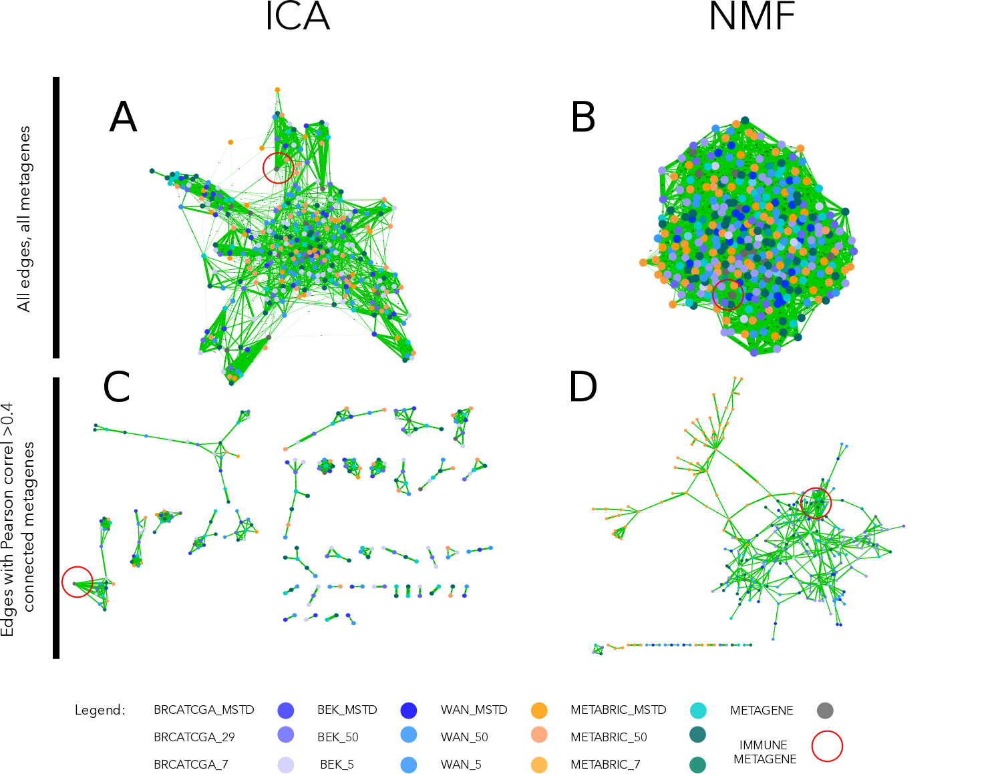

# Study of sensitivity and reproducibility of known methods {#sens} 

## Reproducibility of NMF versus ICA (vs CAM?)

NMF and ICA are both algorithms often applied to solve blind source deconvolution problem. NMF gained a popularity as a tool of transcriptomic analysis mainly thanks to the publications [publicaition_list]. However, the non-negativity contraint, an attractive concept in the case of non-negative transcriptome counts, may be a reason why the reusults of NMF decomposition are not the best candidate for our deconvolution task. We observed that NMF-based metagenes are less reprouctible between different transcriptomic datasets than ICA-based metagenes.

### Comparing metagenes obtained with NMF vs ICA. 

We compared the reproducibility of NMF and ICA through decomposition of four breast cancer datasets (BRCATCGA, METABRIC, BEK, WAN)[ref]. Those datasets were selected because of their size (number of samples > 50) and because they were available in not centred format necessary for NMF. 

For NMF the procedure was following:

* data was transformed into log2
* zero rows were removed 
* the algorithm assesing cophentic index was applied to chose optimal number of components
* datasets were decomposed with matlab NMF implementation from Brunet et al. [@Brunet] into (i) number of components suggested by cophenetic coefficient (ii) MSTD dimension (iii) 50 components (approaching overdecomposition)
* the obtained metagenes were decorellated from the mean using a linear regression model

For ICA, the procedure was following:

* data were transformed into log2
* transformed data were mean-centered by gene
* our implementation of MSTD (most stable transcriptomic dimension) from [@Ulykbek2017] was used to evaluate most stable dimension
* datasets were demposed into (i) MSTD dimension and (ii) 50 components (approaching overdecomposition) with matlab implementantion of fastICA with icasso stabilisation

We did not decompose ICA into low number of components as we consider it as strong underdecomposition and we suspect signals would not be the most reproducible. We limited the over decomposition higher than 50 with NMF as for our biggest dataset (METABRIC) NMF decomposition into 50 took 30245 minutes (3 weeks). 

Then separately for NMF and ICA, we correlated all obtained metagens with each other and with known Biton et al. metagenes (obtain from  previous ICA decompostion applied pan-cancer). We represented the results in a form of a correlation graph where nodes are metagenes from different datasets and decompostion levels and edge width corresponds peasron correaltion coefficients (Fig \@ref(fig:ICAvsNMF)).

```{r ICAvsNMF, fig.cap='(ref:ICAvsNMF-caption)', out.width='100%', fig.align='center', echo = FALSE}
if (is_pdf_output()) {
  knitr::include_graphics('figures-ext/ICANMF.pdf')
} else {
  
}
```

(ref:ICAvsNMF-caption) **Correlation graph of ICA and NMF multiple decompositions.** In the upper part of the figure (A,B) we observe the correlation graph of all metagenes (ICA or NMF-based) disposed using edge-weighted bio layout. In the lower part of the figure (C,D) we applied >0.4 thereshold in order to filter the edges. In the case of ICA (C), remaining nodes form pseudo-cliques, immune-related pseudo-clique is highlighted. In the case of NMF (D), components cluster by dataset. Edges' width coressponds to Pearson correlation coefficient. Node colors correspond to dataset from which a metagene was obtained (see legend).

We hoped to observe a subset of components from different datasets (no matter the decomposition level) correlate with each strongly  and much less with other components in order to confirm that the signal is reproducible (can be found in several dataset) and specific. We used the Biton et al.  componets here to help with eventual identification of signals (labelling). What we observe from ICA-decomposition that indeed, without applying any threshold some emerging clusters can be remarked and after application of >0.4 threshold on the correlation coeffcient pseudo-cliques emerge. While metagenes from NMF-decpmpostion are more tighlty connected globally and when the threshold is applied, remaing metagenes do not form clear clusters but group by data set. In NMF decomposition if it hard to define different signals as the datasets seem to be all related to each other. We can see from (Fig \@ref(fig:ICAvsNMF)D) that the IMMUNE signal is correlated >0.4 with a high number of NMF components that are also linked to some other components. In ICA (Fig \@ref(fig:ICAvsNMF)C) components related to the IMMUNE metagens form a pseudo-clique that is related with one link to INTERFERON metagene. 

This simple analysis illustrates that NMF applied to cancer transcriptomes decomposes them to metagenes that are not highly reproductible between datasets. In practice, it will not always be possible to work with big cohorts and the same processing methods. Using ICA for decomposition gives mor credit that it will be possible to use the obtained metagenes as reference in which new data of similar type could be projected. 

*to do:*

* *quantify: with clustering coefficient?* 

  ​

* Explain why ICA is more reproducible 

## Impact of modification of signatures list on result for signature-based deconvolution methods

Carry on a "sensitivity study": 

* remove some % of genes from basis matrix or marker gene list
* evaluate how it changes results