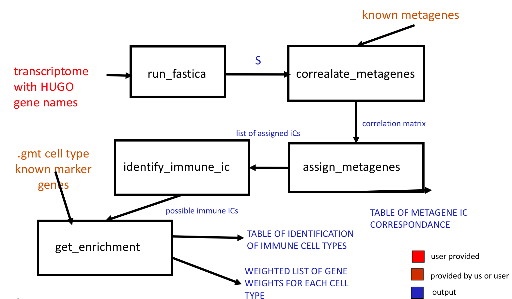

# Deconvolution of transcriptomes and methylomes

We describe our methods in this chapter.  The pre-eliminary pipeline and simple results are described in the manuscript submitted to  Springer-Verlag’s Lecture Notes in Computer Science ([LNCS](http://www.springer.com/gb/computer-science/lncs)) entitled **Application of Independent Component Analysis to Tumor Transcriptomes Reveals Specific And Reproducible Immune-related Signals** that is placed at the end of this chapter. In the final thesis final pipeline will be split into following structure

## From blind deconvolution to cell-type quantification: general overview

Few lines describing our idea

Figure?

### The ICA-based deconvolution of Transcriptomes

* remind shortly ICA
* describe stabilisation procedure *icasso*
* explain IC-metagene concept

If completed add related section about two other ways of getting metagenes

 * attractor metagenes
 * k-lines

### Interpretation of Independent components

#### Correlation based identification of confounding factors 

#### Identification of immune cell types with enrichment test / other

### Transforming metagenes into signature matrix

### Regression-based estimation of cell-type proportions : solving system of equations

## *DeconICA* R package for ICA-based deconvolution 

This part of the chapter will be adapted from package vignettes

It will contain 

* technical package description

* user guide 

* examples

### *Demo*
The package needs to installed and then imported.
```{r demo, eval=FALSE, echo=TRUE}
#import package
library(deconica)
```

Then we can perform our pipeline on sample data available in the package 
```{r,  eval=FALSE, echo=TRUE}
#import sample data
data(BRCA)
#decompose data
fastica.res <- run_fastica (
  BRCA,
  optimal = TRUE,
  row.center = TRUE,
  with.names = TRUE,
  gene.names = NULL,
  alg.typ = "parallel",
  method = "C",
  n.comp = 100,
  isLog = TRUE,
  R = TRUE
)
#correlate obtained metagenes with Biton et al. 
#metagenes (by default)
correlate.res <-
  correlate_metagenes(fastica.res$S, fastica.res$names)
#assign reciprocal components
assign.res <- assign_metagenes(correlate.res$r)
#identify components that are >0.1 correlated with 
#immune and are not assigned to any other component
identify.immune <-
  identify_immune_ic(correlate.res$r[, "M8_IMMUNE"], assign.res[, 2])
#test enrichment with fisher test in 
#Immgen signatures (by default)
enrichment.res <- gene.enrichment.test(
  fastica.res$S,
  fastica.res$names,
  names(identify.immune),
  gmt = ImmgenHUGO,
  alternative = "greater",
  p.adjust.method = "BH",
  p.value.threshold = 0.05
)
```

The present state of the package is described in Fig \@ref(fig:deconICAflow).
```{r deconICAflow, fig.cap='(ref:deconICAflow-caption)', out.width='100%', fig.align='center', echo = FALSE}

```
(ref:deconICAflow-caption) **State of the deconICA package in January 2018.** The flow chart illustrates existing functions in the R package *DeconICA*. Squares represent functions, red are user-provided inputs, brown are inputs we provide but that can be replaced easily by user and in blu we marked outputs.  

Next step will be:

* adding the metagenes selection and transformation into basis matrix for deconvolution
* identifying confounding factors
* estimating purity with an existing tool
* running an equations solver (based on least squares or other type of regression) including basis matrix, confounding factors, purity
* including regularisation factos
* adding graphics
* adding user interface
* writing a demo (best interactive)


\newpage


\includepdf[pages={1-}, scale=1]{pdf-ext/LVAICA.pdf}


