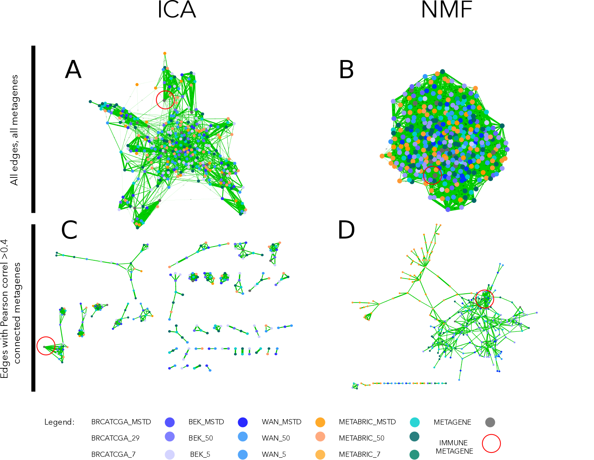

# Comparison of reproducibility between NMF and ICA  {#nmfica}

```{r smallChapNMF, results="asis", echo = FALSE}
if(is_pdf_output()){
cat("\\chaptermark{Reproducibility: NMF vs. ICA}")
}
```
NMF and ICA are algorithms often applied to solve blind source deconvolution problem. NMF gained popularity as a tool of transcriptomic analysis reflected in many publications [@Moffitt2015; @Shen-Orr2013; @Brunet2004; @Repsilber2010]. However, none of these works compare components obtained from different datasets between each other. 

The non-negativity constraint, an attractive concept in the case of non-negative transcriptome counts, may be a reason why the results of NMF decomposition are not the best candidate for our deconvolution task. I performed an analysis that demonstrates that NMF-based metagenes are less reproducible between different transcriptomic datasets than ICA-based metagenes.

## Comparing metagenes obtained with NMF versus ICA

I compared the reproducibility of NMF (classical *brunet* version, see Section 2.3.6.2) and ICA (fastICA) through decomposition of four breast cancer datasets (BRCATCGA, METABRIC, BEK, WAN)[@Cancer2012; @Curtis2012; @Bekhouche2011, @Wang2005]. Those datasets were selected because of their size (number of samples > 50) and because they were available in not centered format necessary for NMF. 

For NMF the procedure was following:

1. data was transformed into log2(x +1)
2. zero-rows were removed 
3. the algorithm assessing cophenetic index was applied to select the optimal number of components
4. datasets were decomposed with Matlab NMF implementation from @Brunet2004 into (i) number of components suggested by the cophenetic coefficient (ii) MSTD dimension (iii) 50 components (approaching overdecomposition)
5. the obtained metagenes were decorrelated from the mean using a linear regression model

For ICA, the procedure was following:

1. data were transformed into log2(x +1)
2. transformed data were mean-centered by gene
3. our implementation of MSTD (most stable transcriptomic dimension) from [@Kairov2017] was used to evaluate most stable dimension
4. datasets were decomposed into (i) MSTD dimension and (ii) 50 components (approaching overdecomposition) with Matlab implementation of fastICA with icasso stabilization

I did not decompose ICA into a low number of components as we consider it as strong underdecomposition and we suspect signals would not be the most reproducible.

To define the optimal number of factors for NMF ($k$), I followed the strategy employed in [@Brunet2004] using the cophenetic coefficient which is a metric related to the stability of clusters obtained over iterative runs of NMF. 

>*[**The cophenetic coefficient**] is defined as the Pearson correlation between the samples' distances induced by the consensus matrix (seen as a similarity matrix) and their cophenetic distances from a hierarchical clustering based on these very distances (by default an average linkage is used)* [@Brunet2004]

 *The cophenetic distance* between two observations that have been clustered is defined to be the intergroup dissimilarity at which the two observations are first combined into a single cluster. The minimum of the cophenetic coefficient values over $k$ indicates the optimal number of factors.

Finding the best $k$ number of factors for NMF of the biggest dataset (METABRIC) for $k$ ranging from 2 to 50 took 30245 minutes (3 weeks).  Therefore, I limited the $k_{max}$ to 50 components (maximal number of factors) and not to 100 as initially planned.

Once, the four datasets were decomposed to MSTD, Cophenetic$_{min}$ and 50, I proceed to the comparison of the components between datasets. I correlated all obtained metagenes with each other and with known reference metagenes [@Biton2014]. We represented the results in the form of a correlation graph where nodes are metagenes from different datasets and decomposition levels, and edge width corresponds Pearson correlation coefficients (Fig \@ref(fig:icavsnmf)).

```{r icavsnmf, fig.cap='(ref:icavsnmf-caption)', out.width='100%', fig.align='center', echo = FALSE, fig.scap="Correlation graph of ICA and NMF multiple decompositions"}
if (is_pdf_output()) {
  knitr::include_graphics('figures-ext/ICANMF.pdf')
} else {
  
}
```

(ref:icavsnmf-caption) **Correlation graph of ICA and NMF multiple decompositions.** In the upper part of the figure (A, B) we observe the correlation graph of all metagenes (ICA or NMF-based) displayed using edge-weighted bio layout. In the lower part of the figure (C, D) we applied >0.4 thresholds to filter the edges. In the case of ICA (C), remaining nodes form pseudo-cliques, immune-related pseudo-clique is highlighted. In the case of NMF (D), components cluster by the dataset. Edges' width corresponds to Pearson correlation coefficient. Node colors correspond to the dataset from which a metagene was obtained (see legend).

I expected to observe a subset of components from different datasets (no matter the decomposition level) correlated with each other firmly and much less with other components in order to confirm that the signal is reproducible (can be found in several dataset) and specific (can be matched to one corresponding signal in another dataset). I used the reference components here to help with the identification of signals (labeling) of indicative nature. In ICA-based correlation of components, without applying any threshold (Fig \@ref(fig:icavsnmf)A), some emerging clusters can be remarked and after application of >0.4 thresholds on the Pearson correlation coefficient value(Fig \@ref(fig:icavsnmf)C) numerous pseudo-cliques emerge. While for metagenes from NMF decomposition, they are more tightly connected globally and when the threshold is applied components group by the dataset. In NMF decomposition, if it is hard to define different signals as the components seem all related to each other. We can see from (Fig \@ref(fig:icavsnmf)D) that the IMMUNE signal is correlated >0.4 with a high number of NMF components that are also linked to some other components. In ICA (Fig \@ref(fig:icavsnmf)C) components related to the IMMUNE metagenes form a pseudo-clique that is related only with one link to INTERFERON metagene. This makes them much more specific, and therefore the interpretation is more straightforward.

## Summary

This simple analysis illustrates that NMF applied to cancer transcriptomes decomposes them to metagenes that are not selectively and specifically matching between datasets. In part, this is because NMF components are correlated with the average gene expression. Therefore, NMF can be sensitive to the normalization. However, even after the "removal" through linear regression, this phenomen persist. It is not clear why, from a mathematical perspective, we observe such a discrepancy of interpretation of NMF and ICA components.  

It is also possible that using a different method to find correct decomposition dimension ($k$) should be used. Ideally, different NMF implementation should be tested to verify if using different error updates can have an impact on the results. 

In practice, it will not always be possible to work with the data processed in the same way. Using ICA for decomposition seems to be more straightforward, and the obtained components are easier to interpret as biological functions (thanks to the reciprocal matching) without a need to renormalize datasets. 

A deepened extension of this study was performed by @Cantini2018 and is available online. 