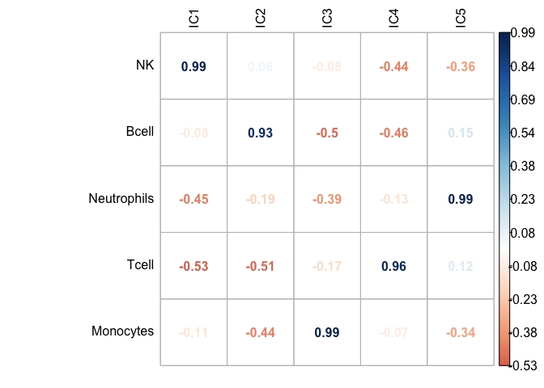

# DeconICA: an R package for Deconvolution of omic data through Immune Components Analysis {#deconica}

```{r smallChapDecon, results="asis", echo = FALSE}
if(is_pdf_output()){
cat("\\chaptermark{DeconICA R package}")
}
```

*Selected content from this chapter is a part of a publication in preparation*

## From blind deconvolution to cell-type quantification: general overview

In the introduction chapters 1 and 2, I have presented why there is a need to extract knowledge about the immune system from the cancer transcriptomes and how it can be done. In the result chapters 3, 4 and 5 I have presented studies of ICA application to transcriptomes, ideas for finding a way to extract the cell-specific components through *overdecomposition* procedure. 

However, I in the presented works, the proposed biological interpretation was not deepened. In order to enable standardized unsupervised deconvolution framework and an interpretation of obtained components as immune cell types and their quantification that is scalable, I introduce, in this chapter, a method named "DeconICA": **Decon**volution of omic data through **I**mmune **C**omponents **A**nalysis. The method is published online on GitHub: [UrszulaCzerwinska/DeconICA](https://github.com/UrszulaCzerwinska/DeconICA) in the form of an R package and has a [doi number (10.5281/zenodo.1250069)](https://zenodo.org/record/1250070) for citations. In this chapter, I will describe my pipeline and the rationale behind my strategy of analysis and quantification of components. I will also briefly compare its performance in the quantifying abundance with previously published methods. The user guide for DeconICA R package is available in [Annexes](#deconicatut) and online at https://urszulaczerwinska.github.io/DeconICA/DeconICA_introduction.html. 

## Unsupervised deconvolution

So far, I have focused on ICA-based decompositions of transcriptomes. In the [chapter 5](#nmfica), I have compared ICA and NMF decompositions concluding that ICA-based decompositions shall be more convenient. In my work, because of my team expertise, the proven computational efficiency, interpretability, and reproducibility, I will use mostly ICA components to deconvolve tumor data (analysis described in the next [chapter 6](#results)). However, the constructed interpretation pipeline can take as input any metagenes, i.e., NMF factors, convex-hull derived sources or attractor metagenes (methods described in [chapter 2](#methods)). 

In this section, I  will explain the DeconICA pipeline (Fig. \@ref(fig:deconicaschema)) based on the stabilized fastICA overdecomposition protocol as it is resulting from our expertise.


```{r deconicaschema, fig.cap='(ref:deconicaschema-caption)',fig.scap="Flowchart of DeconICA method", out.height='80%', fig.align='center', echo = FALSE}
if (is_pdf_output()) {
  knitr::include_graphics('figures-ext/deconica_schema.pdf')
} else {
  knitr::include_graphics('figures-ext/deconica_schema.png')
}
```

(ref:deconicaschema-caption) **Flowchart of DeconICA method**. In this flowchart steps of DeconICA are represented as boxes. Each operation corresponds to one or multiple functions in the R package. Input data X (red) is preprocessed and then decomposed into components. Interpretation of the components is performed with correlation or gene enrichment analysis (using reference materials - green). For components labeled as cell types or other important factors, abundance can be estimated using top genes of each component and computing average of counts in a non-log scale of those genes. Main outputs are ( in blue), the S component matrix, labeled components, and their abundance scores.

### FastICA overdecomposition protocol

The main inputs of unsupervised deconvolution methods are data matrix $X$ and number of output sources $k$. I have developed a protocol that can define $k$ for fastICA algorithm applied to cancer transcriptome datasets and prepares the data for interpretation steps.

#### Data transformation

The input matrix of gene expression is transformed to $log_{2}(x +1)$ where is $x$ is a data point and then row (gene) centered: mean of each row is removed.  This step is necessary for ICA algorithm. 

If gene names or probes are provided, the duplicated genes are removed - the genes with higher variance are kept. 

#### Determining $k$ number of sources

If the number of sources in the mixture is known, $k$ can be fixed by the user.

In case of complex mixtures of tumor transcriptomes, the input matrix of gene in rows ($n$) and samples ($m$) in columns is decomposed into $k=100$ components if $m$ > 100. If m <$100$, then the $k$ number is equal to the number of PCA components necessary to explain 90% of data. 

If a different data type is analyzed, one can also compute MSTD (see [chapter 3](#mstd)) of the data and redefine the *overdecompositon* dimension. 

#### FastICA 

The fastICA algorithm uses icasso stabilization (described in chapter 2 section 2.3.6.3) to obtain an average representation of components over the $i$ number of iterations (by default $i=100$) in order to buffer the effect of local minima resulting from stochastic initializations.

The stabilized version of FastICA algorithm is, so far, only available in Matlab. A custom Matlab scripts "fastica++" that I am using have initially been distributed with [BIODICA software](https://github.com/LabBandSB/BIODICA) by Zinovyev and Kairov.  I have created an R interface to use it easily without any knowledge of Matlab. I also provided a detailed description on how and why use this version of fastICA as a part of [DeconICA tutorial](https://urszulaczerwinska.github.io/DeconICA/Icasso.html) (available in Annex Z), even without Matlab software installed (through a Docker image). Although it is possible to use non-stabilized and slower R version of fastICA, it impacts the results significantly.

To remind, the input $X_{n\times m}$ matrix is in therefore decomposed to $S_{k\times n}$ source matrix and $A_{m \times k}$ mixing matrix, where $k$ is the number of components. Therefore, for example, having as an input transcriptome matrix of 20 000 genes and 150 samples, if $k$ = 100 (overdecomposition), then the $S$ will have dimensions 20 000 $\times$ 100 and $A$ matrix 100 $\times$ 150.  

#### Orienting the components

The $S$ columns (components/sources) contain positive and negative values that the projections of data in the given dimension. The sign (positive or negative) cannot be directly interpreted. Therefore the values should be seen as an absolute value of the projection. The genes ranked top (by the absolute value), separately for positive and negative ends) are representative for the component. Usually, only one end leads to a biological interpretation. To define which end should be interpreted, I apply a simple statistical procedure (Fig. \@ref(fig:orienting)). 

I plot density distribution of a component, compute a standard deviation and count how many genes are above or below a threshold of $t$. I define $t =$ 3 standard deviation (sd). If there are no points >$t$, the threshold is lowered to 2sd, etc. The end of the independent components with a higher number of genes over the threshold is decided to be the one representing the component that we call *heavy tail*. 

If the *heavy tail* is negative the component weights are multiplied by -1 in order to reverse signs.

In this way, all the representative ends of $S$ are all positive which makes the further steps easier. 

This procedure can fail if the initial sources are coming from, i.e., uniform distribution and the component $S_i$ is symmetric. In those cases, components can be oriented for examples based on correlation with known sources (to have only positive correlations). In practical terms, there is an option to skip this step.

Generally, the orientation procedure applies to microarray and RNA-seq transcriptomes that are overdecomposed.

```{r orienting, fig.cap='(ref:orienting-caption)',fig.scap="Principle of components orienting", out.width='70%', fig.align='center', echo = FALSE}
knitr::include_graphics('figures-ext/orienting.png')
```

(ref:orienting-caption) **Principle of components orienting**. An independent component illustrated here has more values under the threshold of - 3 standard deviations (sd) than over 3 sd (64 vs. 4). Therefore the heavy tail is on the negative side. DeconICA orients the heavy tail towards the positive side. This procedure is applied to all independent components. 

## Interpretation of the components

#### Identification of immune cell types with an enrichment test

Based on previous work of our team, a way to characterize obtained components is to select top genes and verify if they belong to a described biological pathway or a list of genes. There is a wide choice of websites (i.e., [BioGPS](http://biogps.org/#goto=welcome), [Toppgene](https://toppgene.cchmc.org/) or [EnrichR](http://amp.pharm.mssm.edu/Enrichr/)) that compares a selected list of genes with databases and computes, in different ways, an enrichment score. Often, proposed pathways or conditions are quite general, for instance, type of immune response and associated cell type would not be specified. Another way to compute enrichment is to use GSEA (described in section 2.3.3). It is possible that I will extend the package to facilitate an enrichment with GSEA (for example using the *fgsea* R package [@Sergushichev2016]). However, the essence of the interpretation though enrichment is not the score itself but the pathways/processes identified to be associated with the analyzed component. 

This is why, in DeconICA package, I implemented a simple Fisher exact test (described in section 2.3.3) that computes a significance of an overlap between a list of top genes from a component and a collection of known gene sets. An ensemble of known pathways is called the universe. 

I set some default parameters for the analysis: the number of top genes, minimal and maximal length of the gene list in the universe, p-value correction. I have tested the enrichment of the components in a custom collection of cell-type specific signatures published in primary research articles or as a part of deconvolution tools. 

Enrichment allows to link a list of component's top genes to biological process, but the p-value depends strongly on the size of the universe and the size of gene sets. In most cases, only a small number of genes is known to be specific to a cell type. These specific genes are not always expressed in the analyzed dataset. Therefore, often false positives are found only due to technical dimension of the analysis.  Depending on which compendium of signatures I used I would identify very different cell types with the enrichment test for the same component. 

The enrichment methods were not conceived for small and close related gene sets. A more sophisticated solution like in xCell [@Aran2017], are necessary to overcome those limitations.  Thus, I would advise using basic enrichment for exploratory analysis of the general factors impacting the transcriptome rather than to identify cell types.

Looking for more robust evaluation of immune cells identification I have proposed a correlation-based interpretation. 

#### Correlation based identification  

#### Reciprocal match

Working with many datasets, I remarked that correlation with a reference metagene enables quickly and robustly label the components. The reference metagenes provided with DeconICA were published in the study of @Biton2014.  As these signals represent independent biological factors, one reference metagene should match one component. This is why I applied the rule of reciprocal matching to label components corresponding to reference metagenes. 

Formally, the reciprocity rule is defined as follows. Given correlations between the set of reference metagenes $M=\{M_{1},...,M_{m}\}$ and $S$ source matrix $S=\{IC_{1},...,IC_{N}\}$, if $S_{i}=argmax_k (corr(M_{j},S_{k}))$ and $M_{j}=argmax_k (corr(S_{i},M_{k}))$, then $S_{i}$ and $M_{j}$ are reciprocal. This rule was already applied previous publications of our group [@Kairov2017; @Czerwinska2018; @Cantini2018].  An important feature of this association is that it is not based on the strength of the correlation and hypothesise that even weak correlation can be meaningful if there is an exclusive reciprocal match between reference metagene and a component. 

#### Maximal correlation match

As there are no established metagenes of immune cells, I used a signature matrix published in [@Newman2015] LM22 containing 22 immune cells profiles reduced to 510 genes that should enable the differentiation between the cell types. I used specifically this reference as it had more genes than other similar matrices (i.e., the one from EPIC [@Racle2017] contains $\approx$ 100 genes). The number of genes is critical because the correlation needs to be based on a minimal number of genes to be reliable. It may happen that genes present in the reference profiles are not present in studied gene matrix. Therefore, more genes in the reference set to increase the probability to interpret the data. Generally, the power of the correlation coefficient increases with the number of genes used to compute it (the overlap between the reference and the analyzed data). On the other hand, the full cell profiles (10000-20000 genes) would introduce a significant amount of noise. 

To assign a reference cell type to a component, I adopted a strategy different from described in the previous section. It is known that cell type subtypes have quite similar expression profiles. Therefore, the match of one component to different subtypes of the same cell type should not be penalized. I have also remarked that sometimes closely related cell types cannot be discriminated and one component can be the most related to, i.e., T-cell and NK. Thus, the label is attributed through maximal correlation, for instance, which of all components has the highest correlation coefficient with given reference profile. 

This results in the fact that each reference metagene has a component attributed. Then, the user needs to define manually is the association can be trusted from the value of the Pearson correlation coefficient. Usually, if there is one component with remarkably stronger associated to the reference cell type than others, the association can be trusted. A graphical representation (Fig. \@ref(fig:corrEx)) can be help in decision making. This step should be automatized if possible in the future.

```{r corrEx, fig.cap='(ref:corrEx-caption)',fig.scap="Example of sucesfull and unsucessful component matching to refrence", out.width='70%', fig.align='center', echo = FALSE}

```

(ref:corrEx-caption) **Example of successful and unsuccessful component matching to a refrence**. Among all components there can be one component that matches the reference profile (A) or many components that weekly matches the reference profile (B). Only in the case, 'A' the most correlated component should be labeled as B-cell. 


## Computing the abundance of the identified cell-types

Once the components are labeled, their contribution in each sample can be estimated. For cell type related components this contribution can be interpreted as cell-type abundance (in arbitrary units). 

Before deciding on the final way in which cell-type contribution can be evaluated, I have tested different possibilities. 

In theory, the $A$ mixing matrix reflects contributions of each component. However, it reflects the contribution of both positive and negative ends of components. In my protocol, one end is selected to be representative of a biological signal. This is why $A$ matrix scores do not reflect well abundance of the information on cell types.

One idea was to use the components as "pure cell-type expression" in a regression model (testing different regression types: SVR, quadratic programming, simple linear regression, lasso regression). I tested this approach on blood transcriptome benchmark (described in more details below). The results were acceptable, but they got outperformed by the mean of top genes approach that is included in DeconICA. 

Finally, I tested the approach inspired by [@Becht2016].  Selecting the most specific genes and computing arithmetic mean of the genes in the original counts matrix.  This method is based on the hypothesis that those particular markers are unique to one cell type. Therefore gene expression of those genes should be proportional to the abundance of the cell type. 

#### Defining markers

In [@Becht2016] cell-type specific markers are defined based on expert knowledge and validated in gene expression data. In this work, the specific markers are generated in the unsupervised deconvolution. I adopted a hypothesis that $n_{top}$ genes of a labeled component is a unique signature of this component. I defined the value of $n_{top}$ empirically to be in a range of 10 to 30 genes. 

#### Computing scores

In order to compute the scores, a mean of the selected marker genes for each component is computed. The user has a choice between arithmetical, geometric, harmonic or weighted mean. So far, the arithmetic means to seem to give the best performance on the benchmark data.

## Validation of the abundance estimation with *DeconICA*  

*Code used to produce the validation, and more extensive description of each step is available as a part of the [online tutorial](https://urszulaczerwinska.github.io/DeconICA/DeconICA_introduction.html) and in Annexes*

### *In silico*

First, the performance of the DeconICA was tested on simulated data. I wrote a function that produces a linear mixture of randomly generated sources of selected distribution with known proportions and possibility to set the number of marker genes. Here I generated ten sources drawn from the negative binomial distribution (10000 *genes*) and mix them at known proportions, adding some noise resulting in 130 mixtures (*samples*). As the ten original sources are known, a component is attributed to an original source through reciprocal correlation. I demonstrate that for each original source a matching component can be identified and using 10 top markers I estimate abundance with correlation coefficient ranging from 0.95 to 0.99 (where 1.0 is a perfect correlation), equal to average $R^2$= 0.96 (Fig \@ref(fig:insilico)).

```{r insilico, fig.cap='(ref:insilico-caption)',fig.scap="Accuracy of estimation versus true proporitons in an in silico mixture", out.width='70%', fig.align='center', echo = FALSE}
knitr::include_graphics('figures-ext/insilico.png')
```

(ref:insilico-caption) **Accuracy of estimation versus true proportions in an *in silico* mixture**. The simulated matrix of mixtures (10000 $\times$ 130) was decomposed, and obtained components were used to estimate proportions. The estimated proportions of each of 10 cell types were correlated with the known abundance values of the given cell type. The Pearson correlation coefficient values are reported in the correlation matrix. 

### *In vitro*

Previously published in [@Becht2016] *in vitro* immune cell types sorted from 3 healthy donors’ peripheral blood and mixed at different proportions resulting in 12 mixed samples. Following my pipeline, data is decomposed with stabilized fastICA, each of cell types finds its match and marker genes are defined as top 10 genes of each component. Then the correlation with abundance is computed. The Pearson correlation with true mixing proportions varies from 0.93 to 0.99, average $R^2$= 0.94 (Fig. \@ref(fig:invitro)). 

```{r invitro, fig.cap='(ref:invitro-caption)',fig.scap="Accuracy of estimation versus true proporitons in an in vitro mixture", out.width='70%', fig.align='center', echo = FALSE}

```

(ref:invitro-caption) **Accuracy of estimation versus true proportions in an *in vitro* mixture**. Five different immune cell types from three donors were mixed at known proportions. The estimated proportions of each of 5 cell types were correlated with the known abundance values of the given cell type. The Pearson correlation coefficient values are reported in the correlation matrix. 

### PBMC transcriptome

Finally, I applied DeconICA to PBMC expression data of 104 healthy patients, paired CyTOF proportion estimation for each sample [@Whiting2015], processed data were shared kindly by [@Aran2017]. I use MSTD to estimate the optimal dimension (39). From the correlation profiles, it can be seen that this task is remarkably more challenging than the previous tests (Fig \@(fig:radarB)) and not all cell types can be perfectly matched to components.  Based on maximal correlation a subset of components is labeled as immune cells and based on 10 top markers abundance is computed for B-cells, T cells CD8, T cells CD4, NK and Monocytes. 

The correlation between CyTOF measured abundance and DeconICA estimated abundance varies from 0.31 to 0.77. Some cell types as T-regs, NKT, other T-cell, naive-B-cells subtypes could not be differentiated with individual components. I compared DeconICA performance with five other methods of immune cell-type deconvolution (Fig \@ref(fig:comparison)). The strategical differences between compared methods were explained in [Chapter 2](#methods). All of them are recent supervised deconvolution approaches, state-of-art at the date. DeconICA performance is better or similar than the one of previously published methods for the cell types that we could identify and in average has slightly better $R^2$. 

It is necessary to mention that EPIC probably performs worse than expected because data were not TPM normalized. For MCPcounter CD8 T-cells were matched to "cytotoxic T-cells" and CD4 T-cells to T-cells. For CIBERSORT between naive B-cells and activated B-cells better correlation was reported as "B-cells". 

```{r radarB, fig.cap='(ref:radarB-caption)',fig.scap="Correlation between independent components and reference immune cell-type metagenes", out.width='100%', fig.align='center', echo = FALSE}

```

(ref:radarB-caption) **Correlation between independent components and reference immune cell-type metagenes**. All correlation and reference cell types are illustrated. Surrounded by color squares are the most important panels for decision making and matching cell types measures as well with CyTOF, used for further comparison.


```{r comparison, fig.cap='(ref:comparison-caption)',fig.scap="Estimation of abundance of immune cell types in PBMC transcriptome of 104 healthy donors", out.width='70%', fig.align='center', echo = FALSE}
if (is_pdf_output()) {
    knitr::include_graphics('figures-ext/comparisonR2.pdf')
} else {
    knitr::include_graphics('figures-ext/comparisonR2.png')
}
```
(ref:comparison-caption) **Estimation of abundance of immune cell types in PBMC transcriptome of 104 healthy donors**. Five different methods (xCell [@Aran2017], CIBERSORT [@Newman2015], EPIC [@Racle2017], MCPcounter [@Becht2016], DeconICA [@Czerwinska2018]), were applied to compare estimated proportions and CyTOF measured proportions of five cell types: B-cells, CD8 T-.cells, CD4 T-cells, Monocytes and  NK as they were identified with DeconICA and measured proportions were available. In the case of a not exact match of cell types between the CyTOF and deconvolutions method, best correlation was reported. The average $R^2$ is computed as an average of $R^2$ for each cell types by the method. DeconICA slightly overperforms existing methods. 

Besides, the markers discovered from data by DeconICA, are not significantly overlapping with markers used by MCPcounter or xCell (Fig. \@ref(fig:venn)) (for EPIC and CIBERSORT list of specific cell-markers is provided as they use a basis matrix). 

```{r venn, fig.cap='(ref:venn-caption)',fig.scap="Comparison of markers used by different deconvolution methods", out.width='100%', fig.align='center', echo = FALSE}
if (is_pdf_output()) {
    knitr::include_graphics('figures-ext/venn.pdf')
} else {
    knitr::include_graphics('figures-ext/venn.png')
}
```

(ref:venn-caption) **Comparison of markers used by different deconvolution methods**: markers of xCell, MCPcounter, and markers discovered from data by DeconICA are compared. Venn diagrams illustrate insignificant overlap between the specific markers list for each cell type.

## Summary 

I developed a DeconICA method and R package that allow decomposition of omic data into components. Based on stabilized fastICA decomposition I demonstrated that DeconICA could estimate cell proportions of immune cell types in PMBC transcriptome with better performance than previously published tools without an *a priori* use of cell-type signatures. The *marker* genes discovered with ICA, proven to evaluate cell abundance correctly, turned out to be different from the markers used by knowledge-based supervised deconvolution methods.

Even though the first release of DeconICA is published online [@Czerwinska2018] and fully functional, some improvements can still be considered in the future. Examples using other unsupervised deconvolution methods can be included to demonstrate that the pipeline is not limited to ICA. An interactive online interface can be built with R shiny for instance. Also, more automatized label attribution and confidence of the match between a reference metagene and a component should be added. I would like also demonstrate the use of DeconICA with methylome data.

Main limitations of DeconICA are

* the need to work with many samples (>100)
* the interpretation that requires manual adjustments
* the number of detected cell types usually lower than other tools
* the abundance scores that cannot be directly interpreted as percentages of sample content
* it is not guaranteed to find a source of the desired cell-type

Main advantages of DeconICA are:

* the possibility to discover new markers from data
* context independence (no a priori use of blood-derived cell-type signatures)
* universality: DeconICA can identify not only cell types but also other factors governing cancer transcriptomes, can also be applied for different purposes with a little adjustment
* sequencing/ microarray platform independence
* data normalization independence
* speed (a formal benchmark is to be provided, but the analysis of the biggest available transcriptomic dataset METABRIC (1980 samples) can be analyzed within less than 1 hour)
* user-friendly form of R package, tutorials, and transparent, open-source code

So far, the tool does not have many users from outside my research group. I hope it will change once the tool is published in a scientific journal.

An ability to discover possible new marker genes of cell states can be extremely interesting in cancer context where true cell-type context-dependent signatures are not known.  If this hypothesis is correct, DeconICA should not only correctly evaluate cell-type abundances but also give insight to context-dependent cell type/cell state signatures.

In the next chapter, I will apply DeconICA to >100 transcriptomic datasets of different cancer types to identify tumor-specific signatures of immune cell types, compare them and describe their features. 

 


