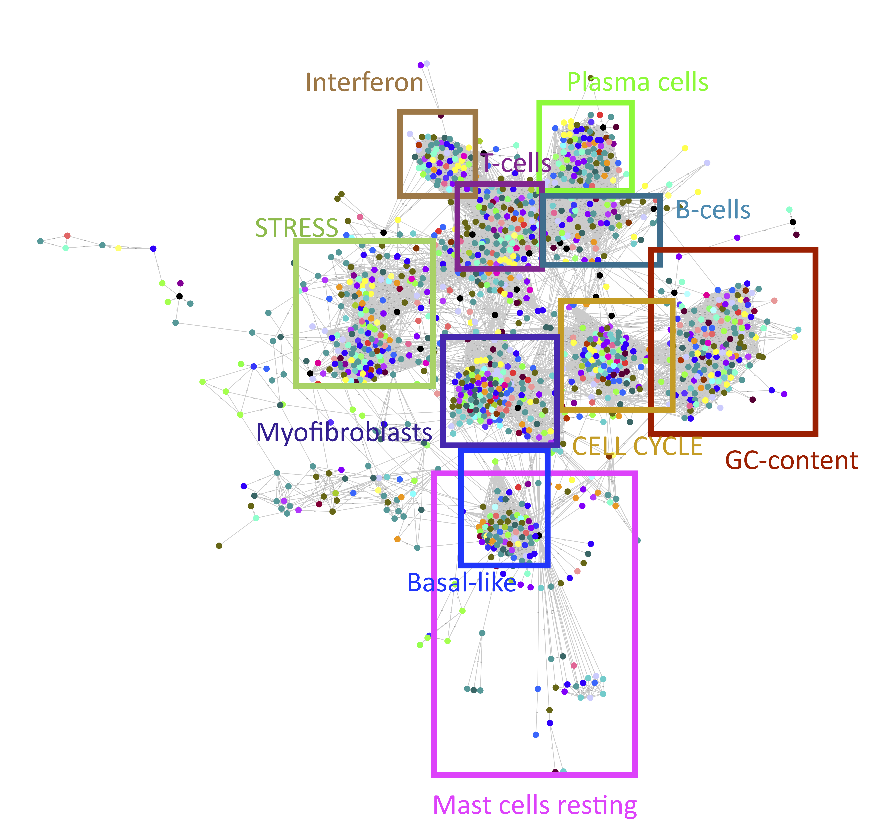
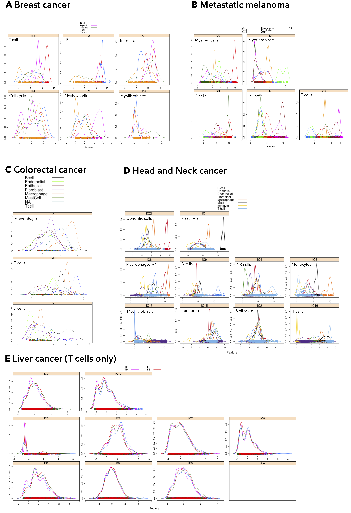

# Landscape of tumor immunity, with focus on T-cells diversity, uncovered via unsupervised deconvolution applied to bulk transcriptomes across 30 tumor types  {#results}


*Selected content of this chapter is a part of a publication in preparation*


```{r smallChapRES, results='asis', echo = FALSE}
if(is_pdf_output()){
cat("\\chaptermark{Landscape of tumor immunity}")
}
```


## Background 

The tumor microenvironment is composed of many different cells including a plethora of immune cells, stromal cells, blood and lymphatic vessels[@Galon2014].  The TME compartments' changes with the cancer type and cancer stage. Recent works showed that immune cells could influence the tumor cells in different ways. The immune therapies take advantage of the protective function of the immune system and aim to activate patients immune defense. FDA has accepted the immune therapies in specific cancer types [@Taube2017a]. One of the problems of the checkpoint immune therapies is heterogeneity of response rate, which can vary, i.e., from 10–40% in the case of PD-L1 blocking [@Zou2016]. To respond to this challenge, a better understanding of the role of immune cells in cancer is necessary.

 A link between patients response to the therapy and the presence of tumor-infiltrating lymphocytes (TILs) was identified [@Topalian2016]. T cells differentiate into highly diverse subsets expressing unique markers depending on their environment [@Wong2016]. Suppressive nature characterizes the infiltrating regulatory T cells (or Tregs) from colon, lung, and breast cancers in transcriptomic studies [@DeSimone2016;  @Plitas2016]. The primary objective of the checkpoint therapies is to activate CD8+ cytotoxic T cells in the tumor microenvironment. CD8+ T cells can be impaired by suppressive T regs or exhausted due to a unique transcriptional state [@Chen2017]. A better understanding of T cells heterogeneity and functions can significantly advance the immune checkpoint therapies. 

Nowadays, research generates a massive amount of data on TME. Many experiments requiring fresh samples are costly and time-consuming. On the other hand, there is available a vast collection of public data that are not always fully exploit. An example is bulk transcriptome data in which, for the heterogeneous samples like PBMC and tumor biopsies, the expression profiles of distinct cell types are mixed in each sample. Several methods were proposed to estimate abundance of immune infiltration in cancers [@Becht2016; @Newman2015; @Aran2017; @Racle2017]. However, they do not propose simultaneous estimation of infiltration abundance and context-specific signatures of the immune cell types. Different approaches (i.e., clustering  [@Chifman2016], attractor metagenes [@Cheng2013], differential gene expression [@Cieslik2017]) were adapted to discover signatures that would describe cancer transcriptomes. 

In this work, I propose an unsupervised deconvolution approach that applied to bulk cancer transcriptomes can detect cell-type specific signals and cellular programs. In contrast to previously published *complete deconvolution* approaches applied to PBMC [@Repsilber2010;@Gaujoux2012]or yeast cell-cycle [@Wang2016], using DeconICA R package [@Czerwinska2018], I performed pan-cancer tumor transcriptome deconvolution of 119 datasets across 30 tumor types.  Also, I dedicated an extra effort to describe T-cell diversity in deconvoluted cancers types. Besides, I apply DeconICA deconvolution to five single-cell datasets to integrate them and compare with created decomposed bulk transcriptome landscape.  

## Results 

### Unsupervised deconvolution of 119 datasets

In this study, we collected 119 datasets with a total of 26561 samples across 30 tumor types (Fig \@ref(fig:datasetcount). Data were collected from public repositories (GEO, ArrayExpress). If normal samples were present in the dataset, they were excluded before running the analysis. The common cancer type we analyzed was the lung cancer (18 datasets), followed by colorectal (11 datasets) and breast cancer (9 datasets). Each dataset was analyzed independently with DeconICA R package using stabilized ICA (see methods). The primary output of the DeconICA pipeline for each dataset was a set of independent components, to which I will also refer as metagenes, which are weighted list of genes. The positive end of a metagene represents a characteristic transcriptomic signature that can be interpreted in terms of cellular processes, state or cell type. The second output of the DeconICA pipeline was the abundance scores of each interpreted component across samples. 


```{r, include= FALSE}
library(plotly)
```

```{r datasetcount, fig.cap='(ref:datasetcount-caption)',fig.scap="Count of the dasets analyzed with DeconICA", out.width='80%', fig.align='center', echo = FALSE}
load("~/Google Drive/PhDThesis/RData/pl_ds_count.RData")
if(!is_html_output()){
  pl_ds_count
} else{
  ggplotly(pl_ds_count)
}

```


(ref:datasetcount-caption) **Count of the datasets analyzed with DeconICA**. Datasets (Supplementary tab. \@ref(tab:bulklist)) were counted depending on the cancer type. The most frequent analyzed cancer type was lung cancer. 


### Interpretation of the immune components

The filtered correlation network (Fig. \@ref(fig:corrgraphfull)) shows a presence of communities of metagenes which can be interpreted based on the higher ranked genes. In our analysis, each metagene was labeled based on its correlation with reference profiles which are either metagenes obtained from previous pan-cancer studies [@Biton2014] or optimized for deconvolution [@Newman2015] integrated into the DeconICA R package. For each dataset and HTML report was generated (see supplementary) to summarize the analysis. To best visualize the data in the 2D space, I used the UMAP dimension-reduction algorithm based on correlation distance. I selected the parameters to best separate the clusters of different component types, for visualizations with the tSNE algorithm and different UMAP parameter settings see supplementary figures \@ref(fig:tsne) and \@ref(fig:umap). Based on the distance from the median and manual curation,  I eliminated susceptible mislabelled components which resulted in the clearly defined landscape of tumor signals (Fig. \@ref(fig:umapplotclean)). One can observe, compact clusters of identified signals, including 13 cell types (B cells, T cells, Dendritic cells, Eosinophils, Macrophages (M0, M1,M2), Mast cells, Monocytes, Neutrophils, NK cells, Plasma cells, Myofibroblasts/CAFs), 6 general signals (Cell cycle, Stress, GC content, Smooth muscle, Mitochondria translation, Interferon), 2  cancer-specific signals (basal-like subtype of breast cancer, BLCA pathways and Urothelial differentiation of bladder cancer) and general immune signals. To confirm the labeling, I visualized the known cell type markers on the 2D landscape for T cells, B cells, Myeloid cells and CAFs (Fig. \@ref(fig:panel)). It can be observed that the cell-type markers are highly expressed in the area labeled as expected cell types. 

```{r corrgraphfull, fig.cap='(ref:corrgraphfull-caption)',fig.scap="Correlation graph of metagenes", out.width='100%', fig.align='center', echo = FALSE}

```


(ref:corrgraphfull-caption) **Correlation graph of metagenes**. RBH network as described in [@Cantini2018] represents reciprocal correlations between vectors of metagenes. Each point here is a metagene. Point colors correspond to the cancer type. Only reciprocal correlations were kept and with absolute Pearson correlation >0.2. The squares defining functional territories were added manually based on the top genes and correlation with the reference metagenes. Only selected processes/cell types were depicted.


```{r umapplotclean, fig.cap='(ref:umapplotclean-caption)',fig.scap="2D representation of labelled metagenes", out.width='90%', fig.align='center', echo = FALSE}
load("~/Google Drive/PhDThesis/RData/umap_plot_cleaned.RData")
if(!is_html_output()){
  # umap_plot_cleaned <- ggplot(umap_ds_sc_clean, aes(x= X1, y = X2, color = cell ))+
  # geom_point()+theme_bw()+scale_color_manual(values=c25)+theme(legend.position="bottom",legend.direction="vertical",aspect.ratio=1)
  # umap_plot_cleaned
  knitr::include_graphics('figures-ext/umap_plot_cleaned.pdf')

} else{
  umap_plot_cleaned <- ggplot(umap_ds_sc_clean, aes(x= X1, y = X2, color = cell , label = tumor, label2=dataset))+
  geom_point()+theme_bw()+scale_color_manual(values=c25)
  ggplotly(umap_plot_cleaned)
}
```

(ref:umapplotclean-caption) **2D representation of labeled metagenes using UMAP dimension reduction with correlation distance as metric**. UMAP was run on all labeled components from bulk transcriptomes (parameters specified in [Methods]. The outliers were removed as described in [Methods]. Each point is a metagene (ICA component). Colors correspond to the attributed labels. The distance between points is a non-linear function of the metagenes proximity.


```{r panel, fig.cap='(ref:panel-caption)',fig.scap="Cell markers expression in the metagenes", out.width='100%', fig.align='center', echo = FALSE}
if(is_pdf_output()){
  knitr::include_graphics('figures-ext/panel_markers_labels_gates_legend.pdf')
} else{
  knitr::include_graphics('figures-ext/panel_markers_labels_gates_legend.png')

}
```

(ref:panel-caption) **Cell markers expression in the metagenes of T cells, B cells, Myeloid cells and CAFs**. Known cellular markers were used to confirm labeling of the metagenes. Color scale corresponds to the weight of the gene in the immune components with red for high weights and blue for low weights (see legend). The squares around metagenes delimit approximatively the area of the labels attributed by DeconICA (Fig. \@ref(fig:umapplotclean))


### Quality of cell-type signal extraction is affected by tumor type 

As the signal extraction is purely data-driven, it is not guaranteed to extract cell-type signals from all datasets (Fig. \@ref(fig:countdectect)). It can be observed that in nearly all datasets at least one component related to the myeloid cells (macrophages, monocytes, eosinophils, neutrophils) was identified and in many multiple components corresponding to the cell types. For B cells (labeled Plasma cells or B cells) usually, one component is identified. Finally, the T-cell/NK component was identified in most of the datasets but with less success rate than the aforementioned immune cells (T cells and NK were regrouped because in most cases, the unsupervised analysis cannot differentiate these profiles). 

One factor that affects the quality of the decomposition is the number of samples. This is why I analyzed datasets containing more than 60 samples with preference to large cohort studies. However, some other factors seem to affect the quality of the decomposition. I observed the average correlation with the reference profile for T cells, B cells and Myeloid cells (Fig. \@ref(fig:corrbar)). It can be observed that AML has a remarkably high correlation with the reference cell types. Besides, breast cancer has a quite good correlation (always in the top 3). Lung cancer is usually placed in the middle. Colorectal cancer has a lower correlation for T cells than for B cells and Myeloid cells.  It can also be observed that in some cancer types, some immune cells were not detected (Supplementary fig. \@ref(fig:ratiodectect)). For instance, in multiple myeloma only T cells were detected, in the bladder, glioma, gastric, pancreas, THYM, uterine, colon adenocarcinoma, rectum, testicular, some soft tissue sarcomas no T cells were detected. In the breast, HNSCC, prostate, Ewing, stomach and other cancers all three cell types were detected.


```{r countdectect, fig.cap='(ref:countdectect-caption)',fig.scap="Detection count of immune cells in analyzed datasets", out.width='100%', fig.align='center', echo = FALSE}
if(is_pdf_output()){
  knitr::include_graphics('figures-ext/count_detectability_immune_only.pdf')
} else{
  knitr::include_graphics('figures-ext/count_detectability_immune_only.png')
}
```

(ref:countdectect-caption) **Detection count of immune cells in analyzed datasets**. In each of the analyzed datasets (rows), the number of detected components with a given label (columns) was counted. Values for each immune cell type were reported, and cumulative count for T cells and NK cells, B cells, and Plasma cells, and all type of Myeloid cells summed were reported as well (in blue). Color code distinguishes tumor types (see legend). The black color of the heatmap cell indicates no component detected. Myeloid and B cell components were detected in almost all datasets, while the T cell/NK component only is a part of the data.


```{r corrbar, fig.cap='(ref:corrbar-caption)',fig.scap="Correlation of cell-type metagenes with the refrence profiles", fig.height=10, fig.align='center', echo = FALSE}
load("/Users/ulala/Google\ Drive/PhDThesis/RData/corr_cell_bar.RData")
if(is_pdf_output()){
  corr_cell_bar
}else{

corr_cell_barplotly
}
```

(ref:corrbar-caption) **Correlation of cell-type metagenes with the reference profiles of T cells (A), B cells/Plasma (B), Myeloid cells (C)**. For the three cell types, average correlation per tumor type was computed. Tumor types were ordered in ascending order. 


```{r set, include = FALSE}
if(is_pdf_output()) {widthO = '7.5in'} else{
  widthO ="100%"
}
```


### Deconvoluted bulk transcriptome T cell signatures  showcase different cell states in cancers 

Then, I focused on the components labeled as T cell. The genes present in all T cell components were ranked based on the frequency they are present in the components. Among top one hundred genes (Supplementary table \@ref(tab:topt), there are classical T-cell markers: CD3D, cD8A, CD2, CD52 and well as chemokines and GZMK, GZMB, interleukins (IL2) and receptors (IL7R, KLRB1). Some of these molecules are specific to T cell, and some other shared between cytotoxic T cells and NK cells, different ones can characterize all leucocytes.

To better understand possible T cell signatures diversity in different cancers, I used PCA projection. PCA axes can be interpreted through the loadings which enable to define variables (genes) that contribute the most to the direction. I considered the top 100 genes for the positive and negative sides of PC1 and PC2 for the interpretation with online enrichment tool [Enrichr](http://amp.pharm.mssm.edu/Enrichr/) [@Chen2013]. The top ten genes of each side of PC1 and PC2 can be seen in the Supplementary tables \@ref(tab:pc1negt)-\@ref(tab:pc2downt). I divided components into three groups based on possible interpretation of the t-cells states (Fig. \@ref(fig:tcelldiv)C). Cytotoxic phenotype, leucocytes activation characterize the group 1 (associated with the negative part of the PC1). Among this "activated T cell," signatures are components extracted from DLBC, colorectal cancer, glioma, gastric, ovarian cancers (Fig. \@ref(fig:tcelldiv)B). The positive part of PC1 does not seem to reflect any strong cell state, containing a lot of small nucleolar RNAs, with enrichment in cofactor activation of translation, fatty acid oxidation and mTORC1 which role is active translation and protein production. The interpretation of the cells in groups 2 and 3 makes more sense along the PC2 axis. The signature of the PC2 positive side seems to be related to chemokine production and B-cell characteristic markers CD79. The group 2 components were mostly extracted from lung, colorectal and breast cancers. The group 3 (negative loading of PC2), is associated with high migration, cytokines, and NK-like activity: GZMA, NKG7  and also INFG. The signatures from the group 3 were mostly obtained from DLBCL, liposarcoma, melanoma, kidney. Besides, I tempted to identify the cells with a collection of T-cell related pathways (with many pathways related to T helpers activity) (courtesy of the team of Vassili Soumelis). From the GSVA [@Hanzelmann2013] scores, the group 3 has the highest enrichment in the CD8 signature, INF response. The group 2 seem to have some CD4 regulatory pathways activated and type II INF response. The group 1 is negatively enriched in most of the pathways except "Tosolini.Th2.signature".  An observation can be made on the how insightful are distinct signatures. Many redundant pathways indicate different enrichment scores which do not help in the interpretation.


```{r tcelldiv, out.extra='angle=90',fig.cap='(ref:tcelldiv-caption)', fig.scap="Analysis of T cell diversity", fig.align='center', echo = FALSE, out.width=widthO}
#load("/Users/ulala/Google Drive/PhDThesis/RData/plot_pca_tumor.RData")
  if(is_pdf_output()){
    knitr::include_graphics('figures-ext/TcellDiv.pdf')
  } else {
      knitr::include_graphics('figures-ext/TcellDiv.png')

  }

```

(ref:tcelldiv-caption) **Analysis of T cell diversity**. The T cell labeled components from bulk transcriptomes were projected in PC1 and PC2 space. The components were coloured by tumor type (B) (see legend) and groups (C) defined by PCA coordinates: group 1: PC1$^-$, group 2 PC1$^+$ & PC2$^+$, group 3 PC1$^+$ & PC2$^-$. The GSVA enrichment scores of T cell pathways were plotted in the heatmap. Cancer types and groups were signaled with a color code (see legend).


### Single-cell RNAseq deconvolution leads to cell-specific metagenes

In addition to deconvolution of bulk transcriptomes, I used five public datasets of single-cell  RNA-seq of human cancers (Breast, CRC, Melanoma, Liver, Head and Neck). The datasets sources and precise count of sequenced cell types (labels attributed by authors) can be found in Supplementary table \@ref(tab:sclist). Only malignant cells were used in the analysis. First, the raw count data were knn-smoothed [@Wagner2018] to palliate the drop-out effect of scRNA-seq. Then DeconICA was used to first, find MSTD[@Kairov2017], then each dataset was decomposed to its optimal dimension. Cell-type specific components were identified through correlation with the reference profiles and double-confirmed through authors labels (Supplementary fig. \@ref(fig:scICA)). I detected T cells, B cells and Myeloid cells in all five datasets and their Pearson correlation coefficient with reference T-cell profile around 0.6, Myeloid 0.4 and B-cells variable (0.2-0.6). Besides detecting cell-type specific signals, I also observed cell-cycle, mitochondria translation, interferon, and stress. The extracted metagenes were plotted together with the bulk metagenes in a 2D UMAP plot (Fig. \@ref(fig:scbulk)A). The single cell components incorporate correctly in the previously established bulk transcriptome landscape. To verify if there can be defined a closer relationship between T cell components (single cell and bulk) from the same cancer type, I computed Pearson correlation between the components (\@ref(fig:scbulk)B). The results indicate that single cell components are strongly correlated with each other (especially CRC, Breast, and HNSCC). There is a group of components that is higher correlated with the single cell signatures. This group corresponds to previously described groups 2 and 3, where most of the components of the group 3 (that was mostly obtained from CRC and liver) are highly associated with CRC single cell components. Therefore a strong association between cancer T cell components can be observed even though it is not exclusive (B cell bulk components correlate well with CRC, Breast, and HNSCC) and single cell extracted components correlate with components originating from diverse tumor type. 


```{r scbulk, fig.cap='(ref:scbulk-caption)',fig.scap="Metagenes from single cell and bulk transcriptome", out.width=widthO ,out.extra='angle=90', fig.align='center', echo = FALSE }
if(is_pdf_output()){
  knitr::include_graphics('figures-ext/corr_sc_tcell_plot.pdf')
} else {
    knitr::include_graphics('figures-ext/corr_sc_tcell_plot.png')

}
```

(ref:scbulk-caption) **Metagenes from the single cell and bulk transcriptome**  (A) The components extracted from five single-cell datasets were depicted together with bulk components. Most of the scRNA-seq-derived components integrate well with the established space in proximity to medians of bulk components for cell types or cellular programs. Shapes correspond to data type, colors to label or cancer type (see legend). (B) T cell components from extracted from single cell datasets and bulk datasets were correlated. The single-cell T cell signatures of CRC, Breast, and HNSCC are strongly correlated together. They also correlate with bulk T cell signatures, mostly with previously defined groups 2 and 3. 


### Landscape of patient based on the immune infiltration scores 

Besides, I computed abundance scores using DeconICA R package for all signals identified in the analysis. I used the 2D UMAP euclidean distance plot to visualize the patient landscape. It can be observed that most of the samples from the same dataset cluster together.  There is an unusual cluster of patients of different cancer types including ovarian, pancreas, breast and lung cancer samples. It is not trivial to interpret the cluster repartition of the sample space given the number of samples. This landscape should be interpreted together with patient survival data to establish a link between the clusters and survival. The analysis of the sample space as part of this work is still unfinished.


```{r samples, echo=FALSE, fig.align='center', fig.cap='(ref:samples-caption)', fig.scap="Patients landscape based on the signal abudance scores", message=FALSE, warning=FALSE, out.width='100%'}
load("/Users/ulala/Google\ Drive/PhDThesis/RData/sample_space.RData")
if(is_pdf_output()){
  knitr::include_graphics('figures-ext/row_centres_tumor.pdf')
}  else {
    plot_samples <- ggplot(umap_df_samples4 , aes(x= X1, y = X2, color = tomor, label = dataset))+geom_point()+theme_bw() +scale_color_manual(values=unlist(palette )) 
ggplotly(plot_samples)
  }
```

(ref:samples-caption) **Patients landscape based on the signal abundance scores** The abundance scores for each detected component were computed with DeconICA. The UMAP 2D representation using Euclidean distance (see [Methods]). Most of the samples cluster by data set. Some (lung) cluster by tumor type. Some datasets are on the opposite sides of the plot (BRCA).


## Discussion

In this work, I performed an unsupervised deconvolution of 26561 samples across 30 cancer types. First, to our knowledge it is one of the largest metanalyses of cancer transcriptomes. Recently published works  [@Thorsson2018; @Tamborero2018] were limited to TCGA data (10 000 samples). In this analysis, unlike the studies mentioned above, we compare information extracted from cohorts that were generated and processes in different projects. By doing this, I challenged the possible biases of data processing and technologies as well us unknown factors affecting the data sources. 

Secondly, [@Newman2015; @Racle2017; @Aran2017; @Becht2016] and others proposed digital deconvolution of cancer transcriptomes. However, their methods are based on pre-defined reference profiles for which abundance is estimated in the cancer samples. In contrast, we proposed a way to discover the factors governing the samples directly from the data. Our method, provide not only the abundance scores of immune cell and other signals but also the signatures of those factors: metagenes. In this work, I compared the metagene signatures between tumor types. This analysis cannot be done using supervised deconvolution algorithms. Unsupervised cell-type deconvolution algorithms [@Newberg2018; @Ogundijo2017; @Wang2016; @Repsilber2010] were never applied in the cancer context, other works [@Moffitt2015; @Brunet2004; @Biton2014] did not show cell-type level resolution of signal deconvolution. 

Using marker genes and dimension reduction, I validated my labeling to represent *bona fide* immune cells, other cell types (i.e., CAFs) and cellular processes (cell cycle, stress, translation). Also, using clusters obtained from 2D dimension reduction correlation based UMAP, I removed possible mislabelled components. The labeling process should be improved in the future to decrease the false positive rate. 

I proved the utility of the ICA deconvolution applied to the single cell data of tumor transcriptomes. The ability of matrix factorization to extract cell-specific and 'cellular activity' signatures was previously demonstrated using NMF in [@Kotliar2018]. To my knowledge, no one showed a similar capacity of ICA. My cell-specific signal extraction was confirmed with cell type labels given independently by article authors. Cell type signals were found without error except for NK/T cell mixed signal in Head and Neck cancer. However, no NK cells were labeled by authors. Also, the decomposition of Liver cancer T cell is quite astonishing. ICA was unable to distinguish cytotoxic T cells (TC) from T cell helpers (TH) or T reg (TR).  The reason may be that normalized by authors data were directly used, maybe data transformation destroyed part of the variability [@Paulson2017]. Another possibility is that the is not enough variability in the data of T cells only to perform an unsupervised deconvolution. I was still able to identify cell cycle and interferon profiles. Besides 4 of ICA components corresponded closely (0.69-0.75 Pearson correlation coefficient) to an average of clusters discovered by authors [@Zheng2017]. 

I observed detection limits of unsupervised deconvolution, indicating that in some tumor types it is more challenging to extract T cells or B cells. Another observation was that for the extracted components, the average correlation is different depending on the cancer type. One explanation of high correlation of AML with reference profiles is that the samples are liquid, AML is a blood cell cancer in bone marrow, and deconvolution of liquid samples (blood or bone marrow samples) is less challenging than solid samples @Racle2017. However, in this case, we would expect high correlation coefficients for DLBCL which are biopsied of lymph nodes. Another possible reason is that the signal of healthy immune cells is mixed with the malignant immune cells increasing the signal strength. However, the reason for breast cancer to have components highly correlating with the reference is more mysterious. @Tamborero2018 (Fig. 4)  discussed three possible scenarios of the impact of the immune infiltrate on cancer: cytotoxic infiltrate, suppressive infiltrate and poorly cytotoxic infiltrate. Breast cancer is characterized mostly by cytotoxic infiltrate it is possible that the highly cytotoxic signal is strongly expressed in the transcriptome and therefore detectable from the bulk. According to another pan-cancer study of @Thorsson2018, highest leucocyte fraction can be found in lung, pancreatic, HNSC and testis cancers. It is essential to add the immune infiltration fractions in [@Thorsson2018]  was evaluated using CIBERSORT [@Newman2015]. 

From the technical side, in smaller datasets, I was usually not able to detect cell-type components, and one immune component was found. This generic immune component "M6_IMMUNE" was the one correlating best with B cells, T cells, and Myeloid cells. Among our labels, I also identify 'Immune' components that were the components correlated with the immune signal but to which no label could be attributed. 

T cell diversity analysis leaves some unanswered questions. Recent works demonstrated essential differences between blood and cancer T cell profiles [@Schelker2017; @Tirosh2016]. I tempted to interpret the diversity of T cells using unsupervised (PCA) and supervised strategy (GSVA). The three groups I could define correspond to activated T cells (group 1), Tumor killing and migrating T cells (group 3) and generic leucocyte (group 2). In [@Thorsson2018] the role of INFG (found enriched in group 3 of deconvoluted T cell signatures) is linked with their INFG-dominant and  Inflammatory clusters. The enrichment analysis (GSVA) did not help much to describe the groups better. It was shown that not all signatures are well-adapted to transcriptome analysis [@Cantini2018b]. From GSVA results, a hypothesis can be made that the group 2 may represent the immunosuppressed T cells, but there is a lack of direct evidence. 

I fused in the same pan-cancer landscape signatures derived from bulk transcriptomes and scRNA-seq. The single-cell derived signatures incorporated well into the established immune landscape. Previously [@Schelker2017; @Racle2017; @Gortler2018] proposed to use single-cell derived signatures to improve the deconvolution performance. So far, single-cell signatures for all cancer types are not available. In my study, ICA derived scRNA-seq signatures for T cells are closely correlated with each other. It may indicate a bias related to the data type [@Kharchenko2014]. It can also be related to the quality of the signal that should have much less noise (as each sample represents one cell) than in bulk tumors. This result does not allow to conclude if the single cell signatures should be used as a reference in the future works. Furthermore, for the T cell signature from the bulk, one would expect the highest correlation between the same cancer type. The correlation between cancer type bulk and single-cell components are high but not for all the components. Especially, former called group 1 of cells seem to be very weakly correlated with the single cell T cell signatures. This can be of technical matter (noisy components) or biological matter (different cell state). The number of scRNA-seq tumor data increases exponentially, and hopefully, soon, it will be possible use more cancer types and confront different single-cell datasets of the same tumor to acknowledge possible technical biases and include higher patient heterogeneity [@Svensson2018b].  

Finally, the abundance scores were used to compose a landscape of samples. Previous pan-cancer work [@Tamborero2018, Fig 1D] applied to TCGA data showed different effect of immune infiltration on patient survival that has a good impact on most of the cancer types (including BRCA, LUAD, SKCLA, ACC), and negative impact in LGG, UVM and seem to have neutral impact for instance for STAD, GBM, ESCA, KIRC, KIP, THCA, OV. As it is a part of the ongoing analysis, no conclusions can be made for our results, and it will be stated in an analysis of cancer datasets beyond TCGA previous findings are confirmed. Also, there is potential to find patient clusters, inter tumor type that would be due to unique features related to patient survival. 

## Conclusions {#resconcl}

In this work, I performed a proof of concept of pan-cancer unsupervised deconvolution. I demonstrated that the ICA-based components extracted from bulk transcriptomes correspond to the immune cell-type signals. I also integrated cell type-specific signatures form single cell tumor data. In addition, I identified, in both bulk and single cell, set of cellular programs deconvoluted from the cell-type signatures. I discussed the limits of unsupervised deconvolution and possible reasons for the difference in the quality of deconvolution that is related to the tumor type.  I also analyzed the T cells diversity with a discovery of three groups of T cell states. At last, I generated samples landscape based on the abundance scores obtained thanks to the top genes of the discovered independent components.

Shortly, the analysis will continue in order to characterize the T cell groups better. A similar analysis can be performed to study other cell types. There is also a possibility to study the impact of the cell cycle (proliferation) on the cell type-specific signatures. In addition, the sample landscape should be explained. Finally, the findings of this study should like to cancer subtyping and patients survival to fully exploit its potential in translational research direction.

In a longer perspective, the transcriptome landscape could be completed by the whole exome, genomic and epigenetic data to gather information about driving mutations, transcription factors, neoantigens and TCR/BCR diversity patterns

\clearpage

## Methods

### Data sources

All data were collected from public repositories TCGA [@Cancer2012], GEO [@Edgar2002] and Array Express [@Kolesnikov2015]. The datasets were filtered based on the number of samples (min 60) and missing value ratio. The detailed list of bulk transcriptome datasets used in this study, with the number of samples, number of probes, technology, reference,  and number of dimension after DeconICA analysis can be found in the Supplementary table \@ref(tab:bulklist). The single cell data were accessed from original publications as listed in Supplementary table \@ref(tab:sclist). The original cell type labels were used as published by authors (the labels for Breast cancer [@Chung2017] were provided through private communication with authors).

### Data pre-processing

The bulk transcriptome data normalized by authors were used in this study. First, if normal tissue samples were present, they were excluded from the analysis. Then probe names were converted to HUGO names using Bioconductor Biomart R package [@Baker2012; @Durinck2009]. Then DeconICA R package [@Czerwinska2018] was applied to analyze the data. DeconICA at first excludes repeated gene names keeping the most variant genes; then data are transformed into $log_2(x+1)$ and row centered. The number of the components is selected automatically in *overdecomposition* mode to either to 100 or number of PCA components explaining 90% of variability (see [the R package documentation](https://urszulaczerwinska.github.io/DeconICA/DeconICA_introduction.html) for more details). 

The single cell data in the first place were treated with knn-smoothing algorithm [@Wagner2018]; Python implementation published on [github](https://github.com/yanailab/knn-smoothing) to minimize the drop-out effect.  Then the probe names were converted into HUGO symbols; duplicated entries remove, then data were transformed by DeconICA R package just like described above. The main difference was the number of dimension with was set according to the MSTD dimension computed with "batchICA" function of the fastICA toolbox. 


### Data analysis 

#### ICA deconvolution

Prepared data matrices are passed to fastICA MATLAB with icasso stabilization (see [this](https://urszulaczerwinska.github.io/DeconICA/Icasso.html) for more details) distributed with [BIODICA](https://github.com/LabBandSB/BIODICA) tool.   The transcriptomes were therefore decomposed to a set of metagenes ($S$ matrix) and metasamples ($A$ matrix). In this work, I used metagenes that are weighted gene vectors.

#### Correlation plot 

The reciprocal correlation plot was obtained with *RBH* function in [BIODICA](https://github.com/LabBandSB/BIODICA) tool and visualized in Cytoscape 2.0 [@Shannon2003]. 

#### Labelling  the components

Using integrated into DeconICA reference profiles of 22 immune cells from [@Newman2015] and reference metagenes from [@Biton2014] immune components were interpreted. An HTML report was generated for each dataset, and all of the reports can be accessed [here](https://drive.google.com/drive/folders/1NmI3hKC4AXcKQ56_BZIbxynn9YVEGt78?usp=sharing). The labels were attributed though reciprocal correlation for reference metagenes and maximal correlation for cell type profiles. Only labeled components were retained for further analysis to facilitate data storage and management (reduction from ~120000 components to ~1900 labeled components). 

#### Missing values imputation

The retained components were merged on gene base, and missing values were imputed using probabilistic principal components analysis ("ppca" in pcaMethods Bioconductor R package [@Stacklies2007] adapted from [@Porta2005]) and k-Nearest Neighbour algorithm (imputation package by [Jeffrey Wong](https://www.rdocumentation.org/collaborators/name/Jeffrey%20Wong) [@Cai2008; @Troyanskaya2001]). The correlation of the data with the imputed values for both methods was 99.7%. Therefore ppca-based was retained as it was significantly faster.

#### Visualization of the data in the 2D space 

Among algorithms commonly used for dimension reduction and visualization such as PCA, ISOMAPS, tSNE [@VanDerMaaten2008], I chose a new one named UMAP [@Mcinnes2018]: Uniform Manifold Approximation and Projection for Dimension Reduction that is based on Laplacian eigenmaps, highly scalable, reproducible. It was recently applied to biological data [@Becht2018]. The advantage of using UMAP is the possibility to chose the distance metric and control different parameters (min distance, number of neighbors). Also, empirically, UMAP provided the best separation of labeled components in clusters (Supplementary fig. umap and tsne). UMAP Python implementation published on [github](https://github.com/lmcinnes/umap) was used in this work. The choice of parameters (*n_neighbors=20, n_components= 2, min_dist=0.05, metric="correlation"*) for UMAP was based on Hopkins statistic [@Hopkins1954] (the mean nearest neighbor distance in the random dataset divided by the sum of the mean nearest neighbor distances in the real and across the simulated data set). 

#### Elimination of false positives

To exclude false positives median was computed for each group of components labeled in the same way. The medians were plotted together with the single components using UMAP with the same parameters as mentioned above. Any points located in UMAP 2 dimensions further from the median group component than two standard deviations were removed from the plot.  Remaining components were used for further data analysis. 

#### T-cells heterogeneity

The T-cell components were selected from the labelled components and PCA (R function "prcomp" with parameters *center = TRUE, .scale= FALSE*). The loadings were extracted from the prcomp object "\$rotation". The top genes of PC1/PC2 negative and positive side interpretation were performed with [Enrichr](http://amp.pharm.mssm.edu/Enrichr/) [@Chen2013]. The enrichment with the T cell pathways (available under request) was computed using the GSVA algorithm [@Hanzelmann2013], implemented in the GSVA R package. 

#### Single cell data

The single cells datasets were analyzed with DeconICA. The cell-specific components were identified. Abundance scores were computed with arithmetic mean of top 10 genes. The density of the abundance was plotted against the cell type labels (Supplementary fig. \@ref(fig:scICA)). The labeled components were merged with the labeled components from the bulk data, and the missing values were imputed using 'ppca' as described above. The T-cell single cell signatures were correlated with the bulk T-cell signatures using Pearson correlation. Results were visualized as a heatmap (R package pheatmap). 

#### Sample landscape

In each dataset abundance scores were computed based on the top 10 genes, then the score for each cell type was mean centered. The abundance scores were merged based on labels. For missing labels, 0 abundance value was reported. UMAP with Euclidean distance was used to project the sample landscape in 2D (parameters: *n_neighbors=20, n_components= 2, min_dist=0.4, metric="euclidean"*).

### Software

Data were manipulated and  visualized using ggplot2 [@ggplot2], pheatmap[@pheatmap], gridExtra[@gridExtra], lattice[@lattice], plotly[@plotly], deconica [@Czerwinska2018] R packages. R version 3.5.0. R studio version 1.1.447. 

```
R version 3.5.0 (2018-04-23)
Platform: x86_64-apple-darwin15.6.0 (64-bit)
Running under: macOS High Sierra 10.13.5

Matrix products: default
BLAS: /System/Library/Frameworks/Accelerate.framework/Versions/
A/Frameworks/vecLib.framework/Versions/A/libBLAS.dylib
LAPACK: /Library/Frameworks/R.framework/Versions/3.5/Resources/lib/libRlapack.dylib

locale:
[1] en_US.UTF-8/en_US.UTF-8/en_US.UTF-8/C/en_US.UTF-8/en_US.UTF-8

attached base packages:
[1] parallel  stats     graphics  grDevices utils     datasets  methods   base     

other attached packages:
 [1] randomcoloR_1.1.0   corrplot_0.84       Hmisc_4.1-1         Formula_1.2-3      
 [5] survival_2.42-3     lattice_0.20-35     GGally_1.4.0        plotly_4.7.1       
 [9] bindrcpp_0.2.2      dplyr_0.7.6         ggpubr_0.1.6        magrittr_1.5       
[13] ggplot2_3.0.0       pcaMethods_1.72.0   Biobase_2.40.0      BiocGenerics_0.26.0
[17] biomaRt_2.36.1     

loaded via a namespace (and not attached):
 [1] bitops_1.0-6         bit64_0.9-7          RColorBrewer_1.1-2  
 [4] progress_1.2.0       httr_1.3.1           rprojroot_1.3-2     
 [7] tools_3.5.0          backports_1.1.2      R6_2.2.2            
[10] rpart_4.1-13         DBI_1.0.0            lazyeval_0.2.1      
[13] colorspace_1.3-2     nnet_7.3-12          withr_2.1.2         
[16] tidyselect_0.2.4     gridExtra_2.3        prettyunits_1.0.2   
[19] bit_1.1-12           curl_3.2             compiler_3.5.0      
[22] htmlTable_1.11.2     labeling_0.3         scales_0.5.0        
[25] checkmate_1.8.5      stringr_1.3.1        digest_0.6.15       
[28] foreign_0.8-70       rmarkdown_1.10       base64enc_0.1-3     
[31] pkgconfig_2.0.1      htmltools_0.3.6      htmlwidgets_1.2     
[34] rlang_0.2.0.9001     rstudioapi_0.7       RSQLite_2.1.1       
[37] shiny_1.0.5          bindr_0.1.1          jsonlite_1.5        
[40] deconica_0.1.1       crosstalk_1.0.0      acepack_1.4.1       
[43] RCurl_1.95-4.10      Matrix_1.2-14        Rcpp_0.12.17        
[46] munsell_0.5.0        S4Vectors_0.18.1     stringi_1.2.2       
[49] yaml_2.1.19          Rtsne_0.13           plyr_1.8.4          
[52] grid_3.5.0           blob_1.1.1           promises_1.0.1      
[55] crayon_1.3.4         cowplot_0.9.2        splines_3.5.0       
[58] hms_0.4.2            knitr_1.20           pillar_1.2.2        
[61] stats4_3.5.0         XML_3.98-1.11        glue_1.2.0          
[64] evaluate_0.10.1      V8_1.5               latticeExtra_0.6-28 
[67] data.table_1.11.2    httpuv_1.4.3         gtable_0.2.0        
[70] purrr_0.2.4          tidyr_0.8.1          reshape_0.8.7       
[73] assertthat_0.2.0     mime_0.5             xtable_1.8-2        
[76] later_0.7.2          viridisLite_0.3.0    tibble_1.4.2        
[79] pheatmap_1.0.10      AnnotationDbi_1.42.1 memoise_1.1.0       
[82] IRanges_2.14.8       cluster_2.0.7-1 
```

ICA computation was performed with fastICA (fastica++) (distributed with [BIODICA](https://github.com/LabBandSB/BIODICA) ) toolbox in MATLAB_R2016a.  

### Hardware

All computations were performed on MacOS High Sierra version 10.13.5.


\clearpage

## Supplementary

### Figures

```{r set2, include = FALSE}
if(is_pdf_output()) {widthOut = '2in'} else{
  widthOut ="33%"
}
```

```{r tsne, fig.cap='(ref:tsne-caption)',fig.scap="Metagenes 2D tSNE landscape, parameters testing", out.width=widthOut, fig.ncol= 3, fig.subcap= c("perplexity: 10, PCA dimensions: 100", "perplexity: 20, PCA dimensions: 50", "perplexity: 20, PCA dimensions: 100"), echo=FALSE, message=FALSE, warning=FALSE, paged.print=FALSE, fig.pos="H"}

if(is_pdf_output()) {
  knitr::include_graphics(
    c(
      "./figures-ext/tsne_clean_P10_D100.pdf",
      "./figures-ext/tsne_cleaned_P20_D50.pdf",
      "./figures-ext/tsne-clean_P20_D100.pdf"
    )
  )
} else{
  knitr::include_graphics(
    c(
      "./figures-ext/tsne_clean_P10_D100.png",
      "./figures-ext/tsne_cleaned_P20_D50.png",
      "./figures-ext/tsne-clean_P20_D100.png"
    )
  )
}

```


(ref:tsne-caption) **Metagenes 2D tSNE landscape, parameters testing**. 2D visualization with tSNE was tested with different perplexity parameters. The component types in the middle of the plot are not well separated. 


```{r umap, fig.cap='(ref:umap-caption)',fig.scap="Metagenes 2D UMAP landscape, parameters testing", out.width=widthOut, fig.ncol= 3, echo=FALSE, message=FALSE, warning=FALSE, paged.print=FALSE, fig.subcap= c("number of neighbors: 5, min distance: 0.2", "number of neighbors: 15, min distance: 0.2", "number of neighbors: 20, min distance: 0.2"), fig.pos="H"}
if(is_html_output()) {
  knitr::include_graphics(
    c(
      "./figures-ext/umap_nn5_dist0.2.png",
      "./figures-ext/umap_nn15_dist0.2.png",
      "./figures-ext/umap_nn20_dist0.2.png"
    )
  )
  
} else {
  knitr::include_graphics(
    c(
      "./figures-ext/umap_nn5_dist0.2.pdf",
      "./figures-ext/umap_nn15_dist0.2.pdf",
      "./figures-ext/umap_nn20_dist0.2.pdf"
    )
  )
  
}
 
```


(ref:umap-caption)  **Metagenes 2D UMAP landscape, parameters testing**. 2D visualization with UMAP was tested with nearest neighbors parameters. For all parameters, clusters of components are well defined.


```{r ratiodectect, fig.cap='(ref:ratiodectect-caption)',fig.scap="Ratio of detected components by cancer type", out.width='100%', fig.align='center', echo = FALSE }
if(is_pdf_output()){
    knitr::include_graphics('figures-ext/ration_only_immune.pdf')
} else {
    knitr::include_graphics('figures-ext/ration_only_immune.png')

}
```


(ref:ratiodectect-caption) **Ratio of detected components by cancer type**. From the Fig. \@ref(fig:countdectect) data were regrouped by cancer type, and a ratio of the number of components over the number of datasets was reported. Values for each immune cell type were reported, and cumulative count for T cells and NK cells, B cells, and Plasma cells, and all type of Myeloid cells summed were reported as well (in blue). Color code distinguishes tumor types (see legend). Black color indicates no component detected. Myeloid and B cell components were detected in almost all datasets, while the T cell/NK component only is a part of the data.


```{r scICA, fig.cap='(ref:scICA-caption)',fig.scap="ICA applied to scRNA-seq detects cell-specific signautures", out.width='100%', fig.align='center', echo = FALSE}
if(is_pdf_output()){
    knitr::include_graphics('figures-ext/scICA.pdf')
} else {
    

}
```


(ref:scICA-caption) **ICA applied to scRNA-seq detects cell-specific signatures**. Five scRNA-seq datasets (Supplementary table \@ref(tab:sclist)), were decomposed with ICA into their MSTD [@Kairov2017] dimensions. Cell-type and cellular programs were identified with DeconICA (written label) and confirmed with the author given cell type labels. The density plots show the abundance scores of a selected component distribution over cells. In all datasets except the T cell liver cancer, dataset cell-type components were correctly identified.


\clearpage

### Tables 

```{r bulklistimport, include=FALSE}
library(readr)
datasets_sources_phd <- data.frame(read_delim("RData/datasets_sources.csv",";", escape_double = FALSE, trim_ws = TRUE))
datasets_sources_phd$Cancer.type <- as.factor(datasets_sources_phd$Cancer.type)

```
```{r eval=is_html_output(), results="asis", echo = FALSE}
cat("<table>",paste0("<caption>", "(#tab:bulklist)","<b>", "List of analyzed bulk transcriptomes datasets","</b>","Datasets were selected to contain at least 60 samples (with one negative control), the original dimensions, the reducted dimension, data source and publication were reported.", "</caption>"),"</table>", sep ="\n")
```

```{r bulklist, echo = FALSE}
if(is_html_output()){
library(DT)
sources_bulk <- datatable(datasets_sources_phd, filter = 'top', options = list(
  columnDefs = list(list(width="10em", targets=list(1, 2,5)), list(width = '5em', targets = list(4,6))),
  pageLength = 20,
  autoWidth = TRUE,
  scrollX=TRUE),
  rownames = FALSE,
width = '100%',
caption = NULL,
escape = FALSE
)
sources_bulk
} else {
library(kableExtra)
kable(datasets_sources_phd, format="latex",row.names = FALSE, align = 'c', booktabs = TRUE , longtable = TRUE, 
      caption='(ref:bulklist-caption)', escape =TRUE, caption.short = "List of analyzed bulk transcriptomes datasets") %>%
    kable_styling(latex_options= c("striped","repeat_header"), full_width =FALSE, font_size = 7, position= "left")  %>%
  column_spec(c(2,7,8,9), width = "8em") %>%  column_spec(c(1,3,4,5,6), width = "3em")
}
```


(ref:bulklist-caption) **List of analyzed bulk transcriptomes datasets**. Datasets were selected to contain at least 60 samples (with one negative control), the original dimensions, the reduced dimension, data source, and publication were reported.


```{r sclistimport, include=FALSE}
library(readr)
sc_phd <- data.frame(read_delim("RData/single_cell_src.csv",";", escape_double = FALSE, trim_ws = TRUE))
```
```{r sclisthead, echo = FALSE, results="asis", eval =is_html_output()}
cat("<table>",paste0("<caption>", "(#tab:sclist)","<b>", "List analyzed of scRNA-seq data","</b>","Five datasets were obtained from source publications. The total count of cell, count of normal and malignant cells and count of immune cell types is reported.", "</caption>"),"</table>", sep ="\n")
```
```{r sclist, echo = FALSE}
if(is_html_output()){
library(DT)
sources_sc <- datatable(sc_phd, filter = 'top', options = list(
  #columnDefs = list(list(width="10em", targets=list(1, 2,5)), list(width = '5em', targets = list(4,6))),
  pageLength = 20,
  autoWidth = TRUE,
  scrollX=TRUE),
  rownames = FALSE,
width = '100%',
caption = NULL,
escape = FALSE
)
sources_sc 
} else {

  library(kableExtra)
  kable(
    sc_phd,
    format = "latex",
    row.names = FALSE,
    align = 'c',
    booktabs = T,
    caption = '(ref:sclist-caption)',
    escape = TRUE,
    longtable = TRUE,
    caption.short = "List analyzed of scRNA-seq data"
    ) %>% kable_styling(latex_options= c("striped"),font_size = 6,  full_width =F ) %>% landscape()
  #%>%
  #   kable_styling(
  #     latex_options = c("striped", "scale_down"),
  #     full_width = FALSE
  #   ) 
} 
```

(ref:sclist-caption) **List analyzed of scRNA-seq data**. Five datasets were obtained from source publications. The total count of the cell, count of normal and malignant cells and count of immune cell types are reported.

```{r, include= FALSE}
load("/Users/ulala/Google Drive/PhDThesis/RData/tabeles_genes.RData")
```

```{r pc1neg, echo = FALSE, results="asis", eval =is_html_output()}
cat("<table>",paste0("<caption>", "(#tab:pc1negt)","<b>", "Top PC1 genes of T cell bulk metagenes, negative loadings","</b>", "</caption>"),"</table>", sep ="\n")
```

```{r pc1negt, echo = FALSE}
if(is_html_output()){
library(DT)
 
pc1neg <- datatable( df_PC1_neg[order(df_PC1_neg[,2]),][1:10,], filter = 'top', options = list(
  #columnDefs = list(list(width="10em", targets=list(1, 2,5)), list(width = '5em', targets = list(4,6))),
  pageLength = 20,
  autoWidth = TRUE,
  scrollX=TRUE),
  rownames = FALSE,
width = '100%',
caption = NULL,
escape = FALSE
)
pc1neg
} else {

  library(kableExtra)
  kable(
     df_PC1_neg[order(df_PC1_neg[,2]),][1:10,],
    format = "latex",
    row.names = FALSE,
    align = 'c',
    booktabs = T,
    caption = '(ref:pc1negt-caption)',
    escape = TRUE,
    longtable = TRUE,
    caption.short = "Top PC1 genes of T cell bulk metagenes, negative loadings"
    ) %>% kable_styling(latex_options= c("striped"), full_width =F ) 
} 
```


(ref:pc1negt-caption) **Top PC1 genes of T cell bulk metagenes, negative loadings**


```{r pc1up, echo = FALSE, results="asis", eval =is_html_output()}
cat("<table>",paste0("<caption>", "(#tab:pc1upt)","<b>", "Top PC1 genes of T cell bulk metagenes, positive loadings","</b>", "</caption>"),"</table>", sep ="\n")
```

```{r pc1upt, echo = FALSE}
if(is_html_output()){
library(DT)
pc1plus <- datatable(df_PC1_plus[1:10,], filter = 'top', options = list(
  #columnDefs = list(list(width="10em", targets=list(1, 2,5)), list(width = '5em', targets = list(4,6))),
  pageLength = 20,
  autoWidth = TRUE,
  scrollX=TRUE),
  rownames = FALSE,
width = '100%',
caption = NULL,
escape = FALSE
)
pc1plus
} else {

  library(kableExtra)
  kable(
    df_PC1_plus[1:10,],
    format = "latex",
    row.names = FALSE,
    align = 'c',
    booktabs = T,
    caption = 'Top PC1 genes of T cell bulk metagenes, positive loadings',
    escape = TRUE,
    longtable = FALSE,
    caption.short = "Top PC1 genes of T cell bulk metagenes, positive loadings"
    ) %>% kable_styling(latex_options= c("striped"), full_width =F )
} 
```

```{r pc2up, echo = FALSE, results="asis", eval =is_html_output()}
cat("<table>",paste0("<caption>", "(#tab:pc2upt)","<b>", "Top PC2 genes of T cell bulk metagenes, positive loadings","</b>", "</caption>"),"</table>", sep ="\n")
```

```{r pc2upt, echo = FALSE}
if(is_html_output()){
library(DT)
 
pc2up <- datatable( df_PC2_plus[1:10,], filter = 'top', options = list(
  #columnDefs = list(list(width="10em", targets=list(1, 2,5)), list(width = '5em', targets = list(4,6))),
  pageLength = 20,
  autoWidth = TRUE,
  scrollX=TRUE),
  rownames = FALSE,
width = '100%',
caption = NULL,
escape = FALSE
)
pc2up
} else {

  library(kableExtra)
  kable(
     df_PC2_plus[1:10,],
    format = "latex",
    row.names = FALSE,
    align = 'c',
    booktabs = T,
    caption = "Top PC2 genes of T cell bulk metagenes, positive loadings",
    escape = TRUE,
    longtable = FALSE,
    caption.short = "Top PC2 genes of T cell bulk metagenes, positive loadings"
    ) %>% kable_styling(latex_options= c("striped"), full_width =F)
} 
```


```{r pc2down, echo = FALSE, results="asis", eval =is_html_output()}
cat("<table>",paste0("<caption>", "(#tab:pc2downt)","<b>", "Top PC2 genes of T cell bulk metagenes, negative loadings","</b>", "</caption>"),"</table>", sep ="\n")
```

```{r pc2downt, echo = FALSE}
if(is_html_output()){
library(DT)
 
pc2down <- datatable(  df_PC2_neg[order(df_PC2_neg[,2]),][1:10,], filter = 'top', options = list(
  #columnDefs = list(list(width="10em", targets=list(1, 2,5)), list(width = '5em', targets = list(4,6))),
  pageLength = 20,
  autoWidth = TRUE,
  scrollX=TRUE),
  rownames = FALSE,
width = '100%',
caption = NULL,
escape = FALSE
)
pc2down
} else {

  library(kableExtra)
  kable(
      df_PC2_neg[order(df_PC2_neg[,2]),][1:10,],
    format = "latex",
    row.names = FALSE,
    align = 'c',
    booktabs = T,
    caption = "Top PC2 genes of T cell bulk metagenes, negative loadings",
    escape = TRUE,
    longtable = FALSE,
    caption.short = "Top PC2 genes of T cell bulk metagenes, negative loadings"
    ) %>% kable_styling(latex_options= c("striped"), full_width =F ) 
} 
```

```{r top, echo = FALSE, results="asis", eval =is_html_output()}
cat("<table>",paste0("<caption>", "(#tab:topt)","<b>", "Ranking of the top 100 genes of T cell bulk components","</b>", "For each T cell metagene 1000 top genes were ranked from 100 to 1 based on their weight. For all T cell gene ranks average was computed and the 100 genes with the highest ranks were reported.","</caption>"),"</table>", sep ="\n")
```

```{r topt, echo = FALSE}
if(is_html_output()){
library(DT)
 
topt <- datatable(  top, filter = 'top', options = list(
  #columnDefs = list(list(width="10em", targets=list(1, 2,5)), list(width = '5em', targets = list(4,6))),
  pageLength = 20,
  autoWidth = TRUE,
  scrollX=TRUE),
  rownames = FALSE,
width = '100%',
caption = NULL,
escape = FALSE
)
topt
} else {

  library(kableExtra)
  kable(
      top,
    format = "latex",
    row.names = FALSE,
    align = 'c',
    booktabs = T,
    caption = '(ref:topt-caption)',
    escape = TRUE,
    caption.short = "Ranking of top 100 genes of all T cell bulk components",
    longtable = TRUE
    ) %>% kable_styling(latex_options= c("striped","repeat_header"), full_width =F ) 
} 

```

(ref:topt-caption) **Ranking of the top 100 genes of T cell bulk components**. For each T cell metagene, 1000 top genes were ranked from 100 to 1 based on their weight. For all T cell gene ranks average was computed and the 100 genes with the highest ranks were reported.