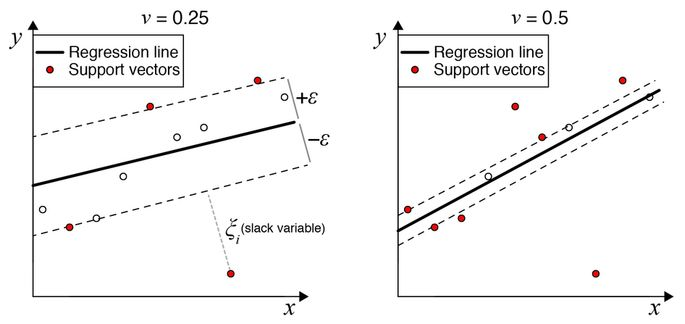

---
title:
author: 
date: 
site: bookdown::bookdown_site
output: 
  bookdown::pdf_book: 
    toc : true
    toc_depth: 4
    keep_tex : yes
    includes:
        in_header: Descartes.tex
        before_body: titre-doctorat.tex
mainfont : Montserrat
lof: yes
lot: yes        
documentclass: book
fontsize: 12pt
bibliography: [01-Interdisciplinarity.bib, 01-Intro.bib, 02-MathIntro.bib, packages.bib, UCzcite.bib, lva.bib, deconica.bib, data.bib, references.bib]
biblio-style: "plainnat"
link-citations: true
colorlinks: true
geometry: "marginpar=2cm, top=3cm, bottom=4cm"
description: "PhDThesis"
linestretch: 1
---

<!-- # Prerequisites -->

<!-- This is a _sample_ book written in **Markdown**. You can use anything that Pandoc's Markdown supports, e.g., a math equation $a^2 + b^2 = c^2$. -->

<!-- For now, you have to install the development versions of **bookdown** from Github: -->

<!-- ```{r eval=FALSE} -->
<!-- devtools::install_github("rstudio/bookdown") -->
<!-- ``` -->

<!-- Remember each Rmd file contains one and only one chapter, and a chapter is defined by the first-level heading `#`. -->

<!-- To compile this example to PDF, you need to install XeLaTeX. 

# ```{r echo=TRUE}
# knitr::opts_knit$get("rmarkdown.pandoc.to")
# ```

# ```{r GlobalOptions}
# options(knitr.duplicate.label = 'allow')
# ```
-->
```{r include=FALSE}
library(kableExtra)
```

```{r include=FALSE}
# automatically create a bib database for R packages
knitr::write_bib(c(
  .packages(), 'bookdown', 'knitr', 'rmarkdown'
), 'packages.bib')
```


```{r setup, include=FALSE}
is_pdf_output = function() {
  knitr::opts_knit$get("rmarkdown.pandoc.to") =="latex"
}
```

```{r setupup, include=FALSE}
is_html_output = function() {
  knitr::opts_knit$get("rmarkdown.pandoc.to") =="html4"
}
```

```{r setsize, include=FALSE}
if(is_pdf_output()){
  size.fig = "70%"
} else {
  size.fig = "100%"
}


```

```{r index, echo=FALSE, results='asis', eval=is_html_output()}
cat("# **Unsupervised deconvolution of bulk omics profiles: methodology and application to characterize the immune landscape in tumors**{-}

by [Urszula Czerwinska](http://urszulaczerwinska.github.io)

INTERDISCIPLINARY Ph.D. thesis

Supervised by Andrei Zinovyev and  Vassili Soumelis

See the website [urszulaczerwinska.github.io](http://urszulaczerwinska.github.io) to learn more about my professional projects.\n\n

# Resumé {-}

Les tumeurs sont entourées d’un microenvironnement complexe comprenant des cellules tumorales, des fibroblastes et une diversité de cellules immunitaires. Avec le développement actuel des immunothérapies, la compréhension de la composition du microenvironnement tumoral est d'une importance critique pour effectuer un pronostic sur la progression tumorale et sa réponse au traitement. Cependant, nous manquons d'approches quantitatives fiables et validées pour caractériser le microenvironnement tumoral, facilitant ainsi le choix de la meilleure thérapie.

Une partie de ce défi consiste à quantifier la composition cellulaire d'un échantillon tumoral (appelé problème de déconvolution dans ce contexte), en utilisant son profil omique de masse (le profil quantitatif global de certains types de molécules, tels que l'ARNm ou les marqueurs épigénétiques). La plupart des méthodes existantes utilisent des signatures prédéfinies de types cellulaires et ensuite extrapolent cette information à des nouveaux contextes. Cela peut introduire un biais dans la quantification de microenvironnement tumoral dans les situations où le contexte étudié est significativement différent de la référence.

Sous certaines conditions, il est possible de séparer des mélanges de signaux complexes, en utilisant des méthodes de séparation de sources et de réduction des dimensions, sans définitions de sources préexistantes. Si une telle approche (déconvolution non supervisée) peut être appliquée à des profils omiques de masse de tumeurs, cela permettrait d'éviter les biais contextuels mentionnés précédemment et fournirait un aperçu des signatures cellulaires spécifiques au contexte.

Dans ce travail, j’ai développé une nouvelle méthode appelée DeconICA (Déconvolution de données omiques de masse par l'analyse en composantes immunitaires), basée sur la méthodologie de séparation aveugle de source. DeconICA a pour but l'interprétation et la quantification des signaux biologiques, façonnant les profils omiques d'échantillons tumoraux ou de tissus normaux, en mettant l'accent sur les signaux liés au système immunitaire et la découverte de nouvelles signatures.

Afin de rendre mon travail plus accessible, j'ai implémenté la méthode DeconICA en tant que librairie R. En appliquant ce logiciel aux jeux de données de référence, j'ai démontré qu’il est possible de quantifier les cellules immunitaires avec une précision comparable aux méthodes de pointe publiées, sans définir a priori des gènes spécifiques au type cellulaire. DeconICA peut fonctionner avec des techniques de factorisation matricielle telles que l'analyse indépendante des composants (ICA) ou la factorisation matricielle non négative (NMF).

Enfin, j’ai appliqué DeconICA à un grand volume de données : plus de 100 jeux de données, contenant au total plus de 28 000 échantillons de 40 types de tumeurs, générés par différentes technologies et traités indépendamment. Cette analyse a démontré que les signaux immunitaires basés sur l'ICA sont reproductibles entre les différents jeux de données. D’autre part, nous avons montré que les trois principaux types de cellules immunitaires, à savoir les lymphocytes T, les lymphocytes B et les cellules myéloïdes, peuvent y être identifiés et quantifiés.

Enfin, les métagènes dérivés de l'ICA, c’est-à-dire les valeurs de projection associées à une source, ont été utilisés comme des signatures spécifiques permettant d’étudier les caractéristiques des cellules immunitaires dans différents types de tumeurs. L'analyse a révélé une grande diversité de phénotypes cellulaires identifiés ainsi que la plasticité des cellules immunitaires, qu’elle soit dépendante ou indépendante du type de tumeur. Ces résultats pourraient être utilisés pour identifier des cibles médicamenteuses ou des biomarqueurs pour l'immunothérapie du cancer.\n\n
# Summary {-}
Tumors are engulfed in a complex microenvironment (TME) including tumor cells, fibroblasts, and a diversity of immune cells. Currently, a new generation of cancer therapies based on modulation of the immune system response is in active clinical development with first promising results. Therefore, understanding the composition of TME in each tumor case is critically important to make a prognosis on the tumor progression and its response to treatment. However, we lack reliable and validated quantitative approaches to characterize the TME in order to facilitate the choice of the best existing therapy. 

One part of this challenge is to be able to quantify the cellular composition of a tumor sample (called deconvolution problem in this context), using its bulk omics profile (global quantitative profiling of certain types of molecules, such as mRNA or epigenetic markers). In recent years, there was a remarkable explosion in the number of methods approaching this problem in several different ways. Most of them use pre-defined molecular signatures of specific cell types and extrapolate this information to previously unseen contexts. This can bias the TME quantification in those situations where the context under study is significantly different from the reference.

In theory, under certain assumptions, it is possible to separate complex signal mixtures, using classical and advanced methods of source separation and dimension reduction, without pre-existing source definitions. If such an approach (unsupervised deconvolution) is feasible to apply for bulk omic profiles of tumor samples, then this would make it possible to avoid the above mentioned contextual biases and provide insights into the context-specific signatures of cell types.

In this work, I developed a new method called DeconICA (Deconvolution of bulk omics datasets through Immune Component Analysis), based on the blind source separation methodology. DeconICA has an aim to decipher and quantify the biological signals shaping omics profiles of tumor samples or normal tissues. A particular focus of my study was on the immune system-related signals and discovering new signatures of immune cell types. 

In order to make my work more accessible, I implemented the DeconICA method as an R package named “DeconICA”.  By applying this software to the standard benchmark datasets, I demonstrated that DeconICA is able to quantify immune cells with accuracy comparable to published state-of-the-art methods but without a priori defining a cell type-specific signature genes. The implementation can work with existing deconvolution methods based on matrix factorization techniques such as Independent Component Analysis (ICA) or Non-Negative Matrix Factorization (NMF).

Finally, I applied DeconICA to a big corpus of data containing more than 100 transcriptomic datasets composed of, in total, over 28000 samples of 40 tumor types generated by different technologies and processed independently. This analysis demonstrated that ICA-based immune signals are reproducible between datasets and three major immune cell types: T-cells, B-cells and Myeloid cells can be reliably identified and quantified. 

Additionally, I used the ICA-derived metagenes as context-specific signatures in order to study the characteristics of immune cells in different tumor types. The analysis revealed a large diversity and plasticity of immune cells dependent and independent on tumor type. Some conclusions of the study can be helpful in identification of new drug targets or biomarkers for immunotherapy of cancer.

\n\n
# Acknowledgements {-}
I would like to thank my supervisors Andrei Zinovyev and Vassili Soumelis for guiding this project and enabling me to interact with their teams and sharing the resources. 
I would also like to thank the U900 lab and his head Emmanuel Barillot to generously equip me with the professional environment, the place and the tools.

I address my gratitude to the TAC committee members Franck Pagès and Denis Thieffry for helping me organizing the jury and giving constructive comments along with my thesis, for being present, at least remotely despite severe weather conditions or travels. 

I would also like to express gratitude towards the jury for taking the time to assess this work.

This is also the place to thank the AVIESAN foundation for funding my Ph.D. scholarship and the Pharmacology Faculty of Paris Diderot and me and specifically Chantal Guihenneuc for giving me the opportunity to teach in parallel of my Ph.D. I would also thank a lot Center of Interdisciplinary Research for equipping me with skills through numerous courses and Bettencourt Foundation for financing part of the training and sponsoring travel expenses. Special thanks to FdV coordinators: Sofie Leon, David Manset, Elodie Kaslikowski and Maria Molina Calvita for their availability and dynamism. Also, I would express my gratitude for supporting my application for French nationality to François Taddei, director of the FdV Ph.D. school.

Thanks to all people I worked with in both teams: Arnau, Pauline, Gaelle, Paul, Cristobal, Luca, Laura, Laurence, Loredana, Jonas, Floriane, Maude, Philemon, Lilith, Paula, Michaly, Luis. To my FdV mates: Roberta, Juanma, Miza, Guillermo, and others.

This work would never be possible without help and patience of my family, my partner Arnaud and his family. Especially, I would like to thank Arnaud, who managed to be with me on the daily basis, spent the endless hours correcting my writing and speaking, discussion about code and good practices, made available a computer server at home, painted furniture, offered me a roof and internet connection at low price,  was making me laugh when I was coming home tired, angry or unmotivated, and just for being him adorable self. This thesis is dedicated to his father in whose case the available health-care solutions were not enough. 

I am proud to finish the thesis and face new professional adventures. I learned a lot about myself during this three years. Thank very much everyone whom I crossed on this path. I hope to meet you again one day.

")


```


<!--chapter:end:index.Rmd-->

```{r message=FALSE, warning=FALSE, paged.print=FALSE, include=FALSE}
load("~/Google Drive/PhDThesis/RData/PreInter.RData")
```

```{r abbrev, results="asis", echo = FALSE}
if(is_pdf_output()){
cat("
\\newpage
\\thispagestyle{empty}
\\vskip 1cm
\\huge{\\textbf{Abbreviations}}
\\vskip 1cm
\\normalsize{}
")
} else 
{
  cat("# Abbreviations{-}")
}
```

|             |                                                                       |
| ----------- | -------------------------------------------------------------------- |
|**ACSN**                    | **A**tlas of **C**ancer **S**ignaling **N**etworks                  |
|**AI**                      | **A**rtificial **I**ntelligence                                       |
|**BIODICA**                 | **ICA** applied to **Bi**g **O**mics **D**ata                         |
|**BSS**                     | **B**lind **S**ource **S**eparation                                   |
|**CAF**                     | **C**ancer-**A**ssociated **F**ibroblasts                            |
|**CNA**                     | **C**opy **N**umber **A**lterations                                   |
|**CNV**                     | **C**opy **N**umber **V**ariation                                     |
|**CRI**                     | **C**enter for **I**nterdisciplinary **R**esearch                     |
|**DeconICA**                | **Decon**volution of omic data through **I**mmune **C**omponents **A**nalysis |
|**DEG**                     | **D**ifferentially **E**xpressed **G**enes                           |
|**DGE**                     | **D**ifferential **G**ene **E**xpression                             |
|**EM**                      | **E**xtracellular **M**atrix                                         |
|**EWAS**                    | **E**pigenome-**w**ide **a**ssociation **s**tudy                     |
|**FACS**                    | **F**luorescence-**a**ctivated **c**ell **s**orting |
|**GSEA**                    | **G**ene **S**et **E**nrichment **A**nalysis |
|**ICA**                     | **I**ndependent **C**omponents **A**nalysis |
|**ML**                      | **M**achine **L**earning |
|**mRNA**                    | **m**essenger **RNA** |
|**MSTD**                    | **M**ost **S**table **T**ranscriptomic **D**imension |
|**NGS**                     | **N**ew **G**eneration **S**equencing |
|**NK**                      | **N**atural **K**iller |
|**NMF**                     | **N**on-negative **M**atrix **F**actorisation |
|**PBMC**                    | **P**eripheral **b**lood **m**ononuclear **c**ell |
|**PCA**                     | **P**rincipal **C**omponents **A**nalysis |
|**RNA-seq**                 | **RNA** **seq**uencing |
|**scRNA-seq**               | **s**ingle **c**ell **RNA** **seq**uencing |
|**SVM**                     | **S**upport **V**ector **M**achine |
|**SVR**                     | **S**upport **V**ector **R**egression |
|**TCGA**                    | **T**he **C**ancer **G**enome **A**tlas |
|**TIL**                     | **T**umor **I**nfiltrating **L**eucocytes |
|**TMA**                     | **T**issue **M**icroarrays |
|**TME **                    | **T**umor **M**icroenvironment |
|**TPM**                     | **T**ranscripts **P**er Kilobase **M**illion |
|**t-SNE**                   | **T**-distributed **S**tochastic **N**eighbor **E**mbedding |
|**UMAP**                    | **U**niform **M**anifold **A**pproximation and **P**rojection for Dimension Reduction |


```{r abbrevTCGA, results="asis", echo = FALSE}
if(is_pdf_output()){
cat("
\\newpage
\\thispagestyle{empty}
\\vskip 1cm
\\huge{\\textbf{TCGA Study Abbreviations}}
\\vskip 1cm
\\small{}
")
} else 
{
  cat("# TCGA Study Abbreviations{-}")
}
```

| Study Abbreviation | Study Name                                                   |
| ------------------ | ------------------------------------------------------------ |
| LAML               | Acute Myeloid Leukemia                                       |
| ACC                | Adrenocortical carcinoma                                     |
| BLCA               | Bladder Urothelial Carcinoma                                 |
| LGG                | Brain Lower Grade Glioma                                     |
| BRCA               | Breast invasive carcinoma                                    |
| CESC               | Cervical squamous cell carcinoma and endocervical adenocarcinoma |
| CHOL               | Cholangiocarcinoma                                           |
| LCML               | Chronic Myelogenous Leukemia                                 |
| COAD               | Colon adenocarcinoma                                         |
| CNTL               | Controls                                                     |
| ESCA               | Esophageal carcinoma                                         |
| FPPP               | FFPE Pilot Phase II                                          |
| GBM                | Glioblastoma multiforme                                      |
| HNSC               | Head and Neck squamous cell carcinoma                        |
| KICH               | Kidney Chromophobe                                           |
| KIRC               | Kidney renal clear cell carcinoma                            |
| KIRP               | Kidney renal papillary cell carcinoma                        |
| LIHC               | Liver hepatocellular carcinoma                               |
| LUAD               | Lung adenocarcinoma                                          |
| LUSC               | Lung squamous cell carcinoma                                 |
| DLBC               | Lymphoid Neoplasm Diffuse Large B-cell Lymphoma              |
| MESO               | Mesothelioma                                                 |
| MISC               | Miscellaneous                                                |
| OV                 | Ovarian serous cystadenocarcinoma                            |
| PAAD               | Pancreatic adenocarcinoma                                    |
| PCPG               | Pheochromocytoma and Paraganglioma                           |
| PRAD               | Prostate adenocarcinoma                                      |
| READ               | Rectum adenocarcinoma                                        |
| SARC               | Sarcoma                                                      |
| SKCM               | Skin Cutaneous Melanoma                                      |
| STAD               | Stomach adenocarcinoma                                       |
| TGCT               | Testicular Germ Cell Tumors                                  |
| THYM               | Thymoma                                                      |
| THCA               | Thyroid carcinoma                                            |
| UCS                | Uterine Carcinosarcoma                                       |
| UCEC               | Uterine Corpus Endometrial Carcinoma                         |
| UVM                | Uveal Melanoma                                               |


```{r abbrevEND, results="asis", echo = FALSE}
if(is_pdf_output()) {
cat("
\\newpage
\\thispagestyle{empty}
")}
```
# Preamble about Interdisciplinary Research {-}

```{r chapnam, results="asis", echo = FALSE}
if(is_pdf_output()){
cat("\\chaptermark{Interdisciplinary research}")
}
```
```{r pagesONE, echo=FALSE, results='asis', eval=is_pdf_output()}
cat("\\setcounter{page}{17}
\\renewcommand{\\thepage}{\\arabic{page}}")
```


> *We are not students of some subject matter, but students of problems. And problems may cut right across the borders of any subject matter or discipline.*
> 														— Karl Popper

The piece of work you are reading should harvest the fruit of interdisciplinary research conceived in an interdisciplinary environment of Center for Interdisciplinary Research in Paris (CRI) in École doctorale *Frontières du Vivant* (FdV) and Institut Curie in groups Computational Systems Biology of Cancer and Integrative Biology of  Human Dendritic Cells and T-cells. CRI's main mission can be formulated as follows:

> *to empower the students to take initiative and develop their own research projects **at the crossroads of life, learning, and digital sciences**.* [@CRIweb] 

Interdisciplinarity has many definitions and meanings. According to the book *Facilitating Interdisciplinary Research* [@FIRbook]

> *Interdisciplinary research and education are inspired by the drive to solve **complex questions** and problems, whether generated by scientific curiosity or by society, and lead researchers in different disciplines to meet at the **interfaces** and **frontiers** of those disciplines and even to **cross frontiers** to **form new disciplines**.*

For me, the essence of interdisciplinarity is the need to solve a complex problem, whatever expertise would be necessary to solve it. I consider that fighting cancer disease, deciphering cancer heterogeneity and interactions of the immune system are causes worth an interdisciplinary effort. This is even truer in the era of big data when the demand for quantitative tools is exponentially growing, in order to extract information and knowledge.

Though this preamble I would like praise not only the interdisciplinary research but also underline possible limitations and constraints that come with it and which could affect this thesis.

## What does interdisciplinarity in science mean in XXI century? {-}

In the ancient history, being formed and practice multiple disciplines was not anything unusual which is strongly reflected in Greek philosophy initiating the dispute about the division and hierarchical classification of knowledge. [@Slavicek2012]. Figures as Aristotle and Leonardo Da Vinci that can be called *homo universals* served different disciplines from arts through history, natural sciences to mathematics.  With time human knowledge about the word, i.e., natural sciences got bigger and bigger, to the point that it became hard to master all the disciplines. The specialization would allow to study in deep a certain subject and make possible discoveries about it. And even if, interdisciplinary efforts never stopped, for a long time they were not mainstream in scientific communities divided into academies, chairs, and specialization.

Different fields differ in term of concept, method, tools, processes, and theories [@Slavicek2012]. Thanks to division into scientific disciplines a sort of order is conserved across space and time. Hierarchical classification of knowledge comes from human nature. 

It can be observed that there is an increasing gap between disciplines along with specialization. 

>*advancing specialisation leads to gaps in the level of comprehension between individual disciplines and eventually gives rise to the demand for interdisciplinarity - in order to close the gaps between disciplines.*[@Slavicek2012] 

It is not really clear why this gap must happen. Would it somehow reflect human nature,  the strong need to divide things into discrete categories rather than to see a continuum?

Nowadays, the knowledge is accessible, and we can profit from achievements of different disciplines thanks to easy means of communication. Two different terms  can be defined to describe initiatives that use the knowledge of different specialties:  multidisciplinarity which is a sum of efforts of different disciplines and interdisciplinarity that allows profiting from the synergy of multiple disciplines (Fig. \@ref(fig:multidisc)). With interdisciplinary research and education come flexibility, creativity, and novelty but also limit of depth on ingested knowledge and possibilities of cross-interactions between disciplines.

```{r multidisc, fig.cap='(ref:multidisc-caption)',fig.scap="Symbolic illustration of a sum (multidisciplinarity) versus synergy (interdisciplinarity)", out.width='60%', fig.align='center', echo = FALSE}
if (is_pdf_output()) {
  knitr::include_graphics('figures-ext/multidisc.pdf')
} else {
  knitr::include_graphics('figures-ext/multidisc.png')
}
```

(ref:multidisc-caption) **Symbolic illustration of a sum (multidisciplinarity) versus synergy (interdisciplinarity)**, in an interdisciplinary project sum of thee disciplines A, B, C should have more value than a simple sum of disciplines:  an interdisciplinary project should have an added value compared to a multidisciplinary one.

Why are not all of the labs interdisciplinary?

> *Scientists tend to resist interdisciplinary inquiries into their own territory. In many instances, such parochialism is founded on the fear that intrusion from other disciplines would compete unfairly for limited financial resources and thus diminish their own opportunity for research*
>  															— [Hannes Alfvén](http://www.azquotes.com/author/28130-Hannes_Alfven) 

Crossing frontiers is not an easy task, and it was quite difficult in the beginnings of modern interdisciplinarity. Some examples of early interdisciplinary efforts of the 20th century are nicely described by Ledford et al. [@Ledford2015] in *Nature* special issue on [Interdisciplinarity](https://www.nature.com/news/interdisciplinarity-1.18295). It illustrates Theodore Brown in 1980s while trying to organize a new interdisciplinary research project and reorganize university space to engage an exchange between students of different faculties, and he encounters a lot of reluctance.

> *And then there was the stigma. “Interdisciplinary research is for people who aren't good enough to make it in their own field,” an illustrious physicist chided* [@Ledford2015].

The story seems to end up with a happy ending of 40-million US dollars grant and foundation of Beckman Institute for Advanced Science and Technology. However, recruiting an open-minded director for leading this unconventional organization was a struggle. Shortly, the structure became a model for others and met a great scientific and technological success.

Even though, since then the idea of interdisciplinary research spread around the world. Yet, not all problems were overcome.

> *"There's a huge push to call your work interdisciplinary," says David Wood, a bioengineer at the University of Minnesota in Minneapolis. "But there's still resistance to doing actual interdisciplinary science".*

First, the institutions, universities where research is performed should equip scientist with a passport to other disciplines, facilitate exchange, funding the interdisciplinary research, be accepting fusion of disciplines as new ones. Then, proper communication between disciplines is necessary. Finally, developing interdisciplinary research is extremely challenging as it often requires extra effort from an apprentice.

*Are all the disciplines independent units nowadays?*

Can we do molecular biology without technical, mathematical and computational support? Can we study cognitive science without knowledge of biology, physics, and psychology? Can we advance medicine without basic research in biology, physiology, electronics?

Bioinformatics and/or computational biology is an compelling case. Working in this field is being between biology, medicine, computer science, mathematics and statistics, the role of a computational biologist is sometimes reduced to a service. A biological lab may need a computational biologist to perform an analysis, restructure the data,  that is needed for the biological discovery. Often, there is not enough space for research in computational biology itself, where the discovery does not depend on the original data but tools and approaches to complex, data-intensive biological problems. It may also happen the other way round when a computational biologist asks a bench researcher to perform an experiment to prove his theoretical model. In both cases, the long-term interdisciplinary partnership would probably fail. Wet and dry researchers should collaborate as equal with important research advances on both sides to assure a long-term equilibrium. 

*How did interdisciplinarity change over the years? Are all disciplines affected equally?* 

From the chart (Fig. \@ref(fig:interdisciplinary)), we can notice that Social Studies of Medicine seems to be the most interdisciplinary field. In general Biology, Health and Biomedical Sciences seem to be more open into a flow of knowledge from other fields than humanities. On the extreme opposite of health, Clinical Medicine appears to be a very conservative field.

```{r interdisciplinary, fig.cap='(ref:interdisciplinary-caption)',fig.scap="Interdisciplinarity of different fields.", echo=FALSE, message=FALSE, warning=FALSE, paged.print=TRUE, fig.align='center', out.width='90%'}
if (is_html_output()){
  library(plotly)
library(ggplot2)
interd.data <- read.csv("~/Google Drive/PhDThesis/RData/interd-data.csv")
interd.data$OutDiscRef <- interd.data$OutDiscRef*100
interd.data$OutDiscCit <- interd.data$OutDiscCit*100
gg <- ggplot(interd.data, aes(OutDiscRef, OutDiscCit, color = Discipline))+
  labs(x = "References to outside disciplines (%)", y = "Citations from outside disciplines (%)") +
  geom_point(aes(size = 4, frame = Year, id = Specialty, alpha = 0.85)) +
  ggtitle(label= "A measure of interdisciplinarity") +
 theme_bw() +
  annotate("text", x = 70, y = 95, label = "More interdisciplinary", color = "grey27", size = 5) +
  annotate("text", x = 30, y = 5, label = "Less interdisciplinary", color = "grey27", size = 5)
ggplotly(gg) %>% animation_slider(
    currentvalue = list(prefix = "\nYEAR ", font = list(color="red"), offset = 30,  redraw = T)
  )
} else {
  knitr::include_graphics('figures-ext/interdisciplinary.jpg')
}  
```


(ref:interdisciplinary-caption) **Interdisciplinarity of different fields.** "From 1950-2014, a field’s position is determined by how much its papers cite outside disciplines (x-axis), and by how much outside disciplines subsequently cite its papers (y-axis). (Some years, certain fields have too few references to be plotted.)". Reprinted by permission from Springer Nature [@VanNoorden2015] © 2015 Nature America, Inc. All rights reserved.

## Strengths, Weaknesses Opportunities, Threats (SWOT) of an interdisciplinary Ph.D. - personal perspective {-}

>*I'm not good enough to do well something I dislike. In fact, I find it hard enough to do well something that I like* 
> — Jim Watson, Succeeding In Science: Some Rules Of Thumb [@Csermely2007]

Being formed first in a double major in biology and mathematics, then participating in interdisciplinary research projects during my master studies, I can witness that the learning curve of multiple disciplines can be steep. It is also often associated with the frustration of not going deep enough in all of the disciplines or the feeling of being overwhelmed by the amount of knowledge.

Coming with the expertise in biology and mathematics, I got fascinated by complex biological systems. One way of study high-dimensional data is to reduce them into smaller interpretable units. This is what I tempted to achieve in this thesis in order to enrich our knowledge about tumor microenvironment and possibly contribute to orienting future research on immunotherapies. 

However, being an interdisciplinary researcher was not always a privilege. *To which category do I belong?* *To whom should I present my work?*  I often asked myself these questions. I also often encountered lack of understanding where my methodological results were not bringing enough of *biological insights*. Or the constraints of my biological application seemed very obscured and complicated for mathematicians, and my work often lacked *important methodological advances*. 

*Does it mean that my work is not accurate, useless?* Probably,  for many, it is not enough. However, I still hope that our findings will be interesting to some. I enjoy working with data and statistics that serve an actual purpose.  The Tab. \@ref(tab:SWOT) summarizes Strengths, Weaknesses, Opportunities, and Threats (SWOT analysis) of an interdisciplinary project, in the way I perceive it. 

```{r SWOT, echo=FALSE, }
  SWOT <- read.csv("~/Google Drive/PhDThesis/RData/SWOT.csv", sep= ";", header = FALSE)
if (is_html_output()){
x <- kable(SWOT, "html", col.names = SWOT[1,], row.names = FALSE, align = 'c',caption='(ref:SWOT-caption)') %>%
  kable_styling(c("striped", "bordered"), full_width = F) %>%
  row_spec(1, bold = T, color = "white", background = "black")
gsub("<thead>.*</thead>", "", x)
  x
  gsub("<thead>.*</thead>", "", x)
} else {

kable(SWOT[2:nrow(SWOT),], format="latex",col.names = as.character(as.matrix(SWOT[1,])),row.names = FALSE, align = 'c', booktabs = T , caption='(ref:SWOT-caption)',   caption.short = "SWOT analysis of Interdisciplinary research") %>%
     kable_styling(latex_options= c("striped"), full_width = F ) %>%
    row_spec(0, bold = T, background = "Gray", color = "white") %>%
  column_spec(1:4, width = "9em", border_left = T) %>%
   column_spec(4, width = "9em",  border_left = T, border_right = T)

}
```

(ref:SWOT-caption) **SWOT analysis of Interdisciplinary research**. In SWOT analysis, Strengths, Weaknesses, Opportunities, and Threats are enumerated. Strengths and Weaknesses are internal, and Opportunities and Threats are external factors. 


<!-- --<! | Strengths (internal, positive)                    | Weaknesses (internal, negative)                   | Opportunities (external, positive)                           | Threats (external, negative)                               | --> 
<!-- | ------------------------------------------------- | ------------------------------------------------- | ------------------------------------------------------------ | ---------------------------------------------------------- | -->
<!-- | Having a holistic view of the problem             | Not seeing details of the problem                 | Mulitple possibilities to convey research                    | Spending too much time filling  knowledge gap              | -->
<!-- | Being supervised  by multiple experts             | Being in the missgle of a conflict of two experts | Take advantage of synergistic effect of fields               | Inhibiting effect of oppinions from  different fields      | -->
<!-- | Joining expertises of different fields            | Not covering in details all the disciplines       | Doing a new discovery                                        | Obtaining too generic results                              | -->
<!-- | Using new/non standart approach                   | Experiencing steep learning curve                 | Raising interest in different expert domains                 | Not mastering the specific  vocabulary of different fields | -->
<!-- | Having better understanding of complex  processes | Being in constant need of help of domain experts  | Making progress                                              | Not being understood                                       | -->
<!-- | Higher creativity                                 |                                                   | Creating a new field                                         | Being hard to classify/ fall into a  category              | -->
<!-- | Having great flexibility                          |                                                   | Sovling many problems impossible to solve with traditional approach | Being considered as superficial                            | -->
<!-- | Feeling a thrill of adventure                     |                                                   |                                                              |                                                            | -->
<!-- | Being open                                        |                                                   |                                                              |                                                            | -->

<!-- Table: (\#tab:SWOT) **SWOT analysis of Interdisciplinary research**  -->

Besides conducting research that crosses the boundaries of one discipline, I also could meet and work with inspiring people coping like me with filling the gap in understanding of interdisciplinary work, multiple supervisors and report to many institutions. I gained (even if only superficial) understanding of many topics in mathematics, statistics, data science, immunology, cancer but also oral and written presentation skills, time and work management   

Is my thesis genuinely interdisciplinary? Does biology profits from mathematics and mathematics from biology? I will let you judge it. 

What impact had biology on the statistical/mathematical modeling? The practical problems, systems that go beyond theoretical formulations challenge the theoretical tools. In my work, I did my best to fuse theory and practice that should serve a biological application. I can image the project more complete if the results of my work would inspire changes in biological experiments, uncover new paths to follow for experimental biologists or translational researchers. 

## The origins of the Ph.D. topic {-}

> *The universe will lead me where I need to go. I am like a leaf in the stream of creation*
> 													— Dirk Gently, Holistic detective

When finishing my master, I was looking for an interdisciplinary topic where I could deepen my quantitative skills and apply to a real-life healthcare problem. I came across a project proposed by Andrei Zinovyev in close collaboration with Vassili Soumelis. I was quite anxious that my knowledge of cancer immunology would not be sufficient to lead the project to a success. I recognize that the immune systems are very complex and dynamic system and many years of expertise are needed to grasp an understanding of it really. I had a great chance to work hand in hand with domain experts that would suggest me the direction I should take in my research.

The project started by causal exploration of different blind source separation or dimension reduction techniques and their ability to dissect bulk transcriptomic data into cell type-related units. We also faced a vital problem of lack of gold standard validation data that would define efficiency and accuracy of different methods. 

I have spent fruitless efforts working on a bulk transcriptomic data simulation framework, important statistical issues come our way and probably another few years of a different Ph.D. would be necessary to solve them. In the meantime, many tools dissecting tumor bulk transcriptome were published. Serving a similar purpose, they used different means and assumptions, which left a space for my project to continue. In my third year, I am finally publishing a tool that performs the analysis I developed together with the Sysbio team members, and I can apply it to a corpus of publicly available data to learn about the actual question: the immune system infiltrating cancers and the context-dependent signatures  (see [Chapters 4 & 5](#deconica)).

In a parallel project, I worked on an exploration of a brand new data type: single cell transcriptomic (RNAseq) in the context of tumor microenvironment (see [Chapter 6](#map)). 

We have also participated in the Dream Idea Challenge, a project that aimed to put closer experimental and theoretical researchers ([Annexe 1](#annex1), [@Azencott2017]) . 

I have collaborated in numerous projects within and outside my team. Some of the projects resulted in publications, such as my work on analyzing pDC subsets of breast cancer [Annexe2](#annexe2). Some others are in still preparation.

I have attended nine national, and international conferences, where I presented posters, gave talks and I got awarded with distinctions for my work. 

Alongside with pursuing the compelling scientific research, I completed a wide variety of courses and I was teaching IT, Statistics and Mathematics at pharmacology faculty. Thanks to this extensive (>300 hours) training over three years, I am equipped with soft skills that not only helped me to shape my thesis project on the go but also, I hope, will help me to succeed in my future career path.

# Organisation of the dissertation {-}
```{r chapnameOne, results="asis", echo = FALSE}
if(is_pdf_output()){
cat("\\chaptermark{Organisation of the dissertation}")
}
```
As it is a fruit of an interdisciplinary work, I decided to introduce the topic from two perspectives: describe the biological and biomedical dimension of the topic (see [Chapter 1](#intro)), as well as, the mathematical dimension of the problem of separation of sources in complex mixtures (see [Chapter 2](#methods)). I hope, it will make the subject of my thesis easy to understand also for non-biologists or non-mathematicians. In the results part, I introduce a study of ICA applied to transcriptomes ([Chapter 3](#mstd)). I also apply ICA-based deconvolution to Breast cancer transcriptomes to prove its reproducibility [Chapter 4](#LVA).  I compare the reproducibility of blind source separation methods NMF and ICA (see [Chapter 5](#nmfica)). Then I introduce the DeconICA R package (see [Chapter 6](#deconica) ) and finally present results of an application of DeconICA and other tools to 118 transcriptomic datasets (see [Chapter 7](#results)). The second part of the results is dedicated to my work on cell type heterogeneity (see [Chapter 8](#map)). The manuscript finishes with [Chapter 9](#discussiongenerale) and [Chapter 10](#conclusions) that contain discussion, conclusions, and perspectives. In annexes, you can find publications to which I contributed during my doctorate that are not strictly linked with the topic of this thesis. In the end, I included a glossary of useful terms.

**INTRODUCTION**

* [Chapter 1](#intro): introduction to cancer biology and immunity, challenges in cancer immunotherapies and cancer immune phenotyping as well as data sources most commonly used to face the topic.

* [Chapter 2](#methods): introduction to a problem of mixed sources in biological samples, an overview of blind source separation methods and supervised deconvolution methods, with focus on those applied to bulk transcriptome to uncover and quantify immune compartments

**RESULTS**

* [Chapter 3](#mstd): Most Reproducible Transcriptome Dimension (MSTD)
* [Chapter 4](): application of ICA-based deconvolution to six breast transcriptomes
* [Chapter 5](#sens): comparison of reproducibility of NMF and ICA methods
* [Chapter 6](): DeconICA R package
* [Chapter 7](): application of DeconICA R package and other tools to analyze >100 transcriptome datasets of bulk cancer transcriptomes
* [Chapter 8](#map): study of immune cell types heterogeneity in tumor microenvironment using the innate immune map and scRNA-seq data

**DISCUSSION**

* [Chapter 9](#discussiongenerale): Discussion
* [Chapter 10](#conclusions): Conclusions and perspectives

**ANNEXES**

* Other publications:
  + Adjustment of dendritic cells to the breast-cancer microenvironment is subset specific
  + The inconvenience of data of convenience: computational research beyond post-mortem analyses
* DeconICA R package documentation:
  + Vignette 1: Introduction to deconICA
  + Vignette 2: Running fastICA with icasso stabilization
  + Manual 
 * Scientific CV (including a list of attended conferences and publications)


**GLOSSARY**

<!--chapter:end:01-Interdisciplinarity.Rmd-->


```{r include=FALSE}
 load(file = "./RData/IntroBio.RData")
```

<!-- ```{r setup, include=FALSE} -->
<!--  is_pdf_output = function() { -->
<!--     knitr::opts_knit$get("rmarkdown.pandoc.to") =="latex" -->
<!--  } -->
<!-- ``` -->

<!-- ```{r setup2, include=FALSE} -->
<!--  is_html_output = function() { -->
<!--    knitr::opts_knit$get("rmarkdown.pandoc.to") =="html4" -->
<!--  } -->
<!-- ``` -->

# (PART) Introduction {-}
# Immuno-biology of cancer {#intro} 

This chapter will first introduce a short history of cancer with a focus on discoveries linking cancer and its environment. It will also describe the participation of TME in cancer development, progression and response to treatment. Most important types of data used to study cancer microenvironment will be discussed. I also introduce a link between tumor immune-biology and cancer phenotyping for development of immunotherapies.

## Cancer disease

According to [GLOBOCAN study]( http://globocan.iarc.fr/Pages/fact_sheets_cancer.aspx) [@GLOBOCAN], 14.1 million cancer cases were estimated to happen around the world in 2012. It touched 7.4 million men and 6.7 million women. It is estimated that the cancer cases will increase almost two-fold to 24 million by 2035.

In France only, in 2012 there were 349426 cases of cancer, of which leading is Prostate cancer (16,3%) followed by Breast (14%) and Lung (11,5%). 

For a long time studying tumor was focused on tumor cells, their reprogramming, mutations. Cancer was seen as a disease of uncontrolled cells by the mainstream research. At the same time, the idea of the importance of the impact of other cells and structures on cancer cells was present but often not believed.  A recent success of immunotherapies moved research focus to tumor cells in their context: tumor microenvironment. We will describe here what is the composition and role of the TME in tumor progression, diagnosis and response to treatment. 

### Historical understanding of cancer {#hist}  

Cancer was historically described by a physician Hippocrates (460–370 B.C) [@Sudhakar2009]. Even though there exist even earlier evidence of the disease. Hippocrates stated that the body contained 4 humors (body fluids): blood, phlegm, yellow bile and black bile. Any imbalance of these fluids will result in disease. Particularly the excess of black bile in an organ was meant to provoke cancer. For years, it was not known what factors cause cancer and it was easily confounded with other diseases. In the middle ages in the Renaissance Period, it was believed cancer is a punishment for the sins they committed against their god, that they deserved it to some extent.

Until the 18th century, it was believed that cancer is contagious and is spread by parasites.

In the 19th century, tumor cells started to be analyzed by pathologists. They were strike with their ability to proliferate uncontrollably, ability to spread and destroy the original tissue [@NPR2010]. Around the same time, leukocytes from the blood were first described by Gabriel Andra and William Addison. Just a few years later, in 1845 Bennett and Virchow described blood cells in leukemia (Fig. \@ref(fig:Virchow-cell)). Virchow is also a father of Chronic irritation theory (nowadays called chronic inflammation) that says that cancer is caused by local "irritation" and, incorrectly, that cancer cells spread like liquid resulting in metastasis.

```{r Virchow-cell, fig.cap='(ref:Virchow-cell-caption)',fig.scap="Illustration of Virchow's cell theory", out.width='100%', fig.align='center', echo = FALSE}
knitr::include_graphics('figures-ext/01-Virchow-cell.jpg')
```

(ref:Virchow-cell-caption) **Illustration of Virchow's cell theory**. Virchow depicted different cells transformation due to irritation.  [@VirchowRudolf1847] 

In 1889, Stephen Paget introduced *soil and seed* hypothesis of metastases [@Paget1889]. He formulates it as follows 

> *When a plant goes to seed, its seeds are carried in all directions, but they can only live and grow if they fall on congenial soil.*

Which is parallel to cancer cells disseminated by body fluids, and they can grow only tissues - "soil" that is predisposed to host the cancer cell - "the seed". He focused on the importance of tissue characteristics that favorize tumor development as opposed to most researchers of his time that were focusing on the "seed" itself.

In the 20th century, molecular causes started to be investigated. It was discovered that cancer could be caused by environmental factors, i.e. chemicals (carcinogens), radiation, viruses and also inherited from ancestors. Those factors would damage but contrary to a healthy condition they would not die.

Also in 1909, Paul Ehrlich, called one of fathers of immunology and Nobel Prize laureate, indicated a link between immune system and tumor suppression [@Ehrlich1909]. One of the remarkable first immunotherapy attempts can be attributed to William Coley, that practiced injecting streptococcus bacteria directly into patients after cancer surgery in 1891, later called "Colley vaccine". However, the impact of this procedure on patients recovery was judged by scientific community as "unclear".

In 1968, Melvin Greenblatt and Philippe Shubik showed that tumor transplants secrete a substance stimulating the growth of blood vessels [@Greenblatt1968], later identified as "tumor angiogenic factor (TAF)" by Judah Folkman in 1971 [@Folkman1971]. Folkman also suggested that TAF can be a  target of a therapy itself. This was a revolutionary idea, at the time, as it did not target the tumor cells directly acted on their environment.

During the 1970s, oncogenes and tumor suppressor genes were discovered. Oncogenes are genes that allow a cell to become a cancer cell, while the tumor suppressor genes would repair DNA or execute cell death of a damaged cell. A new dimension to cancer studies was added in the 1980s, epigenetic changes were proven to occur to both oncogenes and tumor suppressors [@Feinberg1983; @Greger1989], which are presently known as epigenetic markers used for diagnostics and therapeutic targets for cancer.

In 1982, Aline van Pel and Thierry Boon [@VanPel1982] discovered that a specific immunity to spontaneous tumor cells could be induced by vaccinating mice with mutagenized tumor cells. This raised an inspiration for many years of immune therapy development.

In Napoleone Ferrara and colleagues identified the gene encoding vascular endothelial growth factor (VEGF) that was shown to stimulate the growth of endothelial cells proliferation *in vitro* and angiogenesis (blood vessels formation) *in vivo* [@Leung1989].

In 1999 for the first time, gene-expression was used to study cancer (leukemia) by Todd Golub, Donna Slonim and colleagues [@Golub1999].

Since the end of the 20th century, cancer screens are developed along with multiple strategies to fight the tumor. Most classical ones are based on the idea of removing tumor cells (surgery), killing tumor cells with DNA-blocking drugs (chemotherapy), radiation, inhibit cancer growth (hormonal therapy, adjuvant therapy and immunotherapy). As none of those methods is fully efficient, often a combination of treatments is proposed. Nowadays, science is aiming in the direction of targeted therapies and personalized treatment.  

The recent success of immunotherapies (discussed in [Immunotherapies section](#immunotherapies) attracted the attention the scientific community again to the context in which tumor cells are found. This context called Tumor Microenvironment, as well as the communication that happens within it between different agents nowadays studied differently with available knowledge of molecular biology, have become a popular scientific topic of the 21st century (Fig. \@ref(fig:pubmedTME)). 

```{r pubmedTME, echo=FALSE, message=FALSE, warning=FALSE, paged.print=FALSE, fig.cap='(ref:pubmedTME-caption)', fig.scap="Percentage of publications containing the phrase \"tumor immunotherapy\" is growing", out.width=size.fig, fig.align='center'}
library(ggplot2)
p <- ggplot(data = tme, aes(x = Year, y = percentage, fill = Type)) +
  geom_bar(stat = "identity", fill = "steelblue") +
  theme_bw() + scale_x_continuous(breaks = round(seq(min(tme$Year), max(tme$Year), by = 5), 1)) + labs(y = "Percentage of all publications [%]")
if (is_html_output()){
  library(plotly)
  ggplotly(p, tooltip=c("x","y"))
} else {
  p
}
```

(ref:pubmedTME-caption) **Percentage of publications containing the phrase "tumor immunotherapy" is growing**, numbers retrieved on 17.01.2018 from [Medline Trends](http://dan.corlan.net/medline-trend.html) [@Corlan2004]

### Tumor Microenvironment as a complex system 

Tumor Microenvironment is a complex tissue that surrounds tumor cells. It is composed of different compartments (in solid tumors):

* Stroma:  blood and lymphatics vessels, epithelial cells, mesenchymal stem cells,  fibroblasts, adipocytes supported by extracellular matrix (EM) 
*  Immune cells: T cells, B cells, NK cells, Dendritic cells,  Macrophages, Monocytes etc. 

Their proportion and specific roles vary significantly with tumor type and stage. Communication between the environmental cells and the tumor is critical for tumor development and has an impact on patient's response to treatment. This communication between different compartments is bidirectional and all the players can influence each other. Depending on the nature and prevailing direction of those interactions different destiny is possible for each of the compartments, i.e. immune cells can be recruited to protect tumor cells or they can kill them directly. Many of the signals can be contradictory, many can suppress each other. Then is it possible to tilt this complex ecosystem into patients' favor? Can we decipher the most important factors of this molecular knot and manipulate it? 

Next section describes different scenarios of interaction within TME in order to illustrate the complexity of TME and possible targets for cancer therapies.

```{r video1, echo=FALSE, results='asis', eval=is_html_output()}
cat("We recommend watching this video in order to visualize the TME and cancer thanks to 3D animations

<iframe width=\"560\" height=\"315\" src=\"https://www.youtube.com/embed/K09xzIQ8zsg\" frameborder=\"0\" allow=\"autoplay; encrypted-media\" allowfullscreen></iframe> ")
```

#### Interactions between TME and Tumor

Three scenarios can be considered to describe the relationship between TME and tumor cells:

1. TME stimulates  tumor growth and/or  progression and/or impact negatively the response to treatment
2. TME has no influence on tumor cells and disease development
3. TME has a tumor-suppressive role and impact positively the response to treatment

As it is presented in  [Section 1.1.1](#hist) these three hypotheses were gaining and losing popularity in the scientific and medical community over the decades.

##### TME as a foe: inflammation

In 1863 Rudolf Virchow observed a link between chronic inflammation and tumorigenesis. According to Virchov theory, the genetic damage would be the “match that lights the fire” of cancer, and the inflammation or cytokines produced by immune cells should be the “fuel that feeds the flames” [@Balkwill2001]. Therefore lymphocyte infiltration was confirmed by subsequent studies as a hallmark o cancer. The question one may ask is why our immune system is not enough to defend the organism from tumor cells as it does efficiently in a range of bacterial and viral infections? It is mainly because of the ability of tumor cells to inhibit immune response through activation of negative regulatory pathways (so-called immune checkpoints).

It is worth mentioning, that the immune system can be already disabled and therefore cancer has more facility to develop. The immune system can be less efficient for example because of drugs given to patients after transplants of because of diseases like HIV/AIDS. These people have higher probability to develop cancers caused by infectious agents (viruses). These cancers are non-Hodgkin lymphoma (NHL) (caused by [Epstein-Barr virus](https://www.cancer.gov/Common/PopUps/popDefinition.aspx?id=CDR0000045684&version=Patient&language=English) (EBV) infection), lung (no identified specific infectious agent), kidney (no identified specific infectious agent) and liver (caused by chronic infection with the [hepatitis B](https://www.cancer.gov/Common/PopUps/popDefinition.aspx?id=CDR0000046146&version=Patient&language=English) (HBV) and [hepatitis C](https://www.cancer.gov/Common/PopUps/popDefinition.aspx?id=CDR0000044139&version=Patient&language=English) (HCV) viruses) cancers. Human papillomavirus (HPV), can cause cervical, anal, oropharyngeal, and other cancers.

In the case of non-infectious cancers in patients with no history of immunosuppressive drugs intake or diseases, the question how tumor manages to break natural defence remains even more interesting. Many examples can be cited on how TME facilitates tumor development (Fig. \@ref(fig:met-dis)). For instance, in the early stages of tumorigenesis, some macrophage phenotypes support tumor growth and mobility through TGF-beta signaling. Also, it was shown that NK cells and myeloid-derived suppressor cells (MDSCs) have an ability to suppress immune defence i.e. immunosurveillance by dendritic cells (DCs), T cell activation and macrophage polarisation and they promote tumor vascularization as well. [@Talmadge2013; @Gabrilovich2012] They create so-called niches that facilitate tumor colonization. T-regs and myeloid-derived suppressor cells can negatively impact natural immune defense and by these means allow growth and invasion of tumor cells [@Taube2017a]. Another cell type, a part of EM, fibroblast, or more precisely Cancer-Associated Fibroblasts (CAFs) have proven pro-tumor functions in breast cancer where they enhance metastasis [@Dumont2013]. The blood and lymphatic vessels maintain tumor growth providing necessary nutritive compound to malignant cells. 


```{r met-dis, fig.cap='(ref:met-dis-caption)',fig.scap="The microenvironment supports metastatic dissemination and colonization at secondary sites.", out.width='100%', fig.align='center', echo = FALSE}
if (is_pdf_output()) {
  knitr::include_graphics('figures-ext/massive-dissemination.pdf')
} else {
  knitr::include_graphics('figures-ext/massive-dissemination.png')
}
```

(ref:met-dis-caption) **The microenvironment supports metastatic dissemination and colonization at secondary sites.**  Different tumor sites can communicate through exosomes realized by tumor cells and also immune and stromal cells such as NK cells, CAFs and DCs. Reprinted by permission from Springer Nature [@Quail2013] © 2013 Nature America, Inc. All rights reserved.

According to [@Hanahan2012] immune and stroma cells participate in almost all of Cancer Hallmarks [@Hanahan2000; @Hanahan2012]. Most of the hallmarks of cancer are enabled and sustained to varying degrees through contributions from repertoires of stromal cell types and distinctive subcell types.

##### TME seen as neutral

In front of lack of definitive proof that TME can positively or negatively impact on tumor development, many scientists, in a long time, ignored the importance of this factor.  Until the early-mid eighties, the TME research was mostly limited to angiogenesis and immune environment and most areas that are now driving the field were not represented. 

From the early 70s until the end of the 90s. the most accepted statement was that genetic alterations in oncogenes and tumor suppressor genes are both necessary and sufficient to initiate tumorigenesis and drive tumor progression. Therefore TME was not seen as an important element of the puzzle. 

The cancer geneticists, at the time, had a lot of influence on scientific community diminishing the work made on TME which were considered as “uninteresting” and definitely not "mainstream".

After the 90s, with the discovery of signaling molecules involved in the communication of TME like VEGF general opinion started to change. Furthermore, discoveries made by developmental biology field supported the hypothesis that microenvironment plays an important role in development which was later shown for tumorigenesis. Additionally, the success of immune vaccines starting with the tuberculosis vaccine Bacille Calmette-Guérin (BCG) in 1976 and finishing, at the moment with checkpoint inhibitors did not leave the scientific community indifferent. 

##### TME as a friend: immunosurveillance

As mentioned in [Section 1.1.1](#hist) Paget proposed a hypothesis of "seed and soil" where the TME in a certain tissue (the soil) can either stimulate or suppress the metastasis (the seed). William Coley tested a possibility to trigger tumor-suppressive effect via stimulation of the immune system with bacteria.  In the 1960s, the immune surveillance theory hypothesized "the ability to identify and destroy nascent tumors as a central asset of the immune system" [@Sebeok1976; @Burnet1970]. Thus, the hypothesis that TME can have a positive role in tumor prognosis is not new. 

In modern immuno-oncology, the term *immune-editing* was introduced by @Dunn2002 in 2002, to describe the relationship between the tumor cells and the immune system. The immunosurveillance through immune-editing can be summarized in three processes:  elimination, equilibrium, and escape  [@Dunn2002]. 

The elimination is the direct killing of cancer cells or growth inhibition by the immune system. The adoptive T cells and NK are actively involved in tumor killing and stimulate other immune cells. The CD8 + cytotoxic lymphocytes (CTLs)  directly recognize tumor cells.  Employing perforin- and granzyme-dependent mechanisms they can lyse tumor cells. The CD4 + T cells release factors to induce proliferation of B cells and to promote their differentiation to the antibody (Ab)-secreting plasma cells, activate macrophages. Macrophages use phagocytosis to eliminate cancer cells [@Vesely2011].

The tumor-infiltrating lymphocytes (TILs) have been associated with an overall good prognosis and better survival in different cancer studies. Moreover,  abundance of  CD3 + and CD8 +  T cells, NK cells, and $\gamma\delta$T cells correlate  with improved outcomes in epithelial ovarian cancers [@Marquez-Medina2012]. Several studies report that the presence of the abundant immune infiltrates is correlated with a good prognosis or better survival [@Kornstein1983; @Baxevanis1994; @Naito1998; @Pages2005].   Spontaneous regression of human tumors has been reported in cutaneous melanoma, retinoblastoma, osteosarcoma, etc.  [@Aris2012].

The equilibrium is the phase when cancer and immune cells coexist and their crosstalk is preventing metastasis.

T cells are the main actor in maintaining the equilibrium. Progressively, the tumor cells become more immunogenic as they are not edited by the immune system [@Bhatia2011]. The state of tumor cells is then identified as "dormant" and active scientific reports investigate the possible molecular pathways that maintain dormancy or lead to escape [@Teng2008]. 

The immune escape is the final process when tumor cells impair the immune response. 


#### Two-faced nature of immune cells: context-dependent functional plasticity 

A modern vision of TME-tumor interactions assumes that tumor can be directed to several molecular pathways. This direction is decided by signals that are native of tumor cell and/or coming from the microenvironment. 

Recent studies unveil ambivalent nature of immune cells in TME. While some as cytotoxic T cells, B cells and macrophages can manage to eliminate tumor cells. Treg cells role is to regulate expansion and activation of T and B cells. Depending on cancer type, they can be either pro- or anti-tumor. For example, as it has been shown for T-regs, that are usually associated with bad prognosis, they can be equally associated with improved survival (i.e. in colorectal cancer [@Frey2010]). For innate immunity, there are widely accepted M1 (anti-tumor) and M2 (pro-tumor) extreme macrophages phenotypes in TME [@Qian2010]. Most of the statements seem to be context dependent and not valid universally across all cancer types. We already mentioned Macrophages phenotypic plasticity as well as the different behavior of EMC depending on tumor stage.

From a more general point of view, it has been observed that immunodeficiency can correlate with high cancer incidence. Results of analysis based on observations of 25,914 female immunosuppressed organ transplant recipients, the tumor incidence was higher than predicted for multiple cancers. However, the number of breast cancer cases decreased which can be really disturbing if we need to decide on the role of immune defense in tumor progression [@Stewart1995]. This indicates that immune microenvironment can be cancer stimulating or inhibiting depending on the type of cancer and/or other factors. 

#### Immune cell (sub)types in TME 

We are taught that a cell is the basic structural, functional, and biological unit of all known living organisms. A human body contains around $10^{14}$ which is three orders of magnitude more than the number of stars in the Milky Way. This ensemble of cells is traditionally classified into cell types based on their phenotypical variety. 

> *for their immense number, the variety of cells is much smaller: only about 200 different cell types are represented in the collection of about $10^{14}$ cells that make up our bodies. These cells have diverse capabilities and, superficially, have remarkably different shapes….*  @Boal2002

In the description of TME, I have referred to cell types of immune cells as well-established entities of the immune system. However, the definition of cell types remains controversial and there is no consensus among researchers on how exactly a cell type should be defined. The notion of the cell-subtypes is even vaguer. The problem does not only concerns immune cells, most of the cell types of our organism, classified initially according to their morphology, seem to fulfill multiple functions. One can also relate cell-type problem to species problem where scientist also debates about where to draw the borders between species. This problem is widely generalized as "theory of types" [@Slater2013] in many disciplines as philosophy, linguistics, mathematics. 

In this chapter, I will limit the description to immune cell types. 

An immune cell can be described nowadays along many axes:

* Phenotype /surface markers
* Morphology (expressed proteins)
* Ultrastructure (electron microscopy)
* Molecular data (gene expression, genotype, epigenome)
* Cell fate
* Cell of origin
* Function

Depending on how well a cell is different from all other cells along with those axes, it will (or not) be defined as a distinct cell type.  Each of these axes contains a pièce of information that can agree with other axis or not. These features can be independent or can overlap depending on cell types in question. Historically, there were given different importance based on the technologies and general tendencies. Thus, there is no available general recipe applicable to discriminate all cell types from each other.  Moreover, usually, it is not possible to measure all these axes simultaneously (because of the experimental, money or other constraints). Therefore, depending on the scientific question, different researches will give different weights to these axes and a combination of 2-3 *most important* features will be used to discriminate cell types in a given study. 

Besides, the discrimination of the cell types comes with more or less subjective threshold on where the cells become *significantly different*. These thresholds can be established computationally or by an expert. The usual practice is a mix of both methods.

Since the beginning of immunology, there was disagreement between pre-defined cell types and cell functions.

> *Cette espèce de leucocytes a une grande ressemblance avec certains éléments fixes du tissu conjonctif, ainsi qu'avec des cellules endothéliales et des cellules de la pulpe splénique. On est donc souvent embarrassé, surtout lorsqu'on trouve ces leucocytes mononucléaires en dehors des vaisseaux, pour les distinguer des autres espèces de cellules mentionnées.* 
>  				— Elie  Metchnikoff, Leçons sur la pathologie comparée de l'inflammation, 1891

The definition of cell types and subtypes is widely discussed today with the arrival of single cell technologies that allow a change of paradigm in cell classifications. Up to now, the top-down approach was mostly used. A pre-defined set of parameters describing a cell was fixed in order to select cells and then other parameters were measured. Now, it is possible to practice bottom-up approach where all (or some) parameters are measured for a single cell and then, depending on its distance from other cells, cell types are defined [@Satija2014]. 

> *The concept of "cell type" is poorly defined and incredibly useful*				
> 										— Allon Klein, Harvard Medical School

Researchers recognize that the concept of cell type is artificial and a continuum of cell types is closer to the reality. According to Susanne Rafelski, 

> *A useful way to classify cells might thus be a multiscale and multi-parameter cell-type space that includes vectors for key intracellular organizational, dynamic, and functional features as well as tissue location, gene expression etc.*

Some, as Allon Klein,  propose to introduce a concept of *cell states* which would better describe a cell depending on its context and function. However, an emerging challenge would be to connect *cell states* with historical *cell types.* [@EdiorialCellSystems2017] . 

Another aspect of cells, that I am not approaching in this thesis, is time. Cells are shaped by their environment, intrinsic and extrinsic events and can change states, functions etc. Can one cell belong to different cell types depending on its trajectory? How to include the dynamic aspect of the cells into the classification?

Thus, most scientists agree that used convention of cell types is not ideal and it is more matter of convenience than biological reality. This leaves a room to study cells and challenge existing classification. Describing cell types or cell states in the tumor microenvironment is extremely interesting as still little is know about the diversity of cell infiltrated in solid tissues. 

#### Summary

Cancer is a disease concerning milliards of people with a long history. Scientific community recognizes the role of the environment where the tumor cells find themselves as an important factor influencing tumor development, prognosis and response to treatment.  TME is a complex environment that constantly interacts with tumor cells, where both tumor and TME influence and shape each other. 

Over the years, many interactions are being discovered and cell types re-defined and described in their context. However, lots of mechanisms and interactions of TME remains unknown due to very heterogeneous nature of this microenvironment. This leaves room for a more extensive investigation of TME.

A therapeutic goal is target interactions that would be able to pivot the essential processes in tumorigenesis or tumor escape in order to put the cells "back on track" and facilitate anti-tumor therapies. 

These goals can be met thanks to the improvement of investigation methods, data quality and abundance. I will discuss the most important data types used in this project to investigate the TME.

## Quantifying and qualifying immune infiltration (data)

Nowadays, more and more biological data is produced. However, this proliferation of accessible resources is not proportional to generated insights and wisdom. In this thesis, I aim to generate *Knowledge* and *Insights* and we hope to generate some *Wisdom* (Fig. \@ref(fig:information-power)). In this section, we will introduce the foundation of our analysis: different data types that will be further discussed and explored in chapters that follow.


```{r information-power, fig.scap="From Data to Wisdom",echo = FALSE, out.width='80%', fig.show='hold', fig.cap='(ref:information-power-caption)', fig.align = 'center'}
knitr::include_graphics('figures-ext/01-Information_power.jpg')
```

(ref:information-power-caption) **From *Data* to *Wisdom***. Illustration of different steps that it takes to go from *Data* to generating *Wisdom*. It highlights that generating data is not equal to understanding it and additional efforts are needed to generate value. Image authored by Clifford Stoll and Gary Schubert published by Portland Press Limited on behalf of the Biochemical Society and the Royal Society of Biology and distributed under the [Creative Commons Attribution License 4.0 (CC-BY)](https://creativecommons.org/licenses/by/4.0/) in [@Ponting2017].

As discussed with the previous section cell-types, but also the whole systems can be described at different levels (along different axes). These different levels demand distinct technologies and strategies to be developed to enable the measurements. For instance, a phenotypic distinction between cells can be reached using FACS technology, for molecular profiles omic methods were developed and for ultrastructure microscopic methods. We need to approach biological systems from different angles as no one of these axis provide a complete picture of the studied system.

I will introduce most relevant data types that are used to study immune infiltration of tumors.

###  Cell sorting {#facs}

#### Flow cytometry

Flow cytometry is a laser-based technology. It uses marker genes: cell surface proteins to sort cells in different compartments. Nowadays, it permits quantification of the abundance of up to 17 cell surface proteins using fluorescently labeled antibodies [@Papalexi2017]. However this techniques is not free from bias, our knowledge about cell markers is limited and several markers may not be relevant in some context. Moreover, the scientific community did not clearly agree on the marker choice even for popular and well-studied cell types which introduced additional heterogeneity when independent studies are compared. Also, the quality of antibodies may influence the results of the FACs analysis.  Besides those limitations FACs remains quite a popular method for analyzing cells in complex tissues. It was among first methods that allowed molecular phenotyping of immune cells, a discovery of numerous subsets and their further functional interpretation.

#### Mass cytometry

Mass cytometry (also known as CyTOF allows for the quantification of cellular protein levels by using isotopes. It allows to quantify up to 40 proteins per cell [@Papalexi2017]. It also demands lower starting number of cells (1000 - 1000000), a realistic number that can be extracted from patient biopsy [@Lyons2017].

### Microscope Staining{#staining}

Using microscope technics, histopathological cuts are analyzed. The number of cells per a unit of area (i.e. mm$^2$) is defined either manually by a human or through diverse image analysis algorithms. 

Current pathology practice utilizes chromogenic immunohistochemistry (IHC) [@RamosVara2010]. Multiplexed approaches allow identifying multiple markers in the same histopathology cut. Modern techniques like imaging mass cytometry using FFPE tissue samples uses fluorescence and mass cytometry to identify and quantify marker proteins [@Giesen2014].  

The main advantage of aforementioned technics the number of cells that can be analyzed and the information about the spatial distribution of the different cell types. The limiting factor, as for [cell sorting methods](#facs), is the number of markers (~10-100) and consequently a number of cell types that can be identified [@Schelker2017].

The [cell sorting methods](#facs) and [microscope staining](#staining) are usually considered as a gold standard for multidimensional data techniques. The reason why they are not applied at large scale is the cost but also quite laborious and time-consuming sample preparation demanding a fresh sample. In contrast, the [omics methods](#omics) propose a more scalable way to measure tumor microenvironment.

#### Tissue Microarrays

Tissue Microarrays aim to automatize "staining" techniques. A large number of small tissue segments can be organized in a single paraffin block where 100 tissue samples can be easily examined on one slide. A variety of molecular or microscopic method can be then applied to FFPE tissue including immunohistochemistry, FISH, and in situ hybridization [@Wilczynski2009]. It is a technique in between traditional imaging and omic high-throughput.


### omics {#omics}

In biological systems information is coded in the form of DNA that do not vary a lot between different individuals of the same species. To trigger a function in an organism, a part of the DNA is transcribed to RNA, depending on the intrinsic and extrinsic factors, and after additional modification messenger RNA (mRNA) is translated into a protein (i.e., digestive enzyme) that fulfill a role in the organism. The mRNA information (also called transcriptome) can be captured with experimental methods at high throughput (transcriptomics) and provides an approximation of the state of the studied system (i.e., a tissue).  There is also information, not coded on the DNA sequence but in a pattern of chemical species that can regulate the state transition of DNA information. These additional regulators are called epigenome collectively and some of them, like methylation, can also be measured at high-throughput.

#### Transcriptome

Transcriptomics measures the number of counts of mRNA molecules using high-throughput techniques. mRNA is the part of the genetic information that should be translated into proteins. It reflects the activity of ongoing processes in a cell. In contrast to DNA, mRNA concentration can be highly variable [@Velculescu1997]. This variability can be either "intrinsic" that reflect the stochastic process of cell machinery or "extrinsic" reflecting impact of factors upstream to mRNA synthesis [@Satija2014].

Transcriptome can be measured by microarrays or RNA-seq NGS technology. Microarrays remain cost-efficient and popular technique designed in 90. There exist two and one fluorescent color probes, both representing different challenges in experimental design for batch effect removal. RNA-seq, in contrast, uses sequenced RNA to quantify the expression. As not only selected genes (probes) are quantified, it can be used to study unknown parts of the genome. RNA-seq is also characterized by lower background noise than microarrays.

Bulk transcriptome data are quite accessible nowadays. They can be obtained from either flash-frozen or formalin-fixed, paraffin-embedded (FFPE) tissue samples, including both surgically resected material and core needle biopsies [@Schelker2017].

The main flaw of transcriptomic data is that the reproducibility between different platforms is limited. As a result, direct comparison (direct merging, statistical difference tests) between two datasets produced by different platforms is not advised. There are 12 thousand genes that are matching between four sequencing platforms. Through gene names conversions much information is lost, and bias is introduced.

Different strategies can be adapted to analyze bulk transcriptome.

@Cieslik2017 describes five groups of most popular approaches that can be applied to study transcriptome (Fig. \@ref(fig:transcriptome-methods)). Despite a diversity of bioinformatic and statistical tools, the most popular differential approaches, mainly differential gene expression (DGE) based on the difference between two experimental conditions.

```{r transcriptome-methods, fig.cap='(ref:transcriptome-methods-caption)', fig.scap="Five categories of RNA-seq data analysis.", out.width='100%', fig.align='center', echo = FALSE}
if (is_pdf_output()) {
  knitr::include_graphics('figures-ext/transcriptome-methods.pdf')
} else {
  knitr::include_graphics('figures-ext/transcriptome-methods.png')
}
```

(ref:transcriptome-methods-caption) Five categories of RNA-seq data analysis. Differential analyses: comparing two (or more) conditions, Relative analyses: comparing to an internal reference (average, base level), Compositional analyses: inferring cell types or groups of cell types (i.e., tumor purity), Global analyses: pan-tissue and pan-cancer analyses and Integrative analyses: compiling heterogeneous data types. Reprinted by permission from Springer Nature [@Cieslik2017] © 2018 Macmillian Publishers Limited, part of Springer Nature. All rights reserved.

RNA-seq data was proven to be a useful indicator for clinical applications [@Mody2015; @Oberg2016; @Robinson2017]. Its utility for immune profiling was demonstrated in many studies through the use of transcriptomic signatures to predict immunotherapy response or survival [@Chen2016].

In this work transcriptome data analysis falls into multiple categories: Compositional, Relative and aims to construct Global-level conclusions.

#### Single cell RNA-seq

Described above methods of process DNA from hundreds of thousands of cells simultaneously and report averaged gene expression of all cells. In contrast, scRNA-seq technology allows getting results for each cell individually. This is tremendous step forward enhancement of our understanding of cell heterogeneity and opens new avenues of research questions.

Continuous discovery of new immune subtypes has proven that cell surface markers that are used for phenotyping by techniques like FACS and immunohistochemistry cannot capture the full complexity. ScRNA-seq methods allow clustering known cell types in subpopulations based on their genetic features. ScRNA-seq is also able to capture particularly rare cell types as it requires much less of RNA material (1 ng isolated from 100-1000 cells) compared to 'bulk' RNA-seq ( ~ 1 μg of total mRNA transcripts ). It also allows studying cells at high resolution capturing the phenotypes in much more refined scale than previously [@Papalexi2017].

This new data type also brings into the field new challenges related to data processing due to the volume, distribution, noise, and biases. Experts highlight as the most "batch effect", "noise" and "dropout effect" [@Perkel2017]. So far, there are no official standards that can be applied which makes data comparison and post-processing even more challenging. Up to date, there are around 70 reported tools and resources for single cell data processing [@Davis2016]. A limited number of single-cell datasets of tumors are made publicly available, and more are to come.

One can ask why then developing computational deconvolution of bulk transcriptome if we can learn relevant information from single-cell data. Firstly, that single cell data do not provide a straightforward answer to the estimation of cell proportions. The coverage is not full and sequenced single cells are not entirely representative of the actual population. For instance, neutrophils are not found in scRNA-seq data because of they are "difficult to isolate, highly labile ex vivo and therefore difficult to preserve with current single-cell methods" [@Schelker2017]. Besides, a number of patients included in published studies of range <100 cannot be compared to thousand people cohorts sequenced with bulk transcriptome methods. This is mostly because single cell experiments are challenging to perform, especially in a clinical setting as fresh samples are needed [@Schelker2017]. Today, single cell technology brings very interesting "zoom in" perspective, but it would be incautious to make fundings from a restricted group of individuals universal to the whole population. Primary brake to the use of single cell technology more broadly might be as well the price that is nearly 10x higher for single cell sample compared to bulk [@Cedar2018].

In this work, we are using single cell data in two ways. Firstly, in Chapter 5 we compare immune cell profiles defined by scRNA-seq, blood and blind deconvolution (problem introduced in Immune signatures section). Secondly, in Chapter 6 we use single call data of Metastatic melanoma generated by @Tirosh2016 to demonstrate heterogeneity of subpopulations of Macrophages and NK cells.

#### Epigenome {#epi}

An epigenome can be defined as a record of the chemical changes to the **DNA and histone proteins** of an organism. Changes to the epigenome can provoke changes to the structure of chromatin and changes to the function of the genome [@Bernstein2007]. Epigenome data usually contains information about methylation **CpG island changes**. In cancer, global genomic hypomethylation, CpG island promoter hypermethylation of tumor suppressor genes, an altered histone code for critical genes, a global loss of monoacetylated and trimethylated histone H4 were observed. Methylome profiles can also be used as a molecular signature of disease and potential diagnostic or predictive biomarker [@Jeschke2017].

#### Copy number variation (CNV) and Copy number aberration (CNA)

The differences between human genome come in the majority from **Copy Number Variation **[@McCarroll2007].  CNV regions constitute  4.8–9.7%  of the whole human genome [@Zarrei2015]. They can be reflected in structural variation that is duplication or deletion of DNA bases. CNV can affect a lot of base pairs of DNA code  (deletion of more than 100 genes) and result in a phenotype change. 

In addition, there can be distinguished, **Copy number alterations/aberrations (CNAs)** that are changes in copy number that have arisen in **somatic** tissue (for example, just in a tumor), in contrast to CNV that originated from changes in copy number in **germline** cells (and are thus in all cells of the organism) [@McCarroll2007]. CNV and CNA profiles can be associated with diseases or cancer subtypes. 

There exist disease-related exome panels that focus on regions with high copy variation, or the full exome can be sequenced using whole-exome sequencing (WES) [@Yamamoto2016]. 

#### Spatial transcriptomics

> Spatial transcriptomics provides quantitative gene expression data and visualization of the distribution of mRNAs within tissue sections and enables novel types of bioinformatics analyses, valuable in research and diagnostics [@Stahl2016]

It combines RNA-seq technology with spatial labeling which allows having a bulk gene expression of 10-20 cells with given space coordinates within the sample. It allows to localize regions of highest gene expression and perform *Spatially Variable Genes* (@Svensson2018).  Some attempts were already made to combine Spatial Transcriptomics and scRNA-seq [@Moncada2018].  It remains an early-stage technique, and so far it is not widely used, but it might be a future of omics to add spatial information as it can be essential for many research problems. 

## From cancer phenotyping to immune therapies {#immunotherapies}

This section outlines different methods of cancer immune phenotyping and progress in cancer therapies with a focus on immune therapies. It will link the ongoing research on TME with therapeutical potential.

### Cancer immune phenotypes

Since 20s century physicians decided on common nomenclature that classifies tumors into distinct groups that are relatively homogenous or that share common characteristic important for treatment and prognosis. Tumor typing should help to predict prognosis better, to adopt a therapy to the clinical situation, to enable therapeutic studies which are essential in proving any therapeutic progress.

Most of the classifications are based on clinical data. Most common factors taken into account are the degree of local invasion, the degree of remote invasion, histological types of cancer with specific grading for each type of cancer, possibly various tumor markers, general status of the patient.

However, cancers with similar morphological and histopathological features reveal very distinct patterns of progression and response to therapy [@Galon2014]. In the era of gene sequencing, gene and protein expression, as well as epigenome, can provide valuable complementary information. Therefore gene markers or proteomic abnormalities can be integrated into classification panel.  One famous example is a gene signature *PAM50* [@Parker2009] used for prediction of patients' prognosis in breast cancer, patented as a tumor profiling test.

Since the increase of importance of the immunotherapies, researches proposed several ways to classify tumors based on their microenvironment. Given different parameters describing TME, cancers can be sorted into groups that show similar characteristics. We will discuss most common frameworks that allow for phenotype cancers based on the TME.

The localization of the immune cells can be an indicator of the state and response to the therapy [@Bindea2013].

The most standard approach is to convey an analysis of histopathological cuts to asses the number of infiltrating lymphocytes (TILs). Two typical patterns are usually identified: "hot" - immune inflamed and "cold" - no active immune response [@Berghoff2018].

@Chen2017 describe classification into inflamed and non-inflamed tumors, where non-inflamed phenotypes: can be further split into the immune-desert phenotype and the immune-excluded phenotype (Fig. \@ref(fig:immune-phenotypes)). The inflamed phenotype is characterized by the abundant presence of immune cells: T cells, myeloid cells, monocytes in tumor margin. Along with the immune cells, due to their communication, a high expression of cytokines is characteristic for this phenotype. According to @Chen2017, this is a mark that an anti-tumor response was arrested by the tumor. The inflamed phenotype has shown to be most responsive to immunotherapies. In the immune-excluded phenotype, the immune cells are present as well but located in the stroma [@Herbst2014], sometimes penetrating inside the tumor. However, when exposed to checkpoint immunotherapy, T cells do not gain the ability to infiltrate the tumor; therefore the treatment is inefficient. The immune-desert main features are little or no presence of immune cells, especially T cells. Surprisingly, these tumors have been proven to respond rarely to the checkpoint therapy [@Herbst2014]. In non-inflamed tumors, cytokines associated with immune suppression or tolerance are expressed.

```{r immune-phenotypes, fig.cap='(ref:immune-phenotypes-caption)',fig.scap="Cancer-immune phenotypes: the immune-desert phenotype, the immune-excluded phenotype and the inflamed phenotype.", out.width='100%', fig.align='center', echo = FALSE}
if (is_pdf_output()) {
  knitr::include_graphics('figures-ext/immune-phenotypes.pdf')
} else {
  knitr::include_graphics('figures-ext/immune-phenotypes.png')
}
```

(ref:immune-phenotypes-caption) **Cancer-immune phenotypes: the immune-desert phenotype (brown), the immune-excluded phenotype (blue) and the inflamed phenotype (red).** The immune-desert phenotype is characterized by a paucity of immune cells and cytokines. In the immune-excluded phenotypes, the T cells are often present but trapped in the stroma, enabled to migrate to the tumor site. The immune-inflamed phenotype is rich in immune cells and the most responsive to the immune checkpoint therapies. Reprinted by permission from Springer Nature [@Chen2017] © 2017 Macmillian Publishers Limited, part of Springer Nature. All rights reserved.

A presence of immune phenotypes was confirmed by for example by @Becht2016 in colorectal cancer, where after deconvolution of bulk tumor profiles, patterns of immune and stromal cells abundance was matching four cancer subtypes. The good prognosis was related to cytotoxic response and bad prognosis to lymphocytes and cells of monocytic origin.

According to @Gajewski2006,  the immunogenicity of the tumors can be explained by tumor-intrinsic factors and tumor-extrinsic factors. Tumor-intrinsic factors are the neoantigen load and frequency, the mutational load, the expression of immunoinhibitors and immunostimulators (e.i. PD-L1), and alteration of HLA class I molecules. Tumor-extrinsic factors include chemokines regulating T cell trafficking, infiltration of effector TILs and immunosuppressive TILs, and soluble immunomodulatory factors (cytokines).

### Scoring the immune infiltration

Experimental techniques and computational tools enabled us to characterize and classify TME with multi-omics data. Here I present **a short list of most recent and influencing** analysis aiming to redefine tumor phenotypes based on the immune infiltration, with a focus on computational techniques.

#### Immunoscore

Jerôme Galon lab in Paris authors one of the most recognized scoring method, based on fluorescent images and names [Immunoscore](http://www.haliodx.com/clinical-research-services/immunoscorer/). The Immunoscore ranges from 0 to 4 and it is based on the density of lymphocyte populations CD3/CD45RO, CD3/CD8, or CD8/ CD45RO. It also takes into account the spacial position of the cells: the tumor core and margins [@Galon2012]. It was successfully applied to colorectal cancer to predict patients' survival [@Anitei2014]. Since then, it resulted in numerous application to many cancer types. Immunoscore has been recently validated in a large cohort international independent study (14 centers in 13 countries) as a relevant prognostic score of time to recurrence, defined as the time from surgery to disease recurrence [@Pages2018].

The immunoscore is an interesting indicator, especially in the scope of clinical applications, although it does not tell us a lot about underlying biology. It is also limited to a few cell types while it may be that in some cancer types or patients, the system requires more detailed or rich analysis of a larger panel of cells.

#### Spatiotemporal dynamics of Intratumoral Immune Cells of Colorectal Cancer

@Bindea2013 published a quite complete, and supported with strong experimental evidence, immune landscape of colorectal cancer. Authors introduced *the immunome compendium* containing 577 cell-type-specific genes, derived from analysis of a significant corpus of publicly available data. They used it to analyze CRC large transcriptomic data (105 patients). Using qPCR (more sensitive technique than microarray) expression of 81 "representative" genes from the compendium was investigated in 153 CRC patients. This study validated correlation of markers of the same type and also revealed the correlation of different cell-type markers (i.e., T-cells and NK or Th and macrophages). The data matrix was grouped into 3 clusters which were corresponding to 1) tumor 2) adaptive 3) innate immune responses.  Besides, spatial positioning of markers was visualized thanks to Tissue Microarray technology in samples from 107 CRC patients distinguishing marker densities in tumor center and tumor margin areas. This was followed by an in-depth study of chemokines expression and genomic alterations. Also, authors validated potential prognostic biomarkers in murine orthotopic CRC models. 

In summary, using marker genes measured and visualized with different data types of CRC, a high inter-patient heterogeneity was observed. Adaptive immunity cells were associated with the core of the tumor and the innate ones with the tumor margin. A mechanism involving CXCL13, Tfh cells, B cells and IL-21 was identified as associated with good prognosis. 

Authors suggest a dynamic dimension of the study which is in practice comparison between tumor stages. It can be argued that used time scale is too discrete and true dynamics cannot be reflected only along tumor stages in different patients. It is extremely challenging to access truly dynamic data for human tumor biopsies, but some efforts are made in the direction of inclusion of sequential biopsies [@Knebel2017] that allow better time resolution. In brief, the field is still waiting for the landscape of TME truly dynamic in space and time.

#### Immunophenoscore

Different approaches, sub-typing oriented,  are based principally on gene expression patterns. Most commonly, machine learning supervised algorithms are trained to match known phenotype (established with microscopy or with clinical features) to genetic patterns, or an unsupervised clustering is used to discover new classification.

An example of well-formulated classification framework is Immunophenoscore [@Charoentong2017], based on the publication of @Angelova2015, where methylome, transcriptome and mutation of TCGA CRC dataset (n = 598) was used to describe *immunophenotypes*. Later on, it was reduced to gene expression indicator and summarised in the form of a score. This scoring scheme is based on the data of 20 solid tumors, using the expression of marker genes selected by a machine learning algorithm (random forest) for best prediction in each cancer. These indicators can be grouped into four categories:

* MHC molecules (MHC)
* Immunomodulators (CP)
* Effector cells (EC)
* Suppressor cells (SC)

The immunophenscore (IPS) is calculated on a 0-10 scale based on the expression of genes in each category. Stimulatory factors (cell types) impact the score positively and inhibitory factors (cell types) negatively. Z-scores $\geq$ three were designated as IPS10 and z-scores $\leq$ 0 are designated as IPS0. A similar conceptual framework called *cancer immunogram* was proposed by @Blank2016 included seven parameters: tumor foreignness (Mutational load), general immune status (Lymphocyte count), immune cell infiltration (Intratumoral T cells), absence of checkpoints (PD-L1), absence of soluble inhibitors (IL–6, CRP), absence of inhibitory tumor metabolism (LDH, glucose utilisation), tumor sensitivity to immune effectors (MHC expression, IFN-$\gamma$ sensitivity). @Charoentong2017 claim that the immunophenoscore can predict response to CTLA-4 and anti-PD-1.

Nonetheless, the details of the use of *cancer immunogram*  in practice remain unclear and the result could be sensitive to patients' and data heterogeneity as no standardization was proposed. It should also be validated in a systematic, independent study.

#### The immune landscape of cancer

```{r C6, echo=FALSE}
library(kableExtra)
C6 <-
  read.csv("~/Google Drive/PhDThesis/RData/C6.csv",
           sep = ";",
           header = TRUE)
if (is_html_output()) {
  html_C6 <- kable(C6,
        "html",
        row.names = FALSE,
        align = 'c',
        caption = '(ref:C6-caption)') %>%
    kable_styling(c("striped", "bordered"), full_width = T,  font_size = 10) %>%
    row_spec(0,
             bold = T,
             color = "white",
             background = "black")

   html_C6
} else {
  C6$Features <- as.character(C6$Features)
  C6$Features[2] <- "IFN-$\\gamma$ dominant"
  C6$Features[6] <- "TGF-$\\beta$ dominant"

  else_C6 <- kable(
    C6,
    format = "latex",
    row.names = FALSE,
    align = 'c',
    booktabs = T ,
    caption = '(ref:C6-caption)',
    escape = FALSE,
    caption.short = "Six immunological subtypes of cancer"
  ) %>%
    kable_styling(latex_options = c("striped", "scale_down"),
                  full_width = F) %>%
    row_spec(0,
             bold = T,
             background = "Gray",
             color = "white") %>%
    column_spec(1:6, border_left = T) %>%
    column_spec(7,
                border_left = T,
                border_right = T)
  else_C6
}
```


@Thorsson2018 performed a multi-omic analysis of TCGA datasets that allowed them to define six subtypes that are valid across cancer types (see Tab. \@ref(tab:C6) ).

(ref:C6-caption) **Six immunological subtypes of cancer**. The general characteristic of subtypes generated by @Thorsson2018 as described in the original publication.

Authors selected eight indicators to define these six phenotypes:

1. differences in macrophage or lymphocyte signatures
2. Th1:Th2 cell ratio
3. extent of intratumoral heterogeneity
4. aneuploidy
5. extent of neoantigen load
6. overall cell proliferation
7. expression of immunomodulatory genes
8. prognosis

These indicators were selected among many other indicators though machine learning (elastic net regression) for the best predictive power of survival.

All the data and computed parameters can be accessed at [CRI iAtlas Portal](https://isb-cgc.shinyapps.io/shiny-iatlas/). Among the six phenotypes C3 (Inflammatory) has the best-associated prognosis while C1 (wound healing) and C2 (IFN-$\gamma$ dominant), much less favorable outcome. This again illustrates the ambivalent nature of the immune system as the best, and the worst prognosis is associated with immunologically active tumors. C4 (lymphocyte depleted) and C6 (TGF-$\beta$ dominant) subtypes had the worst prognosis. The content of immune cells was determined using different tools and data types (expression, DNA methylation, images, etc.) We can learn a lot from the study. However, it seems difficult to integrate the methods into an ordinary practice because different data levels are necessary for the same samples to compute all the indicators.

#### A pan-cancer landscape of immune-cancer interactions in solid tumors

A different classification was proposed by @Tamborero2018, also using TCGA data. They distinguished 17 immune infiltration patterns based on the immune cell proportions and 6 different clusters based on cytotoxicity measure across all cancer types (named immune-phenotypes) that were finally summarized in three groups: cytotoxic immune infiltrate, infiltrate with more immune-suppressive component and poor immune infiltrate. According to the analysis, one of the most critical factors is cytotoxicity. Tumors with high cytotoxicity were characterized by low clonal heterogeneity, with gene alterations regulating epigenetic, antigen presentation and cell-cell communication. The medium-level cytotoxic tumors had activated invasion and remodeling of adjacent tissue, probably favorable to immune-suppressive cells. The low cytotoxicity subgroup of tumors had altered: cell-cycle, hedgehog, $\beta$- catenin and TGF-$\beta$ pathways. This result roughly overlaps with the one of @Thorsson2018. The survival analysis based on the six immune-phenotypes revealed that for most cancer types, high cytotoxic tumors are associated with better survival. To evaluate tumor environment cells, authors used gene set variation analysis [@Hanzelmann2013] with a set of pre-defined cell-type markers. Another important conclusion of @Tamborero2018 is that tissue of origin is not the only important factor shaping cell-type patterns in tumors. However, the least infiltrated tumors were lung, uterine and bladder cancers, while the most infiltrated were pancreatic, kidney, skin cancers and glioblastoma. They also analyzed cancer cell pathways after computational purification of tumor samples (subtraction of the immune signal) to better understand cancer signaling.

A different approach is to characterize tumors based on signaling pathways organized in functional modules.

#### Immune maps

Another way to summarize tumor phenotype can be through the use of molecular maps. [Atlas of Cancer Signaling Network (ACSN) ](https://acsn.curie.fr/) [@Kuperstein2013; @Kuperstein2015] is a pathway database that contains a collection of interconnected cancer-related signaling network maps. An additional feature is ACSN web-based Google-maps-like visualization of the database. User data can be projected on the molecular map (for example gene/protein expression from user data can be paired with entities on the map ). ACSN 2.0 contains Cancer cell map and TME map (at the time: angiogenesis, innate immune map, T-cell signaling maps). All separate maps are available in [Navicell website](https://navicell.curie.fr/pages/maps.html). Through projection of the data on the innate immunity map, one can see if a tumor sample is characterized by pro- or anti-tumor activated pathways due to the organization of the map layout. Also, different CAF subtypes were characterized by the CAF specific map in [@Costa2018]. Kondratova and colleagues (including myself) used the innate immune map to characterize NK and Macrophages subtypes ([see Chapter Z](#map)).

#### Summary

Despite all scientific efforts, the gene expression-based classifications are not yet used in clinics. The measured multi-panel mRNA expression, which can be included into the category of In Vitro Diagnostic Multivariate Index Assay (IVDMIA) [@Gyorffy2015; @Ross2008], may be a future of TME-based cancer classification, diagnosis and treatment recommendation [@Gnjatic2017]. For this best tools need to be used to evaluate the state of TME and tumor-stroma-immune cells communication properly.

### Immune signatures - biological perspective {#immune-signatures}

A gene signature is

>*a single or combined group of genes in with a uniquely characteristic pattern of gene expression that occurs as a result of an altered or unaltered biological process or pathogenic medical condition* [@Itadani2008; @Liu2008].

They can be classified based on their form:

* metagene
* gene list
* weighted gene list

A term **metagene** or *eigen gene* describes an aggregated pattern of gene expression. The aggregation can correspond to simple mean of samples or can be obtained though matrix factorisation or source separation techniques, clustering. A metagene usually provides values for all measured genes (all probes) in contrast to a wighted gene list where weights are associated with selected genes. 

**Gene lists** are simple enumeration of transcripts names or gene identifiers. Application of gene list is often limited to gene enrichment analysis tools or gene selection from the data. 

An alternative is a **weighted gene list** or ranked gene list, where genes are ranked according to their importance. Often the ranks is obtained though comparison between two conditions or test/control. They can be also based on absolute gene expression values[@Lyons2017]. One possible problem with this weighted gene list can be platform dependence. 

There exist a big choice of databases storing collections of signatures.  They contain gene expression and other genomic data such as genotype, DNA methylation, and protein expression data attributed to some condition of reference. A big collection of immune signatures are regrouped by [Immunological Genome Project (IGP, ImmGen)](https://www.immgen.org/) [@Heng2008]. Gene expression of protein coding genes measure in mice immune cells, ex vivo, in different conditions (drug treatment, perturbations) were regrouped in this ressource. A different ressource [Immuno-navigator](https://sysimm.ifrec.osaka-u.ac.jp/immuno-navigator/) [@Vandenbon2016] that stores information about human and murine immune genes and co-expression networks. [ImmuneSigDB](http://software.broadinstitute.org/gsea/msigdb/collections.jsp) is a collection of gene-sets that describe immunity and inflammation in transcriptomic data [@Godec2016] and a part of popular MSigDB ressource used commonly for gene set enrichment analysis (GSEA) [@Subramanian2005].

They can also be classified based on their use:

* prognostic signatures
* predictive signatures
* diagnostic signatures
* specific signatures

The *prognostic* signatures can distinguish between patients with a good or from patients with bad prognosis when deciding to assign a patient to a therapy.

The *predictive* signatures are able to predict treatment benefit between experimental and/or nontraditional treatment groups vs. control, i.e. in clinical trials [@Michiels2016].

The *diagnostic* signature, also called *biomarkers* can be used for detection of a disease in a patient, like for example in blood tests.

The *specific* signatures should describe with robustness and reproducibility the same group of cells, or patients, or condition with respect to other considered groups. For instance, in the context of cell-types, among studied cell-types a  specific signature will distinguish only one cell type. In the context of cancer subtypes, it will indicate clearly one subtype among others.

Examples of predictive and prognostic gene signatures, used in clinical practice are Oncotype DX, EndoPredict, PAM50, and Breast Cancer Index for breast cancer [@Harris2016].

Studies discussed in this Chapter showed plausible importance of immune-related signals in cancer therapy. However, there is no no immune-related gene signatures used in clinical practice currently. This can be because of the lack of consistency of genes, both within the same tumor type and among different tumors that can be found in the signatures [@Chifman2016]. Difference in gene expression of different cell populations were found even intra- and interlabs. This difference can be due to confounding factors like stress or to contamination [@Heng2008].

In many studies *specifc* signatures of cell types are used. They seem to be good in discriminating between broad lineages of cell type, such as lymphoid and myeloid. Although thier capacity to describe cell states and cell subtypes is more discutable [@Chifman2016]. Another matter is that cell type signatures are often obtained in model organisms or extracted from different tissue (i.e. blood-derived signatures vs cancer-derived signatures).

> *the gene expression profiles of tumour-associated immune cells differ considerably from those of blood derived immune cells* [@Schelker2017]

With emergence of single-cell signatures, there are new horizons of gene signatures to be discovered. Especially signatures of rare cell types in solid tissues. Yet, it is up to researches to cross validate single cell signatures with different types of data as scRNA-seq is not free of platform and post-processing bias.

Immune signatures will be also discussed as a part of deconvolution pipeline in the [Chapter 2](#methods) under the section about *basis matrix* in mathematical terms.

### Cancer therapies {#cancer_Therapies}

Cancer is a complex disease. Up to date, no uniform and fully effective treatment were proposed, and usually different strategies are tested to kill tumor cells. **Surgery** is one of the oldest methods. The cancer is removed from the patient body. There are different ways, more or less invasive, that it can be performed. It is usually applied for solid tumor contained in a small area. **Radiation Therapy** uses high doses of radiation to eliminate tumor cells and shrink tumor mass. It can be applied externally or internally. **Chemotherapy** uses a drug (or a combination of drugs) that kill cancer cells, usually altering cell proliferation and growth. The drawback of radiotherapy and chemotherapy are substantial side effects. **Hormone therapy ** modulate hormone levels in the body in order to inhibit tumor growth in breast and prostate cancers. In leukemia and lymphoma, can be applied **stem cell transplants** that restore blood-forming stem cells destroyed by the very high doses of chemotherapy or radiation therapy that are used to treat certain cancers.

Alternatively, **targeted therapies** represent a more focused strategy that aims to be more efficient and cause fewer side effects than systematic therapies. Two main types of targeted therapies are small-molecule drugs and monoclonal antibodies. Targeted therapies usually aim to stimulate/inhibit a selected molecular function. Particular types of targeted therapies are **Immunotherapies**. Through activation/inhibition of immune regulatory pathways, it stimulates the immune system to destroy malignant cells. A continuation of targeted therapies is **precision medicine approach**. It is based on genetic information to specify patient's profile and find a suitable treatment. A number of innovative treatments targeting a specific change in tumor ecosystem are being tested presently in precision medicine clinical trials [@NCI2018].

### Recent progress in immuno-therapies

The immunotherapies, in contrast with other types of cancers therapies discussed in [the previous section](#cancer_Therapies), aim to trigger or restart the immune system to defend the organism and attack the malignant cells without provoking persisting inflammation state [@Predina2013]

The idea of stimulating the immune system to fight malignant cell was not born recently. For a long time, a possibility of development of an anti-cancer vaccine has been investigated. Unfortunately, this idea faced two essential limitations 1) lack of knowledge of antigens that should be used in a vaccine to stimulate cytotoxic T cells successfully) the ability of cancer to block the immune response also called *immunostat*. Despite those impediments works on anti-tumor vaccines do not cease [@Palucka2013]. A very recent promising an in-situ anti-tumor vaccine was proposed by Sagiv-Barfi et al. [@Sagiv-Barfi2018]. The therapy tested in mice would be based on local injections of the combination of "unmethylated CG-enriched oligodeoxynucleotide (Cp-G) - a Toll-like receptor 9 (TLR9)  ligand and anti-OX40 antibody.  Low doses of CpG injected into a tumor induce the expression of OX40 on CD4+ T cells in the microenvironment in mouse or human tumors. An agonistic anti-OX40 antibody can then trigger a T cell immune response, which is specific to the antigens of the injected tumor". Sagiv-Barfi et al. claim this therapy could be applied to all tumor types, as long as they are leucocyte-infiltrated. As a local therapy, in situ vaccination should have fewer side-effects than systematic administration. It is now undergoing clinical trials to test its efficiency in human patients.

Another idea involving using the immune system as a weapon to fight cancer would be the use of genetically modified patient's T-cells, carrying *CARs* (chimeric antigen receptors) [@Jackson2016]. After an extended period of small unsuccessful trials, recently in 2017, two CAR T-cell therapies were accepted, one to "treat adults with certain type of large B-cell lymphoma" [@FDACARTadult], other to treat "children with acute lymphoblastic leukemia (ALL)" [@FDACARTALL], which are, at the same time, the first two gene therapies accepted by FDA.

However, the two most promising immuno-related strategies with proven clinical efficiency are based on blocking so-called immune checkpoint inhibitors: cytotoxic T-lymphocyte protein 4 (CTLA4) and programmed cell death protein 1 (PD-1). The anti-CLTA4 antibodies blocks repressive action of CLTA4 on T-cells and they become therefore activated. It was shown efficient in melanoma patients and accepted by FDA in 2015 as adjuvant therapy for stage III metastatic melanoma patients [@FDACTLA4]. PD-1 is a cell surface receptor of T cells, that binds to PD-L1/PD-L2. After binding, an immunosuppressive pathway is activated and T cells activity is dampened. An action of an anti-PD-L1 antibody is to prevent this immune exhaustion [@Chen2017]. A stepping stone for anti-PD-L1 therapies was approval of Tecentriq (atezolizumab) for Bladder cancer [@FDAPDL1Bladder] and anti-PD1 Keytruda (pembrolizumab) initially accepted for NSCLC and further extended to head and neck cancer, Hodgkin's lymphoma, gastric cancer and microsatellite instability-high cancer [@FDAPDL1NSCLC]. Since that breakthrough, other anti-PD-L1 or anti-PD1 antibodies were accepted or entered advanced stages of clinical trials [@Wolchok2015]. A short history of immunotherapy FDA-accepted treatments can be found in Fig. \@ref(fig:timeline-immunotherapies)

```{r timeline-immunotherapies, fig.cap='(ref:timeline-immunotherapies-caption)', fig.scap="This timeline describes short history of FDA approval of checkpoint blocking immunotherapies up to 2017.",out.width='100%', fig.align='center', echo = FALSE}
if (is_pdf_output()) {
  knitr::include_graphics('figures-ext/02-timeline-immunotherapies.pdf')
} else {
  knitr::include_graphics('figures-ext/02-timeline-immunotherapies.png')
}
```


(ref:timeline-immunotherapies-caption) **This timeline describes short history of FDA approval of checkpoint blocking immunotherapies up to 2017.** Reprinted by permission from Springer Nature [@Taube2017a] Macmillan Publishers Limited, part of Springer Nature. All Rights Reserved.

The main drawback of immunotherapies is heterogeneity of response rate, which can vary, i.e., from 10–40% in case of PD-L1blocking [@Zou2016], suggesting that some patients can have more chances than others to respond to immune therapy. So far, it has been shown that anti PD-L1 therapies work more effectively in T cell infiltrated tumors with the exclusion of Tregs because of lack of difference in expression of FOXP3 in responding and the non-responding group of patients [@Herbst2014]. Also, some light has been shade by @Rizvi2015 who connected mutational rate of cancer cells to the chances of response to immunotherapy.

Despite those findings, the precise qualifications of patients that should be sensitive to immunotherapy are not defined [@Pitt2016]. As most patients do not answer to immunotherapies, it stimulates researches to look for better biomarkers and patient stratifications, and pharmaceutical industries to discover new immune checkpoints based therapies.

## Summary of the chapter 

Cancer remains a critical health problem of our era that touches many people. Tumor cells are interacting with their microenvironment (called Tumor Microenvironment (TME)) including normal cell, stromal cells and a variety of immune cells. These cells can have a role in disease progression and response to treatment.  A modern approach to modulate TME was proposed through an application of immune therapies. 

A new way to classify cancers based on their TME is called immunophenotyping. Widely used TCGA data contains many different data types, but not all of possible data types. Before entering a clinical practice, the immunophenotyping approaches will need to face important challenges. Would addition of a new data type (i.e., FACS) change the patients classification? Can the similar results be found in non-American patient cohorts?  What if different technologies are used, if data are not normalized uniformly, would it change the conclusions? What if not all data types available in TCGA are not produced for other patients? How these classification can be reproduced for smaller cohorts?  Can these complex classification schemes be reduced to a few easy measurable indices? It is important to acknowledge the authors for their remarkable work. However it is also crucial to remember we are biased by the piece of the truth (type of data) we use, that can be on the top biased with technical and experimental design.  

To produce a very detailed system-level view of the TME with traditional experimental techniques an uncountable amount of work and resources would be necessary. Using omic techniques system approach is possible to reduce the time and resources. However, to embrace fully the data complexity, computational tools are indispensable. From the data generation to the analysis, different statistical and mathematical challenges need to be faced before arriving at valid biological results and interpretations.

As I will present in the next chapter, in order to solve the problem of extraction of cell-type heterogeneity from cancer bulk omic data, a number of approaches were developed. 


```{r include=FALSE}
#save.image( file = "./RData/IntroBio.RData")
```


<!--chapter:end:02-IntroductionBio.Rmd-->


<!-- ```{r setup, include=FALSE} -->
<!--  is_pdf_output = function() { -->
<!--   knitr::opts_knit$get("rmarkdown.pandoc.to") =="latex" -->
<!--  } -->
<!-- ``` -->

<!-- ```{r setup2, include=FALSE} -->
<!--  is_html_output = function() { -->
<!--   knitr::opts_knit$get("rmarkdown.pandoc.to") =="html4" -->
<!--  } -->
<!-- size.fig = "100%" -->
<!-- ``` -->

```{r message=FALSE, warning=FALSE, paged.print=FALSE, include=FALSE}
load("~/Google Drive/PhDThesis/RData/Math.RData")
```

# Mathematical foundation of cell-type deconvolution of biological data {#methods}
```{r smallChap, results="asis", echo = FALSE}
if(is_pdf_output()){
cat("\\chaptermark{Mathematical introduction}")
}
```

In the previous chapter, I presented state-of-art of the current immuno-oncology research that has to embrace the vast complexity of cancer disease and the immune system. One part of this complexity can be explained by the presence and quantities of tumor-infiltrating immune cells, their interactions with each other and the tumor. 

In this chapter, I will discuss how mathematical models can be used to extract information about different cell-types from 'bulk' omics data or how to de-mix mixed sources composing the bulk samples. To start with, I will introduce you to basic concepts of machine learning. Then I will focus on approaches adapted for cell-type deconvolution. In a literature overview, I will depict the evolution of the field as well as discuss the particularities of different tools for estimating presence and proportion of immune cells within cancer bulk omic data. 


## Introduction to supervised  and unsupervised learning

Machine learning (ML) is a field of computer science where a system can learn and improve given an objective function and the data. 

Mitchell gave a popular definition of machine learning in 1997: 

> Machine learning: *A computer program is said to learn from experience E with respect to some class of tasks T and performance measure P if its performance at tasks in T, as measured by P, improves with experience E*.
>
> —  Mitchell in 1997 [@Mitchell1997]

Term *Artificial intelligence* (AI) is often used by the media or the general public to describe machine learning. Indeed ML can be considered as a branch of AI, together with computer vision and deep neural networks applications. However, commonly ML and AI are used interchangeably by the broad public.

ML is applied commonly in many fields of science and industry. I will not discuss here subtle differences between machine learning, statistical learning, computational statistics and mathematical optimization. 

In general, algorithms can be divided into groups given the application: 

- classification - aims to assign observations to a group (discrete variable)
- regression - aims to predict a continuous response of an input (continuous variable)
- clustering - aims to divide data into groups that are related to each other based on a distance 

Another critical distinction can be made given the inputs to the algorithm. Here, I present the differences between supervised and unsupervised learning.

### Supervised learning 

Supervised learning can be described as  "the analysis of data via a focused structure" [@Piegorsch]. The primary task is to predict an output given the inputs. In the statistical language, the inputs are often called the predictors or the independent variables. In the pattern recognition literature, the term features are preferred. The outputs are called the responses, or the dependent variables. [@Hastie2009]

The initial data is divided into two sets: training and test. First, the model is trained with correct answers on the training data (learning to minimize the error), and then its performance is evaluated on the test data. 

Among widely used classifiers there are Support Vector Machines (SVM), partition trees (and their extension random forests), and neural networks. For regression, it is common to encounter linear regression, boosted trees regression, 

### Unsupervised learning {#unsup}

In Unsupervised learning is given the data and is asked to segment the data given a particular constraint. However, the true segments of the data are not known. Therefore an unsupervised algorithm aims to unveil the "hidden structure" of the data or latent variables.

One group of unsupervised learning are descriptive statistic methods, such as principal components, multidimensional scaling, self-organizing maps, and principal curves. These methods aim to represent to the data most adequately in low-dimensional space  [@Hastie2009].

Another group is clustering algorithms. Clustering is the way to create groups (multiple convex regions) based on the intrinsic architecture of the data. These groups are not necessarily known beforehand but can be validated with the domain knowledge. Popular clustering algorithms are k-means, hierarchical clustering, mixture density-based clustering [@Xu2008].

In both descriptive statistics and clustering, one important parameter (i.e. denoted $k$) is the number (number of factors, variables, clusters) to which the data should be decomposed. Different algorithms and applications can propose an automatic choice of $k$ based on formal indexes or previous knowledge, in others, the user needs to provide the $k$.

### Low-dimensional embedding for visualization

There is a common confusion, often seen in computational biology, between dimension reduction and clustering. This confusion is highly pronounced with, a popular in biology, algorithm: T-distributed Stochastic Neighbor Embedding (t-SNE) [@VanDerMaaten2008]. t-SNE works in 2 main steps:  (1) a probability distribution over pairs of high-dimensional objects is computed in such a way that similar objects have a high probability of being picked, whilst dissimilar points have an extremely small probability of being picked, (2) t-SNE defines a similar probability distribution over the points in the low-dimensional map, and it minimizes the Kullback–Leibler divergence between the two distributions with respect to the locations of the points in the map.  It is not reliable to use t-SNE for clustering as it does not preserve distances. It can also easily overfit the data and uncover 'fake' or 'forced' patterns. Therefore, a clustering should not be applied to t-sne reduced data. An alternative to the t-SNE method is recently published Uniform Manifold Approximation and Projection for Dimension Reduction (UMAP) [@Mcinnes2018]– that is based on Laplacian eigenmaps, highly scalable, reproducible and recently applied to biological data [@Becht2018]. Older used alternatives are ISOMAPS (non-linear dimension reduction) or PCA (Principal components analysis). For any non-linear dimension reduction method, it is not recommended to use clustering *a posteriori*. Clusters should be computed on original data, and then the cluster labels can be visualized in low-dimensional embedding.

<!--Impact of machine learning on Healthcare-->

<!--Machine learning may seem a discipline far from biology or healthcare. However with the expansion of data ML-based methods are participating more and more in medecine, especially in diagnostics, and will probably grow expotentially.-->

<!--https://qz.com/1251502/the-fda-just-opened-the-door-to-let-ai-make-medical-decisions-on-its-own/-->

<!--https://www.healthcatalyst.com/clinical-applications-of-machine-learning-in-healthcare-->

<!--http://collections.plos.org/mlforhealth-->

##  Types of deconvolution 

One specific application of mathematical/statistical tools is deconvolution of mixed signals.

According to a mathematical definition:

> Deconvolution : *the resolution of a convolution function into the functions from which it was formed in order to separate their effects.* [@deconvolution]

Alternatively, in plain English:

> *a process of resolving something into its constituent elements or removing complication* [@deconvolution]

The similar problem of mixed sources can be encountered in other fields, i.e., signal processing, also known under the name of  "**cocktail party problem**." In the cocktail party problem, at a party with many people and music, sound in recorded with several microphones. Through blind source separation, it is possible to separate the voices of different people and the musical background (Fig. \@ref(fig:cocktailparty)) [@Cherry1953].

```{r cocktailparty, fig.cap='(ref:cocktailparty-caption)',fig.scap="Illutration of the cocktail party problem", out.width='100%', fig.align='center', echo = FALSE}
if (is_pdf_output()) {
  knitr::include_graphics('figures-ext/cocktailparty.pdf')
} else {
  knitr::include_graphics('figures-ext/cocktailparty.jpg')
}
```

(ref:cocktailparty-caption) **Illustration of the cocktail party problem**. During a cocktail party voices of participants can be recorded with a set of microphones and then recovered through blind source separation. The illustration purposes only four sources are mixed with three microphones, in reality, the analysis can be performed with many sources. However, a number of samples (microphones) should be higher than the number of sources (contrary to the illustration). 

The same concept can be transposed to the bulk omic data, each biological species (like gene) is a cocktail party where each sample is a microphone that gathers mixed signals of different nature. The signals that form the mixtures can be different depending on the data type, and the scientific question asked.

In general, the total bulk data can be affected by three abundance components [@Shen-Orr2013]: 

1. sample characteristic (disease, clinical features)
2. individual variation, genotype-specific or technical variation
3. presence and abundance of different cell types expressing a set of characteristic genes 

Many scientists invested their efforts in order to dissect the bulk omic data into interpretable biological components.

In scientific literature, there can be encountered three main understanding of tumor deconvolution:

* **estimating clonality**: using genomic data is it possible to trace tumor phylogeny raised from mutations and aberrations in tumor cells; therefore it is dissecting *intra*-tumor heterogeneity (i.e., using transcriptomic data [@Schwartz2010], or more often CNA data (see [Section 2.4.2](#otherDecon)) 
* **estimating purity**: deconvolution into the tumor and immune/stroma compartments, often aiming to "remove" not-tumor signal from the expression data, can be performed with different data types, the most reliable estimations are usually obtained from CNA data (see [Section 2.4](#otherDecon)) 
* **estimating cell-type** proportions and/or profiles from bulk omics data, most of works were performed on transcriptome data (see [Section 2.3](#cellTypeTrans)) and some on the methylome data (see [Section 2.4.1](#otherDecon))

These three types of deconvolution can be performed on the bulk omics data. Here we will focus on cell-type deconvolution models using bulk transcriptome. I will also briefly introduce deconvolution models applied to other data types (methylome and CNA).

## Cell-type deconvolution of bulk transcriptomes {#cellTypeTrans}

The idea of un-mixing the bulk omic profiles is documented to first appear in an article of @Venet2001 as a way to 

> *infer the gene expression profile of the various cell types (...) directly from the measurements taken on the whole sample*

In the primary hypothesis [@Abbas2009], a mixture of signals from TME in transcriptomic samples can be described as a linear mixture. 

```{r e1o, results="asis", echo = FALSE}
if(is_pdf_output()){
cat("\\begin{equation}")
}else {
  cat("$$")
}
```
X = SA  (\#eq:linear)
```{r e1e, results="asis", echo = FALSE}
if(is_pdf_output()){
cat("\\end{equation}")
}else {
  cat("$$")
}
```

Where in Equation \@ref(eq:linear) $X$ is microarray data matrix of one biological sample, $A$ are mixing proportions, and $S$ is the matrix of expression of genes in each cell type.

Algebraically the same problem can be formalized as the latent variable model:

```{r e2o, results="asis", echo = FALSE}
if(is_pdf_output()){
cat("\\begin{equation}", "\\begin{aligned}", sep="\n")
}else {
  cat("$$")
}
```
\forall i \in \{1,M\}, 	\forall  j \in \{1,N\} \\
x_{ij}= \sum_{k=1}^K a_{kj} *s_{ik}+ e_{ij} (\#eq:algebraic)
```{r e2e, results="asis", echo = FALSE}
if(is_pdf_output()){
cat("\\end{aligned}","\\end{equation}", sep="\n")
}else {
  cat("$$")
}
```


Where $x_{ij}$ is expression of gene $i$ in sample $j$, $a_{kj}$ is the proportion of cell type $k$ in sample $j$ and $s_{ik}$ is the expression of the gene $i$ in the cell type $k$, $K$ total number of cell types, $N$ total number of samples, $M$ total number of genes. The error term $e_{ij}$ cannot be directly measured. 

The goal of deconvolution is to reverse these equations and starting from the mixture infer the $A$ (or $a_{kj}$) and $S$ (or $s_{ik}$). 

Graphically the deconvolution of bulk gene expression can be depicted as in Fig. \@ref(fig:deconvolution-cartoon).

```{r deconvolution-cartoon, fig.cap='(ref:deconvolution-cartoon-caption)',fig.scap="Principle of the deconvolution applied to transcriptome", out.width='100%', fig.align='center', echo = FALSE}
if (is_pdf_output()) {
  knitr::include_graphics('figures-ext/deconv.pdf')
} else {
  knitr::include_graphics('figures-ext/deconv.png')
}
```

(ref:deconvolution-cartoon-caption) **Principle of the deconvolution applied to transcriptome** Graphical illustration of the deconvolution of mixed samples. Starting from the left, gene expression of genes A B C is a sum of expression of cell types 1, 2, 3, 4. After deconvolution, cell types are separated, and gene expression of each cell type is estimated taking into account cell type proportions.

However, in this model, either the mixing proportions, number of mixing sources or an array of specific genes need to be known. While, in the real-life case, only $X$ is truly known. Therefore, developed models proposed various manners for estimating the number of mixing sources and their proportions, or the specific cell type expression.

Why there is a need for cell-type deconvolution approaches?

* for differential gene expression analysis, to avoid confusion between a studied condition (i.e. disease impact) and cell-type abundance (change in gene expression due to the change of cell proportions)
* difference in gene expression in one cell type can be blurred by the presence of other cells expressing the gene
* to obtain information about a fraction of given component in the sample
* to study potential interactions between cell types in the studied context
* to infer context-specific profile or signature

### Literature overview

In order to answer general and specific need for cell-type deconvolution of bulk transcriptomes researches produced a large collection of tools. I have collected all (to my knowledge) articles published in journals or as a pre-print (up to May 2018) that propose original models/tools of **cell-type deconvolution of bulk transcriptomes** (Tab. \@ref(tab:mytab)). Therefore clonal deconvolution methods are not included in this overview. The transcriptome-based purity estimation methods are included as many of them proposed an initial 2-sources model that could be, at least in theory, extended to multiple sources model. Also, I did not include cell-type deconvolution methods of other data types (such as methylome). A separate [section 2.4](#otherDecon) is dedicated to non-transcriptome methods.

####Growth of the field 

The Table \@ref(tab:mytab) contains 64 (including mine) deconvolution methods. It can be observed (Fig. \@ref(fig:pubyear)) that since the begging of my thesis (2015) the number of publications has doubled (64 publications in 2018 vs. 33 in 2014). Also, from 2014 on, more methods are published every year. In Fig. \@ref(fig:pubyear) *hallmark* publications are indicated in red above their year of publication. The three most popular methods (based on number of citations/number of years since publication) are CIBERSORT [@Newman2015] (2015, total  number of citations: 343  and 88.75 citations per year), ESTIMATE [@Yoshihara2013] (2013, total number of citations: 266 and 44.33 citations per year), and csSAM [@ShenOrr2010] (2010, total number of citations: 286 and 31.77 citations per year).  It can be noticed that the high impact of the journal plays a role, the top 3 cited methods were published in *Nature Methods* and *Nature Communications* followed by Virtual Microdissection method [@Moffitt2015] (2015) published in *Nature Genetics*. However, the fifth most cited publication @Abbas2009 (2009, a total of 207 citations) appeared in *PLOS ONE*. As the index is a bit penalizing for recent publications, among commonly cited tools after 2015 are MCPcounter with 42 citations (2016, 32 without self-citations) and xCell with 14 citations (2017, 11 without self-citations). A big number of publications with a low number of citations were published in *Oxford Bioinformatics* or *BMC Bioinformatics* which underlines the importance of publishing a computational tool along with an important biological message rather than in a technical journal in order to increase a chance to be used by other researchers.

#### Availability

Another essential aspect is the availability of the tool. One-third (in total 21) methods do not provide source code or a user-interface tool to reproduce their results. Among those articles, 13 was published before 2015. Therefore, it can be concluded that the pressure of publishers and research community on reproducibility and accessibility of bioinformatic tools gives positive results. @Shen-Orr2013, authors of semi-supervised NMF method [@Gaujoux2012], published *CellMIx: a comprehensive toolbox for gene expression deconvolution* where he implements most of previously published tools in R language and group them in the same R-package. This work tremendously increased the usability of previously published deconvolution methods. The CellMix package is one of the state-of-the-art work on deconvolution that regroups algorithms, signatures and benchmark datasets up to 2013.

```{r x2, results="asis", echo = FALSE}
if(is_html_output()){cat("<table>",paste0("<caption>", "(#tab:mytab)","<b>", "Summary of methods for cell-type deconvolution of bulk transcriptome","</b>", "</caption>"),"</table>", sep ="\n")}
```

```{r x, echo=FALSE}
if(is_html_output()){
 #devtools::install_github('rstudio/DT')
library(DT)
library(readxl)
decon_meth <- read_excel("RData/decon_meth.xlsx")
decon_meth$data <- as.factor(decon_meth$data)
decon_meth$type <- as.factor(decon_meth$type)
decon_meth$proportions.in <- as.factor(decon_meth$proportions.in)
decon_meth$profiles.in <- as.factor(decon_meth$profiles.in)
decon_meth$application <- as.factor(decon_meth$application)
decon_meth$out.profiles <- as.factor(decon_meth$out.profiles)
decon_meth$out.proportions <- as.factor(decon_meth$out.proportions)
decon_meth$category <- as.factor(decon_meth$category)
decon_meth$language <- as.factor(decon_meth$language)
decon_meth$published <- as.factor(decon_meth$published)
decon_meth$previously.covered <- as.factor(decon_meth$previously.covered)
decon_meth[!(decon_meth$availability  %in% "NA"| decon_meth$availability  %in% "broken link"),]$availability <-  paste0("<a href=\"", decon_meth[!(decon_meth$availability  %in% "NA"| decon_meth$availability  %in% "broken link"),]$availability,"\">",decon_meth[!(decon_meth$availability  %in% "NA"| decon_meth$availability  %in% "broken link"),]$availability,"</a>")
decon_meth$doi <- paste0("<a href=\"", decon_meth$doi,"\">",decon_meth$doi,"</a>")
mytab <- datatable(decon_meth, filter = 'top', options = list(
  columnDefs = list(list(width = '10em', targets = list(1,2,14)), list(width="30em", targets=list(4)),list(width='5em', targets= list(5, 7, 8, 9))),
  pageLength = 20,
  autoWidth = TRUE,
  scrollX=TRUE),
  rownames = FALSE,
width = '100%',
caption = NULL,
escape = FALSE
)
mytab
}
```

```{r mytab, echo = FALSE }
if(!is_html_output()){
  library(kableExtra)
  library(readxl)
decon_meth <- read_excel("RData/decon_meth.xlsx")
decon_meth$data <- as.factor(decon_meth$data)
decon_meth$type <- as.factor(decon_meth$type)
decon_meth$proportions.in <- as.factor(decon_meth$proportions.in)
decon_meth$profiles.in <- as.factor(decon_meth$profiles.in)
decon_meth$application <- as.factor(decon_meth$application)
decon_meth$out.profiles <- as.factor(decon_meth$out.profiles)
decon_meth$out.proportions <- as.factor(decon_meth$out.proportions)
decon_meth$category <- as.factor(decon_meth$category)
decon_meth$language <- as.factor(decon_meth$language)
decon_meth$published <- as.factor(decon_meth$published)
decon_meth$previously.covered <- as.factor(decon_meth$previously.covered)
#decon_meth[!(decon_meth$availibility  %in% "NA"| decon_meth$availibility  %in% "broken link"),]$availibility <-  paste0("<a href=\"", decon_meth[!(decon_meth$availibility  %in% "NA"| decon_meth$availibility  %in% "broken link"),]$availibility,"\">",decon_meth[!(decon_meth$availibility  %in% "NA"| decon_meth$availibility  %in% "broken link"),]$availibility,"</a>")
#decon_meth$doi <- paste0("<a href=\"", decon_meth$doi,"\">",decon_meth$doi,"</a>")
tab.sel <- data.frame(decon_meth[,c("name","data", "type", "doi", "year", "application", "availability", "out.profiles", "out.proportions", "category", "language", "citations", "pop.index", "previously.covered" )])
tab.sel.o <- tab.sel[order(-tab.sel$year),]
tab.sel.o$pop.index <- round(tab.sel.o$pop.index,2)
  kable(tab.sel.o, format="latex",row.names = FALSE, align = 'c', booktabs = T , caption='(ref:mytab-caption)', escape =TRUE, caption.short = "Summary of methods for cell-type deconvolution of bulk transcriptome") %>%
     kable_styling(latex_options= c("striped", "scale_down"), full_width =F )  %>% landscape()
  # %>%
  # column_spec(1:4, width = "9em", border_left = T) %>%
  #  column_spec(4, width = "9em",  border_left = T, border_right = T)
}
```

(ref:mytab-caption) **Summary of methods for cell-type deconvolution of bulk transcriptome**. Data gathered based on PubMed and google scholar search in May 2018.

The most popular language of implementation of published methods is R (49.2 %), followed by Matlab (11.11%), only one tool so far was published in Python.

#### Data type

Also, most of the methods were designed to work with microarray data. There is a high chance that some of them are adaptable to RNA-seq. However, a little number of older methods was tested in a different setup. 
For some method, as CIBERSORT, demonstrated to work with microarray and applied commonly to RNA-seq by other researchers, the validity of results remains unclear as some studies claim that CIBERSORT performs accurately applied to RNA-seq [@Thorsson2018] and other opt against it [@Li2017; @Tamborero2018].
Most of newer methods (i.e. EPIC [@Racle2017], quanTIseq [@Finotello2017] or Infino [@Zaslavsky2017]) are specifically designed for RNA-seq TPM-normalized data. Some methods, mostly enrichment-based methods, are applicable to both technologies (i.e. xCell [@Aran2017]).

#### Objectives of the cell-type deconvolution

It is remarkable that the general aim of the  cell-type deconvolution changed with time. The earlier methods aimed to improve the power of differential expression analysis though *purification* of the gene expression. For example, to compare differentially expressed genes (DEG) in T-cell from the blood under two conditions. However, the obtained purified profiles from complex mixtures were often uncertain [@Onuchic2016]. Recently, the most mentioned goal of deconvolution is a quantification of proportions of different cell types, especially in the context of cancer transcriptomes motivated by redefinition of immunophenotypes discussed in the previous chapter.  The most popular tissue of interest for deconvolution algorithms are cancer tissues and blood. Other applications are cell-cycle time-dependent fluctuations of yeast,  brain cells, and glands .

#### Differences between approaches

Mathematically speaking, I have divided methods into four categories: probabilistic, regression, matrix factorisation and convex hull depending on the nature of the approach. Most of the methods (48 - 74.6%) are working within a supervised framework, and only 20% (14) are unsupervised. The approaches will be described in detail in the following section.

There are numerous practical differences between the methods. @Shen-Orr2013 in their review of deconvolution tools grouped the tools depending on their inputs and outputs. Given the type of outputs, deconvolution can be considered as complete (proportions and cell profiles) or partial (one of those). Moreover, the inputs of the algorithms can be important to evaluate how practical the tool is. The most popular tools and the most recent tools ask for minimal input from the user: the bulk gene expression matrix, or even raw sequencing data [@Finotello2017]. Older methods usually request either at least approximative proportions of mixed cells or purified profiles to be provided.  The newer methods include the reference profiles in the tool if necessary. Some tools, including most of purity estimation tools, demand an additional data input as normal samples or another data type such as CNA data (Timer [@Li2013], VoCAL [@Steuerman2016]) or image data (quanTIseq [@Finotello2017]). An important parameter is also a number of sources  ($k$) to which the algorithm deconvolutes the mixture. In many methods, it should be provided by the user, which can be difficult in a case of complex mixtures of human tissues. Besides, type of method can also limit the number of sources, for example, a probabilistic framework privilege lower number of sources (2-3) due to the theoretical constraints.  In regression depending on provided reference the output number of estimated sources is imposed. Because of the problem of collinearity and similarity of immune cell profiles, it is hard to distinguish between cell sub-types, deconvolution into fine-grain cell subtypes is often called often deep deconvolution. Some methods (i.e., CIBERSORT, Infino, xCell) give specific attention to deconvolution of cell-subtypes. An absolute presence of a cell type in the mixture can also be an essential factor. If it is too low it can reach a detection limit, Electronic subtraction [@Gosink2007] discuss specifically the detection of rare cel-types.

#### Computational efficiency

Running time and the necessary infrastructure are another way to characterize the methods. Although it is hard to compare the running time objectively simultaneously of all the tools because of the heterogeneity of methods and different datasets analysed, some tendencies can be observed. If one thinks about applying deconvolution methods to big cohorts, regression and enrichment-based methods should be well suited. As far as matrix factorisation is concerned, it depends on the implementation (i.e. R vs Matlab) and if the number of sources needs to be estimated (multiple runs for different $k$ parameter) or if a stabilisation needs to applied (multiple runs for the same $k$ parameter). Finally, probabilistic tools seem to be challenging to scale, i.e. authors of Infino admit that their pipeline is not yet applicable at high-throughput.

In order to let user better understand the differences between different mathematical approaches, I will introduce shortly the types of approaches used for cell-type deconvolution of transcriptomes as well as their  strong and weak points.


```{r plotsetup, echo = FALSE, warning=FALSE, include=FALSE}
library(ggplot2)
library(plotly)
library(readxl)
decon_meth <- read_excel("RData/decon_meth.xlsx")
tab.sel <- data.frame(decon_meth[,c("name","data", "type", "doi", "year", "application", "availability", "out.profiles", "out.proportions", "category", "language", "citations", "pop.index", "previously.covered" )])
tab.sel.o <- tab.sel[order(-tab.sel$year),]

pap.year <- data.frame(table(tab.sel.o$year))
colnames(pap.year) <- c("year", "nb. of papers")

# p <-
#   ggplot(data = pap.year, aes(x = year, y = `nb. of papers`, group = 1)) +
#   geom_line() +
#   geom_point() + theme_bw()
p <- ggplot(data = pap.year, aes(x = year, y = `nb. of papers`, width=0.5)) +
  geom_bar(stat = "identity", colour= "black", fill="grey") +
  theme_bw()+
 annotate(
    "text",
    x = 13,
    y = 4.3,
    label = "CIBERSORT",
    colour = "red"
  ) + annotate(
    "text",
    x = 11,
    y = 11.6,
    label = "ESTIMATE\n CellMix toolbox",
    colour = "red"
  ) + annotate(
    "text",
    x = 14,
    y = 7.3,
    label = "MCPcounter",
    colour = "red"
  ) + annotate(
    "text",
    x = 15,
    y = 12.6,
    label = "xCell\n EPIC",
    colour = "red"
  ) + annotate(
    "text",
    x = 7,
    y = 2.3,
    label = "Abbas et al.",
    colour = "red"
  ) + annotate(
    "text",
    x = 8,
    y = 4.3,
    label = "csSAM",
    colour = "red"
  )

```


```{r pubyear, echo=FALSE, message=FALSE, warning=FALSE, paged.print=FALSE, fig.cap='(ref:pubyear-caption)', out.width='70%', fig.scap="Distribution of publications of cell-type deconvolution of bulk transcriptome over the years", fig.align='center', out.width=size.fig}

if (is_pdf_output()) {
  p
} else {
  ggplotly(p, tooltip = c("x", "y"))
}

```


(ref:pubyear-caption) **Distribution of publications of cell-type deconvolution of bulk transcriptome over the years**. In red: hallmark publications. Data gathered based on PubMed and google scholar search in May 2018.

```{r languagesA,  echo=FALSE, message=FALSE, warning=FALSE, paged.print=FALSE, out.width=size.fig, fig.align='center'}
if(is_html_output()){


  df <-
    data.frame(category = as.character(tab.sel$category),
               value = rep(1, nrow(tab.sel)))

  res <- by(df$value, df$category, sum)
  stat.1 <- data.frame(value = do.call(rbind, as.list(res)))
  stat <-
    data.frame(category = row.names(stat.1),
               value = do.call(rbind, as.list(res)))

  a <-
    plot_ly(
      stat,
      labels = ~ category,
      values = ~ value,
      type = 'pie',
      textposition = 'inside',
      textinfo = 'label+percent',
      insidetextfont = list(color = '#FFFFFF', size = 20),
      marker = list(colors = colors,
                    line = list(color = '#FFFFFF', width = 1))
    ) %>%
    layout(
      title = "a) Percentage of used approach type",
      xaxis = list(
        showgrid = FALSE,
        zeroline = FALSE,
        showticklabels = FALSE
      ),
      yaxis = list(
        showgrid = FALSE,
        zeroline = FALSE,
        showticklabels = FALSE
      )
    )
  a
}
```

```{r languagesB,  echo=FALSE, message=FALSE, warning=FALSE, paged.print=FALSE, out.width=size.fig, fig.align='center'}
if(is_html_output()){
  df <-
    data.frame(type = as.character(tab.sel$type), value = rep(1, nrow(tab.sel)))

  res <- by(df$value, df$type, sum)
  stat.1 <- data.frame(value = do.call(rbind, as.list(res)))
  stat <-
    data.frame(type = row.names(stat.1), value = do.call(rbind, as.list(res)))

  b <-
    plot_ly(
      stat,
      labels = ~ type,
      values = ~ value,
      type = 'pie',
      textposition = 'inside',
      textinfo = 'label+percent',
      insidetextfont = list(color = '#FFFFFF', size = 20),
      marker = list(colors = colors,
                    line = list(color = '#FFFFFF', width = 1))
    ) %>%
    layout(
      title = "b) Percentage of supervised/unsupervised tools",
      xaxis = list(
        showgrid = FALSE,
        zeroline = FALSE,
        showticklabels = FALSE
      ),
      yaxis = list(
        showgrid = FALSE,
        zeroline = FALSE,
        showticklabels = FALSE
      )
    )
  b

}
```

```{r languagesC,  echo=FALSE, message=FALSE, warning=FALSE, paged.print=FALSE, fig.cap='(ref:languagesABC-caption)', out.width=size.fig, fig.align='center'}
if(is_html_output()){
  tab.sel$language[grep(".*R.*",  tab.sel$language)] <- "R"
df <- data.frame(language = as.character(tab.sel$language), value = rep(1, nrow(tab.sel)))

res <- by(df$value, df$language, sum)
stat.1 <- data.frame( value = do.call(rbind,as.list(res)))
stat <- data.frame(language = row.names(stat.1), value = do.call(rbind,as.list(res)))

c <- plot_ly(stat, labels = ~language, values = ~value, type = 'pie',textposition = 'inside',
        textinfo = 'label+percent',  insidetextfont = list(color = '#FFFFFF', size = 20), marker = list(colors = colors,
                      line = list(color = '#FFFFFF', width = 1))) %>%
  layout(title="c) Percentage of the programming languages of implementation", xaxis = list(showgrid = FALSE, zeroline = FALSE, showticklabels = FALSE),
         yaxis = list(showgrid = FALSE, zeroline = FALSE, showticklabels = FALSE))
c

}
```

```{r caption-html, results="asis", echo= FALSE}
if(is_html_output()){
cat("(ref:languagesABC-caption) **Simple statistics illustrating characteristics of published cell-type deconvolution tools**: **a)** Percentage of used approach type, **b)** Percentage of supervised/ unsupervised tools, **c)** Percentage of the programming languages of implementation. Data gathered based on pubmed and google scholar search in May 2018.")
}
```


```{r languages, fig.cap='(ref:lang-caption)',fig.scap="Simple statistics illustrating characteristics of published cell-type deconvolution tools", out.width='33%', fig.ncol= 3, fig.subcap= c("approach type", "supervised/unsupervised", "programming language"), echo=FALSE, message=FALSE, warning=FALSE, paged.print=FALSE}
if(is_pdf_output()) {
knitr::include_graphics(c("./figures-ext/piechartA.png", "./figures-ext/pichartB.png", "./figures-ext/pirChart.png"))
}
```

```{r caption-pdf, results="asis", echo = FALSE}
if(is_pdf_output()){
  cat("(ref:lang-caption) **Simple statistics illustrating characteristics of published cell-type deconvolution tools**: \\@ref(fig:languages1) - Percentage of used approach type, \\@ref(fig:languages2) - Percentage of supervised/unsupervised tools, \\@ref(fig:languages3) - Percentage of the programming languages of implementation. Data gathered based on pubmed and google scholar search in May 2018.")
}
```


### Regression-based methods

Regression models are the most popular methods for bulk gene expression deconvolution. They use estimated pure cell profiles as depending variables (or selected signature genes) that should explain the mixed profiles choosing best $\beta$ parameters (Eq. \@ref(eq:regLin)) that can be interpreted as cell proportions.

A standard type of regression is called linear regression. It reflects linear dependence between independent and dependent variables. The linear regression was developed in the *precomputer age of statistics* [@Hastie2009].

In linear regression, we want to predict a real-valued output $Y$, given a vector $X^T = (X_1,X_2,… ,X_p)$. The linear regression model has the form:

\begin{equation}
f(X) = \beta_0 + \sum_{j=1}^{p} X_j\beta_j (\#eq:regLin)
\end{equation}

Where the $\beta_j$s are unknown parameters or coefficients, and $X_j$s are the explaining variables. Given pairs of ($x_1$,$y_1$)...($x_N$ ,$y_N$ ), one can estimate coefficients $\beta$ with an optimization of an objective function (also called cost function).

The most popular estimation method is **least squares**, the coefficients $\beta = (\beta_0, \beta_1, ..., \beta_n)$ are computed to minimize the residual sum of squares (RSS):

\begin{equation}
RSS(\beta) = \sum_{i = 1}^{N}(y_i - f(x_i))^2 = \sum_{i = 1}^{N}(y_i - \beta_0 - \sum_{j=1}^p x_i\beta_j)^2 (\#eq:rss)
\end{equation}


**Ordinary least squares regression** is using Eq.\@ref(eq:rss) to compute $\beta$.

**Ridge regression** (Eq.\@ref(eq:ridge)) (aka Tikhonov regularization) adds a regularizer (called $L2$ norm) to shrink the coefficients ($\lambda \geq 1$) through imposing a penalty on their size.

\begin{equation}
\hat{\beta}^{ridge} = \underset{\beta}{\text{argmin}}\{\sum_{i = 1}^{N}(y_i - f(x_i))^2 + \lambda\sum_{j=1}^{p}\beta^2_j\}(\#eq:ridge)
\end{equation}

Similarly **Lasso regression** (Equation \@ref(eq:lasso)) adds a regularization term to RSS (called $L1$ norm), it may set coefficients to 0 and therefore perform feature selection.

\begin{equation}
\hat{\beta}^{ridge} = \underset{\beta}{\text{argmin}}\{\sum_{i = 1}^{N}(y_i - f(x_i))^2 + \lambda\sum_{j=1}^{p}\lvert\beta_j\rvert\}(\#eq:lasso)
\end{equation}

In **Elastic net regression** both penalties are applied.

**Support Vector Regression (SVR)** is regression using **Supported Vector Machines (SVM)**. In SVR $\beta$ can be estimated as follows:

\begin{equation}
H(\beta,\beta_0) = \sum_{i=1}^{N} V (y_i − f(x_i)) +\frac{λ}2\lVert\beta\rVert^2 (\#eq:svr1)
\end{equation}

where error is measured as follows:

\begin{equation}
V_\epsilon(r) = \begin{cases}
    0, & \text{if $\lvert r \rvert < \epsilon$,}\\
    \rvert r\lvert - \epsilon, & \text{otherwise}.
  \end{cases}  (\#eq:svr2)
\end{equation}

with $\epsilon$ being the limit of error measure, meaning errors of size less than $\epsilon$ are ignored.

In the SVM vocabulary, a subset of the input data that determine hyperplane boundaries are called the **support vectors** (Fig.\@ref(fig:svr)). SVR discovers a hyperplane that fits the maximal possible number of points within a constant distance, $\epsilon$, thus performing a regression.

In brief, in SVR, RSS is replaced by a linear $\epsilon$-insensitive loss function and uses *L*2-norm penalty function. There exist variants of SVR algorithm, i.e. $\epsilon$-SVR [@drucker1997] and $\nu$-SVR [@Scholkopf2000]. $\epsilon$-SVR allows to control the error; this favors more complex models. In the $\nu$-SVR the distance of the $\epsilon$ margin can be controlled and therefore the number of data points used for regression can be controlled. @Ju2013 used an SVM-based method to define cell type-specific genes. A model using  $\nu$-SVR with linear kernel was used by @Newman2015 in CIBERSORT.


```{r svr, fig.cap='(ref:svr-caption)',fig.scap="Priciple of the SVR regression", out.width='100%', fig.align='center', echo = FALSE}

```


(ref:svr-caption) **Principle of the SVR regression**. In SVR regression $\epsilon$ represents the limit of error measure, input data points higher than $+\epsilon$  or lower than $-\epsilon$ are called support vectors. The $\nu$ parameter in $\nu$-SVR regression controls the distance of training error bonds: left - lower $\nu$ value larger bound, right - higher $v$ margin, smaller bound.  Reprinted by permission from Springer Nature [@Newman2015] © 2018 Macmillan Publishers Limited, part of Springer Nature. All rights reserved.


As unconstrained optimization of the objective function can result in negative coefficients, in the context of cell-type deconvolution, authors often aim to avoid as it complicates the interpretation. Therefore, different constraints can be imposed on the $\beta$ coefficients. The most common conditions are $\beta_0 +\beta_1+ ...+\beta_n =1$ and  $\forall\beta_i \geq 0$. Solution respecting the non-negativity condition is also called non-negative least squares (NNLS) to contrast with ordinary least squares (OLS). NNLS was adopted by many authors [@Venet2001; @Abbas2009; @Repsilber2010; @Zuckerman2013; @Wang2016].

The task can also be solved differently from the computational perspective. @Lu2003 and @Wang2006 propose to use simulated annealing to minimize the cost function. @Gong2011 proposed to solve the task using quadratic programming.

An extensive review on optimization of the objective function for regression methods in cell-type deconvolution was published by @Mohammadi2017. Authors carefully consider different possibilities of parameter choice in the loss and regularization formulations and its performance. They present as well recommendations for construction of basis matrix and data pre- and post-processing. Digital tissue deconvolution (DTD) [@Gortler2018] aims to train the loss function with *in silico* mixtures of single cell profiles resulting in improved performance of rare cell types (present in a small proportion). However, the training is computationally heavy, and the proper training data for bulk transcriptomes are not available.

Since the publication of CIBERSORT [@Newman2015] some authors [@Chen2018; @Schelker2017] used the @Newman2015 implementation directly with pre/post modifications or with different basis matrix or they re-implemented the SVR regression in their tools [@Chen2018].

Another recent method EPIC [@Racle2017] introduced weights related to gene variability. In their constrained regression, they add it explicitly in the cost function modifying RSS (Eq.\@ref(eq:rss)):

\begin{equation}
RSS^{weighted} (\beta) = \sum_{i = 1}^{N}(y_i - \beta_0 - w_i \sum_{j=1}^p x_i\beta_j)^2  (\#eq:epic)
\end{equation}

with the non-negativity and the sum constraints, we discussed above. The $w_i$ weights are corresponding to the variance of the given gene measure in the same cell type. It aims to give less importance to the genes variant between different measurements of the same cell-type. EPIC also allows a cell type that is not a referenced in the signature matrix with an assumption that the non-referenced cell type is equal to 1- a sum of proportions of other cell types (Eq.\@ref(eq:tumorcoeff)). Authors interpret this non-referenced cell type as the tumor fraction:

\begin{equation}
\beta_m = 1 - \sum_{j=1}^{m-1}\beta_j (\#eq:tumorcoeff)
\end{equation}

An additional feature of EPIC is advanced data normalization and estimation of mRNA produced by each cell to adjust cell proportions, which was previously proposed by @Liebner2014 in the context of microarray data:

\begin{equation}
p_j=\alpha \frac{\beta_j}{r_j} (\#eq:norm)
\end{equation}

where $p_j$ are actual cell proportions that are 'normalized' with empirically derived coefficient $\alpha$ and measured $r_j$ is the number of RNA nucleotides in cell type $j$.

Recently CIBERSORT proposed an *absolute mode* where the proportions are not relative to the leucocyte infiltration but to the sample. It can be obtained with an assumption that the estimation of the proportion of all genes in CIBERSORT matrix is corresponding to sample purity. This functionality was not yet officially published, and it is still in experimental phase [@Newman].

Regression methods combined with pre- and post-processing of data can result in estimation of proportions that can be interpreted directly as a percentage of cells in a mixed sample. It is an important feature hard to achieve with other methods. Some methods provide relative proportions of the immune infiltrate [@Newman2015] and another aim to provide absolute abundance [@Racle2017]. The absolute proportions are easily comparable between data sets and cell types. Regression-based methods are usually quite fast and can process large transcriptomic cohorts. However, as I will discuss in [Validation](#Validation) section, they pose on the hypothesis that the reference profiles available in some context (i.e., blood) are valid in a different one (i.e., tumor) or that profiles extracted from one data type (scRNA-seq) are adapted to deconvolute bulk RNAseq. Most of the recent regression methods focused on estimating proportions and do not estimate context-specific profiles and can process as little as one sample.

### Enrichment-based methods

```{r contangency, echo =FALSE}
library(kableExtra)
Tab <- data.frame(Y = c("a", "c"), `Z-Y`= c("b","d"), check.names = FALSE)
row.names(Tab) <- c("in X", "not in X")
if (is_html_output()) {
  html_C6 <- kable(Tab,
        "html",
        row.names = TRUE,
        align = 'c',
        caption = '(ref:tab-caption)') %>%
    kable_styling(c("striped", "bordered"), full_width = T,  font_size = 10) %>%
    row_spec(0,
             bold = T,
             color = "white",
             background = "black")

   html_C6
} else {
  else_C6 <- kable(
    Tab,
    format = "latex",
    row.names = TRUE,
    align = 'c',
    booktabs = T ,
    caption = '(ref:tab-caption)',
    escape = FALSE,
    caption.short = "Contangency table"
  ) %>%
    kable_styling(latex_options = c("striped"),
                   full_width = F) %>%
    row_spec(0,
              bold = T,
             background = "Gray",
             color = "white") %>%
     column_spec(1, border_left = T) %>%
     column_spec(2,
                 border_left = T,
                border_right = T)
  else_C6
}
```


(ref:tab-caption) **Contingency table** is the count of overlap of genes present in a certain condition (Y) vs. not present (Y-Z) and association to a pathway X (in X or not in X). The contingency table is used in the frequency based test as Fisher exact test.


Enrichment-based methods aim to evaluate an amount of activity of a given list of genes within the data. This can be obtained by calculating a score based on gene expression. Traditionally enrichment methods were used to analyze set of DEG. Different statistical approaches were adapted: like Fisher exact test giving a p-value that estimated the chance a given list of genes is over/under present in the input list of DEGs and therefore characterize the condition vs. control expressed genes.

Let's take an example; if one wants to compute enrichment in pathway X of the list of DEG genes Y with the total number of tested genes Z, a contingency table need to be constructed (Tab. \@ref(tab:contangency)).

In the Fisher exact test formula (Eq. \@ref(eq:fisher)) the $a$, $b$,$c$ and $d$  are the individual frequencies, i.e. number of genes in  of the 2X2 contingency table, and $N$ is the total frequency ($a + b +  c + d$).

\begin{equation}
p= \frac{( ( a + b ) ! ( c + d ) ! ( a + c ) ! ( b + d ) ! )}{a ! b ! c ! d ! N ! } (\#eq:fisher)
\end{equation}

Another important (>14000 citations) algorithm computing such a score (enrichment score ES) is named gene set enrichment analysis (GSEA) [@Subramanian2005] uses sum-statistics. The list of genes user wants to test for enrichment is usually ranked by fold change odd or p-value of DGE analysis.

The high score indicated high activity of genes included in the list. GSEA can also indicate an anti-activity of correlation. A variant of GSEA, single sample GSEA (ssGSEA) [@Barbie2009] was used by @Senbabaoglu2016, @Yoshihara2013 and @Aran2017 to compute infiltration scores. In the ssGSEA genes are ranked by their absolute expression. A variance-based variant of GSEA - GSVA [@Hanzelmann2013] was used by @Tamborero2018 for the same purpose. MCPcounter [@Becht2016] uses an arithmetic mean of gene expression of highly specific signature genes to compute a score.

In this way obtained scores, are not comparable between different cell types and datasets. Therefore some authors propose normalization procedures that make the score more comparable. For instance, xCell uses a platform-specific transformation of enrichment scores. Similarly, Estimate transforms scores for TCGA though an empirically derived formula. MCPcounter authors use z-scoring to minimize platform-related differences. Unfortunately, the normalization is not directly included in the R package

Even though enrichment methods do not try to fit the linear model and derived scores are not mathematically conditioned to represent cell proportions; usually there can be observed a strong linear dependence. An advantage of the enrichment-based methods is the speed and possibility to include distinct signatures that can characterize cell-types and cell-states of different pathways.


### Probabilistic methods

The probabilistic methods share a common denominator: they aim to minimise a likelihood function of Bayes' theorem:

\begin{equation}
p(y|\theta) = \frac{p(\theta|y )* p(y)}{p(\theta)} (\#eq:Bayes)
\end{equation}

In Eq.\@ref(eq:Bayes) $y$ is our data, $\theta$ a parameter,  $p(y|\theta)$ *posterior*, $p(\theta|y )$ *likelihood*  and $p(\theta)$ *prior*. Prior distribution is what we know about the data before it was generated and combined with a probability distribution of the observed data is called posterior distribution. The likelihood describes how likely it is to observe the data ($y$) given the parameter $\theta$ (probability of $y$ given $\theta$ - $p(y|\theta)$). A parameter is characteristic of a chosen model and a hyperparameter is a parameter of prior distribution.

In the literature, there are mainly different types of probabilistic models, one that assumes some type of distribution of mixed sources (i.e., Gaussian or Poisson), others that learn the distribution parameters empirically from a training set, another that try to find the parameters of the distribution given the number of given sources. Then in each case, there are different ways of constructing different priors and posteriors functions. Among used techniques are Markov Chain Monte Carlo or Expectation-Maximisation, which themselves can be implemented in different ways [@Erkkila2010; @Ghosh2004; @Lahdesmaki2005; @Li2013; @Roy2006, @Zaslavsky2017].

The probabilistic approaches are the most popular for purity estimation (2 components models), that seems to be possible to extend to 3-components model [@Wang2017]. As far as cell-type decomposition into a number of cells is concerned, a method published on BioRxiv *Infino* uses Bayesian inference with a generative model, trained on cell type pure profiles. Authors claim their method is notably suited for deep deconvolution that is able to build cell type similarities and estimate the confidence of the estimated proportions which help to interpret the results better.

A probabilistic framework is an attractive approach with solid statistical bases. It can be suited to many specific cases. The pitfalls are (1) the need of prior profiles or correct hypothesis on the distribution parameters (2) reduced performance when applied to high dimensional datasets due to extensive parameters search.

### Convex-hull based methods

An emerging family of BSS methods is convex geometry (CG)-based methods. Here, the *sources* are found by searching the facets of the convex hull spanned by the mapped observations solving a classical convex optimization problem [@Yang2015].  It can be implemented in many ways [@Preparata1985].

**Convex hull** can be defined as follows [@Erickson2018]:

> *We are given a set $P$ of $n$ points in the plane. We want to compute something called the **convex hull** of $P$. Intuitively, the convex hull is what you get by driving a nail into the plane at each point and then wrapping a piece of string around the nails. More formally, the convex hull is the smallest convex polygon containing the points:*


> * _**polygon**_: *A region of the plane bounded by a cycle of line segments, called **edges**, joined end-to-end in a cycle. Points, where two successive edges meet, are called **vertices**.*
>
> * _**convex**: For any two points $p$, $q$ inside the polygon, the line segment $pq$ is completely inside the polygon._
>
> * _**smallest**_: *Any convex proper subset of the convex hull excludes at least one point in $P$. This implies that every vertex of the convex hull is a point in $P$.*
>
>


```{r convexhull, fig.cap='(ref:convexhull-caption)',fig.scap="Convex hull illustration", out.width='50%', fig.align='center', echo = FALSE}
knitr::include_graphics('figures-ext/convexhull.png')
```


(ref:convexhull-caption) **Convex hull illustration**. A set of points and its convex hull (line). Convex hull vertices are black, and interior points are white. Image reproduced after @Erickson2018.


Convex hull methods have been used in many fields, from economics and engineering, I will discuss it with a focus on biological context to link tightly to cell-type deconvolution.

The central assumptions of Convex hull optimization are that the gene expression of pure cell types is non-negative and that cell type proportions are linearly independent.

The shapes can be fitted to a cloud of points in many ways in order to respond to given optimality criteria. A popular method introduced by @Shoval2012 and applied to gene expression and morphological phenotypes of biological species employ the **Pareto front** concept which aims to find a set of designs that are the best trade-offs between different requirements.

Visually Pareto front correspond to the edge of the convex hull.

@Wang2013 proposed Complex Analysis of Mixtures (CAM) method to find the Pareto front (the vertices of $X$ mixed matrix (a convex set)). In the context of the cell-type deconvolution, it can be said that "the scatter simplex of pure subpopulation expressions is compressed and rotated to form the scatter simplex of mixed expressions whose vertices coincide with cell proportions"[@Wang2016]. In respect to the assumptions, under a noise-free scenario, novel *marker genes* can be blindly identified by locating the *vertices* of the mixed expression scatter simplex [@Wang2010]. In the figure (Fig. \@ref(fig:cam)), the $a_i$'s are cell-type proportions of $k$ cell types, $s_i$ pure cell type expression and $x_j$ mixed expression in sample $j$.  Therefore the vertices correspond to the column vectors of the matrix $A$ (Eq. \@ref(eq:linear)). The genes placed in a distance $d$ from the vertices can be interpreted as marker genes.


```{r cam, fig.cap='(ref:cam-caption)',fig.scap="Fitting gene expression data of mixed populations to a convex hull shape", out.width='50%', fig.align='center', echo = FALSE}
knitr::include_graphics('figures-ext/cam.png')
```

(ref:cam-caption) **Fitting gene expression data of mixed populations to a convex hull shape**. The geometry of the mixing operation in scatter space that produces a compressed and rotated scatter simplex whose vertices host subpopulation-specific marker genes and corresponding to mixing proportions.

In the procedure suggested by @Wang2013, before performing CAM, clustering (more precisely affinity propagation clustering (APC) ) is applied to the matrix in order to select genes representing clusters, called cluster centers $g_m$ and dimension reduction(PCA) is applied to the sample space.  Then in order to fit a convex set, a margin-of-error should be minimized. The Eq. \@ref(eq:camErr) explains the computation of the error which computes $L2$ norm of the difference between $g_m$ possible vertices and remaining exterior clusters. All possibilities of combinations drew from $C^M_K$, $M$ number of clusters and $K$ true vertices, are tested.

```{r e3o, results="asis", echo = FALSE}
if(is_pdf_output()){
cat("\\begin{equation}", "\\begin{aligned}", sep="\n")
}else {
  cat("$$")
}
```
\text{given }\alpha_k \geq 0, \sum^K_{k=1}\alpha_k=1 \\
\delta_{m, \{1,...,K\} \in C^M_K }= \underset{\alpha_k}{min} \sqrt{{g_m} - \sum^K_{k=1}\alpha_kg_k} (\#eq:camErr)
```{r e3e, results="asis", echo = FALSE}
if(is_pdf_output()){
cat("\\end{aligned}", "\\end{equation}", sep="\n")
}else {
  cat("$$")
}
```

Once optimal configuration is found,  the proportions are computed using standardised averaging:
\begin{equation}
\hat{\alpha_k} = \frac{1}{n_{markers}} \sum_{i \in markers} \frac {x(i)}{\rVert x(i)\lVert}
\end{equation}
where $\hat{\alpha_k}$ is proportion of cell type $k$, $n_{markers}$ number of marker genes (obtained from CAM), and $\rVert x(i)\lVert$ is the $L1$ or $L2$ norm of a given marker gene $x_i$.

Then the cell-type specific profiles are obtained with linear regression. Authors of CAM also propose a minimum description length (MDL) index that determines the number of sources in the mixture. It selects the $K$ minimizing the total description code length.


So far, the published R-Java package *CAM* does not allow to extract gene specific signatures, and it is not scalable to large cohorts (many samples). In the article, authors apply essential pre-processing steps that are not trivial to reproduce and which are not included in their tool. Authors apply CAM and validate on rather simple mixtures (tissue *in vitro* mixtures and yeast cell cycle).

A slightly different approach was proposed by @Newberg2018. It does not require initial dimension reduction steps or clustering before fitting the convex hull, and it is based on a probabilistic framework. The toll *CellDistinguisher* was inspired by topic modeling algorithm [@Arora2013]. It first computes $Q$ matrix (Eq. \@ref(eq:q)). Then each row vector of $Q$ is normalized to 1 giving $\overline{Q}$ matrix. Every row of  $\overline{Q}$  lies in the convex hull of the rows indexed by the cell-type specific genes. Then $L_2$ norm of each row is computes. Genes which rows have the highest norm can be used as *distinguishers* or *marker* genes. Then other runs of selections are applied after recentering the matrix to find more markers.

\begin{equation}
Q=XX^T (\#eq:q)
\end{equation}

Once the set of possible distinguishers is defined, proportions and cell profiles are computed using a Bayesian framework to fit the convex hull. Authors provide a [user-friendly R package *CellDistinguisher* ](https://github.com/GeneralElectric/CellDistinguisher). Unfortunately, they do not provide any method for estimation of some sources, which is critical for source separation of complex tissues. Additionally, quantitative weights are provided only for signature genes which number can vary for different sources, and can be as small as one gene. Authors do not apply their algorithm to complex mixtures as tumor transcriptome; they establish a proof of concept with *in vitro* mixtures of tissues.

The convex hull-based method does not require the independence of cell types assumption, nor the non-correlation assumption which can be interesting in the setup of closely related cell types. In theory, they also allow $k>j$ (more sources than samples). So far, the existing tools are not directly applicable to tumor transcriptomes.


### Matrix factorization methods

Matrix factorization is a general problem not specific to cell types deconvolution. It has been extensively used for signal processing [@Zinovyev2013]and extraction of features from images [@Hastie2009]. Matrix factorization can also be called BSS or dimension reduction. Despite quite simple statistical bases they have been proven to be able to solve quite complex problems. Many matrix factorization methods can solve the problem of Eq. \@ref(eq:linear). They can solve it in different ways and concern different hypotheses.

Naturally, matrix factorization methods estimate simultaneously $A$ and $S$ matrices (cell proportions and profiles) given $X$ rectangular matrix (genes $\times$ samples) without any additional input.

```{r fact, fig.cap='(ref:fact-caption)',fig.scap="Principle of matrix factorisation of gene expression", out.width='100%', fig.align='center', echo = FALSE}
if(is_html_output()){
     knitr::include_graphics('figures-ext/factor.png')
} else{
    knitr::include_graphics('figures-ext/factor.pdf')
}
```
(ref:fact-caption) **Principle of matrix factorisation of gene expression**. The gene expression matrix $X$ is decomposed into a set of *metagenes* $S$ matrix and *metasamples* $A$. Number of components *C* is defined with parametre $k$.

#### Principal Components Analysis

One of the most popular methods, **Principal Components Analysis** (PCA) computes projections of the variables onto the space of the eigenvectors of the empirical covariance matrix, the projections are mutually uncorrelated and ordered in variance. The principal components provide a sequence of best linear approximations to that data.

PCA can  be computed through eigen decomposition of the covariance matrix. Covariance matrix is computed as follows:

\begin{equation}
\Sigma = \frac{1}{n-1}((X-\bar{x})^T(X-\bar{x})) (\#eq:covPCA)
\end{equation}

where $\bar{x}$ is mean vector of the feature column in the data $X$.

Then the matrix is decomposed to eigenvalues:
\begin{equation}
\mathbf{V^{-1}\Sigma V=D} (\#eq:eigenvecPCA)
\end{equation}

where $\mathbf{V}$ is the matrix of eigenvectors and the $\mathbf{D}$ diagonal matrix of eigenvalues.

It can be also computed using **singular value decomposition** (SVD) (computationally more efficient way):

\begin{equation}
X= UDV^T (\#eq:svd)
\end{equation}

Here $U$ is an $N \times p$ orthogonal matrix ($U^T U = I_p$) whose columns $u_j$ are called the left singular vectors; $V$ is a $p \times p$ orthogonal matrix ($V^T V = I_p$) with columns $v_j$ called the right singular vectors, and $D$ is a $p \times p$ diagonal matrix, with diagonal elements $d_1 \geq d_2 \geq ... \geq d_p \geq 0$ known as the singular values. The columns of $UD$ are called the projections of principal components of $X$ on axes.

PCA finds directions in which the samples are dispersed to define Principal Components. This dispersion is measured with variance, and resulting PCA components are variance-ordered.

As nicely described in [@Rutledge2013]

> *The first PC is the vector describing the direction of maximum sample dispersion. Each following PC describes the maximal remaining variability, with the additional constraint that it must be orthogonal to all the earlier PCs to avoid it contains any of the information already extracted from the data matrix. In other words, each PC extracts as much remaining variance from the data as possible. The calculated PCs are weighted sums of the original variables, the weights being elements of a so-called loadings vector. Inspection of these loadings vectors may help determine which original variables contribute most to this PC direction. However, PCs being mathematical constructs describing the directions of greatest dispersion of the samples, there is no reason for the loadings vectors to corresponding to underlying signals in the dataset. Most of the time, PCs are combinations of pure source signals and do not describe physical reality. For this reason, their interpretation can be fraught with danger.*

Especially in the context of the cell-type deconvolution, it can imagine that different cell-types contribute to the variance, but one PC could explain the joint variance of many cell types.

@Wang2015 used SVD to compute matrix inversion in order to separate tumor from the stroma. The method was applied to tumor transcriptomes and gives purity estimation quite different from other popular enrichment-based method ESTIMATE [@Yoshihara2013].

@Nelms2016 in CellMapper uses a semi-supervised approach based on SVD decomposition to dissect human brain bulk transcriptome. Authors define a query gene (a specific known gene), and then they decompose transcriptome into components (eigenvectors) and multiply by weights that are higher for the components correlated with the query gene. Then the matrix is transformed back to gene $\times$ samples matrix, but query signal is amplified. The point is to find marker genes that characterize the same cell-type as the query gene. Authors did not aim at the identification of cell-type proportions or cell types profiles but identification of cell-type specific markers. They underline applicability of the method to rare cell types where many markers are not available. This approach was proposed by authors to be used to prioritize candidate genes in disease susceptibility loci identified by GWAS.

#### Non-negative matrix factorisation

Non-negative matrix factorization [@Seung1999] is an alternative approach to principal components analysis. It requires data are non-negative and it estimates components that are non-negative as well. It finds its application in image analysis and gene expression analysis where analyzed data are non-negative. The $N \times p$ data matrix $X$ is approximated by

$$X \approx WH $$

 where $W$ is $N \times r$ and $H$ is $r \times p$, $r ≤ max(N,p)$. We assume that $x_{ij}$ ,$w_{ik}$, $h_{kj}$$\geq 0$.

Which is a special case of Eq. \@ref(eq:linear).

The matrices $W$ and $H$ are found by maximizing
\begin{equation}
\mathcal{L}(W, H) = \sum^N_{i=1}\sum^{p}_{j=1}[x_{ij} log(WH)_{ij} − (WH)_{ij} ] (\#eq:nmf)
\end{equation}

The log-likelihood from a model in which $x_{ij}$ is drawn from a pre-defined distribution (i.e., Poisson) with a mean $(WH)_{ij}$.

This formula can be maximized through minimization of divergence:

\begin{equation}
\underset{W,H}{min} f(W,H)  = \frac{1}{2}\rVert X-WH\rVert^2_F (\#eq:divNMF)
\end{equation}

Where $\rVert .\rVert_F$ is Frobenius norm, which can be replaced by Kullback-Leibler divergence.

The optimization can be done employing different methods:

*  **euclidean** update with multiplicative update rules, it is the classic NMF [@Seung1999] 
```{r e4o, results="asis", echo = FALSE}
if(is_pdf_output()){
cat("\\begin{equation}", "\\begin{aligned}", sep="\n")
}else {
  cat("$$")
}
```
W \leftarrow W \frac{XH^T}{WHH^T}\\H \leftarrow H\frac{W^TX}{W^TWH}  (\#eq:euclidNMF) 
```{r e4e, results="asis", echo = FALSE}
if(is_pdf_output()){
cat( "\\end{aligned}", "\\end{equation}", sep="\n")
}else {
  cat("$$")
}
```
*  **alternating least squares** [@Paatero1994] where the matrices W and H are fixed alternatively
*  **alternating non-negative least squares** using projected gradients (@Lin2007)
*  **convex-NMF **[@Ding2010] imposes a constraint that the columns of $W$ must lie within the column space of $X$, i.e. $W = XA$ (where $A$ is an auxiliary adaptative weight matrix that fully determines $W$), so that $X=XAH$. In this method only $H$ must be non-negative.

The NMF algorithms can differ in initialization method as well and even in situations where $X = WH$ holds exactly, and the decomposition may not be unique.  This implies that the solution found by NMF depends on the starting values. The performance of different combinations applied to MRS data from human brain tumors can be found in @OrtegaMartorell2012.

@Brunet2004 created an NMF Matlab toolbox and demonstrated applicability of NMF (using  Kullback-Leibler divergence and euclidean multiplicative update [@Lee2000] to cancer transcriptomes with focus on cancer subtyping (focusing on the $H$ matrix). @Brunet2004 also proposed a way to evaluate the optimal number of factors (sources) to which matrix should be decomposed.

NMF as imposing non-negativity in the context of decomposition of transcriptomes seems as an attractive concept as both cell profiles and cell proportions should be non-negative. It is not surprising then that some authors used NMF to perform cell-type deconvolution.

To my knowledge, *deconf* [@Repsilber2010] was the first tool proposing NMF cell-type deconvolution of PBMC transcriptome, of considerable dimensions,  80 samples (40 control and 40 cases) of Tuberculosis. @Repsilber2010 employed random initialization and alternating non-negative least squares to minimize the model divergence. The complete deconvolution of the transcriptome was used to perform DEG analysis on the deconvoluted profiles.

@Shen-Orr2013, not only presented exhaustive literature review through implementing cell-type deconvolution methods in an R package *CellMix* [@Gaujoux2013] but also proposed a semi-supervised NMF for cell-type deconvolution and published an R package implementing different NMF methods [@Gaujoux2010]. The semi-supervised version of NMF proposed by @Gaujoux2013, need a set of specific marker genes for each desired cell type. Then at initialization and after each iteration of the chosen NMF algorithm (applies to some versions of NMF [@Seung1999; @Brunet2004; @PascualMontano2006], "each cell type signature has the values corresponding to markers of other cell types set to zero. The values for its own markers are left free to be updated by the algorithm’s own iterative schema". Applying their algorithm to *in vitro* controlled dataset [GSE11058 [@Abbas2009], testing selected NMF implementations and a varying number of markers per cell, authors observed the best performance with guided version of *brunet* [@Brunet2004] implementation.

@Moffitt2015 applied NMF to separate tumor from stroma in pancreatic ductal carcinoma (PDAC) using multiplicative update NMF. They scaled $H$ matrix rows to 1 so that the values correspond to the proportions. Authors tested different possibilities of the number of sources ($k$), the final number of factors was defined through hierarchical clustering on gene-by-gene consensus matrix of top 50 genes of each component.

Finally @Liu2017 proposed post-modified NMF in order to separate *in vitro* mixtures of different tissues.

In brief, NMF is a popular, in biology, algorithm performing source separation with non-negativity constraint. It was applied to *in vitro* cell-mixtures and blood transcriptomes, showing a satisfying accuracy of cell-type *in silico* dissection and evaluating proportions. It was also applied in cancer context. However, it did not recover cell-type specific signals but rather groups of signals that could be associated with cancer or stroma.

#### Independent Components Analysis

Independent Components Analysis is written as in Eq. \@ref(eq:linear) maximizing *independence*  and *non-Gaussianity* of columns of $S$:  $S_i$. It was first formulated by @Herault1986

The independence can be measured with entropy, kurtosis, mutual information or negentropy measure $J(Y_j )$ [@Hyvarinen2000] defined by

\begin{equation}
J(Y_j ) = H(Z_j ) - H(Y_j ) (\#eq:negentropy)
\end{equation}

where $H(Y_j )$ is entropy, $Z_j$ is a Gaussian random variable with the same variance as $Y_j$. Negentropy is non-negative and measures the deviation of $Y_j$ from Gaussianity. An approximation of negentropy is used in popular implementation of **FastICA** [@Hyvarinen2000]. Other existing implementations of ICA are

* Infomax [@Bell1995] using Information-Maximization that maximizes the joint entropy
* JADE (@Cardoso1993) on the construction of a fourth-order cumulants array from the data

However, they are usually a lot slower which limits their application to a large corpus of data and @Teschendorff2007 demonstrated that *FastICA* gives the most interpretable results.

Therefore, I will focus on FastICA implementation as it will be extensively used in the [Results](#results) part.

FastICA requires *prewhitening* of the data (centering and whitening). Centering is removing mean from each row of $X$ (input data). Whitening is a linear transformation that columns are not correlated and have variance equal to 1.

**Prewhitenning **


1. Data centering
    \begin{equation}
     x_{ij} \leftarrow x_{ij} - {\frac {1}{M}}\sum_{j^{\prime }}x_{ij^{\prime }}  (\#eq:cent)
     \end{equation}
    $x_{ij}$: data point
2. Whitenning
    \begin{equation}
    \mathbf {X} \leftarrow \mathbf {E}\mathbf {D} ^{-\frac{1}{2}}\mathbf {E} ^{T}\mathbf {X} (\#eq:whit)
    \end{equation}
    Where  $\mathbf {X}$ - centered data, $\mathbf {E}$ is the matrix of eigenvectors, $\mathbf{D}$ is the diagonal matrix of eigenvalues

```{r alg1, results="asis", echo = FALSE}
if(is_pdf_output()){
cat("\\begin{algorithm}",
  "\\caption{ FastICA multiple component extraction}",
  "\\begin{algorithmic}[1]",
  "\\INPUT{$K $ Number of desired components}",
  "\\INPUT{$X \\in \\mathbb{R}^{N \\times M}$ Prewhitened matrix, where each column represents an $N$-dimensional sample, where $K \\leq N$ }",
"\\OUTPUT{$A \\in \\mathbb{R}^{N \\times K}$ Un-mixing matrix where each column projects  $\\mathbf {X}$ onto independent component.}",
"\\OUTPUT{$S \\in \\mathbb{R}^{K \\times M}$ Independent components matrix, with $M$ columns representing a sample with $K$ dimensions.}",
 "\\begin{equation}(\\#eq:fasticaMul)\\end{equation}",
    "\\For{$p\\gets 1, K$}",
    	"\\State $\\mathbf{w}_{p} \\gets$ \\emph{Random vector of length} $N$",
    	"\\While{$\\mathbf{w_{p}}$ \\emph{ changes}}",
    		"\\State $\\mathbf{w}_p \\gets \\frac{1}{M}Xg(\\mathbf{w}_p^TX)^T - \\frac{1}{M}g'(\\mathbf{w}_p^TX)1w_p$",
			"\\State $\\mathbf{w}_p \\gets \\mathbf{w}_p - (\\sum_{j=1}^{p-1}\\mathbf{w}_p^T\\mathbf{w}_j\\mathbf{w}_j^T)^T$",
			"\\State $\\mathbf{w}_p \\gets \\frac{\\mathbf{w}_p}{\\lVert \\mathbf{w}_p \\rVert}$",
    "\\EndWhile",
    "\\EndFor",
    "\\State where $\\mathbf {1}$  is a column vector of 1's of dimension $M$",
     "\\OUTPUT{$A = [\\mathbf{w}_1, ..., \\mathbf{w}_K]$}",
     "\\OUTPUT{$S = \\mathbf{A}^T\\mathbf{X}$}",

  "\\end{algorithmic}",

"\\end{algorithm}"
  , sep="\n")
}else {
  cat("<div align=\"left\">",
      "**Algorithm 1: FastICA multiple component extraction**",
      "",
      "**INPUT**: $K$ Number of desired components",
      "",
    "**INPUT**: $X \\in \\mathbb{R}^{N \\times M}$ Prewhitened matrix, where each column represents an $N$-dimensional sample, where $K \\leq N$ ",
    "",
    "**OUTPUT**: $A \\in \\mathbb{R}^{N \\times K}$ Un-mixing matrix where each column projects  $\\mathbf {X}$ onto independent component. ",
    "",
    "**OUTPUT**: $S \\in \\mathbb{R}^{K \\times M}$ Independent components matrix, with $M$ columns representing a sample with $K$ dimensions.",
    "",
    "\\begin{equation}",
    "(\\#eq:fasticaMul)",
    "\\end{equation}",
    "For $p\\gets [1, K]$",
    "",
    "$\\mathbf{w}_{p} \\gets$ *Random vector of length* $N$",
    "",
    "**WHILE** $\\mathbf{w_{p}}$ *changes*",
    "",
    "&nbsp;&nbsp;&nbsp;&nbsp;&nbsp;&nbsp; $\\mathbf{w}_p \\gets \\frac{1}{M}Xg(\\mathbf{w}_p^TX)^T - \\frac{1}{M}g'(\\mathbf{w}_p^TX)1w_p$",
    "",
		"&nbsp;&nbsp;&nbsp;&nbsp;&nbsp;&nbsp; $\\mathbf{w}_p \\gets \\mathbf{w}_p - (\\sum_{j=1}^{p-1}\\mathbf{w}_p^T\\mathbf{w}_j\\mathbf{w}_j^T)^T$",
		"",
	  "&nbsp;&nbsp;&nbsp;&nbsp;&nbsp;&nbsp; $\\mathbf{w}_p \\gets \\frac{\\mathbf{w}_p}{\\lVert \\mathbf{w}_p \\rVert}$",
		"",
		"where $\\mathbf {1}$  is a column vector of 1's of dimension $M$",
    "",
    "",
     "**OUTPUT**: $A = [\\mathbf{w}_1, ..., \\mathbf{w}_K]$",
		"",
     "**OUTPUT**: $S = \\mathbf{A}^T\\mathbf{X}$",
		"</div>",
		sep="\n"
  )
}
```


However, the results of this algorithm (Alg. 1. \@ref(eq:fasticaMul)) are not deterministic, as the $\mathbf{w}_{p}$ initial vector of weights is generated at random in the iterations of fastICA. If ICA is run multiple times, one can measure **stability** of a component. Stability of an independent component, regarding varying the initial starts of the ICA algorithm, is a measure of internal compactness of a cluster of matched independent components produced in multiple ICA runs for the same dataset and with the same parameter set but with random initialization [@Himberg2003].

The Icasso procedure can be summarized in a few steps :

1. applying multiple runs of ICA with different initializations
2. clustering the resulting components
3. defining the final result as cluster centroids
4. estimating the compactness of the clusters

In brief, ICA looks for a sequence of orthogonal projections such that the projected data look as far from Gaussian as possible. ICA starts from a factor analysis solution and looks for rotations that lead to independent components.

So far, ICA was used to deconvolute transcriptomes into biological functions [@Biton2014; @Engreitz2010; @Gorban2007; @Teschendorff2007;@Zinovyev2013]. However, it has never been used for cell-type deconvolution.

In theory, ICA outputs: $S$ could be interpreted as sources and $A$ as proportions in the cell-type deconvolution context. In practice, the fact that the ICA allows negative weights of projections, it makes the interpretation less trivial.

To my knowledge, my [DeconICA](#DeconICA) R-package (that will be described in the results part) is the first method allowing interpretation of ICA-based signals as cell-type context-specific signatures and quantify their abundance in the transcriptome.

```{r matrixfact, fig.cap='(ref:matrixfact-caption)',fig.scap="Simple illustration of matrix factorisation methods", out.width='80%', fig.align='center', echo = FALSE}
knitr::include_graphics('figures-ext/bss.png')
```
(ref:matrixfact-caption) **Simple illustration of matrix factorisation methods**.  Adapted with permision from [@Zinovyev2013]

All in all, matrix factorization methods are able to decompose a gene expression matrix into a weighted set of genes (metagene)($S$) and weighted set of samples (metasample $A$). Discussed here PCA, NMF and ICA differ in constraints and starting hypotheses. PCA components are ordered by variance and are orthogonal in the initial space of data (Fig. \@ref(fig:matrixfact) ). NMF impose non-negativity constraint and ICA independence of sources hypothesis. Components of NMF and ICA are not ordered. For all the matrix factorization methods number of components (or factors) ($k$) needs to be given to the algorithm. Some authors propose a way to estimate the optimal number of components usually justified in a specific context. NMF and SVD were applied in the context of cell-type deconvolution while ICA, so far, was used to dissect transcriptome into factors related to signaling pathways, technical biases or clinical features. Also, ICA was proven to find reproducible signals between different datasets [@Cantini2018; @Teschendorff2007]. I am going to discuss this aspect of the [Results] section.

### Attractor metagenes

A method proposed by @Cheng2013 that can be run in semi-supervised or unsupervised mode is called attractor metagenes. Authors describe their rationale as follows:

> *We can first define a consensus metagene from the average expression levels of all genes in the cluster, and rank all the individual genes in terms of their association (defined numerically by some form of correlation) with that metagene. We can then replace the member genes of the cluster with an equal number of the top-ranked genes. Some of the original genes may naturally remain as members of the cluster, but some may be replaced, as this process will “attract” some other genes that are more strongly correlated with the cluster. We can now define a new metagene defined by the average expression levels of the genes in the newly defined cluster, and re-rank all the individual genes concerning their association with that new metagene; and so on. It is intuitively reasonable to expect that this iterative process will eventually converge to a cluster that contains precisely the genes that are most associated with the metagene of the same cluster so that any other individual genes will be less strongly associated with the metagene. We can think of this particular cluster defined by the convergence of this iterative process as an “attractor,” i.e., a module of co-expressed genes to which many other gene sets with close but not identical membership will converge using the same computational methodology.*

Which in pseudocode works as described in Algorithm 2 \@ref(eq:attr) and it is implemented in R code is available online in  [Synapse portal](https://www.synapse.org/#!Synapse:syn1446295).

```{r alg2, results="asis", echo = FALSE}
if(is_pdf_output()){
cat("\\begin{algorithm}",
  "\\caption{Attractor metagenes algorithm}",
  "\\begin{algorithmic}[2]",
  "\\INPUT{$\\alpha$ shrinkage parameter}",
  "\\INPUT{$X \\in \\mathbb{R}^{N \\times M}$ gene expression matrix}",
  "\\OUTPUT{$m_j$ metagene of $g_{seed}$ }",

    "\\begin{equation}(\\#eq:attr)\\end{equation}",
    "\\State{$g_{seed} \\gets$ \\emph{a gene from} $1:N$ }",
   " \\State{$I^{\\alpha}(g_{seed}; g_i)$} \\Comment{compute association beteen $g_{seed}$ and $g_i$}",
    "\\State{$w_i = f(I^{\\alpha}(g_{seed}; g_i))$} \\Comment{compute weights for each gene}",
    "\\State{$m_0 = \\frac{\\sum^N-1_{i=1}(g_iw_i)}{\\sum^N-1_{i=1}w_i} $}\\Comment{compute metagene as weighted average of all genes}",
    "\\State{$I^{\\alpha}(m_0; g_i)$} \\Comment{compute association between metagene $m_0$ and each gene $g_i$}",
   " \\Repeat",
        "\\State{$w_i = f(I^{\\alpha}(m_0; g_i))$}",
   " \\State{$m_j = \\frac{\\sum^N-1_{i=1}(m_0w_i)}{\\sum^N-1_{i=1}w_i} $}",
    "\\Until {$m_{j+1} =  m_j$}",
  "\\end{algorithmic}",
"\\end{algorithm}",
 sep="\n")
}else {
  cat("<div align=\"left\">",
      "**Algorithm 2: Attractor metagenes algorithm**",
      "",
      "**INPUT**: $\\alpha$ shrinkage parameter",
      "",
    "**INPUT**: $X \\in \\mathbb{R}^{N \\times M}$ gene expression matrix",
    "",
    "**OUTPUT**: $m_j$ metagene of $g_{seed}$ ",
    "",
    "\\begin{equation}",
    "(\\#eq:attr)",
    "\\end{equation}",
    "",
    "$g_{seed} \\gets$ *a gene from* $1:N$ ",
    "",
    "$I^{\\alpha}(g_{seed}; g_i)$ *# compute association beteen $g_{seed}$ and $g_i$*",
    "",
    "$w_i = f(I^{\\alpha}(g_{seed}; g_i))$ *# compute weights for each gene*",
    "",
    "$m_0 = \\frac{\\sum^N-1_{i=1}(g_iw_i)}{\\sum^N-1_{i=1}w_i}$ *# compute metagene as weighted average of all genes*",
    "",
		"$I^{\\alpha}(m_0; g_i)$ *# compute association between metagene $m_0$ and each gene $g_i$*",
		"",
	  "**REPEAT**",
		"",
		"&nbsp;&nbsp;&nbsp;&nbsp;&nbsp;&nbsp; $w_i = f(I^{\\alpha}(m_0; g_i))$",
    "",
		"&nbsp;&nbsp;&nbsp;&nbsp;&nbsp;&nbsp; $m_j = \\frac{\\sum^N-1_{i=1}(m_0w_i)}{\\sum^N-1_{i=1}w_i}$",
    "",
		  "**UNTIL** $m_{j+1} =  m_j$",
		"",
		"</div>",
		sep="\n"
  )
}
```

The produced signatures’ weights are non-negative. In the original paper, the generation of tumor signatures leads to three reproducible signatures among different tumor types, including *leucocyte* metagene. Typically with the essential parameter $\alpha=5$, they discovered typically approximately 50 to 150 resulting attractors.

This method was further to study breast cancer [@AlEjeh2014] and to SNP data [@Elmas2016].

There is a possibility to tune the $\alpha$ parameter in order to obtain more or less metagenes that would be possibly interpretable as cell-type signatures.

### Others aspects

Here I will discuss transversal aspects common to most deconvolution methods. They play the critical role in the final results and are often omitted while algorithms are published which impacts the reproducibility significantly.

#### Types of biological reference

Let us consider the case of the deconvolution where neither $A$ or $S$ are not known (Eq. \@ref(eq:linear)) (as in the case of cancer transcriptomes), and we would like to estimate cell proportions or both cell proportions and cell profiles. No matter if the method is supervised or unsupervised at some point of the protocol the biological knowledge about cell types is necessary in order to either derive the model or interpret the data. I discussed signatures from the biological perspective in Section \@ref(immune-signatures). Here, I would like to stress the importance of the design of gene signatures which aim is to facilitate cell-type deconvolution.

Depending on chosen solution different type of reference can be used. In regression algorithms, a way to approximate the individual cell-type profiles is necessary to estimate proportions. However, the genes that are the most variant between cell types are enough for regression, and not all profiles are necessary. A matrix containing gene expression characteristic for a set of cell-types, often for selected, most discriminative, genes is called **basis matrix**.  The choice of the genes and the number of the genes impact the outcome [@Vallania2017] significantly. Therefore, most of the regression methods come together with a new basis matrix, ranging from hundreds to tens of genes. Typically, genes selected for basis matrix should be cell-type specific in respect to other estimated cell types, validated across many biological conditions [@Hoffmann2006]. @Racle2017 adds a weight directly in the regression formula (see Eq. \@ref(eq:epic) ) that corresponds to the variability of a signature gene between independent measurements of the same cell type so that the least inter-cell type variable genes have more weight in the model.   *CellMix* [@Gaujoux2013] regroups different indexes to select the most specific genes based on signal-to-noise ratio. However, the most popular method is the selection of differentially expressed genes between pure populations. Often criteria for the optimal number of genes in the basis matrix are not knowledge-based but data-driven. @Abbas2009 uses matrix mathematical property - condition number of basis matrix (*kappa*) in order to select the number of genes. CIBERSORT and many other regression methods follow the same approach. @Newman2015 also added another step while constructing the basis matrix, and it preselects reference profiles having maximal discriminatory power. Some authors [@Ju2013; @Nelms2016] propose to find marker genes through correlation with a provided marker gene (a single one or a group of genes).

In enrichment methods, **gene list** can be enough to estimate cell abundance, sometimes (i.e., GSEA) ranked gene list is necessary. The choice of extremely specific markers is crucial for accurate call-type abundance estimation. The choice of markers can also be platform-dependent, this point is strongly underlined in [@Becht2016]. An interesting possibility is the use of gene list of different *cell states* in order obtain coarse-grain resolution.

The impact of missing gene from a signature in the bulk dataset remains an unanswered question. It would be logical that shorter the gene list for a specific cell, a lack of a gene can have more impact on the result. There is a need for an accurate threshold between robustness and accuracy of the method.

In unsupervised methods, purified cell-profiles, signatures or list of genes can be used *__a posteriori__* to interpret the obtained sources. Even though the choice of reference does not affect the original deconvolution, it affects the interpretation. The advantage of *a posteriori* interpretation is a possibility to use different sources and types of signatures in order to provide the most plausible interpretation. It is common that the way of interpretation of components is not included in the deconvolution tool [@Wang2016, @Newberg2018, @Moffitt2015], even though it is a crucial part of the analysis.

For the deconvolution of tumoral biopsies, most of the reference profiles, up to now, are coming from the blood, which is the most available resource. Therefore most of the methods make a hypothesis that blood cell-type profiles/signatures are a correct approximation of cancer infiltrating immune cells. Rare models like PERT [@Qiao2012] or ImmuneStates [@Vallania2017] discuss the perturbation of the blood-derived profiles in diseases.

With the availability of single-cell RNA-seq of human cancers [@Chung2017; @Lavin2017; @Li2017; @Puram2017; @Schelker2017; @Tirosh2016; @Zheng2017], we gain more knowledge on immune cells in TME, and there is growing evidence that they differ importantly from blood immune cells. @Racle2017 show that lymph node-resident immune cells have expression profile closer to blood immune cells than cancer immune cells. @Schelker2017 shows, using a synthetic bulk dataset that using single cell profiles with existing regression methods (CIBERSORT) can improve their performance in the cancer context. However, availability of scRNA-seq remains succinct and probably do not embrace the patient heterogeneity that can be found in large bulk transcriptome cohorts.

#### Data processing

Data pre- and post-processing can have a substantial impact on the deconvolution. Many authors apply strong filtering of genes [@Wang2016], removing probes with the lowest and the highest expression (potential outliers). In many cases, data preprocessing is not detailed and therefore impossible to reproduce.

There is also a debate on the data normalization. 

In microarray analysis pipeline, data are transformed into log-space, usually $log_2(x+1)$ in order to make the distribution closer to Gaussian and therefore facilitate statistical hypothesis testing [@Hoyle2002]. It also stabilizes the variance [@Tsai2003].

Most of the authors suggest to use counts (not transformed into log-space) for estimating cell abundance as log-transformed data violate the linearity assumption [@Zhong2013], some opt against it [@Shannon2017; @Clarke2010], and some envisage both possibilities [@Erkkila2010; @Repsilber2010]. 

For the RNA-seq data TPM (transcripts per million) normalization is preferred or even required by most methods [@Chen2018; @Finotello2017; @Racle2017]. @Jin2017 performed an extensive analysis of RNA-seq data processing that preserves best the linearity for deconvolution suggesting that TPM normalization for deconvolution studies. 

For matrix factorization: PCA, ICA the data are usually log-transformed and centred to reduce the influence of extreme values or outliers. NMF for cell-type deconvolution is usually applied in non-log space.

#### Validation {#Validation}

Most of algorithm validation starts with *in silico* mixtures (Fig. \@ref(fig:dataVal)). In published articles, the bulk transcriptome is simulated in two ways (1) mixing numerically simulated sources at defined proportions of given distribution (i.e. uniform) using linear model (for instance NMF) (2) using sampling (for instance Monte Carlo) to randomly select existing pure profiles and mixing them (additive model) at random proportions. To the obtained bulk samples, noise can be added at different steps of the simulation. Additional parameters can be defined in *in silico* mixtures, for instance, CellMix allows defining the number of marker genes (specific to only one source) for each cell type. The simulated benchmark based on single cell data was used in @Schelker2017 and @Gortler2018. In this framework, simulated data was obtained through summing single cell profiles at known proportions. The main pitfall of those methods is that in the proposed simulations the gene covariance structure is not preserved. In reality, the proportions of cell types are usually not random, and some immune cell types can be correlated or anti-correlated.  In addition, these simulations create a simple additive model which perfectly agrees with the linear deconvolution model. This is probably not the case of the real bulk data affected by different factors as cell cycle, technical biases, patients heterogeneity and especially cell-cell interactions.

```{r dataVal, fig.cap='(ref:dataVal-caption)',fig.scap="From theory to practice: simplified pipeline of model validation", out.width='100%', fig.align='center', echo = FALSE}
if (is_pdf_output()) {
  knitr::include_graphics('figures-ext/dataVal.pdf')
} else {
 knitr::include_graphics('figures-ext/dataVal.png')
}
```
(ref:dataVal-caption) **From theory to practice: a simplified pipeline of model validation**. The scheme reflects pipeline of data validation commonly used in transcriptome deconvolution methods validation. The project can be started from a biological problem (A) and then a way to solve the problem in mathematical model (C) is tested. Most commonly, the project starts with the model (C) then it is tested on simulated data (D). Next level of difficulty is testing the model with real data, so-called, benchmark data (B) that were generated in some biological context different from initial problem. They need to be usually normalized (E) before the model is challenged. B data are widely used as they are easily available and there is some validation available facilitating comparison. Lastly, it is assumed that if the method works fine in the context B, it will work as well in the context A, preferably accompanied by some partial validation. One can replace A by cancer transcriptomics, B by blood data or *in vitro* mixtures if the focus is TME  bulk transcriptomics deconvolution.

Naturally, algorithms validated with simulated mixtures are then validated with controlled *in vitro* mixtures of cell types or tissues mixed in known proportions. The most popular benchmark datasets are:

* mix of human cell lines Jurkat, THP-1, IM-9 and Raji in four different concentration in triplicates and the pure cell-line profiles ([GSE11058](https://www.ncbi.nlm.nih.gov/geo/query/acc.cgi?acc=GSE11058)) [@Abbas2009];
* mix of rat tissues: liver, brain, lung mixed in 11 different concentrations in triplicates and the pure tissues expression([GSE19830](https://www.ncbi.nlm.nih.gov/geo/query/acc.cgi?acc=GSE19830)) [@ShenOrr2010]

Similar simple mixtures are also proposed by other authors [@Becht2016, @Kuhn2011]. This type of benchmark adds the complexity of possible data processing and experimental noise. However, it still follows an almost perfect additive model as the cell/tissues do not interact and they are only constituents of the mixture.

Several tools performed systematic benchmark using PBMC or whole blood datasets, where for a number of patients (that can be over one hundred) FACS measured proportions of selected cell types and bulk transcriptomes are available. Many such datasets can be found at [IMMPORT](http://www.immport.org/immport-open/public/home/home) database. @Aran2017 kindly shared with scientific community two datasets with a considerable number of patients ($\sim80$ and $\sim110$) and processed FACS data (actual proportions) on their [github repository](https://github.com/dviraran/xCell/blob/master/Dev_scripts/xCell_ImmPort.zip). It is still important to remember that liquid tissues are easier to deconvolute and for the tools using *a priori* reference, the reference profiles are obtained from the blood. Therefore the context remains consistent.

For the solid cancer tissues deconvolution, some of the tools were validated with the stained histopathology cuts using in situ-hybridisation (ISH) [@Kuhn2011] or immunohistochemistry (IHC) (@Becht2016). Often this method estimates a limited number of cell types and the measured abundance of pictures can also be biased by the technical issues (image/ staining quality).

Authors of EPIC validated their tool with paired RNAseq and Lymph node FACS-derived proportions in 4 patients ([GSE93722](https://www.ncbi.nlm.nih.gov/geo/query/acc.cgi?acc=GSE93722)).  They also noticed that it is more straightforward to correctly evaluate lymph node immune cell types than cancer infiltrating cell types as lymph node-resident cells are more similar to the blood immune cells.

FACS and gene expression of blood cancer (Follicular lymphoma) were also used by @Newman2015  for 14 patients (unpublished data). For solid tissues, @Newman2015 used paired FACS and expression datasets of normal lung tissues for B-cell and CD8 and CD4 T cells of 11 patients (unpublished data).

Some authors proposed to cross-validate estimated proportions with estimated proportions based on a different data input (i.e., methylome) [@Li2016, @Senbabaoglu2016] or CNA (@Senbabaoglu2016). This type of validation is interesting, even though in many projects only one type of data types are available for the same samples. TCGA data is one of few exceptions.

Finally, a validation of deconvolution of solid cancer tissues remains incomplete as no paired expression and FACS data is available up to date.


#### Statistical significance

A little number of tools propose a statistical significance assessment.  CIBERSORT computes empirical p-values using Monte Carlo sampling. Infino authors [@Zaslavsky2017] provide a confidence interval for the proportion estimations.  This allows knowing which proportion estimation are more trustful than other.

Most tools compare themselves to others measuring the accuracy of the prediction, or Pearson correlation, on the benchmark datasets (described above).  Often, in the idealized mixtures, methods perform well. Evaluation of their performance in cancer tissues remains unanswered without proper statistical evaluation.

### Summary

The field of computational transcriptome deconvolution is continuously growing. Initially used to solve simple in vitro or simulated mixtures of quite distinct ingredients, then to deconvolute blood expression data, finally applied to solid cancer tissues.  In cancer research, digital quantification of cancer purity becomes a routine part of big cancer research projects [@Yoshihara2013]. Cell-type quantification, even though the validation framework and statistical significance of deconvolution tools can still be improved, seems to be considered as a popular part of an analytical pipeline of bulk tumor transcriptomes [@Cieslik2017]. Different types of approaches try to solve the deconvolution problem, focusing on different aspects of the quantification, or proposing methodologically different approaches. Methods proposing an unsupervised solution to the deconvolution problem of transcriptomes are still underrepresented. All the tools assume a linear additive model without explicitly including the impact of possible interactions on the cell-type quantification. The tools that met the most prominent success were proven by the authors to be readily applicable to a variety of cancer datasets and reusable without an extra effort (through a programming library or web interface). The field is still waiting for a gold standard validation benchmark that would allow a fair comparison of all the tools in solid cancer tissues. It is also remarkable that the recent methods focus on quantification of the abundance of an average representation of cell-types without aspiring to deconvolute the cell-type context-specific profiles. Thanks to various cancer single-cell data and big-scale projects [@Regev2017], we will be able to improve the existing deconvolution approaches and finally replace the collection of bulk transcriptomes by a collection of scRNA-seq ones.

## Deconvolution of other data types {#otherDecon}

The transcriptome data is not the unique omic data type that can be used to infer cell type proportions. Genomic and epigenomic data was used in numerous publications to perform cell-type deconvolution or estimate sample purity. I will present a general landscape of the tools and methods used for this purpose.

### DNA methylation data

Cell-type composition can be computed from DNA methylation data (described in [Section X](#epi)). In EWAS (Epigenome Wide Association Studies) variation origination from cell types is considered as an important confounding factor that should be removed before comparing cases and controls and defining Differentially Methylated Positions (DMPs).  @Teschendorff2017 reviewed ten tools for epigenome deconvolution.  Authors identify six of the described methods as reference-free (which I called in this Chapter *unsupervised*), three are regression-based, and one is semi-supervised. Another review on this topic was authored by @Titus2017.

Unsupervised methods employed in methylome cell-type deconvolution are RefFreeEWAS [@Houseman2014], SVA [@Leek2007] are based on SVD, ISVA based on ICA [@Teschendorff2011) are more general methods that aim to detect and remove confounders from the data (that do not need to be necessary the cell types). RUVm [@Maksimovic2015] is a semi-supervised method using generalized least squares (GLS) regression with negative reference also used to remove *unwanted variation* from the data and could be potentially adapted to cell-type deconvolution. EWASher (@Zou2014) is linear mixed model and PCA based method that corrects for cell-type composition. Similarly,  ReFACTor [@Rahmani2016] use sparse PCA to remove the variation due to cell-type proportions.  @Houseman2016 proposed RefFreeCellMix: an NMF model with convex constraints to estimate factors representing cell types and cell-type proportions and a likelihood-based method of estimating the underlying dimensionality ($k$ number of factors). A different tool MeDeCom [@Lutsik2017] uses alternating non-negative least squares to fit a convex hull.

As far as supervised methods are concerned, EPiDISH (*E*pigenetic *D*issection of *I*ntra-*S*ample-*H*eterogeneity) R-package [@Teschendorff2017] includes previously published tools: Quadratic programming method using reference specific DNAse hypersensitive sites [Constrained Projection (CP) [@Houseman2012]), adapted to methylome deconvolution CIBERSORT algorithm ($\nu$-SVR) and robust partial correlations (RPC) method (a form of linear regression). Reference cell-type specific profiles were obtained from the blood.

eFORGE [@Breeze2016] can detect in a list of DMPs if there is a significant cell-type effect.

EDec [@Onuchic2016] uses DNAm to infer factors proportions using NMF and then derives factors profiles though linear regression of transcriptome data of cancer datasets. Authors identify the tumor and stroma compartments and profiles. However, they admit the error rate for profiles is quite high for most genes.

@Wen2016 focused on intra-tumor heterogeneity (clonal evolution) based on DNAm data. Profiles obtained from cell lines were used in a  regression model to identify the proportions of sub-clones in breast cancer data. InfiniumPurify [@Zheng2017] and LUMP [@Aran2015] uses DNAm to estimate sample purity.

The validation framework for methylation deconvolution is very similar to transcriptome ones: in silico mixtures and FACS-measured proportions of the blood.  Most of the tools assume the cell composition is a factor the most contributing to the variability and therefore SVD/PCA based approaches are sufficient to correct for the variability. According to @Teschendorff2017, this assumption was not proven to hold true in solid tissues like cancer. Supervised methods have the same drawback as in the case of the transcriptome, and they use purified profiles from one context to derive cell proportions in a different context. In overall, it seems that no study proposed cell-type quantification based on methylome profiles in a pan-cancer manner.

### Copy number aberrations (CNA)

To my knowledge there is no method using CNA data in order to estimate cell-type composition, as CNA occur in tumor tissue and natural distinction can be made between tumor and normal cells and within tumor cells (intra-tumor).

Therefore, copy number aberrations can be used to estimate tumor purity and clonality. BACOM 2.0 [@Fu2015], ABSOLUTE [@Carter2012], CloneCNA [@Yu2016], PureBayes [@Larson2013], CHAT [@Li2014], ThetA [@Oesper2013],  SciClone [@Miller2014], Canopy [@Jiang2016], PyClone [@Roth2014], EXPANDS [@Andor2014] estimate tumor purity and quantify true copy numbers. [OmicTools website](https://omictools.com/tumor-purity-and-heterogeneity-category) reports 70 tools serving this purpose and their review goes beyond the scope of my work. Most tools use tumor and normal samples, paired if possible. [QuantumClone](https://github.com/DeveauP/QuantumClone/) seem to be the only tool that requires a few samples from the same tumor (in time or space dimension).

@Aran2015 published Consensus measurement of purity estimation that combines purity estimations based on different data types (available in [cBioportal](http://www.cbioportal.org/)) using: ESTIMATE [@Yoshihara2013] (gene expression data), ABSOLUTE [@Carter2012] (CNA), LUMP [@Aran2015] (DNAm and IHC of stained slides.  Authors concluded that the estimation based on different data types highly correlate with each other, besides the IHC estimates, which suggests that IHC provides a qualitative estimation of purity.

## Summary of the chapter

A plethora of machine learning solutions has been developed to solve problems of different nature. Supervised and Unsupervised approaches can be distinguished depending if a model is provided a set of training data with known response or the algorithm works blindly trying to find patterns in the data. Some of the algorithms found an essential application in healthcare and are included in the clinical routine.

One of the critical problems that can, in theory, be solved with ML, is bulk omic data deconvolution. Different types of deconvolution of cancer samples can be distinguished: clonal, purity and cell-type deconvolution. Here I focused on cell-type deconvolution of transcriptome data. Through an extensive review, I presented 64 tools and divided them into categories depending on the adapted type of approach. I distinguished probabilistic, enrichment-based, regression-based, convex hull, matrix factorization and attractor metagene approaches that can be used for cell-type deconvolution. I detailed the basis of the different models and highlighted the most important features counting for cell-type deconvolution.

DNAm data were also used to estimate cell-type proportions. However, the heterogeneity found in methylome data resulting from the difference in cell type proportions is usually seen as a confounding factor to be removed. CNA data can be used for estimation of tumor purity and clonality.

In brief, for the transcriptome cell-type deconvolution, it can be observed that just a limited number of tools are usable in practice in order to deconvolute large cancer cohorts and without the need to provide hard to estimate parameters. Supervised methods applied to cancer use reference-profiles coming from a different context.  Unsupervised tools, so far, are somewhat underrepresented in the field and do not offer a solution directly applicable to cancer transcriptomes of high dimensions. All of the presented methods are still waiting for consistent validation with the gold standard benchmark. This could be done if systematic data of bulk transcriptome paired with  FACS-measured cell-type proportions information for many cells and in many samples were generated. Another unanswered question is the validity of the linear mixture model in the presence of cell-cell interactions.

There is still a room for improvement in the field in order to provide more user-friendly, accurate and precise cell-type abundance estimations.

A question can be asked, **are cell-type proportions enough to understand tumor immune phenotypes?** Can we extract more valuable information from the bulk omic data that would give useful insight to biological functions of the *in silico* dissected cells?


```{r include=FALSE}
#save(mytab , file = "./RData/Math.RData")
```

<!--chapter:end:03-lntroductionMath.Rmd-->

# Objectives {-}

In the introduction, I have described two sides of studying TME complexity. I placed in the context of cancer research and cancer therapy the most recent studies of tumor immunity with a focus on system-level computational approaches. I have also introduced a wide array of available approaches to address deconvolution of bulk omic data. I reviewed their strong and weak points, and I presented general trends since the field was established. 

Answers to important questions on *how TME modulates tumor*, *how to propose better cancer subtyping for immune therapies* and *how to predict better response to treatment* are perhaps **hidden in already generated bulk omic data**. However, new methodological tools and a more overall view is needed to uncover hidden patterns better.

In this thesis, I aim to bring new insights into composition and function of TME. It is clear that complex information is necessary to understand the role of different immune cells in cancer and not only presence but also function are to be deciphered from available data. Therefore, this project, on its biological side, has two main aims:

1. fundamental research: understand the presence of different cell type, their interactions and functions in TME of different cancers types and how other factors as stress, cell cycle, etc. shape them. Thanks to data-driven and discovery nature of the project, I will also hope to understand how the signature of cell type evolves in different conditions shaped by other cells and factors.
2. translational research: how immune landscape and its state can help to predict patient survival and better tailor recommendation for therapy. The analysis could also bring to the light possible biomarkers or drug targets for immune therapies.

I aim to explore publicly available data, challenge inter-lab, and inter-platform biases. I will use mainly bulk transcriptomic data (because of available volume) and cross-validated with other data types: scRNA-seq, FACS, IHC when possible.

On its computational/mathematical side it will face following challenges: 

1. Establish state-of-art of existing bulk deconvolution methods, discuss their advantages and limits
2. Propose new unsupervised method that will fill the knowledge gap giving an insight into context-specific signatures of cell types/cell states in cancer
3. Deliver well-documented and user-friendly tool that can be used by the scientific community
4. Decompose a big corpus of bulk omic data into interpretable biological functions, with a particular focus on the immune cell types
5. Use different data types (scRNAseq, microarray, RNAseq, FACS, etc.) to complete, compare and contrast findings of the analysis.
6. Decompose established immune cells populations from metastatic melanoma in order to better understand cell-type heterogeneity

In order to face these challenges, I have first focused on testing and creating new methods. This is why methods and results are interlaced in this thesis. Reproducing work of other researchers it is not always easy, and sometimes it is even impossible. Much time was invested in understanding and reusing previous publications, part of this effort was reflected in the [introduction](#methods), some of my thoughts will be expressed in the discussion. 

Next important step was improving and testing ideas born in our team. I collaborated to a publication on a topic [Chapter 3](#MSTD), and I have authored an extension of this work described in [Chapter 4](#lva). I have also compared my tool to other similar methods, an overview of the results are in [Chapter 5](#nmf).

Once I have found the most appropriate way to apply my method, that I validated with multiple datasets,  I have built a tool to share it with the scientific community ([Chapter  6](#deconica)). The tool is freely available online as an R package. During my work,  I have collected many datasets of tumor signatures, tumor metagenes, benchmark datasets some of which are part of my tool. I have also accessed, thanks to the courtesy of our collaborators a collection of pan-cancer bulk transcriptomic datasets that I competed with other publicly available datasets. I build my working environment in which I managed and cleaned the data.

Finally, I realized a pan-cancer analysis of over 100 datasets which is the primary outcome of my work. I completed results of this work with published scRNAseq data from tumor samples. This analysis is a source of precious information, I have, so far, explored only part of possible direction focusing on cancer infiltrating T-cells. This results will be found in a manuscript in preparation in [Chapter  7](#results). However, more information can still be extracted in the further work. There is also a possibility to provide experimental validation of my findings, and it will be considered in the perspectives part.

In parallel, I used part of methods to study cell-type heterogeneity in an independent project resulted in a publication in review ([Chapter 8](#maps)).  

The remaining time, I have invested in collaborations and contributions to different works within and outside of my team. Published work from those projects will be shortly described in [Annexes]. 


<!--chapter:end:04-Objectives.Rmd-->

# (PART) Results {-}

# Determining the optimal number of independent components for reproducible transcriptomic data analysis {#mstd}

```{r smallChapMSTD, results="asis", echo = FALSE}
if(is_pdf_output()){
cat("\\chaptermark{Most Stable Transcriptomic Dimension}")
}
```
Ulykbek Kairov$^\star$, Laura Cantini$^\star$, Alessandro Greco, Askhat Molkenov, **Urszula Czerwinska**, Emmanuel Barillot and Andrei Zinovyev

 $^\star$ $^{_{contributed}}$ $^{_{equally}}$

*Published in BMC Genomics, 11 September 2017*

## Context

In the introduction to the computational cell-type deconvolution, I have introduced Matrix factorization *family* of approaches including, Independent Components Analysis (ICA). ICA decomposes transcriptome ($X$) into to matrices of sources ($S$) and mixing matrix ($A$).  I have mentioned that one of the most critical parameters to decompose transcriptome with matrix factorization methods is the parameter that I called $k$ (called $M$ through this publication), which is the number of sources (independent components). 

## Description

In this publication, @Kairov2017 developed a way to identify a Maximally Stable Transcriptomic Dimension (MSTD). This index helps to decompose transcriptomes into interpretable biological factors. We mention that different methods to find the right number of $k$ were developed in the previous works. However, none was conceived with biological interpretation clarity in mind. The MSTD index is computed based on the stability of the components over different $k$. The details of how MSTD is computed are explained in the publication.

The components coming from decompositions of within MSTD range have a higher probability to be found in other transcriptome datasets. In this way, reproducible signatures of cancer transcriptomes can be identified in diverse cancer datasets, published by different authors and in different platforms. 

The concept was tested on TCGA data and six independent breast cancer datasets (37 datasets in total).

In overall, we observed that average stability of computed components decreases when the number of components increase (Fig 1. [@Kairov2017]), while the top components keep their stability almost unchanged.

If one uses $k$ < MSTD, it makes the identification of biological signals difficult because different factors (sources) remain merged or mixed.

An unexpected observation while working on MSTD was that if the transcriptome is decomposed into a high number of $k$ $\gg$ MSTD, the signals existing in lower dimensions are robustly identifiable. Besides, an important observation was made in METABRIC dataset, where the *Immune* signal existing in MSTD dimension, in high $k$, splits into three signals identifiable as groups of immune cells (Fig. 2f [@Kairov2017]). 

A side-effect of $k$ $\gg$ MSTD were also components driven by a small number of genes. This phenomenon is described in details in the publication. 

## Impact on the further work

I have contributed to this publication by running numerous simulations and working on the final manuscript. 

This work was a significant breakthrough in my work on cell-type deconvolution. While the co-authors started to develop the MSTD index, I was working on finding the best $k$ for immune cells identification. I was trying mainly two different strategies:

1. decomposition of the transcriptome matrix with fastICA into a very stable dimension $k$$\approx$ 10, selection of the immune signal, selection of the $n$ top genes of these immune components from the transcriptome and running the fastICA again
2. trying different decompositions and interpreting results, with an objective to define best $k$ for the interpretability.

I have presented the first strategy (1), that was giving promising results on a breast carcinoma dataset, at [ISMB conference in 2016](https://www.iscb.org/ismb2016). I gave a short talk and presented an [award-winning poster](https://www.iscb.org/ismb2016general/ismb2016-awardwinners#f1000) presenting the strategy. However, this strategy was not easy to generalize and apply to multiple datasets. 

Thus, I started to experiment with the second strategy. However, it was not easy to evaluate the quality of decomposition, as I was employing gene enrichment methods (like GSEA or Fisher test described in the previous chapter) that are not free from false positives. 

Finally, participating in the work on this publication, I have found a third possibility:

3. decomposing transcriptome into a high number of components ($k \gg MSTD$) that allows direct identification of cell-type-specific components

The possibility to apply this strategy reproducibly remained unclear. The *unstable* components were not supposed to be found with high probability in other transcriptome data. 

In the next [chapter](#Lvaica), I describe the study where I test the third strategy in multiple cancer transcriptome datasets. 

```{r pdf, echo=FALSE, results='asis'}
if (is_pdf_output()){
    cat("\\includepdf[pages={1-}, scale=1]{pdf-ext/BMCMSTD.pdf}")
} else {
    cat("Article is available online: https://bmcgenomics.biomedcentral.com/articles/10.1186/s12864-017-4112-9")
}

```


<!--chapter:end:05-MSTD.Rmd-->


# Application of Independent Component Analysis to Tumor Transcriptomes Reveals Specific and Reproducible Immune-Related Signals {#lva}

```{r smallChaplva, results="asis", echo = FALSE}
if(is_pdf_output()){
cat("\\chaptermark{Reproductibility if ICA: Breast cancer}")
}
```
**Urszula Czerwinska**, Laura Cantini, Ulykbek Kairov, Emmanuel Barillot, Andrei Zinovyev

*Published in  [Lecture Notes in Computer Science](https://link.springer.com/bookseries/558) book series (LNCS, volume 10891) at conference  LVA/ICA 2018: [Latent Variable Analysis and Signal Separation](https://link.springer.com/book/10.1007/978-3-319-93764-9), 6 June 2018*


## Context

LVA/ICA conference is an interdisciplinary conference that gathers researches working on Latent Variable Analysis and Signal Separation in different fields of application. Works presented at LVA/ICA conference can be both methodological and application works. Submitted papers are reviewed by at least three members of the Technical Program Committee (TPC) or by competent additional reviewers assigned by the TPC members. 

I have decided to expose my work on immune-related signals obtained using the fastICA algorithm to the signal deconvolution community in order to receive feedback from the experts of the field. It was a great chance to systematize my findings on overdecomposition of breast cancer transcriptomes and describe them in details. I did not aim to expand biological interpretation in this work given the technical character of the conference. 

## Description

In this work, I applied ICA to six breast cancer datasets in a way to obtain a high number of sources ($k \gg MSTD$ as described in the previous chapter). Then, I identified the sources related to the immune signals in all of the datasets. Finally, I concluded that three cell-types could be identified: T-cell, B-cell and Myeloid cells in most of the datasets. 

I am using the protocol of decomposition defined in the previous chapter: 

1. Compute the MSTD for each dataset 
2. If number of samples is >100 then decompose to $k$= 100, otherwise to the maximal possible number of components ($k$ = $m$) (assuming that 100 $\gg$ 25 - the average MSTD)
3. Interpret the components with the gene enrichment methods

I also improved this over-mentioned protocol with additional steps that will be later included in [DeconICA R package](https://urszulaczerwinska.github.io/DeconICA/) described in [chapter 6](#deconica). 

1. The components of the $S$ matrix are oriented in the direction of the *heavy tail*  (the side of an ICA component with absolute higher weights) so that the *top* genes are always at the positive side.

2. The components are interpreted through correlations with two panels: 

   * reference metagenes, published in [@Biton2014] - the factors present in most tumor transcriptomes
   * immune cell-type signatures used by CIBERSORT [@Newman2015] as pure cell-type profiles 
   * reciprocity was a condition to label the components with reference metagenes and maximal correlation for immune cell-type signatures


## Impact on the further work

With six independent datasets, I validated the hypothesis that using decompositions of $k \gg MSTD$. It is possible to compute signals corresponding to immune cell types in tumor transcriptomes. 

I was also able to test different ways to characterize components and chose the one giving the most consistent results in many datasets. This work was an important step that enabled me to develop an R package and apply it to over 100 cancer datasets. 

In the next chapter, I will show a comparison of this approach with an alternative method: Nonnegative Matrix Factorisation (NMF).


```{r pdf3, echo=FALSE, results='asis'}
if(is_pdf_output()){
cat("\\includepdf[pages={1-}, scale=1]{pdf-ext/LVAICA_proof.pdf}")
}else{
    cat("Article is available online: https://link.springer.com/chapter/10.1007%2F978-3-319-93764-9_46")
}
```

<!--chapter:end:06-Lvaica.Rmd-->

# Comparison of reproducibility between NMF and ICA  {#nmfica}

```{r smallChapNMF, results="asis", echo = FALSE}
if(is_pdf_output()){
cat("\\chaptermark{Reproducibility: NMF vs. ICA}")
}
```
NMF and ICA are algorithms often applied to solve blind source deconvolution problem. NMF gained popularity as a tool of transcriptomic analysis reflected in many publications [@Moffitt2015; @Shen-Orr2013; @Brunet2004; @Repsilber2010]. However, none of these works compare components obtained from different datasets between each other. 

The non-negativity constraint, an attractive concept in the case of non-negative transcriptome counts, may be a reason why the results of NMF decomposition are not the best candidate for our deconvolution task. I performed an analysis that demonstrates that NMF-based metagenes are less reproducible between different transcriptomic datasets than ICA-based metagenes.

## Comparing metagenes obtained with NMF versus ICA

I compared the reproducibility of NMF (classical *brunet* version, see Section 2.3.6.2) and ICA (fastICA) through decomposition of four breast cancer datasets (BRCATCGA, METABRIC, BEK, WAN)[@Cancer2012; @Curtis2012; @Bekhouche2011, @Wang2005]. Those datasets were selected because of their size (number of samples > 50) and because they were available in not centered format necessary for NMF. 

For NMF the procedure was following:

1. data was transformed into log2(x +1)
2. zero-rows were removed 
3. the algorithm assessing cophenetic index was applied to select the optimal number of components
4. datasets were decomposed with Matlab NMF implementation from @Brunet2004 into (i) number of components suggested by the cophenetic coefficient (ii) MSTD dimension (iii) 50 components (approaching overdecomposition)
5. the obtained metagenes were decorrelated from the mean using a linear regression model

For ICA, the procedure was following:

1. data were transformed into log2(x +1)
2. transformed data were mean-centered by gene
3. our implementation of MSTD (most stable transcriptomic dimension) from [@Kairov2017] was used to evaluate most stable dimension
4. datasets were decomposed into (i) MSTD dimension and (ii) 50 components (approaching overdecomposition) with Matlab implementation of fastICA with icasso stabilization

I did not decompose ICA into a low number of components as we consider it as strong underdecomposition and we suspect signals would not be the most reproducible.

To define the optimal number of factors for NMF ($k$), I followed the strategy employed in [@Brunet2004] using the cophenetic coefficient which is a metric related to the stability of clusters obtained over iterative runs of NMF. 

>*[**The cophenetic coefficient**] is defined as the Pearson correlation between the samples' distances induced by the consensus matrix (seen as a similarity matrix) and their cophenetic distances from a hierarchical clustering based on these very distances (by default an average linkage is used)* [@Brunet2004]

 *The cophenetic distance* between two observations that have been clustered is defined to be the intergroup dissimilarity at which the two observations are first combined into a single cluster. The minimum of the cophenetic coefficient values over $k$ indicates the optimal number of factors.

Finding the best $k$ number of factors for NMF of the biggest dataset (METABRIC) for $k$ ranging from 2 to 50 took 30245 minutes (3 weeks).  Therefore, I limited the $k_{max}$ to 50 components (maximal number of factors) and not to 100 as initially planned.

Once, the four datasets were decomposed to MSTD, Cophenetic$_{min}$ and 50, I proceed to the comparison of the components between datasets. I correlated all obtained metagenes with each other and with known reference metagenes [@Biton2014]. We represented the results in the form of a correlation graph where nodes are metagenes from different datasets and decomposition levels, and edge width corresponds Pearson correlation coefficients (Fig \@ref(fig:icavsnmf)).

```{r icavsnmf, fig.cap='(ref:icavsnmf-caption)', out.width='100%', fig.align='center', echo = FALSE, fig.scap="Correlation graph of ICA and NMF multiple decompositions"}
if (is_pdf_output()) {
  knitr::include_graphics('figures-ext/ICANMF.pdf')
} else {
  knitr::include_graphics('figures-ext/ICANMF.png')
}
```

(ref:icavsnmf-caption) **Correlation graph of ICA and NMF multiple decompositions.** In the upper part of the figure (A, B) we observe the correlation graph of all metagenes (ICA or NMF-based) displayed using edge-weighted bio layout. In the lower part of the figure (C, D) we applied >0.4 thresholds to filter the edges. In the case of ICA (C), remaining nodes form pseudo-cliques, immune-related pseudo-clique is highlighted. In the case of NMF (D), components cluster by the dataset. Edges' width corresponds to Pearson correlation coefficient. Node colors correspond to the dataset from which a metagene was obtained (see legend).

I expected to observe a subset of components from different datasets (no matter the decomposition level) correlated with each other firmly and much less with other components in order to confirm that the signal is reproducible (can be found in several dataset) and specific (can be matched to one corresponding signal in another dataset). I used the reference components here to help with the identification of signals (labeling) of indicative nature. In ICA-based correlation of components, without applying any threshold (Fig \@ref(fig:icavsnmf)A), some emerging clusters can be remarked and after application of >0.4 thresholds on the Pearson correlation coefficient value(Fig \@ref(fig:icavsnmf)C) numerous pseudo-cliques emerge. While for metagenes from NMF decomposition, they are more tightly connected globally and when the threshold is applied components group by the dataset. In NMF decomposition, if it is hard to define different signals as the components seem all related to each other. We can see from (Fig \@ref(fig:icavsnmf)D) that the IMMUNE signal is correlated >0.4 with a high number of NMF components that are also linked to some other components. In ICA (Fig \@ref(fig:icavsnmf)C) components related to the IMMUNE metagenes form a pseudo-clique that is related only with one link to INTERFERON metagene. This makes them much more specific, and therefore the interpretation is more straightforward.

## Summary

This simple analysis illustrates that NMF applied to cancer transcriptomes decomposes them to metagenes that are not selectively and specifically matching between datasets. In part, this is because NMF components are correlated with the average gene expression. Therefore, NMF can be sensitive to the normalization. However, even after the "removal" through linear regression, this phenomen persist. It is not clear why, from a mathematical perspective, we observe such a discrepancy of interpretation of NMF and ICA components.  

It is also possible that using a different method to find correct decomposition dimension ($k$) should be used. Ideally, different NMF implementation should be tested to verify if using different error updates can have an impact on the results. 

In practice, it will not always be possible to work with the data processed in the same way. Using ICA for decomposition seems to be more straightforward, and the obtained components are easier to interpret as biological functions (thanks to the reciprocal matching) without a need to renormalize datasets. 

A deepened extension of this study was performed by @Cantini2018 and is available online. 

<!--chapter:end:07-nmfica.Rmd-->

# DeconICA: an R package for Deconvolution of omic data through Immune Components Analysis {#deconica}

```{r smallChapDecon, results="asis", echo = FALSE}
if(is_pdf_output()){
cat("\\chaptermark{DeconICA R package}")
}
```

*Selected content from this chapter is a part of a publication in preparation*

## From blind deconvolution to cell-type quantification: general overview

In the introduction chapters 1 and 2, I have presented why there is a need to extract knowledge about the immune system from the cancer transcriptomes and how it can be done. In the result chapters 3, 4 and 5 I have presented studies of ICA application to transcriptomes, ideas for finding a way to extract the cell-specific components through *overdecomposition* procedure. 

However, I in the presented works, the proposed biological interpretation was not deepened. In order to enable standardized unsupervised deconvolution framework and an interpretation of obtained components as immune cell types and their quantification that is scalable, I introduce, in this chapter, a method named "DeconICA": **Decon**volution of omic data through **I**mmune **C**omponents **A**nalysis. The method is published online on GitHub: [UrszulaCzerwinska/DeconICA](https://github.com/UrszulaCzerwinska/DeconICA) in the form of an R package and has a [doi number (10.5281/zenodo.1250069)](https://zenodo.org/record/1250070) for citations. In this chapter, I will describe my pipeline and the rationale behind my strategy of analysis and quantification of components. I will also briefly compare its performance in the quantifying abundance with previously published methods. The user guide for DeconICA R package is available in [Annexes](#deconicatut) and online at https://urszulaczerwinska.github.io/DeconICA/DeconICA_introduction.html. 

## Unsupervised deconvolution

So far, I have focused on ICA-based decompositions of transcriptomes. In the [chapter 5](#nmfica), I have compared ICA and NMF decompositions concluding that ICA-based decompositions shall be more convenient. In my work, because of my team expertise, the proven computational efficiency, interpretability, and reproducibility, I will use mostly ICA components to deconvolve tumor data (analysis described in the next [chapter 6](#results)). However, the constructed interpretation pipeline can take as input any metagenes, i.e., NMF factors, convex-hull derived sources or attractor metagenes (methods described in [chapter 2](#methods)). 

In this section, I  will explain the DeconICA pipeline (Fig. \@ref(fig:deconicaschema)) based on the stabilized fastICA overdecomposition protocol as it is resulting from our expertise and results are satisfying.  

```{r deconicaschema, fig.cap='(ref:deconicaschema-caption)',fig.scap="Flowchart of DeconICA method", out.height='80%', fig.align='center', echo = FALSE}
if (is_pdf_output()) {
  knitr::include_graphics('figures-ext/deconica_schema.pdf')
} else {
  knitr::include_graphics('figures-ext/deconica_schema.png')
}
```

(ref:deconicaschema-caption) **Flowchart of DeconICA method**. In this flowchart steps of DeconICA are represented as boxes. Each operation corresponds to one or multiple functions in the R package. Input data X (red) is preprocessed and then decomposed into components. Interpretation of the components is performed with correlation or gene enrichment analysis (using reference materials - green). For components labeled as cell types or other important factors, abundance can be estimated using top genes of each component and computing average of counts in a non-log scale of those genes. Main outputs are ( in blue), the S component matrix, labeled components, and their abundance scores.

### FastICA overdecomposition protocol

The main inputs of unsupervised deconvolution methods are data matrix $X$ and number of output sources $k$. I have developed a protocol that can define $k$ for fastICA algorithm applied to cancer transcriptome datasets and prepares the data for interpretation steps.

#### Data transformation

The input matrix of gene expression is transformed to $log_{2}(x +1)$ where is $x$ is a data point and then row (gene) centered: mean of each row is removed.  This step is necessary for ICA algorithm. 

If gene names or probes are provided, the duplicated genes are removed - the genes with higher variance are kept. 

#### Determining $k$ number of sources

If the number of sources in the mixture is known, $k$ can be fixed by the user.

In case of complex mixtures of tumor transcriptomes, the input matrix of gene in rows ($n$) and samples ($m$) in columns is decomposed into $k=100$ components if $m$ > 100. If m <$100$, then the $k$ number is equal to the number of PCA components necessary to explain 90% of data. 

If a different data type is analyzed, one can also compute MSTD (see [chapter 3](#mstd)) of the data and redefine the *overdecompositon* dimension. 

#### FastICA 

The fastICA algorithm uses icasso stabilization (described in chapter 2 section 2.3.6.3) to obtain an average representation of components over the $i$ number of iterations (by default $i=100$) in order to buffer the effect of local minima resulting from stochastic initializations.

The stabilized version of FastICA algorithm is, so far, only available in Matlab. A custom Matlab scripts "fastica++" that I am using have initially been distributed with [BIODICA software](https://github.com/LabBandSB/BIODICA) by Zinovyev and Kairov.  I have created an R interface to use it easily without any knowledge of Matlab. I also provided a detailed description on how and why use this version of fastICA as a part of [DeconICA tutorial](https://urszulaczerwinska.github.io/DeconICA/Icasso.html) (available in Annex Z), even without Matlab software installed (through a Docker image). Although it is possible to use non-stabilized and slower R version of fastICA, it impacts the results significantly.

To remind, the input $X_{n\times m}$ matrix is in therefore decomposed to $S_{k\times n}$ source matrix and $A_{m \times k}$ mixing matrix, where $k$ is the number of components. Therefore, for example, having as an input transcriptome matrix of 20 000 genes and 150 samples, if $k$ = 100 (overdecomposition), then the $S$ will have dimensions 20 000 $\times$ 100 and $A$ matrix 100 $\times$ 150.  

#### Orienting the components

The $S$ columns (components/sources) contain positive and negative values that the projections of data in the given dimension. The sign (positive or negative) cannot be directly interpreted. Therefore the values should be seen as an absolute value of the projection. The genes ranked top (by the absolute value), separately for positive and negative ends) are representative for the component. Usually, only one end leads to a biological interpretation. To define which end should be interpreted, I apply a simple statistical procedure (Fig. \@ref(fig:orienting)). 

I plot density distribution of a component, compute a standard deviation and count how many genes are above or below a threshold of $t$. I define $t =$ 3 standard deviation (sd). If there are no points >$t$, the threshold is lowered to 2sd, etc. The end of the independent components with a higher number of genes over the threshold is decided to be the one representing the component that we call *heavy tail*. 

If the *heavy tail* is negative the component weights are multiplied by -1 in order to reverse signs.

In this way, all the representative ends of $S$ are all positive which makes the further steps easier. 

This procedure can fail if the initial sources are coming from, i.e., uniform distribution and the component $S_i$ is symmetric. In those cases, components can be oriented for examples based on correlation with known sources (to have only positive correlations). In practical terms, there is an option to skip this step.

Generally, the orientation procedure applies to microarray and RNA-seq transcriptomes that are overdecomposed.

```{r orienting, fig.cap='(ref:orienting-caption)',fig.scap="Principle of components orienting", out.width='70%', fig.align='center', echo = FALSE}
knitr::include_graphics('figures-ext/orienting.png')
```

(ref:orienting-caption) **Principle of components orienting**. An independent component illustrated here has more values under the threshold of - 3 standard deviations (sd) than over 3 sd (64 vs. 4). Therefore the heavy tail is on the negative side. DeconICA orients the heavy tail towards the positive side. This procedure is applied to all independent components. 

## Interpretation of the components

#### Identification of immune cell types with an enrichment test

Based on previous work of our team, a way to characterize obtained components is to select top genes and verify if they belong to a described biological pathway or a list of genes. There is a wide choice of websites (i.e., [BioGPS](http://biogps.org/#goto=welcome), [Toppgene](https://toppgene.cchmc.org/) or [EnrichR](http://amp.pharm.mssm.edu/Enrichr/)) that compares a selected list of genes with databases and computes, in different ways, an enrichment score. Often, proposed pathways or conditions are quite general, for instance, type of immune response and associated cell type would not be specified. Another way to compute enrichment is to use GSEA (described in section 2.3.3). It is possible that I will extend the package to facilitate an enrichment with GSEA (for example using the *fgsea* R package [@Sergushichev2016]). However, the essence of the interpretation though enrichment is not the score itself but the pathways/processes identified to be associated with the analyzed component. 

This is why, in DeconICA package, I implemented a simple Fisher exact test (described in section 2.3.3) that computes a significance of an overlap between a list of top genes from a component and a collection of known gene sets. An ensemble of known pathways is called the universe. 

I set some default parameters for the analysis: the number of top genes, minimal and maximal length of the gene list in the universe, p-value correction. I have tested the enrichment of the components in a custom collection of cell-type specific signatures published in primary research articles or as a part of deconvolution tools. 

Enrichment allows to link a list of component's top genes to biological process, but the p-value depends strongly on the size of the universe and the size of gene sets. In most cases, only a small number of genes is known to be specific to a cell type. These specific genes are not always expressed in the analyzed dataset. Therefore, often false positives are found only due to technical dimension of the analysis.  Depending on which compendium of signatures I used I would identify very different cell types with the enrichment test for the same component. 

The enrichment methods were not conceived for small and close related gene sets. A more sophisticated solution like in xCell [@Aran2017], are necessary to overcome those limitations.  Thus, I would advise using basic enrichment for exploratory analysis of the general factors impacting the transcriptome rather than to identify cell types.

Looking for more robust evaluation of immune cells identification I have proposed a correlation-based interpretation. 

#### Correlation based identification  

#### Reciprocal match

Working with many datasets, I remarked that correlation with a reference metagene enables quickly and robustly label the components. The reference metagenes provided with DeconICA were published in the study of @Biton2014.  As these signals represent independent biological factors, one reference metagene should match one component. This is why I applied the rule of reciprocal matching to label components corresponding to reference metagenes. 

Formally, the reciprocity rule is defined as follows. Given correlations between the set of reference metagenes $M=\{M_{1},...,M_{m}\}$ and $S$ source matrix $S=\{IC_{1},...,IC_{N}\}$, if $S_{i}=argmax_k (corr(M_{j},S_{k}))$ and $M_{j}=argmax_k (corr(S_{i},M_{k}))$, then $S_{i}$ and $M_{j}$ are reciprocal. This rule was already applied previous publications of our group [@Kairov2017; @Czerwinska2018; @Cantini2018].  An important feature of this association is that it is not based on the strength of the correlation and hypothesise that even weak correlation can be meaningful if there is an exclusive reciprocal match between reference metagene and a component. 

#### Maximal correlation match

As there are no established metagenes of immune cells, I used a signature matrix published in [@Newman2015] LM22 containing 22 immune cells profiles reduced to 510 genes that should enable the differentiation between the cell types. I used specifically this reference as it had more genes than other similar matrices (i.e., the one from EPIC [@Racle2017] contains $\approx$ 100 genes). The number of genes is critical because the correlation needs to be based on a minimal number of genes to be reliable. It may happen that genes present in the reference profiles are not present in studied gene matrix. Therefore, more genes in the reference set to increase the probability to interpret the data. Generally, the power of the correlation coefficient increases with the number of genes used to compute it (the overlap between the reference and the analyzed data). On the other hand, the full cell profiles (10000-20000 genes) would introduce a significant amount of noise. 

To assign a reference cell type to a component, I adopted a strategy different from described in the previous section. It is known that cell type subtypes have quite similar expression profiles. Therefore, the match of one component to different subtypes of the same cell type should not be penalized. I have also remarked that sometimes closely related cell types cannot be discriminated and one component can be the most related to, i.e., T-cell and NK. Thus, the label is attributed through maximal correlation, for instance, which of all components has the highest correlation coefficient with given reference profile. 

This results in the fact that each reference metagene has a component attributed. Then, the user needs to define manually is the association can be trusted from the value of the Pearson correlation coefficient. Usually, if there is one component with remarkably stronger associated to the reference cell type than others, the association can be trusted. A graphical representation (Fig. \@ref(fig:corrEx)) can be help in decision making. This step should be automatized if possible in the future.

```{r corrEx, fig.cap='(ref:corrEx-caption)',fig.scap="Example of sucesfull and unsucessful component matching to refrence", out.width='70%', fig.align='center', echo = FALSE}
knitr::include_graphics('figures-ext/corrEx.png')
```

(ref:corrEx-caption) **Example of successful and unsuccessful component matching to a refrence**. Among all components there can be one component that matches the reference profile (A) or many components that weekly matches the reference profile (B). Only in the case, 'A' the most correlated component should be labeled as B-cell. 


## Computing the abundance of the identified cell-types

Once the components are labeled, their contribution in each sample can be estimated. For cell type related components this contribution can be interpreted as cell-type abundance (in arbitrary units). 

Before deciding on the final way in which cell-type contribution can be evaluated, I have tested different possibilities. 

In theory, the $A$ mixing matrix reflects contributions of each component. However, it reflects the contribution of both positive and negative ends of components. In my protocol, one end is selected to be representative of a biological signal. This is why $A$ matrix scores do not reflect well abundance of the information on cell types.

One idea was to use the components as "pure cell-type expression" in a regression model (testing different regression types: SVR, quadratic programming, simple linear regression, lasso regression). I tested this approach on blood transcriptome benchmark (described in more details below). The results were acceptable, but they got outperformed by the mean of top genes approach that is included in DeconICA. 

Finally, I tested the approach inspired by [@Becht2016].  Selecting the most specific genes and computing arithmetic mean of the genes in the original counts matrix.  This method is based on the hypothesis that those particular markers are unique to one cell type. Therefore gene expression of those genes should be proportional to the abundance of the cell type. 

#### Defining markers

In [@Becht2016] cell-type specific markers are defined based on expert knowledge and validated in gene expression data. In this work, the specific markers are generated in the unsupervised deconvolution. I adopted a hypothesis that $n_{top}$ genes of a labeled component is a unique signature of this component. I defined the value of $n_{top}$ empirically to be in a range of 10 to 30 genes. 

#### Computing scores

In order to compute the scores, a mean of the selected marker genes for each component is computed. The user has a choice between arithmetical, geometric, harmonic or weighted mean. So far, the arithmetic means to seem to give the best performance on the benchmark data.

## Validation of the abundance estimation with *DeconICA*  

*Code used to produce the validation, and more extensive description of each step is available as a part of the [online tutorial](https://urszulaczerwinska.github.io/DeconICA/DeconICA_introduction.html) and in Annexe X*

### *In silico*

First, the performance of the DeconICA was tested on simulated data. I wrote a function that produces a linear mixture of randomly generated sources of selected distribution with known proportions and possibility to set the number of marker genes. Here I generated ten sources drawn from the negative binomial distribution (10000 *genes*) and mix them at known proportions, adding some noise resulting in 130 mixtures (*samples*). As the ten original sources are known, a component is attributed to an original source through reciprocal correlation. I demonstrate that for each original source a matching component can be identified and using 10 top markers I estimate abundance with correlation coefficient ranging from 0.95 to 0.99 (where 1.0 is a perfect correlation), equal to average $R^2$= 0.96 (Fig \@ref(fig:insilico)).

```{r insilico, fig.cap='(ref:insilico-caption)',fig.scap="Accuracy of estimation versus true proporitons in an in silico mixture", out.width='70%', fig.align='center', echo = FALSE}
knitr::include_graphics('figures-ext/insilico.png')
```

(ref:insilico-caption) **Accuracy of estimation versus true proportions in an *in silico* mixture**. The simulated matrix of mixtures (10000 $\times$ 130) was decomposed, and obtained components were used to estimate proportions. The estimated proportions of each of 10 cell types were correlated with the known abundance values of the given cell type. The Pearson correlation coefficient values are reported in the correlation matrix. 

### *In vitro*

Previously published in [@Becht2016] *in vitro* immune cell types sorted from 3 healthy donors’ peripheral blood and mixed at different proportions resulting in 12 mixed samples. Following my pipeline, data is decomposed with stabilized fastICA, each of cell types finds its match and marker genes are defined as top 10 genes of each component. Then the correlation with abundance is computed. The Pearson correlation with true mixing proportions varies from 0.93 to 0.99, average $R^2$= 0.94 (Fig. \@ref(fig:invitro)). 

```{r invitro, fig.cap='(ref:invitro-caption)',fig.scap="Accuracy of estimation versus true proporitons in an in vitro mixture", out.width='70%', fig.align='center', echo = FALSE}
knitr::include_graphics('figures-ext/invitro.png')
```

(ref:invitro-caption) **Accuracy of estimation versus true proportions in an *in vitro* mixture**. Five different immune cell types from three donors were mixed at known proportions. The estimated proportions of each of 5 cell types were correlated with the known abundance values of the given cell type. The Pearson correlation coefficient values are reported in the correlation matrix. 

### PBMC transcriptome

Finally, I applied DeconICA to PBMC expression data of 104 healthy patients, paired CyTOF proportion estimation for each sample [@Whiting2015], processed data were shared kindly by [@Aran2017]. I use MSTD to estimate the optimal dimension (39). From the correlation profiles, it can be seen that this task is remarkably more challenging than the previous tests (Fig \@(fig:radarB)) and not all cell types can be perfectly matched to components.  Based on maximal correlation a subset of components is labeled as immune cells and based on 10 top markers abundance is computed for B-cells, T cells CD8, T cells CD4, NK and Monocytes. 

The correlation between CyTOF measured abundance and DeconICA estimated abundance varies from 0.31 to 0.77. Some cell types as T-regs, NKT, other T-cell, naive-B-cells subtypes could not be differentiated with individual components. I compared DeconICA performance with five other methods of immune cell-type deconvolution (Fig \@ref(fig:comparison)). The strategical differences between compared methods were explained in [Chapter 2](#methods). All of them are recent supervised deconvolution approaches, state-of-art at the date. DeconICA performance is better or similar than the one of previously published methods for the cell types that we could identify and in average has slightly better $R^2$. 

It is necessary to mention that EPIC probably performs worse than expected because data were not TPM normalized. For MCPcounter CD8 T-cells were matched to "cytotoxic T-cells" and CD4 T-cells to T-cells. For CIBERSORT between naive B-cells and activated B-cells better correlation was reported as "B-cells". 

```{r radarB, fig.cap='(ref:radarB-caption)',fig.scap="Correlation between independent components and reference immune cell-type metagenes", out.width='100%', fig.align='center', echo = FALSE}
knitr::include_graphics('figures-ext/radarBlood.png')
```

(ref:radarB-caption) **Correlation between independent components and reference immune cell-type metagenes**. All correlation and reference cell types are illustrated. Surrounded by color squares are the most important panels for decision making and matching cell types measures as well with CyTOF, used for further comparison.


```{r comparison, fig.cap='(ref:comparison-caption)',fig.scap="Estimation of abundance of immune cell types in PBMC transcriptome of 104 healthy donors", out.width='70%', fig.align='center', echo = FALSE}
if (is_pdf_output()) {
    knitr::include_graphics('figures-ext/comparisonR2.pdf')
} else {
    knitr::include_graphics('figures-ext/comparisonR2.png')
}
```
(ref:comparison-caption) **Estimation of abundance of immune cell types in PBMC transcriptome of 104 healthy donors**. Five different methods (xCell [@Aran2017], CIBERSORT [@Newman2015], EPIC [@Racle2017], MCPcounter [@Becht2016], DeconICA [@Czerwinska2018]), were applied to compare estimated proportions and CyTOF measured proportions of five cell types: B-cells, CD8 T-.cells, CD4 T-cells, Monocytes and  NK as they were identified with DeconICA and measured proportions were available. In the case of a not exact match of cell types between the CyTOF and deconvolutions method, best correlation was reported. The average $R^2$ is computed as an average of $R^2$ for each cell types by the method. DeconICA slightly overperforms existing methods. 

Besides, the markers discovered from data by DeconICA, are not significantly overlapping with markers used by MCPcounter or xCell (Fig. \@ref(fig:venn)) (for EPIC and CIBERSORT list of specific cell-markers is provided as they use a basis matrix). 

```{r venn, fig.cap='(ref:venn-caption)',fig.scap="Comparison of markers used by different deconvolution methods", out.width='100%', fig.align='center', echo = FALSE}
if (is_pdf_output()) {
    knitr::include_graphics('figures-ext/venn.pdf')
} else {
    knitr::include_graphics('figures-ext/venn.png')
}
```

(ref:venn-caption) **Comparison of markers used by different deconvolution methods**: markers of xCell, MCPcounter, and markers discovered from data by DeconICA are compared. Venn diagrams illustrate insignificant overlap between the specific markers list for each cell type.

## Summary 

I developed a DeconICA method and R package that allow decomposition of omic data into components. Based on stabilized fastICA decomposition I demonstrated that DeconICA could estimate cell proportions of immune cell types in PMBC transcriptome with better performance than previously published tools without an *a priori* use of cell-type signatures. The *marker* genes discovered with ICA, proven to evaluate cell abundance correctly, turned out to be different from the markers used by knowledge-based supervised deconvolution methods.

Even though the first release of DeconICA is published online [@Czerwinska2018] and fully functional, some improvements can still be considered in the future. Examples using other unsupervised deconvolution methods can be included to demonstrate that the pipeline is not limited to ICA. An interactive online interface can be built with R shiny for instance. Also, more automatized label attribution and confidence of the match between a reference metagene and a component should be added. I would like also demonstrate the use of DeconICA with methylome data.

Main limitations of DeconICA are

* the need to work with many samples (>100)
* the interpretation that requires manual adjustments
* the number of detected cell types usually lower than other tools
* the abundance scores that cannot be directly interpreted as percentages of sample content
* it is not guaranteed to find a source of the desired cell-type

Main advantages of DeconICA are:

* the possibility to discover new markers from data
* context independence (no a priori use of blood-derived cell-type signatures)
* universality: DeconICA can identify not only cell types but also other factors governing cancer transcriptomes, can also be applied for different purposes with a little adjustment
* sequencing/ microarray platform independence
* data normalization independence
* speed (a formal benchmark is to be provided, but the analysis of the biggest available transcriptomic dataset METABRIC (1980 samples) can be analyzed within less than 1 hour)
* user-friendly form of R package, tutorials, and transparent, open-source code

So far, the tool does not have many users from outside my research group. I hope it will change once the tool is published in a scientific journal.

An ability to discover possible new marker genes of cell states can be extremely interesting in cancer context where true cell-type context-dependent signatures are not known.  If this hypothesis is correct, DeconICA should not only correctly evaluate cell-type abundances but also give insight to context-dependent cell type/cell state signatures.

In the next chapter, I will apply DeconICA to >100 transcriptomic datasets of different cancer types to identify tumor-specific signatures of immune cell types, compare them and describe their features. 

 


<!--chapter:end:08-DeconICA.Rmd-->

# Comparative analysis of cancer immune infiltration {#results}


*Selected content of this chapter is a part of a publication in preparation*

## Background 


## Methods 

### Data sources

**Bulk datasets**


**Single cell datasets**


### The DeconICA pipeline on bulk


Labeling components 

post Data cleaning 

### The DeconICA pipeline on single cell


## Results 
```{r, include= FALSE}
library(plotly)
```

```{r datasetcount, fig.cap='(ref:datasetcount-caption)',fig.scap="Count of the dasets analyzed with DeconICA", out.width='80%', fig.align='center', echo = FALSE}
load("~/Google Drive/PhDThesis/RData/pl_ds_count.RData")
if(!is_html_output()){
  pl_ds_count
} else{
  ggplotly(pl_ds_count)
}

```

(ref:datasetcount-caption)


```{r corrgraphfull, fig.cap='(ref:corrgraphfull-caption)',fig.scap="Correlation graph of metagenes", out.width='100%', out.height='50%', fig.align='center', echo = FALSE}
knitr::include_graphics('figures-ext/full_02_recip_color_annot.png')
```

(ref:corrgraphfull-caption)

```{r umapplotclean, fig.cap='(ref:umapplotclean-caption)',fig.scap="2D representation of labelled metagenes", out.width='90%', fig.align='center', echo = FALSE}
load("~/Google Drive/PhDThesis/RData/umap_plot_cleaned.RData")
if(!is_html_output()){
  # umap_plot_cleaned <- ggplot(umap_ds_sc_clean, aes(x= X1, y = X2, color = cell ))+
  # geom_point()+theme_bw()+scale_color_manual(values=c25)+theme(legend.position="bottom",legend.direction="vertical",aspect.ratio=1)
  # umap_plot_cleaned
  knitr::include_graphics('figures-ext/umap_plot_cleaned.pdf')

} else{
  umap_plot_cleaned <- ggplot(umap_ds_sc_clean, aes(x= X1, y = X2, color = cell , label = tumor, label2=dataset))+
  geom_point()+theme_bw()+scale_color_manual(values=c25)
  ggplotly(umap_plot_cleaned)
}
```

(ref:umapplotclean-caption)


```{r panel, fig.cap='(ref:panel-caption)',fig.scap="Cell markers expression in the metagenes", out.width='100%', fig.align='center', echo = FALSE}
if(is_pdf_output()){
  knitr::include_graphics('figures-ext/panel_markers_labels_gates_legend.pdf')
} else{
  knitr::include_graphics('figures-ext/panel_markers_labels_gates_legend.png')

}
```

(ref:panel-caption)

```{r countdectect, fig.cap='(ref:countdectect-caption)',fig.scap="Cell markers expression in the metagenes", out.width='100%', fig.align='center', echo = FALSE}
if(is_pdf_output()){
  knitr::include_graphics('figures-ext/count_detectability_immune_only.pdf')
} else{
  knitr::include_graphics('figures-ext/count_detectability_immune_only.png')
}
```

(ref:countdectect-caption)


```{r corrbar, fig.cap='(ref:corrbar-caption)',fig.scap="Correlation of cell-type metagenes with the refrence profiles", fig.height=10, fig.align='center', echo = FALSE}
load("/Users/ulala/Google\ Drive/PhDThesis/RData/corr_cell_bar.RData")
if(is_pdf_output()){
  corr_cell_bar
}else{

corr_cell_barplotly
}
```

(ref:corrbar-caption)

```{r tcelldiv, out.extra='angle=90',fig.cap='(ref:tcelldiv-caption)', fig.scap="Analysis of T cell diversity", fig.align='center', echo = FALSE, out.width='7.5in', eval=is_pdf_output()}
#load("/Users/ulala/Google Drive/PhDThesis/RData/plot_pca_tumor.RData")
  knitr::include_graphics('figures-ext/TcellDiv.pdf')

```
```{r tcelldiv2,fig.cap='(ref:tcelldiv-caption)', fig.scap="Analysis of T cell diversity", fig.align='center', echo = FALSE, out.width='100%', eval=is_html_output()}
#load("/Users/ulala/Google Drive/PhDThesis/RData/plot_pca_tumor.RData")
  knitr::include_graphics('figures-ext/TcellDiv.png')

```

(ref:tcelldiv-caption)

```{r scbulk, fig.cap='(ref:scbulk-caption)',fig.scap="Metagenes from single cell and bulk transcriptome", out.width='7.5in',out.extra='angle=90', fig.align='center', echo = FALSE ,eval =is_pdf_output() }

  knitr::include_graphics('figures-ext/corr_sc_tcell_plot.pdf')

```
```{r scbulk2,fig.cap='(ref:scbulk-caption)', fig.scap="Metagenes from single cell and bulk transcriptome", fig.align='center', echo = FALSE, out.width='100%', eval=is_html_output()}
#load("/Users/ulala/Google Drive/PhDThesis/RData/plot_pca_tumor.RData")
  knitr::include_graphics('figures-ext/corr_sc_tcell_plot.png')

```
## Discussion

## Conclussions 

\newpage
## Supplementary

### Figures

```{r tsne, fig.cap='(ref:tsne-caption)',fig.scap="Metagenes 2D landscape, parameters testing", out.width='33%', fig.ncol= 3, fig.subcap= c("1", "2", "3"), echo=FALSE, message=FALSE, warning=FALSE, paged.print=FALSE}

if(is_pdf_output()){
  knitr::include_graphics(c("./figures-ext/tsne_clean_P10_D100.pdf", "./figures-ext/tsne_cleaned_P20_D50.pdf", "./figures-ext/tsne-clean_P20_D100.pdf"))}else{
    knitr::include_graphics(c("./figures-ext/tsne_clean_P10_D100.png", "./figures-ext/tsne_cleaned_P20_D50.png", "./figures-ext/tsne-clean_P20_D100.png"))
  }

```
(ref:tsne-caption)


```{r umap, fig.cap='(ref:umap-caption)',fig.scap="Metagenes 2D landscape, parameters testing", out.width='33%', fig.ncol= 3, echo=FALSE, message=FALSE, warning=FALSE, paged.print=FALSE, fig.subcap= c("1", "2", "3"), eval= is_html_output()}

  knitr::include_graphics(c("./figures-ext/umap_nn5_dist0.2.png", "./figures-ext/umap_nn15_dist0.2.png","./figures-ext/umap_nn20_dist0.2.png"))

```

```{r umap2, fig.cap='(ref:umap-caption)',fig.scap="Metagenes 2D landscape, parameters testing", out.width='2in', fig.ncol= 3, echo=FALSE, message=FALSE, warning=FALSE, paged.print=FALSE, fig.subcap= c("1", "2", "3"), eval = is_pdf_output()}
knitr::include_graphics(c("./figures-ext/umap_nn5_dist0.2.pdf", "./figures-ext/umap_nn15_dist0.2.pdf","./figures-ext/umap_nn20_dist0.2.pdf"))
```

(ref:umap-caption)


```{r ratiodectect, fig.cap='(ref:ratiodectect-caption)',fig.scap="Ratio of detected components by cancer type", out.width='100%', fig.align='center', echo = FALSE, eval =is_pdf_output() }

  knitr::include_graphics('figures-ext/ration_only_immune.pdf')

```

```{r ratiodectect2, fig.cap='(ref:ratiodectect-caption)',fig.scap="Ratio of detected components by cancer type", out.width='100%', fig.align='center', echo = FALSE, eval =is_html_output() }
  knitr::include_graphics('figures-ext/ration_only_immune.png')

```

(ref:ratiodectect-caption)


### Tables 

```{r bulklistimport, include=FALSE}
library(readr)
datasets_sources_phd <- data.frame(read_delim("RData/datasets_sources.csv",";", escape_double = FALSE, trim_ws = TRUE))
datasets_sources_phd$Cancer.type <- as.factor(datasets_sources_phd$Cancer.type)

```
```{r eval=is_html_output(), results="asis", echo = FALSE}
cat("<table>",paste0("<caption>", "(#tab:bulklist)","<b>", "Caption","</b>", "</caption>"),"</table>", sep ="\n")
```

```{r bulklist, echo = FALSE}
if(is_html_output()){
library(DT)
sources_bulk <- datatable(datasets_sources_phd, filter = 'top', options = list(
  columnDefs = list(list(width="10em", targets=list(1, 2,5)), list(width = '5em', targets = list(4,6))),
  pageLength = 20,
  autoWidth = TRUE,
  scrollX=TRUE),
  rownames = FALSE,
width = '100%',
caption = NULL,
escape = FALSE
)
sources_bulk
} else {
library(kableExtra)
kable(datasets_sources_phd, format="latex",row.names = FALSE, align = 'c', booktabs = TRUE , longtable = TRUE, 
      caption='(ref:bulklist-caption)', escape =TRUE, caption.short = "List of datasets") %>%
    kable_styling(latex_options= c("striped","repeat_header"), full_width =FALSE, font_size = 7, position= "left")  %>%
  column_spec(c(2,7,8,9), width = "8em") %>%  column_spec(c(1,3,4,5,6), width = "3em")
}
```


(ref:bulklist-caption) **Some capiton**.


```{r sclistimport, include=FALSE}
library(readr)
sc_phd <- data.frame(read_delim("RData/single_cell_src.csv",";", escape_double = FALSE, trim_ws = TRUE))
```
```{r sclisthead, echo = FALSE, results="asis", eval =is_html_output()}
cat("<table>",paste0("<caption>", "(#tab:sclist)","<b>", "Caption","</b>", "</caption>"),"</table>", sep ="\n")
```
```{r sclist, echo = FALSE}
if(is_html_output()){
library(DT)
sources_sc <- datatable(sc_phd, filter = 'top', options = list(
  #columnDefs = list(list(width="10em", targets=list(1, 2,5)), list(width = '5em', targets = list(4,6))),
  pageLength = 20,
  autoWidth = TRUE,
  scrollX=TRUE),
  rownames = FALSE,
width = '100%',
caption = NULL,
escape = FALSE
)
sources_sc 
} else {

  library(kableExtra)
  kable(
    sc_phd,
    format = "latex",
    row.names = FALSE,
    align = 'c',
    booktabs = T,
    caption = '(ref:sclist-caption)',
    escape = TRUE,
    longtable = TRUE,
    caption.short = "List of datasets 2"
    ) %>% kable_styling(latex_options= c("striped"), full_width =F ) %>% landscape()
  #%>%
  #   kable_styling(
  #     latex_options = c("striped", "scale_down"),
  #     full_width = FALSE
  #   ) 
} 
```

(ref:sclist-caption) azez

```{r, include= FALSE}
load("/Users/ulala/Google Drive/PhDThesis/RData/tabeles_genes.RData")
```

```{r pc1neg, echo = FALSE, results="asis", eval =is_html_output()}
cat("<table>",paste0("<caption>", "(#tab:pc1negt)","<b>", "Caption","</b>", "</caption>"),"</table>", sep ="\n")
```

```{r pc1negt, echo = FALSE}
if(is_html_output()){
library(DT)
 
pc1neg <- datatable( df_PC1_neg[order(df_PC1_neg[,2]),][1:10,], filter = 'top', options = list(
  #columnDefs = list(list(width="10em", targets=list(1, 2,5)), list(width = '5em', targets = list(4,6))),
  pageLength = 20,
  autoWidth = TRUE,
  scrollX=TRUE),
  rownames = FALSE,
width = '100%',
caption = NULL,
escape = FALSE
)
pc1neg
} else {

  library(kableExtra)
  kable(
     df_PC1_neg[order(df_PC1_neg[,2]),][1:10,],
    format = "latex",
    row.names = FALSE,
    align = 'c',
    booktabs = T,
    caption = '(ref:pc1negt-caption)',
    escape = TRUE,
    longtable = TRUE,
    caption.short = "PC1 neg"
    ) %>% kable_styling(latex_options= c("striped"), full_width =F ) 
} 
```


```{r pc1up, echo = FALSE, results="asis", eval =is_html_output()}
cat("<table>",paste0("<caption>", "(#tab:pc1upt)","<b>", "Caption","</b>", "</caption>"),"</table>", sep ="\n")
```

```{r pc1upt, echo = FALSE}
if(is_html_output()){
library(DT)
pc1plus <- datatable(df_PC1_plus[1:10,], filter = 'top', options = list(
  #columnDefs = list(list(width="10em", targets=list(1, 2,5)), list(width = '5em', targets = list(4,6))),
  pageLength = 20,
  autoWidth = TRUE,
  scrollX=TRUE),
  rownames = FALSE,
width = '100%',
caption = NULL,
escape = FALSE
)
pc1plus
} else {

  library(kableExtra)
  kable(
    df_PC1_plus[1:10,],
    format = "latex",
    row.names = FALSE,
    align = 'c',
    booktabs = T,
    caption = '(ref:pc1upt-caption)',
    escape = TRUE,
    longtable = TRUE,
    caption.short = "PC1 plus"
    ) %>% kable_styling(latex_options= c("striped"), full_width =F )
} 
```

```{r pc2up, echo = FALSE, results="asis", eval =is_html_output()}
cat("<table>",paste0("<caption>", "(#tab:pc2upt)","<b>", "Caption","</b>", "</caption>"),"</table>", sep ="\n")
```

```{r pc2upt, echo = FALSE}
if(is_html_output()){
library(DT)
 
pc2up <- datatable( df_PC2_plus[1:10,], filter = 'top', options = list(
  #columnDefs = list(list(width="10em", targets=list(1, 2,5)), list(width = '5em', targets = list(4,6))),
  pageLength = 20,
  autoWidth = TRUE,
  scrollX=TRUE),
  rownames = FALSE,
width = '100%',
caption = NULL,
escape = FALSE
)
pc2up
} else {

  library(kableExtra)
  kable(
     df_PC2_plus[1:10,],
    format = "latex",
    row.names = FALSE,
    align = 'c',
    booktabs = T,
    caption = '(ref:pc2upt-caption)',
    escape = TRUE,
    longtable = TRUE,
    caption.short = "PC2 up"
    ) %>% kable_styling(latex_options= c("striped"), full_width =F)
} 
```


```{r pc2down, echo = FALSE, results="asis", eval =is_html_output()}
cat("<table>",paste0("<caption>", "(#tab:pc2downt)","<b>", "Caption","</b>", "</caption>"),"</table>", sep ="\n")
```

```{r pc2downt, echo = FALSE}
if(is_html_output()){
library(DT)
 
pc2down <- datatable(  df_PC2_neg[order(df_PC2_neg[,2]),][1:10,], filter = 'top', options = list(
  #columnDefs = list(list(width="10em", targets=list(1, 2,5)), list(width = '5em', targets = list(4,6))),
  pageLength = 20,
  autoWidth = TRUE,
  scrollX=TRUE),
  rownames = FALSE,
width = '100%',
caption = NULL,
escape = FALSE
)
pc2down
} else {

  library(kableExtra)
  kable(
      df_PC2_neg[order(df_PC2_neg[,2]),][1:10,],
    format = "latex",
    row.names = FALSE,
    align = 'c',
    booktabs = T,
    caption = '(ref:pc2downt-caption)',
    escape = TRUE,
    longtable = TRUE,
    caption.short = "PC2 down"
    ) %>% kable_styling(latex_options= c("striped"), full_width =F ) 
} 
```

```{r top, echo = FALSE, results="asis", eval =is_html_output()}
cat("<table>",paste0("<caption>", "(#tab:topt)","<b>", "Caption","</b>", "</caption>"),"</table>", sep ="\n")
``` 

```{r topt, echo = FALSE}
if(is_html_output()){
library(DT)
 
topt <- datatable(  top, filter = 'top', options = list(
  #columnDefs = list(list(width="10em", targets=list(1, 2,5)), list(width = '5em', targets = list(4,6))),
  pageLength = 20,
  autoWidth = TRUE,
  scrollX=TRUE),
  rownames = FALSE,
width = '100%',
caption = NULL,
escape = FALSE
)
topt
} else {

  library(kableExtra)
  kable(
      top,
    format = "latex",
    row.names = FALSE,
    align = 'c',
    booktabs = T,
    caption = '(ref:topt-caption)',
    escape = TRUE,
    longtable = TRUE,
    caption.short = "top"
    ) %>% kable_styling(latex_options= c("striped", "scale_down"), full_width =F ) 
} 
```

<!--chapter:end:09-Res.Rmd-->

# A multiscale signalling network map of innate immune response in cancer reveals signatures of cell heterogeneity and functional polarization  {#map}


```{r smallChapMAP, results="asis", echo = FALSE}
if(is_pdf_output()){
cat("\\chaptermark{Innate immune map}")
}
```
Maria Kondratova$^\star$ , **Urszula Czerwinska$^\star$**, Nicolas Sompairac, Sebastian D Amigorena, Vassili Soumelis, Emmanuel Barillot, Andrei Zinovyev and Inna Kuperstein

 $^\star$ $^{_{contributed}}$ $^{_{equally}}$

*Under review in Nature Communications*

## Context

The intra- and intercellular signaling pathways are a broad subject of biological research. It is known that in cancer disease, important signaling pathways get altered. These phenomena got described in the field-breaking [@Hanahan2000] publication Hallmarks of cancer. Many pathways altered in cancer determine how cell get out of the 'healthy state' and become invasive, immortal and deleterious. Researchers performing metabolic, proteomic and genetic experiments can measure the interactions between different molecules and link with observed phenotype. This knowledge is collected in databases, of so-called, protein-protein interactions or pathway databases (i.e. HPRD [@KeshavaPrasad2009], STRING [@Szklarczyk2017], REACTOME [@JoshiTope2004]), some including metabolic interactions as well RECON [@Brunk2018], KEGG[@Kanehisa2000]. These databases can, besides the experimental knowledge, contain computationally inferred interactions based on text mining or data inference. It is a usual practice as well to include interactions observed in different animal species (Human, mice, yeast), or in different states (healthy, cancer, infection). Therefore, it is not trivial to retrieve relevant information for a given organism in a given state. In our group, there was created an Atlas of Cancer Signaling Networks (ACSN) that contains manually curated interactions retrieved from cancer-specific literature, to create a compendium of knowledge that is specific to tumor cells. The created database has a number of additional features facilitating the content exploration (google map based semantic zooming), hierarchical content organization (pathways, modules, maps), manually designed layout facilitating interpretation and allowing projection of proteomic and genomic data into the existing pathways to create, so-called, molecular portraits illustrating state of the represented pathways (activation/inhibition) in the data. 

However, given the importance of the TME in the cancer progression and response to treatment, the intracellular cancer pathways are not enough to have a system-level view of the cancer data. The evaluation of the polarization status within the subtle innate immune cell subpopulations in TME is essential for the improvement of immunotherapy. This is why, in my team, we developed TME-related maps that will be soon a part of ACSN 2.0. The first part of TME maps collection was related to the innate immunity including NK, Macrophages and DC maps which form together, with additional intercellular interactions, an innate immunity meta map. With respect to existing databases of immune signaling networks, the innate immune maps we propose are cancer-focused and minutely manually curated, which make our resource the first of its kind.

In this publication which I am a co-author, in the first place, we describe the details and strategy of the innate immunity maps creation. In the second place, we demonstrate with scRNA-seq transcriptomic profiles of NK and Macrophages in Metastatic Melanoma how this maps can be used to understand immune cells heterogeneity better. 

I participated mostly in the second part of the work and as well as in figures design and article writing.


## Description

The created innate immune meta map contains 1466 nodes among which there are 582 proteins, 1084 biochemical reactions based on 837 cell type-specific and cancer-related articles. The map has a multidimensional hierarchical structure (Fig.3 @Kondratova2018)

* right-left axis: anti- and pro-tumor polarisation
* up-down axis: signaling pathways structure (Inducers $\rightarrow$ Intermediates $\rightarrow$ Effectors)
* layers: signaling pathways, functional modules, biological processes

Three cell-type specific maps (macrophages, NK, DC) can also be used separately. However, the combined meta-map contains more interactions and can often bring a complete picture. 

To illustrate the use of the innate immune maps, we used the scRNA-seq of macrophages and NK cells from metastatic melanoma (section: **"Application of innate immune maps for high-throughput cancer data visualization and analysis"** of @Kondratova2018).

We used **ICA to identify factors driving diversity of the cells within the population of macrophages and NK single cells**. We split NK and macrophages along the axis of the first independent component. Then the functional phenotypes of the subgroups of cells were analyzed with the innate immune map.

We selected from the single cell profiles the genes present in the innate immune map. For each functional map module, we computed an activity score which corresponds to the mean of 50% most variant genes between two groups. The activity scores were projected on the innate map facilitating the visual representation. The ensemble of the results allowed the further interpretation of functional phenotypes of NK and Macrophage groups. 

For macrophages, we identified **pro- and anti-tumor polarisation**.  The expression of inflammatory cytokines that induces local adaptive immunity via the antigen presentation process was the marker of the anti-tumor macrophage activity.  The expression of immunosuppressive cytokines and growth factors supporting tumor growth characterized the pro-tumor phenotype. 

Among NK cells we identified **tumor-killing** and **immunosuppressed phenotypes**. The upregulation of map modules: Lytic granules exocytosis, Recruitment of immune cells, Integrins, Fc receptors, Danger signal pathway were upregulated in the tumor killing phenotypes. We suggested that the tumor-killing would possibly be cells that are recently recruited and actively migrating. In contrast, an immunosuppressed group of cell seems to be the resting group that does not express strongly any anti-tumor activity. 

We also identified possible molecular pathways differentially regulated between the phenotypes (Fig 5D @Kondratova2018).

Besides, we demonstrate that the genes present in the map are significantly linked with the prediction of patients survival (both good and bad prognosis) therefore the map could be a support to analyze patient samples with conclusions sensibly affecting the prognosis.

## Discussion and perspectives

In this work, we constructed the cell-specific and the meta innate-immune map including intra- and intercellular signaling in the Tumor Microenvironment.  Using ICA, we defined groups of cells of scRNA-seq, and we interpreted their functional phenotypes using the constructed map. 

We presented here a quite simplistic view of "heterogeneity" focusing on two groups for each cell type. It cannot illustrate the full complexity of the immune cell types interacting with the tumor. With increasing accessibility of single-cell data, it will be possible to perform multidimensional analysis to discover more functional subtypes that might also be dependent on tumor type, patient clinical features, and the treatment.  Here we presented the first trial, shortly after the publication of the first cancer single cell RNAseq [@Tirosh2016]. An interesting extension could be a comparison of NK and Macrophages from melanoma with the ones sequenced in other cancer since then, i.e., CRC or Brest cancer. It could also be interesting to project data from different patients on the complete ACSN 2.0 (cancer cell and TME), using different cell types: cancer, immune, etc., under a condition, that they would have equilibrated and a sufficient number of cells sequenced per patient, to see possible differences between patients. 

In the context of the thesis, this work demonstrated that the deconvolution of single-cell transcriptomes is possible and useful. It represents a deeper *zoom in* level if contrasted with the bulk transcriptome deconvolution performed so far. It demonstrates that ICA (and probably other deconvolution techniques) can also be used with single cell profiles to obtain coarse grain dissection of functional cell space.  


```{r pdf2, echo=FALSE, results='asis'}
if (is_pdf_output()){
cat("\\includepdf[pages={1-}, scale=1]{pdf-ext/MapPaper.pdf}}")
}else{
   cat("The article will be shortly available on biorxiv.") 
}

```

<!--chapter:end:10-ImmuneMap.Rmd-->

# (PART) Discussion {-}

# Discussion{#discussiongenerale}

> *There are known knowns. These are things we know that we know. There are known unknowns. That is to say, there are things that we know we don't know. But there are also unknown unknowns. There are things we don't know we don't know.*
> 										          		Donald Rumsfeld


In this work, I aimed to combine biological and mathematical expertise in order to approach the better understanding of the TME. I approached the complexity of TME with mathematical tools applied to transcriptome data. Starting this work, three years ago, little was know about the possibility of extracting immune signals from bulk tumor transcriptomes. **In this Ph.D. project I tested the limits of detection of the immune signal from bulk transcriptomes with unsupervised methods.** 

Through Chapters \@ref(mstd)-\@ref(nmfica), I tested parameters of Independent Components Analysis to optimize it for immune signal extraction. First publication (Chapter \@ref(mstd)) focused on developing and computing the MSTD index. This work led to a better understanding of our methods. It also resulted in helpful observations for my further deconvolution work. 

The work on MSTD index triggered a change in my protocol towards *overdecomposition* of transcriptomes. With my application of this protocol to six breast cancer transcriptomic datasets, I validated a hypothesis that ICA can extract reproducible signals from breast cancer transcriptomes and that some of those signals can be consequently labeled as cell-types (Chapter \@ref(lva)). In my additional work, I compared ICA and NMF algorithms showing that ICA breast cancer transcriptomes decomposition results in more interpretable readout (Chapter \@ref(nmfica)).  Despite this result, no categorical statement on the superiority of ICA over NMF can be made. ICA and NMF differ in mathematical approach, and usually, a direct comparison (as I did) is avoided. Different *flavors* of NMF and ICA should also be tested with real data taking into account facility of use, the speed, and interpretability. Some recent works on ICA indicate that the performance of an algorithm can be strikingly different when applied to simulated and real data [@Ablin2018]. 

​It is worth mentioning that the tests were performed all in breast cancer as it is one of the most frequent cancers and there are publicly available datasets with large cohorts. Later results (Chapter \@ref(results)) show that immune signal extracted through ICA deconvolution from breast cancer transcriptomes are the closest to the reference profiles for all three considered cell types (T cell, B cell, and Myeloid cells) and their *detectability* is quite high.  This suggests that similar studies could not be reproduced in some cancer types, the, i.e., the T-cell signal is much further from the reference profiles (or not detectable) in colorectal cancer. 

In Chapter \@ref(deconica), I implemented the methods used in the previous studies in a well-documented tool. It was an essential part of this work to make it reproducible and freely accessible to any researcher. I demonstrated that ICA is able to separate immune cell-types in blood transcriptomes with a competitive performance. 

To put it in the context, in the introduction of Chapter \@ref(methods), I presented a wide array of deconvolution tools. It can be observed that the field evolves impressively fast, and competition is fierce. *It would be interesting to measure the direct impact of each of the tool on the immunobiology field and percentage of the progress in immunotherapies due to the deconvolution methods.* What can be observed, it is the number and type of citations. For most of the methods published in theory-focused journals, they are rarely cited in biological works using the method. All in all, without doubts CIBERSORT met the most significant success, not only thanks to the solid scientific basis, extensive validation, and high impact journal but probably also because of the user-friendly web interface and simplicity (from the user perspective). Even though newer tools argue its accuracy for RNA-seq data, it will probably remain the champion of the field for a long time. Which does not mean that subsequent efforts are pointless as (1) CIBERSORT is under MIT license which means any new tools based on CIBERSORT methods belong to MIT (2) there is more to explore in the TME than only cell-type abundance (3) validity of CIBERSORT (and other methods) cannot be confirmed without gold standard benchmark.

The success of CIBERSORT brings into the light another critical topic which is reproducibility crisis in research [@Fanelli2018]. It is still common to find publications about software without code or online access provided. Moreover, even if thanks to community and publishers pressure it is less and less frequent (as demonstrated with numbers in Chapter \@ref(methods)), still it is not trivial to understand and reproduce published tools. Often documentation is not provided or floppy. Scripts deposed on a public repository are not conformed to any standards and are not tested on different operating systems and software versions. One answer to this problem could be Docker image technology that allows sharing a *frozen* environment where the tool can run, and that is not affected by user informatics environment. However, this does not replace substantial documentation and examples provided with realized tools. I put my best effort to make my tool easy to use providing a tutorial and an R package following good practice guidelines with a sincere hope that users will be able to reproduce my work and build on without my extensive assistance. 

As I stated in the Chapter \@ref(methods), there is a schematic validation framework that is followed by many authors of deconvolution tools. This framework has one crucial problem: lack of gold standard validation datasets. Without a high-dimensional collection of bulk transcriptomic samples paired with an independent measure of cell-type proportions in different solid tumors, it is not possible to objectively assess the performance of published cell-type deconvolution tools. With such a benchmark it would be easier to make the field progress in the direction that can bring most benefits to immunobiology through trustful information. 

I claimed that most of the tools published in the filed are using cell profiles available from the blood and some from cancer single cell studies. The few existing unsupervised tools were not widely applied in the context of tumor transcriptomes and, if tested, they were generally over-performed by supervised frameworks. 

A crucial part of an unsupervised analysis is the data interpretation. So far most of the unsupervised methods proposed deconvolution algorithm without the facilitation of the interpretation of the resulting components. This may be a reason why supervised tools met great success. Another possibility is that the data-driven nature of the unsupervised methods, that can bring unexpected results, contrasted with the more predictable behavior of supervised methods discourage researches from experimenting with them. 

This brings the discussion back to our awareness of the limits of deconvolution methods in the context of the tumor transcriptomes. Through the application of DeconICA to numerous transcriptomic datasets, I observed variable detectability depending on tumor type and a number of samples. For the tumor types, some trends can be observed and interpreted. In a case of AML which immune cell-type signals were highly correlated with the reference profiles, the samples are liquid to contrast with solid tissues. Then the differences in the decomposition of solid tumors and possible biological consequences of deviation of the cell-type specific signal from the reference to be understood. The number of samples is more of technical matter. However, it is surprising that for some datasets even a low number of samples (50-90) results in meaningful signal extraction, while for some datasets with >100 samples, the decomposition can be unsuccessful. The general trend says more tumor samples, better chance to extract meaningful signals however it is not guaranteed.  As the DeconICA signal extraction is data-driven and the same reference as used for all datasets, we can learn that probably use of reference genes in some tumor types may be difficult. In xCell publication [@Aran2017], the authors applied their deconvolution tool to TCGA tumor types. Their sample space tSNE visualization (Fig. [4b](https://media.springernature.com/full/springer-static/image/art%3A10.1186%2Fs13059-017-1349-1/MediaObjects/13059_2017_1349_Fig4_HTML.gif)) show that some tumor types samples can be clearly distinguished from other (AML, KIRC, SKCM, BRCA) and for some, it is more difficult (STAD, COAD, BLCA). This fact is not directly commented on by the authors. This result partially confirms our hypothesis that tissue type can play a role in the immune signal detectability. 

**Deep deconvolution ** should also be discussed. Many authors [@Newman2015, @He2018, @Aran2017] claimed to be able to distinguish cell subtypes from transcriptome. My results say that data-driven deconvolution is not suited to accomplish this task. As shown in Chapter \@ref(maps), I dissected the functional subgroups of the NK and Macrophages. Starting with single-cell resolution, I was able to detect groups of cells within studied cell types with distinct functional phenotype. Limited by the number of cells, the number of cell states was limited to two. 

In Chapter \@ref(results), I decomposed five single-cell cancer transcriptomes: Melanoma, CRC, Breast, Liver, and Head and Neck.  Applying ICA decomposition, I did not detect cell-subtypes. However, I identified cell types and common signals: cell-cycle, stress, etc. This shows the limits of the blind deconvolution methods for sub-types detection. Probably the gene expression profiles of immune cell sub-types are not strong enough to be detected in an unsupervised setup. 

The overall diversity of resources should also be discussed. As mentioned in Chapter \@ref(intro),  TCGA is the most widely used resource in pan-cancer omics studies. Main reasons are: 

* accessibility
* multilevel data for the same patient
* many cancer types
* big number of patients

Studies integrating many data sources for different cancer types are less frequent as an additional effort is necessary, and even then the removal of technical biases is not guaranteed. 

In hoped to overcome this issue including datasets generated with different platforms and by different research groups. In this work, I integrated data sets of published by different authors and from different technologies RNA-seq and Microarray.  TCGA data were analyzed together with a corpus of datasets shared with us by Aurélien de Reynès and publicly available data.  Usually, data integration poses an essential challenge in transcriptomic studies. Different tools like Combat [@Johnson207] were developed to overcome this issue. Thanks to ICA, we can get rid of most of the batch effects as they can be discovered as an independent factor. In [@Biton2014], the authors detected a particular batch effect thanks to one of the non-biological components.  Therefore, ICA proposes a unique working framework that allowed me to compare signals from independently produced datasets in a single study without a need for re-normalization of the data. It was possible thanks to the use of ICA that removes the significant batch effects and the fact that the extracted from different datasets ICA components are comparable.

Despite the best research effort, the pan-cancer studies are missing some critical elements: time and space dimensions.

Most studies are based on omic data of tumor biopsies, which do not allow spatial localization of gathered information. In TCGA project pathology slides are available for a subset of patients. However, it is impossible to project the cell markers on them a posteriori or obtain gene expression from a selected area. Many studies, including [@Bindea2014; @Galon2018; @Dieu-Nosjean2014; @Sautes-Fridman2016] demonstrated that the presence of the immune cells at the invasive margin versus tumor core, or the adjacent tertiary lymphoid structures (TLS) could have a different impact on the tumor evolution and patients response to prognosis. 

It is possible to estimate the abundance of some immune cells based on pathological images and also relate the patterns of cells to the patients' survival [@Saltz2018]. This work can be done with an algorithm or by a pathologist.  However, we cannot learn anything about the nature of the cells, cell state or functional subtype from the pathological images.

Therefore, even though most of the immunophenotyping works neglect this aspect, it is important to remember that even if we assume that we can correctly estimate cell type abundance in the sample, its impact can be confounded with spatial information. 

There is a hope that with an evolution of spatial transcriptomic this gap in our knowledge will be filled in a near future.

Another crucial missing in most studies dimension is time. **The immune system is a highly dynamic system**. Immune cells secrete various molecules depending on stimulants coming from the surrounding tissue (endothelial cells, blood, and lymphatic vessels), tumor cells and other immune cells. Different stimuli can have additive, suppressive of synergistic effects, the order of stimuli can also matter [@Touzot2014]. 

The animal studies can profit from time resolution data, but it is linked with a sacrifice of the animal. In human studies, this approach cannot be considered. Thus, most of the patients' samples are a *snapshot* at some time $t$. With sequential biopsies, it is possible to have several time points and observe a sort of dynamic nature of TME. Unfortunately, this kind of data is not widely available for many patients, and pan-cancer multi-omics cancer immunophenotyping remains wishful thinking. 

Finally, I would like to discuss the place of bulk deconvolution in a single cell transcriptomic. As I mentioned before in the introduction (Chapter \@ref(intro)), scRNA-seq data are bringing single-cell resolution to transcriptomics. This allows studying cell states and re-definition of cell types from gene expression perspective. With few cancer singe cell datasets, the scientific community learned a lot about patients and cell heterogeneity. The single cell signatures are already used in bulk deconvolution. In my work, I showed that immune cells signature extracted from a single cell are closely related to the signature extracted from the bulk transcriptomes. Due to technical challenges, scRNA-seq is not so far applied to large patient cohorts. It was also observed that rare cell types are not trivial to capture even with single-cell technologies. Even though scRNA-seq may one day replace the bulk RNA-seq, it will not be immediate. Till then both technologies should be used to cross-confirm findings and advance the state of our knowledge.

Despite continuous advances in research, our knowledge is limited on how tumor and immune cells interact with each other and how much this ecosystem is depending on intrinsic and extrinsic factors. The interest in the TME increased significantly over the last twenty years based on the percentage of publications dedicated to the TME. This was due mostly due to the vital breakthrough of immunotherapies. **Medical advances become a motivation for many projects, mine included, to be founded and perform fundamental or applied for work on the TME. **Many fundamental questions remain unanswered or controversial in the field. For example, the cell-type definition is an open issue that leads to multiple interpretations. Also, the role of different compartments of TME is now considered as context-dependent which means that it is difficult to infer a clinical-level conclusion and prognosis with heterogeneous patients.  The putative predictive/explanatory still await large cohort studies followed by independent validation

As discussed briefly in the Chapter \@ref(intro), researchers produce more and more data, on different scales: from molecule specific to system level which does not always directly leads to a generation of knowledge. **Biological scientists need to join their efforts with analysts (mathematicians, physicists, engineers and computer scientists) to better exploit the available data, to generate the data in a smart way which would improve our understanding of complex biological systems**. 

Thanks to a multi-level transversal analysis of available data a few recent classifications of cancers based on TME features were proposed. It remains unclear how these classifications can be brought to clinical practice in a near future and what the real impact of those studies will be on patients' survival, diagnosis, and treatment selection. The descriptive character of the immunophenotyping lack simplicity (combination of various machine-learning-derived scores and knowledge-based curation) and it is not guaranteed to be universal (applicable to different cohorts, technologies). 

Possible research directions will be discussed in perspectives.

# Conclusions  and perspectives {#conclusions}


## Conclusions

This thesis described methods and results of applying unsupervised deconvolution to bulk omic data to extract cell-type specific signals. 

The first contribution of this thesis is the review of deconvolution tools, including very recent ones that illustrate the diversity of the approaches to the bulk transcriptome deconvolution problems. 

The second contribution is the work on methodological aspects of ICA deconvolution. I participated in the definition of Most Stable Transcriptomic Dimension (MSTD) index, and I redefined the way to apply ICA in order to extract cell-type related signals (overdecomposition) best. I demonstrated that ICA-based signals are reproducible in breast cancer and that the interpretability of ICA is higher than *brunet* version of NMF. 

The third contribution is the DeconICA method for omic data deconvolution through immune components and the R package published online. DeconICA allows detection of immune cell-type signals from tumor bulk data and quantification of their abundance. The tool is not limited to ICA-based decomposition interpretation and can be easily used with different metagene generating methods. The R package has extensive documentation and tutorials that help the user to use the method autonomously. The performance of the DeconICA was evaluated in PBMC transcriptome and concluded to obtain better performance for extraction of some of the cell-type signals than the state-of-the-art published methods.

The fourth contribution is the pan-cancer DeconICA deconvolution study in which signals from 119 datasets, of 32 tumor types, with a total of 26561 samples were analyzed. The ongoing analysis highlighted detection limits of immune cell signals in some tumor types. On the natural side, so far, I focused on T-cell signal analysis which revealed that there is a high heterogeneity of t-cell signals that could be identified. Further analyses will show if this diversity has a link with patient survival or impacts other immune populations.

Finally, I contributed to a study of heterogeneity of NK and Macrophages based on scRNA-seq transcriptomic data illustrating distinct cell states of the mentioned cell types revealed thanks to a new resource: Innate free map (of the tumor microenvironment).

## Perspectives

Hopefully, the achievements and findings of the thesis will not finish with the Ph.D. project itself. Many directions can be employed to continue presented work. 

In the first place, the DeconICA package can still be improved. Actual compatibility of the tool with other BSS/Matrix factorization methods should be illustrated with examples, and future adjustments can be integrated into the R package. The reference signatures (for cell types and biological processes) can be extended with new signatures, i.e., based on single-cell technology if proven to bring a better interpretation to bulk decompositions. A graphical web-based interface could be a real added value and should be realized in the near future.  The applicability of DeconICA to other data types, for instance, methylome is to be demonstrated.

There is a wide array of possibilities on how the analysis of ICA-based deconvoluted immune landscape can be continued. The ways I consider to be employed before journal publication of the results are:

* incorporation of clinical and survival data (when available): test for correlations between clinical features and immune cell infiltration, compare survival of patients with high and low infiltrate of different immune cell types
* better study signal reproducibility in different tumor types, better understand why in some tumor types extracted cell-type signals are closer to the reference than others. 
* analysis of the diversity of Myeloid cells, B cells, CAFs, mast cells
* study of the relationship of immune signatures and cell cycle using bulk and single cell data

In a long-term perspective, the possible biological findings resulting from this work, concerning a gene or a set of genes, that would novel in the cancer immunity context could be validated *in vitro* through our partnership with the team of Vassili Soumelis.

From the more general point of view, this work could be extended in a multi-omic manner.  Many groups proposed ways to combine multilevel data. Would the analysis of the immune infiltrates be more meaningful if other data types were used simultaneously?

The primary constraints for all algorithms applied to biological data are the amount of data (efficiency of the algorithm) and the course of dimensionality (large p, small n ).  Different data types can have specific difficulties (sparsity, missing values, drop out). Therefore in the multi-omics integration, one needs to cope with all the constraints of different data types simultaneously and the integration problem itself. 

One possibility is to employ the tensor decomposition that allows simultaneous decomposition of multidimensional matrices [@Teschendorff2018; @Taguchi2017] (called orders in tensors jargon). *Late* integration can also be considered: applying algorithms to multi-omic data independently and integrate them *a posteriori*, through a consensus [@Bonnet2015]. Many methods were developed for multi-omics integration [@Huang2017], little literature is available on the profit of multi-omics integration on the extraction of immune-related signals from bulk cancer data. 

A significant constraint of unsupervised approaches is the need to use data including high variability and therefore, many samples. In theory, it could be possible to compute values for a new single sample given a space established by other samples. In practice, the values predicted for the new samples should be carefully verified for possible biases.

Finally, the blind deconvolution approaches can be applied to detect different signals from diverse tissues. For their interpretation adequate reference profiles or known signatures are necessary. Also for single-cell data, blind deconvolution can be a powerful tool to unveil new cell states.


<!--chapter:end:11-Conclusions.Rmd-->

# Annexes {-}

```{r smallChapann, results="asis", echo = FALSE}
if(is_pdf_output()){
cat("\\chaptermark{Annexes}")
}
```
## 1 DeconICA documentation {-} 

Tutorials and manual are available as a part of R package documentation (Vignettes and Reference Manual) at https://github.com/UrszulaCzerwinska/DeconICA.

### 1.1 Introduction to deconICA {-}

See the online tutorial *Introduction to deconICA* at: https://urszulaczerwinska.github.io/DeconICA/DeconICA_introduction.html


```{r pdfdoc1, echo=FALSE, results='asis', eval=is_pdf_output()}
cat("\\includepdf[pages={1-}, scale=1]{pdf-ext/IntroductiontodeconICA.pdf}")
```
\newpage

### 1.2 Running fastICA with icasso stabilisation {-}

See the online tutorial *Running fastICA with icasso stabilisation* at: https://urszulaczerwinska.github.io/DeconICA/Icasso.html


```{r pdfdoc2, echo=FALSE, results='asis', eval=is_pdf_output()}
if (is_pdf_output()){
cat("\\includepdf[pages={1-}, scale=1]{pdf-ext/icasso.pdf}")
} 
```

\newpage

### 1.3 Reference manual  {-}


The formal documentation of the R package automatically generated. Describes all functions and data with examples included in the package.

 


```{r pdfman, echo=FALSE, results='asis'}
if (is_pdf_output()){
cat("\\includepdf[pages={1-}, scale=1]{pdf-ext/DeconICA.pdf}")
} else {
    cat("The manual is available from the R package and online:  https://github.com/UrszulaCzerwinska/DeconICA/blob/master/inst/manual/DeconICA.pdf")
}
```


\newpage

## 2  Publications and conferences  {-}

In this section I included publications with my minor contribution or not related to the thesis topic. At the end of the section, there is my CV with listed publicatons, conferences and selected graduated courses.

### 2.1 Adjustment of dendritic cells to the breast-cancer microenvironment is subset-specific {-}

Paula Michea$^\star$, Floriane Noël$^\star$, Eve Zakine, **Urszula Czerwinska**, Philemon Sirven, Omar Abouzid, Christel Goudot, Alix Scholer-Dahirel, Anne Vincent-Salomon, Fabien Reyal, Sebastian Amigorena, Maude Guillot-Delost, Elodie Segura, and Vassili Soumelis

 $^\star$ $^{_{contributed}}$ $^{_{equally}}$

*Published in Nature Immunology on 16th July 2018*


This project developed by Michea et al. originated in Vassili Soumelis group with interesting quality bulk RNa-seq data on pDC cells subsets in breast cancer. 

On my side, I worked on an alternative to DGE (presented in this publication) approach aiming to verify if the pDC subsets can be discovered in an unsupervised manner from the data. As there were a number of samples for each subset available, I used ICA to decompose each subset.  With the ICA components I created a correlation network of common and subset-specific signals. 

On the other hand, I computed module activity scores with ROMA software [@Maginetti2017] of each samples using a wide collection of pathways and then used hierarchical clustering to order the samples. 

In my analysis, some subsets were clearly separated (MMAC, BDCA1pDC) and some not (BDCA1nDC and CD14pDC). 

A strategical decision was taken to not to include my part of work in the main storyline.  I actively participated in article writing and the review process.


```{r pdfDC, echo=FALSE, results='asis'}
if (is_pdf_output()){
cat("\\includepdf[pages={1-}, scale=1]{pdf-ext/pDC_Paula_official.pdf}")
} else{
    cat("Article available online: https://www.nature.com/articles/s41590-018-0145-8")
}
```


\newpage

### 2.2 The inconvenience of data of convenience: computational research beyond post-mortem analyses {-}

Chloé-Agathe Azencott, Tero Aittokallio, Sushmita Roy, **DREAM Idea Challenge Consortium**, Thea Norman, Stephen Friend, Gustavo Stolovitzky & Anna Goldenberg

**DREAM Idea Challenge Consortium:**

Ankit Agrawal, Tero Aittokallio, Chloé-Agathe Azencott, Emmanuel Barillot, Nikolai Bessonov, Deborah Chasman, **Urszula Czerwinska**, Alireza Fotuhi Siahpirani, Stephen Friend, Anna Goldenberg, Jan Greenberg, Manuel Huber, Samuel Kaski, Christoph Kurz, Marsha Mailick, Michael Merzenich, Nadya Morozova, Arezoo Movaghar, Mor Nahum, Torbjörn E M Nordling,
Thea Norman, Robert Penner, Sushmita Roy, Krishanu Saha, Asif Salim, Siamak Sorooshyari,
Vassili Soumelis, Alit Stark-Inbar, Audra Sterling, Gustavo Stolovitzky, S S Shiju, Jing Tang, Alen Tosenberger, Thomas Van Vieet, Krister Wennerberg & Andrey Zinovyev

*Published in Nature Methods on 29 September 2017*


One of burning problems of computational scientists is the fact that the data ideal to verify some hypothesis born from theoretical work or simulations do not exist. Idea Dream Challenge was a call for projects that would describe the ideal data for a proposed model. Winning project would obtain money to gather necessary data. All projects would participate in matching board that aimed to expose interesting theoretical work with experimental scientist that may have or produce necessary data.  

I proposed a project, together with my thesis supervised Andrei Zinovyev and Vassili Soumelis. We proposed three independent datasets that could be used to study TME.

1. A single cell data from tumor transcriptomes filling requirements of minimal number of cells of each type to facilitate the statistical analysis.
2. A bulk transcriptome data of  systematically co-culture immune-related cells of different types together controlling their proportions with sufficient number of combinations (at least several hundreds) of different cell type proportions in order to study cell-cell interactions. This data would contain 1) individual transcriptomic profiles of pure cell cultures (few tens, containing the replicas) and 2) transcriptomic profiles of controlled mixtures of cell cultures (if possible, containing combinations of many cell types). 
3. A benchmark dataset for deconvolution methods: bulk transcriptomic profiles of tumoral samples coupled with carefully quantified proportions of the immune-related cells of different types and the tumoral cellularity .

In the project description we presented as well the ICA model of deconvolution and our preliminary results. 

Our project was selected in the first but not the second round of the review process. 

All participant of the Idea Dream Challenge co-authored the correspondence to *Nature Mathods* as the DREAM Idea Challenge Consortium.


```{r pdfdata, echo=FALSE, results='asis'}
if (is_pdf_output()){
cat("\\includepdf[pages={1-}, scale=1]{pdf-ext/data.pdf}")
} else {
    cat("Article available online: https://www.nature.com/articles/nmeth.4457")
}
```

<!-- ### 2.3 Deconvolution of transcriptomes and miRNomes by independent component analysis provides insights into biological processes and clinical outcomes of melanoma patients {-} -->

<!-- Petr V. Nazarov$^\star$, Anke K. Wienecke-Baldacchino$^\star$, Andrei Zinovyev, **Urszula Czerwińska**, Arnaud Muller, Dorothée Nashan, Gunnar Dittmar1, Francisco Azuaje1 and Stephanie Kreis -->

<!--  $^\star$ $^{_{contributed}}$ $^{_{equally}}$ -->

<!-- *Submitted to NAR on 3rd July 2018* -->


<!-- My part -->

<!-- **ABSTRACT** -->

<!-- The amount of publicly available cancer-related “omics” data is constantly growing and can potentially be used to gain insights into the biology of new cancer patients, their diagnosis and suitable treatment options. However, the integration of different datasets is not straightforward and requires specialized approaches to deal with heterogeneity at technical and biological levels. Here we present a methodology that can overcome technical biases, predict clinically relevant outcomes and identify tumour-related biological processes in patients using previously collected large reference datasets. The approach is based on independent component analysis (ICA) – an unsupervised method of signal deconvolution. We developed parallel consensus ICA that robustly decomposes joint reference and investigated datasets into signals with minimal mutual dependency. By applying the method to a small cohort of primary melanoma and control samples combined with a large reference melanoma dataset, we demonstrate that our method distinguishes cell-type specific signals from technical biases and allows to predict clinically relevant patient characteristics. Cancer subtypes, patient survival and activity of key tumour-related processes such as immune response, angiogenesis and cell proliferation were characterized. Additionally, through integration of transcriptomes and miRNomes, the method helped deducing biological functions of miRNAs, which would otherwise not be possible. -->


<!-- \newpage -->

### 2.3 CV: publications, conferences, courses {-}


```{r pdfcv, echo=FALSE, results='asis'}
if (is_pdf_output()) {
  cat("\\includepdf[pages={1-}, scale=1]{pdf-ext/CV.pdf}")
} else {
  cat(
    "<a href=\"https://github.com/UrszulaCzerwinska/UCzPhDThesis/raw/master/pdf-ext/CV.pdf\" download=\"CV\">Downlad the CV here</a>"
  )
}
```

\newpage

# Glossary {-}

## Biological terms {-}

**bulk data** - a pooled assay using a weighted average of a bulk cell sample from a particular tissue (i.e., a large population of cells), obscuring cell-to-cell variation 

cancer biopsy

cytotoxic

efectors

gene enrichment

gene expression
genome
immunosuppresive
inducers 
ligands
liquid tissue
marker gene
molecular biology
omic data
phenotyping 
receptors
solid tissue 
subtyping
tumor purity

## Mathematical terms {-}

**basis matrix** - in cell-type deconvolution, the characteristic expression profiles for each of the cell types to be estimated used in the regression-based deconvolution

bayesian

**condition number** - a function with respect to an argument measures how much the output value of the function can change for a small change in the input argument. A problem with a low condition number is said to be **well-conditioned**, while a problem with a high condition number is said to be **ill-conditioned**. In linear regression the condition number can be used as a diagnostic for multicollinearity [@Belsley2005].


correlation

covariance

**deconvolution** -  *Math*:the resolution of a convolution function into the functions from which it was formed in order to separate their effects; *Common*: a process of resolving something into its constituent elements or removing complication [@deconvolution]

diagonal matrix
dimension reduction
eigenvalue 
eigenvector
matrix
matrix factorisation
metagene
metasample
monte carlo simulations

multicollinearity

p-value


# Post Scriptum: Thesis writing {-}

This Thesis is written in [*bookdown*](https://github.com/rstudio/bookdown). I have chosen this form as it can easily compile to *LaTeX*, PDF, MS Word, ebook and  html. Optimally, the final manuscript will be also published online in a form of an open source [gitBook](https://www.gitbook.com/about) and an ebook including interactive figures and maybe even data demos. Another good reason for using  [*bookdown*](https://github.com/rstudio/bookdown) is its simple syntax of markdown and natural integration of code snippets with .Rmd. It reduces formatting time and give multiple outputs. 

The template of for this thesis manuscript was adapted from *LaTeX*  template provided by University Paris Descartes. 

Citations are stocked in Mendeley Desktop and exported to .bib files automatically.


<!--chapter:end:12-Annexes.Rmd-->

`r if (knitr:::is_html_output()) '# References {-}'`
`r if (is_pdf_output()) '\\addcontentsline{toc}{chapter}{Bibliography}'`


```{r add .nojekyll, message=FALSE, warning=FALSE, include=FALSE, paged.print=FALSE}
file.create('./docs/.nojekyll')
```

<!--chapter:end:13-references.Rmd-->

